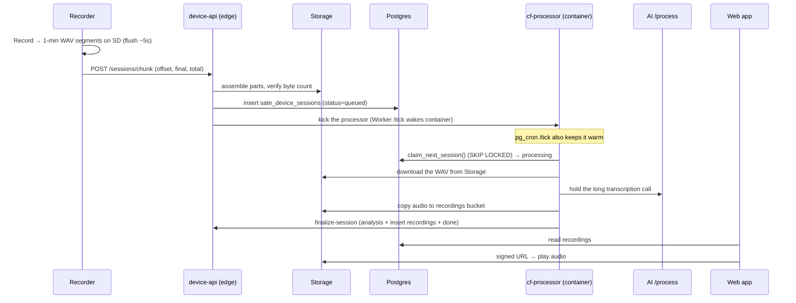
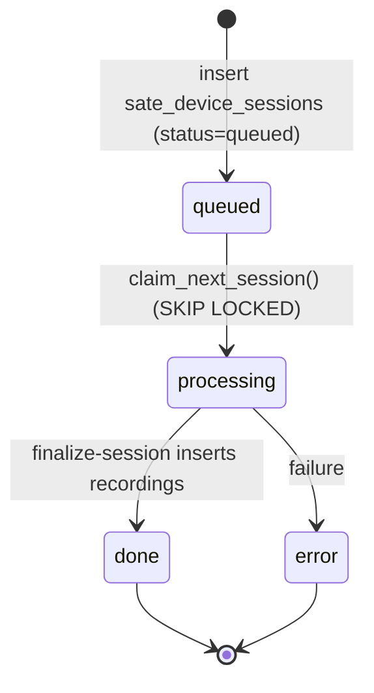
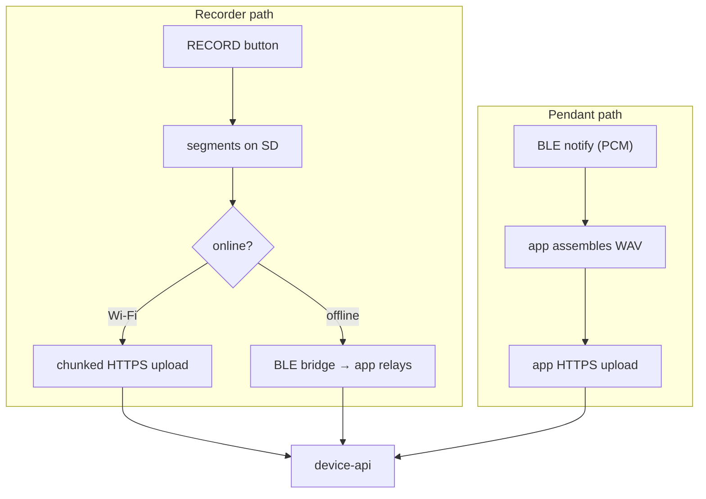

# Architecture & data flow

How a recording travels from a device to the clinician's report — and why the long AI
step runs in a long-lived container rather than a serverless function.

async pipeline
state machine
Cloudflare Container

## End-to-end: a recording's journey

**Who triggers what.** The audio never flows *through* Cloudflare. `device-api` (the Supabase
edge function) is the only thing devices talk to: it stores the assembled WAV in Storage and
queues the session, then **kicks off processing** (a fire-and-forget trigger). The long-lived
Cloudflare container is woken by the Worker's `/tick` endpoint — pinged every minute by
`pg_cron` and designed to also be poked by `device-api` on new audio — after which it
**claims the queued session and pulls the WAV from Storage itself** before holding the AI
call. So the path is **edge fn → Cloudflare → Storage**: Cloudflare reads the audio out of
Storage; the edge function never streams audio to it, and the device never uploads to
Cloudflare directly.

:::note Upload transport history
Earlier firmware streamed device audio to Supabase over a **WebSocket**. The current path is
**resumable chunked HTTPS** (`POST /sessions/chunk`) — the server reassembles the ~1 MB
slices and byte-verifies before accepting, which survives drops and mid-upload reboots that a
single long-lived socket could not.
:::

## Why processing is asynchronous

Supabase edge functions have a **hard ~150 s wall-clock limit** (not configurable).
A long transcription exceeds it, and the worker is **killed mid-fetch before the
`try/catch`**, so the session hangs in `processing` forever. The fix is a **state
machine** on `sate_device_sessions.status` (`queued → processing → done | error`)
drained by a **long-lived Cloudflare Container** (`cf-processor/`) that has no
wall-clock limit and holds the AI call itself.

Edge wall-clock limit

~150 s

CF Worker 524 origin

~100 s

Container wall-clock

none

The status column moves through exactly four states — the container is the only thing
that can hold `processing` long enough to reach `done`:

:::warning Never move the AI call back into an edge/Worker fetch
Any serverless request (Supabase edge **or** a plain CF Worker with its ~100 s 524
origin timeout) will kill a long transcription. The long call must live in the
container. See [Backend pipeline](guides/backend).
:::

## Capture paths

- **Recorder (online):** uploads directly over Wi-Fi in ~1 MB chunks; the server
  reassembles and byte-verifies before accepting.
- **Recorder (offline):** the mobile app pulls sessions over a BLE bridge and
  relays them to `device-api`.
- **Pendant:** always via the app — it streams PCM over BLE, the app wraps a WAV
  and uploads (`device_serial = pendant-<bleId>`).

## Storage & data model (summary)

| Bucket / table | Visibility | Holds |
|---|---|---|
| `device-sessions` (Storage) | **private** (signed URLs) | raw uploaded WAVs |
| `recordings` (Storage) | **private** (signed URLs) | processed audio for the report |
| `firmware` (Storage) | **public** | OTA `.bin` images |
| `sate_device_sessions` (DB) | RLS by user | upload + processing state machine |
| `recordings` (DB) | RLS by user/patient | transcript, analysis, flags |
| `patients` (DB) | RLS by SLP | patient roster |

Full schema and RLS notes: [Reference → Data model](reference/data-model).

## Concurrency notes

- **Recorder:** connectivity runs on a **core-0** FreeRTOS task; GUI + buttons +
  recording on **core-1**. They share the SD/FATFS volume, guarded cooperatively
  by a `uiSdBusy` flag. See [Recorder firmware](guides/recorder#concurrency-model).
- **Mobile:** three BLE stacks (SATE, Pendant, Plaud) share **one** `BleManager`
  via a radio arbiter (`src/ble/radio.ts`). See [Mobile app](guides/mobile-app).
