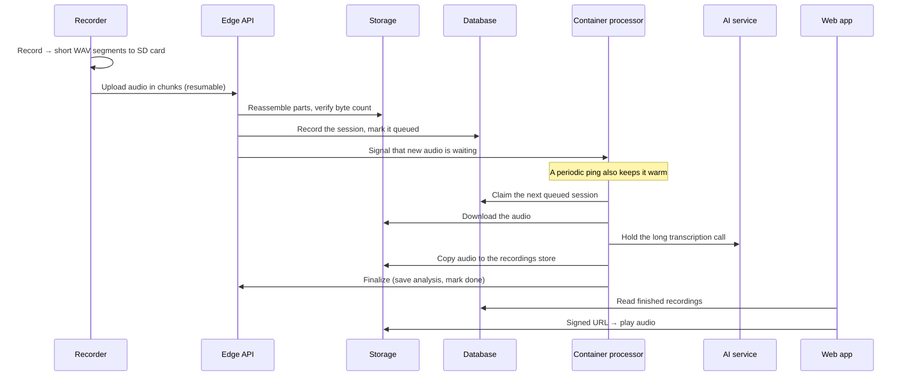
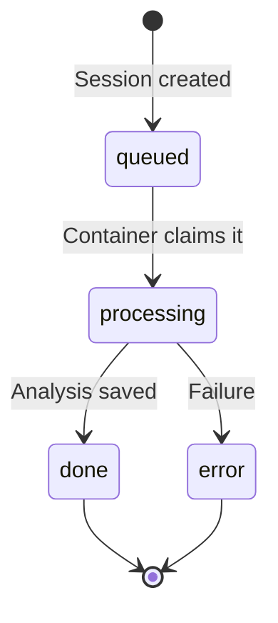
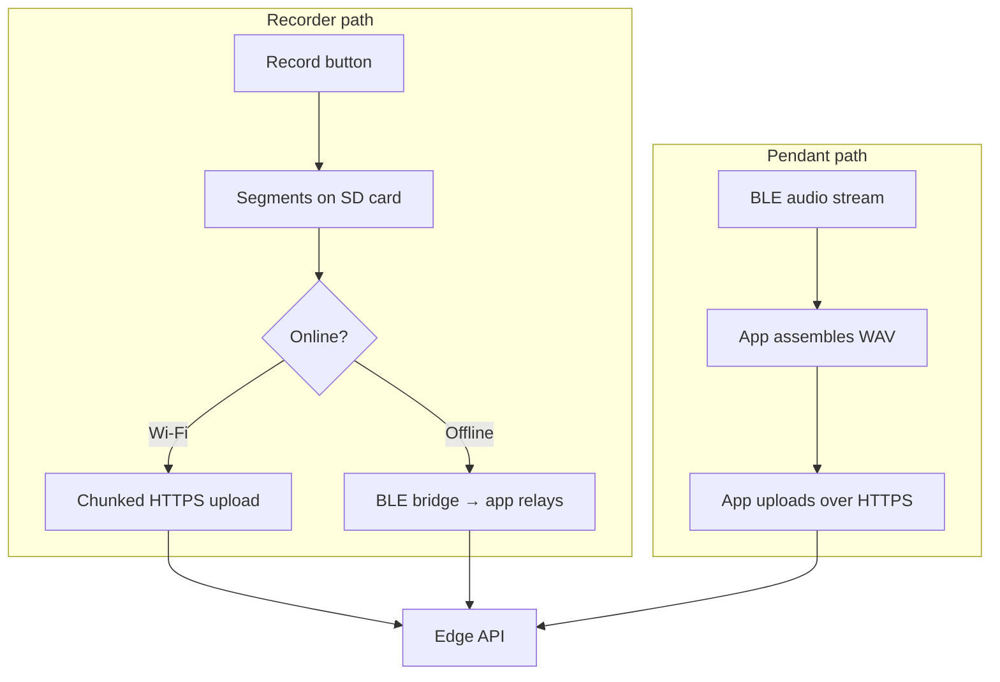

# Architecture & data flow

How a recording travels from a device to the clinician's report — and why the long AI
transcription step runs in a long-lived container rather than a short-lived serverless
function.

async pipeline
state machine
Cloudflare Container

## System overview

<figure class="doc-figure"><figcaption>How the pieces connect: the recorder syncs over Wi-Fi, the pendant and other devices reach the mobile app over Bluetooth, everything lands in Supabase, and the audio is processed asynchronously through Cloudflare and the AI service. The web frontend reads the results.</figcaption></figure>

## End-to-end: a recording's journey

**Who triggers what.** The audio never flows *through* the AI infrastructure directly.
The edge API is the single entry point that devices talk to: it stores the assembled
recording, queues the session, and signals that new work is waiting. The long-lived
container processor is woken by that signal — and kept warm by a periodic heartbeat — then
**claims the queued session and pulls the audio from storage itself** before holding the AI
call. In other words, the container reads the audio out of storage; the edge API never
streams audio to it, and the device never uploads to the processing layer directly.

:::note[Upload transport history]
Early firmware streamed device audio to the backend over a persistent **WebSocket**
connection. Current firmware uses **resumable chunked HTTPS**: the server reassembles the
uploaded slices and byte-verifies the result before accepting it. The change was made for a
more **stable transfer** — chunked HTTPS survives connection drops and mid-upload reboots
that a single long-lived socket could not, because the device simply re-sends the missing
slices from the last confirmed point.
:::

## Why processing is asynchronous

Serverless edge functions carry a **hard wall-clock limit** of a couple of minutes that
cannot be raised. A long transcription can exceed it, and the function is **killed
mid-request** — leaving the session stuck in a "processing" state with no clean way to
recover. The solution is a **state machine** over each session's status
(`queued → processing → done | error`), drained by a **long-lived container** that has no
wall-clock limit and can hold the AI call from start to finish.

Edge function limit

~minutes

Serverless origin timeout

~minutes

Container wall-clock

none

A session moves through exactly four states — and only the container can hold "processing"
long enough to reach "done":

:::warning[Keep the long AI call out of serverless functions]
Any short-lived serverless request — whether an edge function or a plain worker — will kill
a long transcription when its origin timeout fires. The long call must live in the
container. See [Backend pipeline](guides/backend).
:::

## Capture paths

- **Recorder (online):** uploads directly over Wi-Fi in small chunks; the server
  reassembles and byte-verifies before accepting.
- **Recorder (offline):** the mobile app pulls sessions off the device over a Bluetooth
  bridge and relays them to the edge API.
- **Pendant:** always goes through the app — it streams audio over Bluetooth, the app wraps
  it into a WAV file and uploads it through the same pipeline.

## Storage & data model (summary)

The system separates private audio (served only through short-lived signed URLs) from
public assets, and keeps upload/processing state alongside the finished clinical results.

| Area | Visibility | Holds |
|---|---|---|
| Raw session audio | Private (signed URLs) | Uploaded recordings awaiting processing |
| Processed recordings | Private (signed URLs) | Finished audio attached to a report |
| Firmware images | Public | Over-the-air update files |
| Session state | Per-user access control | Upload and processing status |
| Recordings | Per-user / per-patient access control | Transcript, analysis, flag markers |
| Patients | Per-clinician access control | Patient roster |

More detail: [Reference → Data model](reference/data-model).

## Concurrency notes

- **Recorder:** connectivity and networking run on a separate processor core from the
  screen, buttons, and recording, so heavy network work never stalls the interface. The two
  cores share the SD card cooperatively. See
  [Recorder firmware](guides/recorder#concurrency-model).
- **Mobile:** several Bluetooth integrations coexist on one radio, coordinated by an
  arbiter so only one owns the radio at a time. See [Mobile app](guides/mobile-app).
