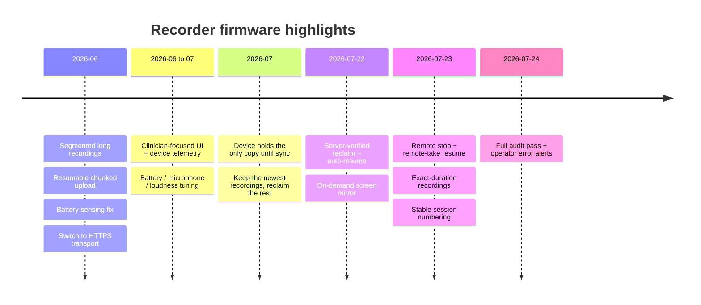

# Version log

A human-readable record of the **released versions** of each part of the SATE
Companion system. Every component is versioned **independently** — the recorder
firmware, the pendant firmware, the mobile app, the web app, and the backend
service each carry their own number and evolve on their own schedule.

recorder 1.5.32
pendant 1.0.0
app 0.1.0
web 1.5.9
backend v18

## Components at a glance

| Component | What it is | Current |
|---|---|---|
| Recorder firmware | Firmware for the ESP32-S3 handheld recorder | **1.5.32** |
| Pendant firmware | Firmware for the nRF52840 wearable pendant | **1.0.0** |
| Mobile app | Companion app for phones (recorder, pendant, and Plaud support) | **0.1.0** |
| Web app | Clinician web application (reports, editing, analytics, billing) | **1.5.9** |
| Backend service | The Device API that devices and apps talk to | **v18** |

:::note[About these numbers]
Each component reports its own version so the field deployment can be checked at a
glance — the recorder includes its firmware version in every heartbeat, and the apps
report their build version. Numbers advance independently and are not meant to line up
across components.
:::

---

## Recorder firmware

The recorder is the ESP32-S3 handheld unit. It captures 16 kHz mono audio, stores it
locally on an SD card, and syncs it to the backend over Wi-Fi. It can be controlled at
the device (buttons and on-screen status) or remotely from the app and web app.

| Version | Date | Notes |
|---|---|---|
| **1.5.32** | 2026-07-24 | **Full re-audit hardening plus operator error alerts.** Closed two edge cases in the storage-reclaim logic so the device never gets stuck holding recordings it should be able to free, and made sure a recording interrupted by a power loss still uploads even if its resume attempt is abandoned. Added **system-wide error email alerts**: a background monitor emails the operator whenever a new problem appears — a service down, a processing or audio error, a stuck job — and an all-clear when it resolves. Passed the full hardware test suite. |
| 1.5.31 | 2026-07-24 | **Broad audit fixes across firmware and web.** Each recording is tagged with the device that made it, so a unit handed to a new account never auto-uploads a previous account's audio — closing a cross-clinic privacy gap. Retention now reliably keeps the genuinely newest recordings. Web app: fleet firmware publishing restricted to admins, more resilient audio playback, corrected clinical scoring on short samples, and a new **patient progress chart** that plots any clinical metric across a patient's sessions. |
| 1.5.30 | 2026-07-24 | **Reliability fixes for recorder and web.** A recording resumed after a power loss stays fully controllable — remote stop, status, and health checks keep working even when Wi-Fi is down at startup. The sessions list shows only recordings that still have audio on the card. Web app: fixed several transcript-editing round-trip issues and a duplicate-count bug. |
| 1.5.28 | 2026-07-23 | **Multiple audit rounds and a rebuilt retention model.** Session numbers are stable and never reshuffled, so a standalone unit keeps working indefinitely. Retention is device-wide and runs during idle time — not only right after an upload — while still never freeing a recording the server has not confirmed. Standalone recording is the default behavior. Plus recovery, diagnostics, on-device status messaging, dead-microphone detection, and memory-usage improvements. |
| 1.5.19 | 2026-07-23 | **Exact-duration recordings.** A remote record command can request a precise length; the device captures exactly that duration and stops itself, sample-accurate. Previously timed captures overshot by several seconds. |
| 1.5.18 | 2026-07-23 | **A remote stop issued while a recording is starting is no longer dropped.** A stop that arrived during a recording's own startup could be discarded, leaving the take running with nothing able to end it. Stops are now reliably honored throughout. |
| 1.5.17 | 2026-07-23 | **Fixed a device going unresponsive after a mid-recording reboot.** A resumed recording now keeps its network connection alive for its whole length, so heartbeat, remote stop, and serial control all keep working. |
| 1.5.16 | 2026-07-23 | **Remotely-started recordings auto-resume after a reboot.** A recording started from the app or server and interrupted by a power dip now continues from the local card and stored segments alone — no Wi-Fi or server needed. Added resume diagnostics. |
| 1.5.15 | 2026-07-23 | **Remote stop command.** A recording started from the app or server can now be ended remotely, exactly like pressing the record button, instead of running until an internal time ceiling. |
| 1.5.14 | 2026-07-22 | **On-demand screen mirror** for support and debugging — streams a snapshot of the active screen over USB. Available in debug builds only; it never fires on its own and refuses while recording. Production builds do not include it. |
| 1.5.13 | 2026-07-22 | **Server-verified reclaim** (the device confirms audio is durably stored before freeing SD space), automatic resume of an interrupted local recording after reboot, and crash-safe deletes. |
| 1.5.12 | 2026-07-21 | Firmware restructure and hardware-documentation refresh; bounded reclaim that keeps the newest few synced recordings per patient. |
| 1.5.9 | 2026-07 | Retention change: the device holds the only copy of a recording until the user deletes it — the earlier automatic purge paths were removed. |
| 1.5.5 – 1.5.8 | 2026-07-01 | Battery calibration, Wi-Fi transmit power, microphone gain, and loudness tuning. |
| 1.5.1 – 1.5.4 | 2026-07-01 | Save-reliability fix; charging and battery fix; added battery-level telemetry. |
| 1.5.0 | 2026-06-30 | Clinician-focused recorder UI, auto-dim, and device telemetry to the admin view. |
| 1.2.10 | 2026-06 | **Upload transport moved from WebSocket to resumable chunked HTTPS** for a more stable transfer — it survives connection drops and mid-upload reboots by resuming from where it left off, which a single long-lived socket could not. |
| 1.0.6 | 2026-06 | Battery sensing was wired to the wrong pin for this chip and caused a boot loop; fixed by moving it to the correct pin. |
| 1.0.x | 2026-06-16 | Over-the-air firmware updates, battery percentage, device onboarding, and a web update UI. |
| 1.0.1 | 2026-06-14 | Companion app connected to the backend; upload-path fix. |
| 0.8.2 | 2026-06-13 | Record long sessions as one-minute segments and merge them. |

:::note[Upload transport migration]
Firmware **before 1.2.10** streamed device audio to the backend over a **WebSocket**.
**From 1.2.10 onward** it uses **resumable chunked HTTPS**, verified on assembly, for a
more **stable transfer** — it survives connection drops and mid-upload reboots that a
single long-lived WebSocket could not, resuming from where it left off. See
[Architecture → Who triggers what](architecture).
:::

## Pendant firmware

The pendant is a small nRF52840 wearable. It streams raw audio (16 kHz mono) over
standard Bluetooth to the mobile app, which wraps it into a recording and sends it
through the same upload pipeline as the handheld recorder.

| Version | Date | Notes |
|---|---|---|
| **1.0.0** | 2026-07 | First versioned pendant firmware. Bluetooth audio streaming, high-pass filtering and soft-clip gain to lift the quiet microphone, a low-power nap mode, an overrun guard, and over-the-air firmware update support. |

## Mobile app

| Version | Date | Notes |
|---|---|---|
| **0.1.0** | current | Support for the recorder, the pendant, and Plaud devices; automatic background sync; and QR / mobile-link login. |

## Web app

The clinician web application for reviewing and working with recordings.

| Version | Date | Notes |
|---|---|---|
| **1.5.9** | current | Clinician report view, transcript editing, annotations, clinical metrics, per-patient analytics, admin firmware publishing, and billing. |

## Backend service

The Device API that devices and apps communicate with — registration, uploads, remote
commands, and status.

| Version | Date | Notes |
|---|---|---|
| **v18** | 2026-07-24 | Added a health digest that feeds the operator error-alert emails. |
| v17 | 2026-07-23 | Remote record commands can carry an exact duration, delivered to the device so it stops itself sample-accurately. |
| v16 | 2026-07-23 | Live upload-progress reporting — the byte count of an in-flight upload, so the pipeline view can show a transfer in real time. |
| v15 | 2026-07-22 | A read-only verification endpoint the recorder uses to confirm a recording is durably stored before freeing space, upload de-duplication, and validation of published firmware images. |
| v14 | — | Asynchronous processing state machine for uploaded recordings (queued → processing → done / error) with a retry endpoint. Heavy processing moved off the edge and onto a long-running container. |
| v12 | — | More efficient chunked-upload assembly and stricter size checks on incoming recordings. |

---

## Live deployed versions

The versions actually running in the field also surface in the service-monitoring
dashboard — the recorder reports its firmware in every heartbeat, and the apps report
their build version.
