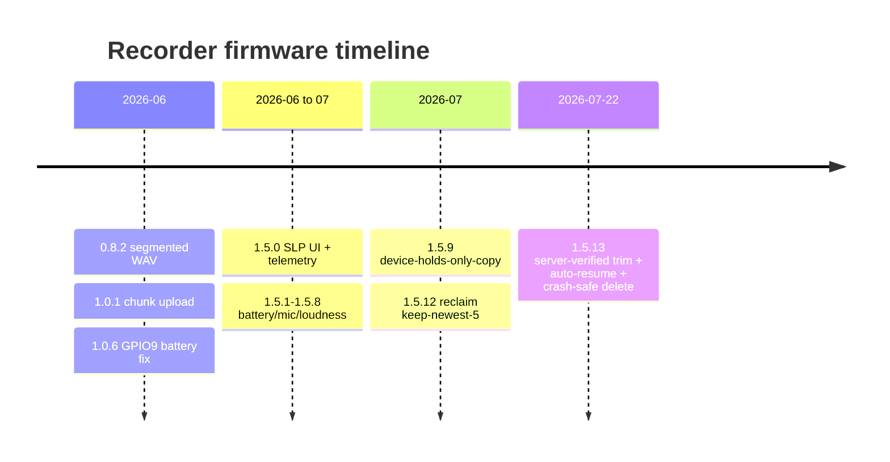

# Version log

The canonical record of **every released version** of each component. Update the
relevant table on every release. Versions are independent per component (the
recorder firmware, the app, and the web app do **not** share a number).

recorder 1.5.13
pendant 1.0.0
app 0.1.0
web 1.5.9
device-api v15

## Where each version is defined (source of truth)

| Component | Field / source of truth | Current |
|---|---|---|
| Recorder firmware | `SATE_Recorder/SATE_Recorder.ino` → `FIRMWARE_VERSION` | **1.5.13** |
| Pendant firmware | `SATE_Pendant/SATE_Pendant.ino` → `FIRMWARE_VERSION` (added 2026-07-22) | **1.0.0** |
| Mobile app | `app.json` `version` (+ `package.json`) | **0.1.0** |
| Web app | `react_app_sate-ui_update/package.json` `version` | **1.5.9** |
| Backend (`device-api`) | in-comment `[vNN]` header of `.../functions/device-api/index.ts` | **v15** |

:::note Pendant version field (new)
`SATE_Pendant.ino` now has a `FIRMWARE_VERSION` constant (`1.0.0`, added 2026-07-22)
so releases can be logged here. It is **not yet exposed over BLE** — add a version
characteristic (or a Device Information Service firmware-revision string) so the app
can read/verify what's flashed. The device already ships a `BLEDfu` OTA service.
:::

> `git log` remains the ground truth for what actually shipped; this page is the
> human-readable summary. The recorder **source** version can be ahead of the
> **GitHub release asset** tag (e.g. `FIRMWARE_VERSION=1.5.13` while prebuilt bins
> are still tagged `fw-1.5.12` if no release was cut).

---

## Recorder firmware

| Version | Date | Notes |
|---|---|---|
| **1.5.13** | 2026-07-22 | **Server-verified trim** (`GET /api/sessions/verify` before freeing SD audio) · reboot **auto-resume** of a local take (~5 s flush + restart empty `part00`) · **crash-safe delete/renumber** (NVS journal + boot heal). Source only — no GitHub release cut yet. |
| 1.5.12 | 2026-07-21 | Sketch restructure + full hardware doc refresh; bounded reclaim `trimPatientSyncedAudio` (keep newest 5 synced sessions per patient). |
| 1.5.9 | 2026-07 | Reclaim policy change: device holds the only copy until user delete (the three old auto-purge paths removed). |
| 1.5.5 – 1.5.8 | 2026-07-01 | Battery calibration, Wi-Fi TX power, mic gain, loudness. |
| 1.5.1 – 1.5.4 | 2026-07-01 | Unstick save; charging + battery fix; add cell-mV telemetry. |
| 1.5.0 | 2026-06-30 | SLP-focused recorder UI, auto-dim, device telemetry to admin. |
| 1.0.6 | 2026-06 | Battery ADC on GPIO34 (wrong for S3) → bootloop; fixed by moving to GPIO9. |
| 1.0.x | 2026-06-16 | OTA firmware updates, battery %, MAC onboarding, web update UI. |
| 1.0.1 | 2026-06-14 | Companion app → Supabase; chunk-upload path fix. |
| 0.8.2 | 2026-06-13 | Record long sessions as 1-min segments + merge. |

:::note Upload transport migration
Early builds streamed device audio to Supabase over a **WebSocket**. That was replaced by
the current **resumable chunked HTTPS** upload (`POST /sessions/chunk`, byte-verified on
assembly), which survives connection drops and mid-upload reboots a single long-lived socket
could not. See [Architecture → Who triggers what](architecture).
:::

## Pendant firmware

| Version | Date | Notes |
|---|---|---|
| **1.0.0** | 2026-07 | First versioned pendant firmware. BLE PCM streaming (16 kHz mono, 244 B notifies), DC-block HPF + tanh soft-clip gain, nap mode, overrun guard, DC/DC regulator, `BLEDfu` OTA. (Pendant work landed 2026-07-10; sketch moved to `SATE_Pendant/` 2026-07-21; `FIRMWARE_VERSION` field added 2026-07-22.) |

## Mobile app

| Version | Date | Notes |
|---|---|---|
| **0.1.0** | current | Recorder + Pendant + Plaud support; auto-sync; QR/mobile-link login. |

## Web app

| Version | Date | Notes |
|---|---|---|
| **1.5.9** | current | Clinician report, SALT transcript editing, annotations, clinical metrics, admin firmware publish, Stripe billing. |

## Backend — `device-api`

| Version | Date | Notes |
|---|---|---|
| **v15** | 2026-07-22 | `GET /sessions/verify` (device-key, read-only) · `storeSessionRecord` idempotency probe (dedup a re-uploaded take) · `publishFirmware` validation (semver + `0xE9` magic + size). |
| v14 | — | Async processing state machine on `sate_device_sessions.status` (`queued→processing→done\|error`, `attempts`) · `POST /sessions/:id/retry`. Processing moved to the container; `process-device-session` became a 200 no-op. |
| v12 | — | `/sessions/chunk` stores each slice as its own part and stitches on final (was quadratic) · accepts `&total=` from firmware ≥1.5.9 and rejects a size mismatch. |

---

## How to add a release entry

1. Bump the version **in its source of truth** (table at the top).
2. Add a row to that component's table here: `| <version> | <YYYY-MM-DD> | <what changed> |`.
3. For firmware, also follow [Firmware release & OTA](operations/firmware-release)
   (build, publish the `.bin`, insert the `sate_firmware` row).
4. Commit both together so `git log` and this page agree.

The **live** deployed versions (what's actually running in the field) will also
surface in the service-monitoring dashboard — the recorder reports its `fw` in each
heartbeat, and the app/web report their build version.
