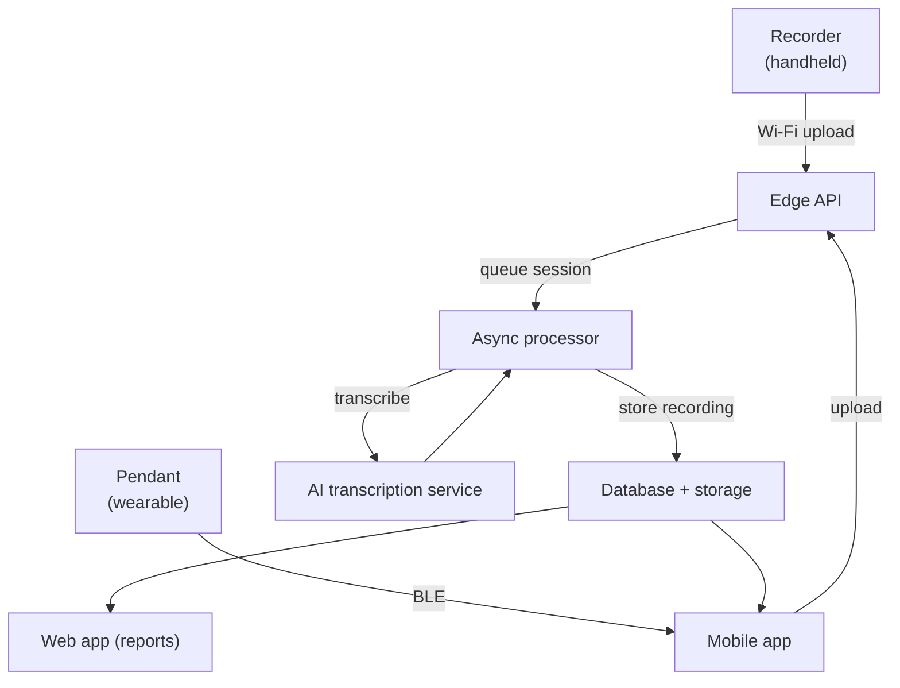
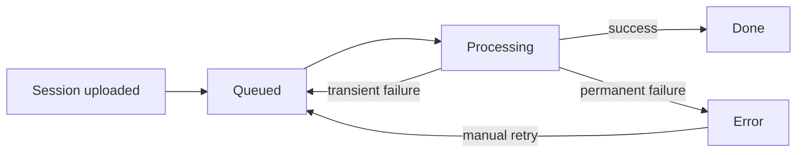

# Getting started

SATE Companion is a small family of connected devices and services that capture
audio in the field, sync it securely, and turn it into transcribed, searchable
recordings. This page is the high-level tour: what each part is, how the pieces
fit together, and where audio flows from a device in someone's hand to a finished
report on the web. For the deeper, part-by-part write-ups, follow the
[component guides](guides/recorder).

ESP32-S3 recorder
nRF52840 pendant
iOS companion app
React + Vite web app

## The parts at a glance

The system spans four kinds of software — device firmware, a mobile app, a web
app, and a cloud backend — each versioned and released independently.

Recorder

ESP32-S3

Pendant

nRF52840

Mobile app

iOS

Web app

React + Vite

Audio format

16 kHz mono

Sync

Wi-Fi + BLE

Backend

Edge + container

AI

Async transcription

## How it fits together

At the center are the recording devices. Audio they capture is synced up to the
cloud, processed asynchronously into transcribed recordings, and presented back
to people through the mobile and web apps.

The guiding principle throughout: **a recording is never treated as safely
delivered until the cloud has verifiably stored it.** Devices hold their own copy
of audio until storage is confirmed, and the long-running AI step lives in a
process that can take as long as it needs — never on a request that might time
out mid-transcription.

## Recorder

A handheld, battery-powered recorder built on an ESP32-S3 (16 MB flash, 8 MB
PSRAM) with a small screen and two buttons — one to start and stop recording, one
to drop a flag marker at a moment of interest. It records 16 kHz mono audio to a
local SD card, then syncs completed sessions to the cloud over Wi-Fi.

The recorder is designed to be resilient in the field: it can keep recording
through a reboot and resume the same session, it survives being off-network by
holding audio locally and retrying, and it only frees space on its SD card once
the cloud has confirmed the audio is durably stored. It can also update its own
firmware over the air.

## Pendant

A lightweight wearable built on an nRF52840. Rather than storing audio itself, it
streams captured audio over standard Bluetooth Low Energy to the companion app,
which packages it and hands it into the same upload pipeline the recorder uses.
This keeps the wearable simple and inexpensive while reusing all of the cloud
processing already in place.

## Mobile app

An iOS companion app that acts as the bridge and control surface for the devices.
It discovers nearby devices, manages pairing and connections, receives audio
streamed from the pendant, and helps provision recorders onto Wi-Fi. It also
integrates with a supported third-party recording device, letting those captures
flow into the same recordings pipeline.

:::note[One recording pipeline]
Whatever the source — recorder, pendant, or an integrated device — captured audio
converges on a single upload-and-processing path. Recordings arrive as standalone
by default, and can be organized or assigned later from the web reports.
:::

## Web app

A React web application where recordings live once processed. It presents each
recording with its transcript, lets people review and organize sessions, and
shows flag markers as ticks along the playback timeline so the moments someone
marked in the field are easy to jump to. It also hosts administrative views for
managing devices and publishing firmware updates across the fleet.

## Backend

The cloud backend has two complementary halves. A set of lightweight **edge
functions** handle fast, short-lived requests: device registration, session
uploads, and coordinating work. The heavy lifting — holding a full audio
transcription call that can run for many minutes — happens in a separate
**long-running container service** so it is never cut short by a request timeout.

Processing is organized as a queue with a simple state machine: a new session is
queued, claimed by the processor, transcribed, and finalized into a stored
recording. Failures retry with backoff, stalled jobs are automatically requeued,
and people can manually retry a session that ended in error.

## Where to go next

The [component guides](guides/recorder) cover each part in more depth — the
recorder, the pendant, the mobile and web apps, and the backend pipeline — while
the [operations](operations/hardware-testing) section covers testing on real
hardware and releasing firmware. The [Version log](changelog) tracks what changed
in each release.
