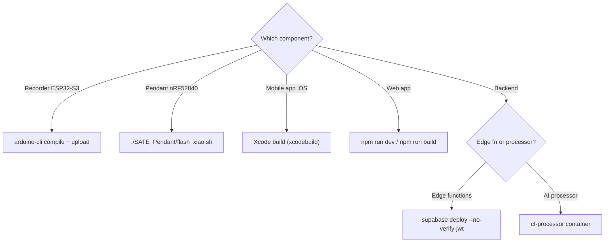

# Getting started (new engineer)

Everything you need to build, flash, and run each part. Deeper details live in each
[component guide](guides/recorder); this is the "zero to running" path. Every command
below is the real one used in this repo, and every version is read from source.

<div class="badge-row">
<span class="sate-badge">ESP32-S3</span>
<span class="sate-badge">nRF52840</span>
<span class="sate-badge">Expo SDK 54 · iOS</span>
<span class="sate-badge">React 19 + Vite 6</span>
</div>

## Version matrix (source of truth)

Each component is versioned independently. These are read directly from the code — see the
[Version log](changelog) for the release history and the exact file each is defined in.

<div class="spec-grid">
<div class="spec-tile"><div class="k">Recorder fw</div><div class="v">1.5.20</div></div>
<div class="spec-tile"><div class="k">Pendant fw</div><div class="v">1.0.0</div></div>
<div class="spec-tile"><div class="k">Mobile app</div><div class="v">0.1.0</div></div>
<div class="spec-tile"><div class="k">Web app</div><div class="v">1.5.9</div></div>
<div class="spec-tile"><div class="k">device-api</div><div class="v">v18</div></div>
<div class="spec-tile"><div class="k">Expo SDK</div><div class="v">54</div></div>
<div class="spec-tile"><div class="k">React Native</div><div class="v">0.81.5</div></div>
<div class="spec-tile"><div class="k">React</div><div class="v">19.1.0</div></div>
</div>

## Toolchain (install once)

| Component | Needs | Install |
|---|---|---|
| Recorder | `arduino-cli` + ESP32 core + `lvgl@8.4.0` | `arduino-cli core install esp32:esp32` |
| Pendant | `arduino-cli` + **Seeed** nRF52 core | board pkg `Seeeduino:nrf52` (see the flash trap in the guide) |
| Mobile app | Node ≥18, Xcode, Expo (SDK 54), a physical iOS device | `npm install` in repo root |
| Web app | Node ≥18 | `npm install` in `react_app_sate-ui_update/` |
| Backend | Supabase CLI, Docker (for `cf-processor`), `wrangler` | `npm i -g supabase` |
| Docs site | Node ≥18 | `npm install` in `docs-site/` |



## Repo layout

| Path | What |
|---|---|
| `SATE_Recorder/` | Recorder firmware (ESP32-S3) — `SATE_Recorder.ino` + `connectivity.cpp` |
| `SATE_Pendant/` | Pendant firmware (nRF52840) — `SATE_Pendant.ino` |
| `src/`, `App.tsx` | Mobile app (React Native / Expo) |
| `react_app_sate-ui_update/` | Web app (React + Vite) |
| `react_app_sate-ui_update/supabase/functions/` | Supabase edge functions |
| `cf-processor/` | Cloudflare Container (Python async AI processor) |
| `cloudflare/` | Cloudflare Workers port of the backend |
| `hwtest/` | Hardware-in-the-loop test harness (see [Hardware testing](operations/hardware-testing)) |
| `doc/` | Original hand-written engineering notes |
| `docs-site/` | This documentation site (Docusaurus) |

## Recorder (ESP32-S3)

```bash
# Compile (folder name matches the .ino → builds in place, no temp copy)
arduino-cli compile --fqbn "esp32:esp32:esp32s3:FlashSize=16M,PartitionScheme=default_8MB,PSRAM=opi" SATE_Recorder

# Flash the fleet
arduino-cli upload -p <port> --fqbn "esp32:esp32:esp32s3:FlashSize=16M,PartitionScheme=default_8MB,PSRAM=opi" SATE_Recorder
```

:::danger[Two silent bricks — check these first]
- **`PartitionScheme` MUST be `default_8MB`** (dual OTA slots). `huge_app` silently kills OTA.
- **`lv_conf.h` `LV_TICK_CUSTOM` MUST be `1`.** If `0`, the boot spinner freezes at
  frame 1 while `setup()` still finishes — looks like a bad flash, isn't. Reinstalling
  lvgl resets it to `0`, so re-check after any `lib install lvgl`.
:::

`PSRAM=opi` is mandatory. Serial only appears when built `CDCOnBoot=cdc,USBMode=hwcdc`.
Full recipe: [Recorder firmware](guides/recorder) and [Operations → Firmware release](operations/firmware-release).

## Pendant (nRF52840)

```bash
# Build + flash with the SEEED core (NOT Adafruit — see the guide's flash trap)
./SATE_Pendant/flash_xiao.sh SATE_Pendant
```

Requires the Seeed nRF52 board package. FQBN `Seeeduino:nrf52:xiaonRF52840SensePlus`.
See [Pendant firmware](guides/pendant).

## Mobile app (Expo, iOS)

Plaud is iOS-device-only (no simulator), so this needs a physical device and a custom dev
build — Expo Go will not work. Run scripts are in `package.json`:

```bash
npm install               # repo root
npm run ios               # expo run:ios — build + install the dev client on a device
npm start                 # expo start --dev-client — Metro bundler for an installed build
```

Compile-check the native module without a device or signing, and typecheck:

```bash
xcodebuild -workspace ios/SATECompanion.xcworkspace -scheme SATECompanion \
  -sdk iphoneos -destination 'generic/platform=iOS' CODE_SIGNING_ALLOWED=NO build
npx tsc --noEmit   # repo root (filter react_app_sate-ui_update @/… alias noise)
```

## Web app (React + Vite)

```bash
cd react_app_sate-ui_update
npm install
npm run dev          # vite — local dev server
npm run build        # tsc -b && vite build  — REQUIRED before pushing (noUnusedLocals)
npm run preview      # vite preview — serve the production build locally
```

Deploy is a **git subtree** to a separate repo that Vercel builds:

```bash
# from repo root
git subtree push --prefix=react_app_sate-ui_update webapp <branch>
```

:::warning[Deploy-breaker]
The web build runs `tsc -b` with `noUnusedLocals`, so a merely-unused variable fails
Vercel even though a plain typecheck passes. Always `npm run build` before pushing the
web subtree.
:::

## Backend

Edge functions validate their own tokens, so they **must** deploy with `--no-verify-jwt`:

```bash
supabase functions deploy device-api --no-verify-jwt
supabase functions deploy finalize-session --no-verify-jwt
supabase functions deploy mint-plaud-token --no-verify-jwt
```

- **cf-processor** (`cf-processor/`, Python container): the long-lived AI processor that
  holds the transcription call — deployed as a Cloudflare Container, never an edge fn.
- **cloudflare/** is the Workers port of the backend.

:::warning[Never redeploy with `verify_jwt:true`]
The MCP default is `verify_jwt:true`; redeploying `device-api` or `mint-plaud-token` that
way breaks recorder registration and Plaud token minting. Always pass `--no-verify-jwt`.
:::

See [Backend pipeline](guides/backend).

## Documentation site (this site)

```bash
cd docs-site
npm install
npm start             # docusaurus start — live-reload dev server
npm run build         # docusaurus build — static site into build/
npm run serve         # serve the production build locally
npm run deploy:cf     # build + wrangler pages deploy build --project-name sate-docs
```

Built with Docusaurus 3.10.2; deployed to Cloudflare Pages at
[sate-docs.pages.dev](https://sate-docs.pages.dev).

## Hardware testing

Before a firmware release, run the hardware-in-the-loop harness on a real device.
The `sate` CLI wraps testing, flashing, and diagnosis:

```bash
pip install -e hwtest         # installs the `sate` command + deps
sate test --sim               # self-test the harness, no hardware
sate test                     # recorder (USB serial)
sate test -t pendant          # pendant (BLE)
sate doctor --device          # reset the board + diagnose hardware faults
sate flash recorder           # build + flash (auto-detects the port)
sate gui                      # native window   |   sate dashboard = browser
```

The raw entry points still work (`python3 hwtest/run.py --sim`, `gui.py`,
`dashboard.py`). See [Hardware testing](operations/hardware-testing).
