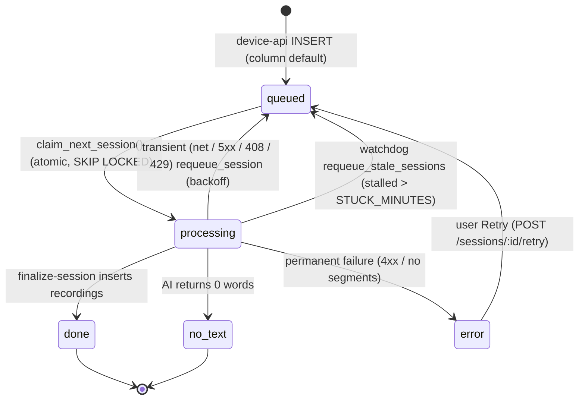
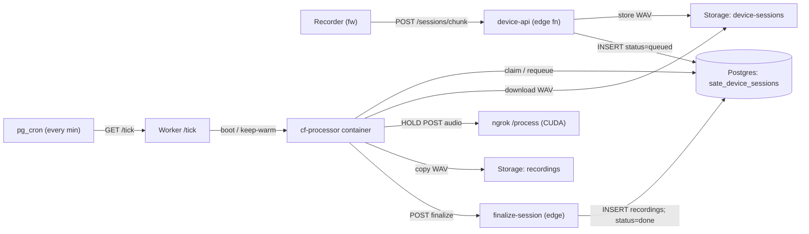
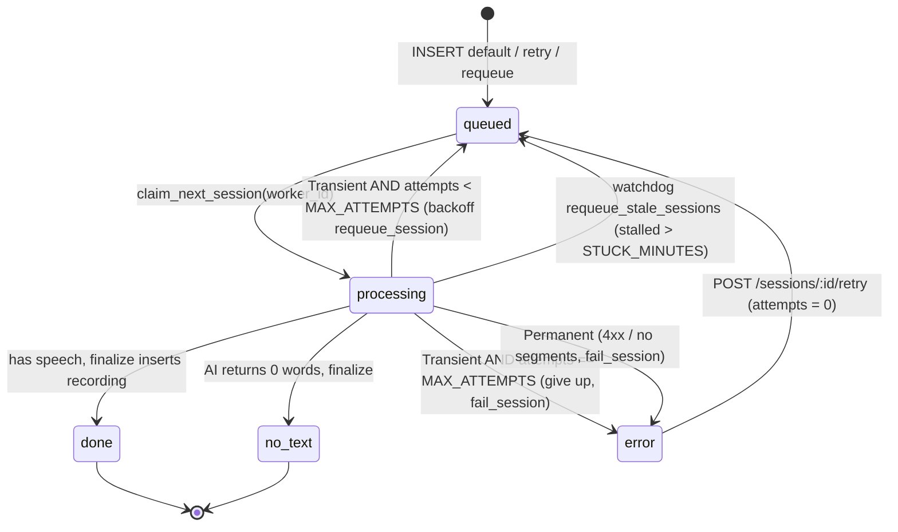
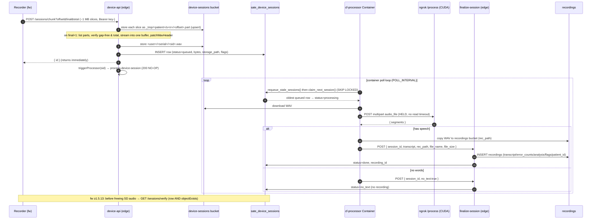

# Backend pipeline

How a hardware take becomes a clinical `recordings` row. This page is the internal-engineer
reference for the SATE backend: the Supabase edge functions (`device-api`,
`process-device-session`, `finalize-session`) and the Cloudflare **Container** that holds the long
AI call (`cf-processor/`). Everything below is grounded in the code in
`react_app_sate-ui_update/supabase/functions/`, `cf-processor/`, and `cloudflare/`.

Project **SATE**, ref `zlgdpivcbmaodgokkdvz`, `https://zlgdpivcbmaodgokkdvz.supabase.co`.

device-api ≥v15Supabase EdgeCloudflare Containerasync state machine

---

## 1. Overview — why processing is ASYNC

:::danger[The single most important rule in this pipeline]
Never run the AI transcription from an edge function or a plain Worker `fetch`.
:::

The old `process-device-session` edge fn ran `fetch(AI_PROCESS_URL)` (ngrok → self-hosted CUDA box)
and **awaited the whole transcription**. Supabase Edge has a hard **~150 s wall-clock limit** — not
a timeout we set, not configurable. On a long take the platform **kills the worker mid-`fetch`,
before the `try/catch` runs**, so `process_error` is never written and the session hangs in
`processing` forever. A 32-min take was observed stuck for **70 minutes** (edge kill → cron retry →
kill → …) before a retry happened to land during a short window. The AI is not slow; the serverless
request simply cannot hold the call. A plain Cloudflare Worker has the same problem via its ~100 s
origin timeout (524).

**The fix:** processing is a state machine on `sate_device_sessions.status`. The long AI call is
moved out of the edge entirely into a long-lived **Cloudflare Container** (`cf-processor/`), which
has no wall-clock. New rows default to `queued`; the container claims them, holds the AI call, and
hands the light half (analysis + insert) back to a fast edge fn (`finalize-session`).

Edge wall-clock

~150 s

Plain Worker 524 timeout

~100 s

Observed stuck take

70 min

Container wall-clock

none

### The state machine (`sate_device_sessions.status`)

State columns added by the `async_processor_state_machine` migration: `status`,
`processing_started_at`, `attempts`, `worker_id`, `heartbeat_at`. New device sessions become
`status='queued'` automatically (column default) — no device-api change is needed to enqueue.

---

## 2. Components

The pipeline is deliberately split so no single request ever has to hold the long AI call.

| Component | Where | Deploy / runtime | Job |
|---|---|---|---|
| **`device-api`** edge fn | `react_app_sate-ui_update/supabase/functions/device-api/index.ts` (≥v15) | Supabase Edge, **`verify_jwt:false`** | The whole device + app REST surface. Path-routes by auth header (device key vs user JWT). Accepts chunked uploads, assembles + verifies the WAV, inserts `sate_device_sessions` (`status=queued`), fire-and-forgets `process-device-session`. |
| **`process-device-session`** edge fn | `…/supabase/functions/process-device-session/index.ts` | Supabase Edge, `verify_jwt:false` | **Must be a 200 no-op in prod.** device-api still pings it, but it must NOT process — that would race the container. The repo copy is NOT the no-op (see §7). |
| **`finalize-session`** edge fn | `…/supabase/functions/finalize-session/` | Supabase Edge, `verify_jwt:false` | The **light half**: resolve patient, `countErrors` + `calculateSpeechAnalysis`, INSERT `recordings`, set `status=done` + `recording_id`. Fits the 150 s limit because the AI already ran in the container. Idempotent. |
| **`cf-processor`** Container | `cf-processor/app/processor.py` (loop), `app/main.py` (HTTP), `src/index.ts` (Worker + DO) | Cloudflare Container, `sate-processor.longcao.workers.dev` | **Long-lived process, no wall-clock.** Poll loop: `requeue_stale_sessions()` → `claim_next_session()` (SKIP LOCKED) → download WAV → **HOLD** the ngrok `/process` call → copy WAV to `recordings` bucket → POST `finalize-session`. On failure → `fail_session` (never deletes device audio). |
| **Worker `/tick`** | `cf-processor/src/index.ts` | Cloudflare Worker fronting the Container DO | Does NOT process. A single fetch boots/keeps-warm the singleton container. `TICK_SECRET`-gated. |
| **`pg_cron` + `pg_net`** | Supabase SQL (`cron.schedule('sate-processor-tick', '* * * * *', …)`) | Postgres | Pings the Worker `/tick` every minute so the container stays warm and drains the queue even with no traffic. |

Component topology — device-api enqueues; the container is the only place that holds the long AI
call; `finalize-session` writes the light half back; `pg_cron`→Worker `/tick` keeps the container warm:

### How the container stays alive

`cf-processor/app/main.py` starts the poll `loop()` on a **daemon thread** and serves a trivial
HTTP endpoint on `$PORT` (any request resets the container idle timer). `src/index.ts` sets
`sleepAfter = '20m'`; the singleton container sleeps if `/tick` pings stop and reboots on the next
tick, resuming straight from the queue. The container's **own loop** does the draining — the cron
tick is just a keep-warm and a correctness backstop.

pg_cron /tick

every 1 min

Container sleepAfter

20 m

POLL_INTERVAL

10 s

STUCK_MINUTES

45

MAX_ATTEMPTS

3

Poll-loop tunables (env, injected by `src/index.ts` into the Python process):

| var | default | meaning |
|---|---|---|
| `STUCK_MINUTES` | `45` | reclaim a `processing` job stalled beyond this (watchdog) |
| `MAX_ATTEMPTS` | `3` | after this many tries a stuck/transient job → `error` |
| `POLL_INTERVAL` | `10` | seconds between empty-queue polls |
| `WORKER_ID` | `cf-container-1` | claim owner id written to `worker_id` |

The container's per-attempt view of the same `status` machine (`processor.py`): a `Transient`
failure (network / `5xx` / `408` / `429`) requeues with backoff while `attempts < MAX_ATTEMPTS`,
else gives up to `error`; a `Permanent` failure (`4xx` / no segments) goes straight to `error`; the
`requeue_stale_sessions()` watchdog reclaims a job stalled past `STUCK_MINUTES`.

---

## 3. Connection / auth

Three caller identities hit `device-api`; the **auth header selects the route branch** before any
DB lookup. Note: the Supabase Edge **gateway** still requires the public `apikey` (anon) header on
*every* call regardless of the branch — that is the platform's gate, not the function's.

| Identity | Header | Who | What it can reach |
|---|---|---|---|
| **Device key** | `Authorization: Bearer key-<device-id>` | The recorder / firmware | `POST /register`, `GET /devices/:id/commands` (heartbeat), `POST /sessions{,/raw,/chunk}`, `GET /sessions/verify`, `GET /patients` |
| **User JWT** | `Authorization: Bearer <supabase-jwt>` | Signed-in SLP (web/mobile) | everything under the `supabase.auth.getUser(token)` gate: devices list/claim/rename/delete, commands, patients GET/PUT, sessions GET / audio / retry / delete, firmware, `/admin/*` |
| **anon apikey** | `apikey: <anon key>` | platform gateway | required on all calls; not itself an authorization |

Two more service-only identities exist for the async back-half:

- `process-device-session` and `finalize-session` accept the **service role key** OR a
  `PROCESSOR_SECRET` in the `Authorization` header (checked explicitly; `verify_jwt` disabled).
- The container authenticates to Supabase REST/Storage with the **service role key**
  (`SUPABASE_SERVICE_KEY`, `apikey` + `Bearer`).
- The Worker `/tick` is gated on a shared `TICK_SECRET` (constant string compare) shared with the
  pg_cron caller.

:::warning[`verify_jwt` MUST stay `false`]
On `device-api`, `process-device-session`, and `finalize-session` — the device has no Supabase user
JWT; it presents a device key the function validates itself. Redeploying with the MCP/CLI default
`verify_jwt:true` breaks recorder registration and the pipeline. Always pass `--no-verify-jwt` /
`verify_jwt:false`.
:::

### Storage buckets

| Bucket | Visibility | Holds | Access model |
|---|---|---|---|
| `device-sessions` | **PRIVATE** | Raw device-uploaded WAVs + `_tmp/` chunk parts | server-side service role only; `GET /sessions/:id/audio` returns a **302** to a 1-hour signed URL (`createSignedUrl(path, 3600)`) |
| `recordings` | **PRIVATE** | Final WAVs backing `recordings` rows (manual + device) | signed URLs only |
| `firmware` | **PUBLIC** | OTA `.bin` releases (`sate_<version>.bin`) | public URL served to the whole fleet by `getLatestFirmware` |
| `mobile` | public | Mobile uploads | — |

---

## 4. Upload → process → recording data flow

Load-bearing details in the chunk-assembly path (`handleSessionUpload`, each rule cost a real
recording once):

- Each slice is its **own object**; the full file is materialised **once**, on the final slice.
  The old version rewrote the whole temp blob per slice (quadratic → ~1.5 GB moved for a 30-min
  take → firmware timeouts → a backlog that could never drain).
- `offset=0` **purges the part dir** first (sessions are renumbered after a delete; stale higher
  parts must not be stitched onto new audio).
- Part dir is **scoped by patient** (`_tmp/<patient>/s<n>`) — session numbers restart at 1 per
  patient, so `s1` alone collides.
- `final=1` runs an **idempotency probe** by `(user, serial, session_number, bytes)` and confirms
  the object exists — a lost final ACK becomes a no-op instead of a full re-upload.
- Contiguity is verified from the **listed part sizes before downloading a byte**; a gap or a
  `total=` mismatch is a **409** and the device restarts from offset 0.
- A failed storage upload **throws** (`storeSessionRecord`) so the device keeps the audio. It used
  to `console.error` and insert the row anyway (2xx), which — combined with the 413 file-size bug —
  destroyed a 62-min recording.

---

## 5. `device-api` endpoints (≥v15)

Prefix `/api` is stripped (`/api/sessions/chunk` → `/sessions/chunk`); both `/register` and
`/devices/register` aliases are accepted.

### Device-key routes (`Bearer key-<id>`)

| Route | Method | Purpose |
|---|---|---|
| `/register`, `/devices/register` | POST | Validate a one-time `claim_token`, upsert `sate_devices` (`id = dev-<serial>`), return `device_key = key-<id>` |
| `/devices/:id/commands` | GET | Heartbeat: update `online`/`last_seen`/`state`/`fw`/`ota_state`, drain unconsumed commands, return `commands` + `active_patient` + `ota`; `{unclaimed:true}` if the row is gone (device resets) |
| `/sessions` | POST | Upload one WAV as `wav_base64` JSON |
| `/sessions/raw` | POST | Upload one WAV as a raw body (`?patient_id&session_number&sample_rate`) |
| `/sessions/chunk` | POST | Chunked slice upload (`?offset&final&total&session_number&patient_id&flags`); assembles on `final=1` |
| `/sessions/verify` | GET | **Read-only** — `stored:true` only when the row exists **AND** `objectExists`; the recorder's gate before it frees SD audio (fw ≥1.5.13). Never mutates. |
| `/patients` | GET | Device fetches its owner's roster (resolves the device's `user_id` first) |

### User-JWT routes

| Route | Method | Purpose |
|---|---|---|
| `/devices` | GET | List the SLP's devices (flips stale rows offline at 45 s) |
| `/devices/claim-token` | POST | Mint a one-time `claim-<8hex>` provisioning token |
| `/devices/:id/commands` | POST / GET | Queue / read remote commands (record, ota, reboot, …) |
| `/devices/:id` | PATCH / DELETE | Rename / unlink |
| `/patients` | GET / PUT | Roster read / full replace |
| `/sessions` | GET | List uploaded sessions (returns `status` + `attempts` for real progress, ≥v14) |
| `/sessions/:id/retry` | POST | Re-queue an `error` session (`status→queued`, `attempts→0`); only an `error` may retry |
| `/sessions/:id/audio` | GET | 302 → 1-hour signed URL for the raw WAV |
| `/sessions/:id` | DELETE | Delete the row + stored WAV (linked recording left intact) |
| `/firmware/latest` | GET | Newest firmware row (by `created_at`) |
| `/firmware` | POST | Publish an OTA `.bin` — validates semver + `0xE9` magic + ≤4 MB (above the admin gate, see §7) |
| `/admin/me` | GET | `{ isAdmin }` (email in `sate_admins`) |
| `/admin/devices`, `/admin/firmware` | GET | System-wide lists (403 unless admin) |
| `/admin/devices/:id`, `/admin/firmware/:id` | DELETE | System-wide unlink / delete |

> The recorder (SATE hardware) uploads with its **device key**. Plaud and BLE-bridged Pendant
> sessions upload via a **user-authed `POST /sessions`** — they have no `sate_devices` row / device
> key, so the session is stored under `user.id`.

---

## 6. Key files

| File | Role |
|---|---|
| `react_app_sate-ui_update/supabase/functions/device-api/index.ts` | The device + app REST surface (≥v15). Routing, chunk assembly, `storeSessionRecord`, `handleSessionVerify`, `publishFirmware`, admin, `triggerProcessor`. |
| `…/supabase/functions/process-device-session/index.ts` | Repo copy still processes (downloads WAV, awaits AI, inserts `recordings`). Prod is a no-op — do NOT deploy this file (see §7). |
| `…/supabase/functions/finalize-session/` | The light back-half: analysis + INSERT `recordings` + `status=done`. |
| `cf-processor/app/processor.py` | The container poll loop: claim / download / HOLD AI / upload / finalize; Transient vs Permanent retry classification. |
| `cf-processor/app/main.py` | Container entrypoint: daemon-thread `loop()` + `$PORT` keep-warm HTTP server. |
| `cf-processor/src/index.ts` | Worker + `ProcessorContainer` DO: `/tick` (TICK_SECRET), `/health`, `sleepAfter='20m'`, env injection. |
| `cf-processor/README.md` | Deploy + pg_cron wiring + tunables. |
| `cloudflare/src/functions/processDeviceSession.ts` | CF Worker **port** of the OLD synchronous path (no state machine; `fetch(AI_PROCESS_URL)` inline). Regression — see §7. |
| `cloudflare/src/functions/deviceApi.ts` | CF Worker port of `device-api` (D1-backed). |
| `cloudflare/src/policy.ts` | Transcribed prod RLS rules (incl. the `invite_codes` quirk). |
| `cloudflare/schema.sql` | D1 schema for the port. Has `sate_device_patients` unique index; **no** async state-machine RPCs and **no** `sate_device_sessions` dedup unique constraint. |
| `doc/05-backend-supabase.md`, `doc/06-ai-pipeline.md` | Canonical prose references. |

---

## 7. Known issues & current status

From the full multi-agent audit (2026-07-22). User priorities, in order: (1) never lose or
**mismatch** patient audio; (2) no feature ever **stuck**; features > security for now. Security
items below are **noted, deprioritized behind features**.

### Stuck-state / data-integrity (functional)

| Issue | Symptom | File | Status |
|---|---|---|---|
| **`process-device-session` repo copy is NOT the deployed no-op** | The checked-in file still downloads the WAV, awaits the AI, and inserts `recordings`. It filters `processed=false` while the container claims on `status`, so **both** process the same session → **duplicate recordings** + the 150 s edge-kill hang. Prod is deployed as the no-op. | `…/functions/process-device-session/index.ts` | **OPEN — do NOT deploy the repo file.** Make it a real early-return `200` before GA. |
| **Cloudflare port regression** | `cloudflare/src/functions/processDeviceSession.ts` is the OLD **synchronous** path: no state machine, `fetch(env.AI_PROCESS_URL)` awaited inline in a Worker, `processed=0` filter. A Worker's ~100 s 524 origin timeout would kill a long take exactly like the old edge fn. `cloudflare/schema.sql` has no `claim_next_session`/`requeue_*`/`fail_session` RPCs. | `cloudflare/src/functions/processDeviceSession.ts`, `cloudflare/schema.sql` | **OPEN** — port must adopt the container state machine before it can serve device processing. |
| **`storeSessionRecord` dedup has no DB backstop** | The idempotency probe `(user, serial, patient, session_number, bytes)` + `objectExists` dedups a re-uploaded take (lost BLE `markSynced` ACK). It is the **only** guard — no DB UNIQUE constraint, so a concurrent double-upload could still slip two rows past the probe. | `device-api/index.ts` (`storeSessionRecord`) | probe **FIXED**; DB unique constraint **OPEN**. |
| **cf-processor never heartbeats** | The container claims via `claim_next_session` but never calls a `heartbeat_session` RPC during the long AI hold, so a very long take could be requeued by `requeue_stale_sessions` while still running → duplicate processing. (Reviewer note: a heartbeat guard exists but the container doesn't drive it.) | `cf-processor/app/processor.py`, migration RPC `heartbeat_session` | **OPEN** — call `heartbeat_session` periodically during `process()`. |

### Security (noted, deprioritized behind features)

| Issue | Symptom | File | Status |
|---|---|---|---|
| **Heartbeat has no key validation** (CRITICAL) | `GET /devices/:id/commands` only checks the header *starts with* `Bearer key-`; `deviceId` comes from the URL path and the key is never looked up. Any `key-anything` harvests a device's active-patient PHI (name/age/clinician) and marks commands consumed (DoS the real recorder). | `device-api/index.ts`, same in CF port | **OPEN — noted, deprioritized.** |
| **Device key is derivable from the serial** (HIGH) | `device_key = 'key-' + 'dev-' + serial.toLowerCase()`. A serial (printed on the device) forges the key → `GET /patients` returns the owner's whole roster, and session upload injects audio under any `patient_id`. Reads aren't rate-limited. Fix: mint a random secret at register, store its hash. | `device-api/index.ts` (`handleDeviceRegister`) | **OPEN — noted, deprioritized.** |
| **`POST /firmware` above the admin gate** | `publishFirmware` is routed before the `subPath.startsWith('/admin')` `isAdmin()` block, so **any authenticated user can publish fleet-wide OTA**. Server-side image validation (semver + `0xE9` magic byte + ≤4 MB size cap) is in place; the missing piece is the `isAdmin()` gate. Same in the CF port. | `device-api/index.ts` (`publishFirmware`) | validation **FIXED**; `isAdmin` gate **OPEN — noted, deprioritized.** |
| **`invite_codes` cross-tenant RLS** (MEDIUM) | SELECT policy is `is_active = 1` **unscoped** → any signed-in user reads all active invite codes. Transcribed verbatim from prod RLS. | `cloudflare/src/policy.ts` | **OPEN — noted, deprioritized.** |
| **`recordings` INSERT no patient-ownership check** | Device processing resolves `patient_id` via `resolvePatient` (scoped to the SLP's `user_id`/`slp_id`, returns `null` if none), but the INSERT itself asserts no ownership invariant on the resolved id. Combined with the forgeable device key, audio could be attributed across patients. | `finalize-session` / `process-device-session` (`resolvePatient`) | **OPEN — noted, deprioritized.** |
| **Root `.env` holds a live service-role key, not gitignored** (MEDIUM) | `SUPABASE_SERVICE_ROLE_KEY` (`sb_secret_…`) present and `git check-ignore .env` → not ignored; a `git add -A` would commit it. | repo root `.env` / `.gitignore` | **OPEN — add `.env*` to `.gitignore` and rotate; noted.** |

Reviewed **clean**: `recordings` bucket private + signed-URL capped, constant-time auth compare
(`cloudflare/src/auth.ts`), cf-processor `/tick` `TICK_SECRET`-gated, admin gating on the `/admin/*`
subtree.
