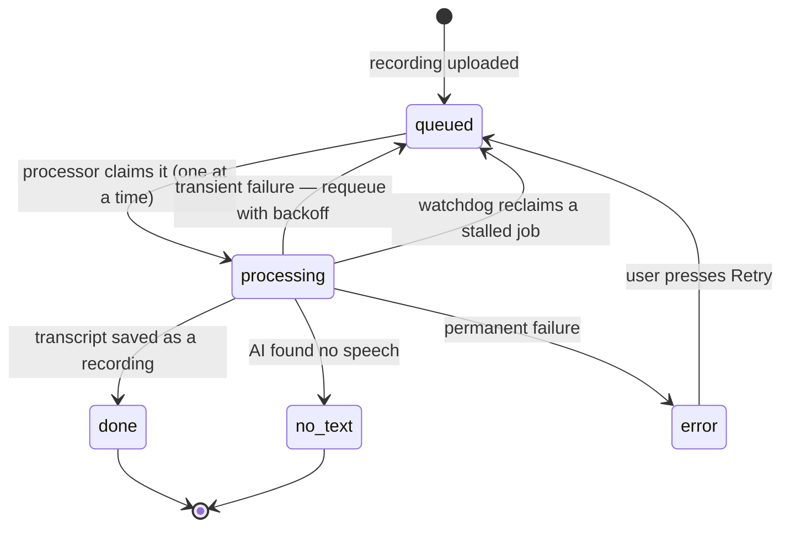
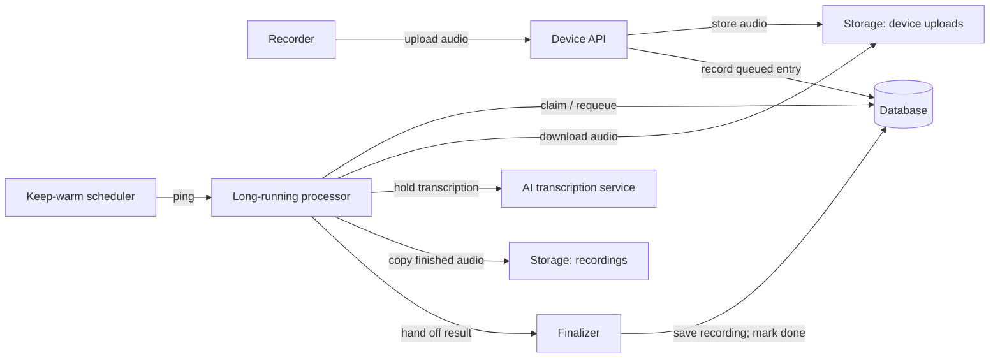
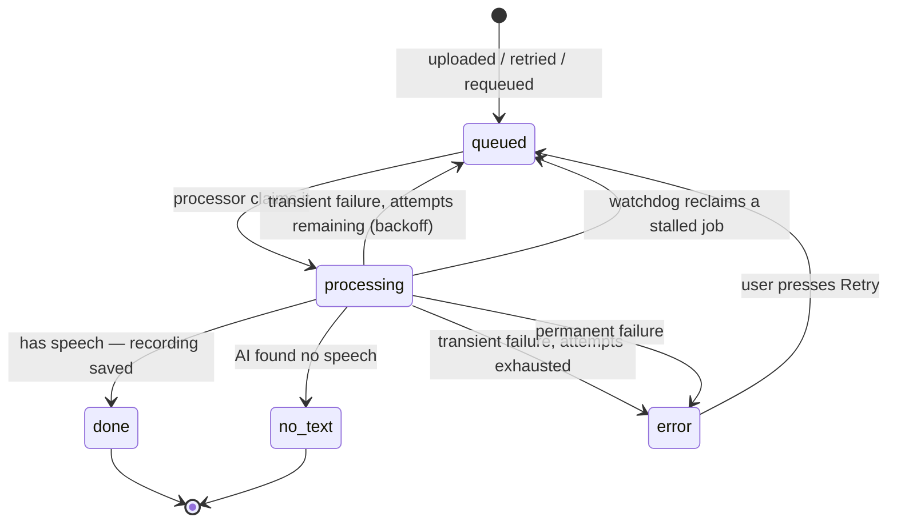
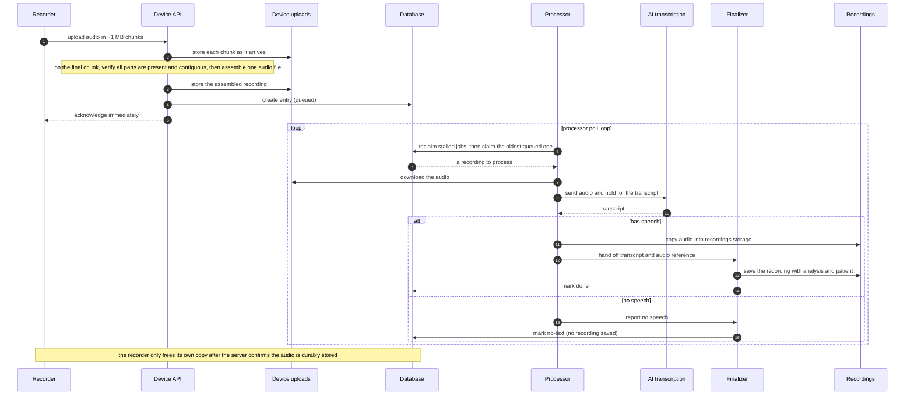

# Backend pipeline

How a recording made on the hardware becomes a finished clinical recording in the app. This page
gives a conceptual tour of the SATE backend: how audio is uploaded, how the AI transcription runs,
and how the pieces fit together so that no recording is ever lost or left stuck.

Device APIAsync pipelineLong-running processorState machine

---

## 1. Overview — why processing is ASYNC

:::danger[The single most important rule in this pipeline]
The long AI transcription must never run inside a short-lived serverless request.
:::

Serverless functions have a hard wall-clock limit — a request is killed after roughly a couple of
minutes, and that limit cannot be raised. Transcribing a long recording can easily take longer than
that. If the transcription is run directly inside such a request, the platform terminates the worker
mid-call, before any error handling can run. The recording is left marked "processing" with no way
to recover, and automated retries simply hit the same wall over and over. A long take was once seen
stuck for over an hour this way. The AI itself is not slow — a short-lived request just cannot hold
the call open long enough.

**The fix:** processing is modelled as a **state machine**, and the long AI call is moved out of the
serverless layer entirely into a **long-lived processor** that has no wall-clock limit. New
recordings arrive in a `queued` state; the processor claims them one at a time, holds the AI call for
as long as it takes, and hands the quick final steps (analysis and saving the result) back to a fast
serverless function.

Serverless wall-clock

~2 min

Worst-case stuck take (before fix)

70 min

Long-running processor

no limit

Retry attempts

bounded

### The processing state machine

Every recording carries a status plus a little bookkeeping (when processing started, how many
attempts have been made, which processor holds it). A newly uploaded recording is `queued`
automatically, so nothing extra has to happen to get it into the pipeline.

---

## 2. Components

The pipeline is deliberately split so that no single request ever has to hold the long AI call.

| Component | Role |
|---|---|
| **Device API** | The single REST surface for both devices and the app. It authenticates each caller, accepts chunked audio uploads, assembles and validates the finished audio file, and records a new `queued` entry. It returns immediately — it never waits for transcription. |
| **Long-running processor** | A long-lived process with no wall-clock limit. It repeatedly claims the oldest queued recording, downloads its audio, holds the AI transcription call open for as long as needed, copies the finished audio into permanent storage, and hands off the final steps. On failure it never deletes the device's audio. |
| **Finalizer** | The light back-half, run as a fast serverless function: it resolves which patient the recording belongs to, computes the speech analysis, saves the finished recording, and marks the job `done`. It fits comfortably in the serverless time limit because the slow AI work already happened in the processor. It is safe to run more than once for the same job. |
| **Keep-warm scheduler** | A scheduled ping (about once a minute) that keeps the processor awake and draining the queue even when there is no other traffic. |

The Device API enqueues work; the processor is the only place that holds the long AI call; the
finalizer writes the result back; and the keep-warm scheduler makes sure the queue always drains:

### How the processor stays alive

The processor runs its own polling loop continuously and only sleeps after a stretch of inactivity;
the next scheduled ping wakes it and it resumes straight from the queue. The keep-warm ping is a
backstop — the processor's own loop is what actually drains the work.

Keep-warm ping

every 1 min

Idle sleep

after ~20 min

Queue poll

every ~10 s

Stalled-job reclaim

~45 min

The processor classifies failures so the queue always resolves. A **transient** problem (a network
blip or a temporary server error) is requeued with a backoff, up to a bounded number of attempts,
after which it is marked as an error. A **permanent** problem (a bad request, or audio with no usable
content) is marked as an error right away. And a **watchdog** reclaims any job that has been sitting
in `processing` for too long, so a crash or lost connection can never wedge the queue.

---

## 3. Connection & authentication

Three kinds of caller reach the Device API, and the credential a caller presents decides which part of
the API it is allowed to use.

| Identity | Who | What it can reach |
|---|---|---|
| **Device credential** | A recorder / firmware | Register itself, send heartbeats and receive commands, upload recordings, ask whether a recording is safely stored, and fetch its owner's patient roster. |
| **Signed-in user** | A clinician on web or mobile | Everything behind a real sign-in: managing devices, patients, recordings (list, play, retry, delete), publishing firmware, and administrative views. |

The internal hand-offs between the processor and the finalizer are protected by their own shared
service credentials, separate from either caller above.

:::note[Devices don't have user logins]
A recorder authenticates with a device credential it presents to the API, not with a normal user
sign-in. The API validates that credential itself, which is why the device half of the pipeline is
kept distinct from the signed-in-user half.
:::

### Storage

| Store | Visibility | Holds |
|---|---|---|
| **Device uploads** | Private | Raw audio uploaded by devices, plus in-progress upload parts. Audio is only ever served through short-lived signed links. |
| **Recordings** | Private | The finished audio behind each saved recording, served through signed links only. |
| **Firmware** | Public | Over-the-air firmware releases, served to the whole fleet. |

---

## 4. Upload → process → recording data flow

A few principles make the upload path safe:

- **Chunked, then assembled once.** Each chunk is stored on its own and the full file is assembled a
  single time on the final chunk. An earlier design rewrote the whole file on every chunk, which grew
  quadratically on long takes and caused upload timeouts.
- **Idempotent finals.** If the device re-sends because it never heard the acknowledgement, the API
  recognises the already-stored recording and treats the repeat as a no-op instead of a full
  re-upload.
- **Verified before assembly.** Missing or mismatched chunks are rejected and the device simply
  restarts the upload; a partial take is never stitched together.
- **The device keeps its copy until the server proves storage.** A failed upload is reported as a
  failure so the recorder holds onto its audio, and the recorder only reclaims local space after the
  server confirms the exact recording is durably stored.

---

## 5. What the Device API offers

The Device API exposes two families of capabilities, chosen by who is calling.

### For devices

- Register a new device from a one-time setup token.
- Send heartbeats and receive queued commands (record, reboot, update firmware, and so on).
- Upload a recording — as a single file or in chunks for long takes.
- Ask whether a specific recording is durably stored before freeing local space.
- Fetch the owner's patient roster.

### For signed-in clinicians

- List, rename, unlink, and claim devices, and issue one-time setup tokens.
- Read and update the patient roster.
- List recordings with live processing status, play them, retry a failed one, or delete one.
- Publish and look up over-the-air firmware releases.
- Administrative, fleet-wide views for authorized administrators.

:::note[Where recordings come from]
The SATE recorder uploads with its device credential. Recordings that arrive by other paths — for
example a phone-bridged wearable — are uploaded through a normal signed-in session instead, and are
filed under that user's account.
:::

---

## 6. Reliability principles

The whole design is organized around two promises: **never lose or misfile a recording**, and
**never leave a recording stuck**.

- The long AI call lives only in the long-running processor, never in a request that can be killed by
  a time limit.
- Every recording moves through an explicit state machine, so its status is always meaningful and
  never ambiguous.
- Failures are classified and bounded — transient problems retry with backoff, permanent ones fail
  fast, and a watchdog reclaims anything that stalls.
- A user-facing Retry can always re-queue a recording that ended in error.
- The device treats itself as the only copy until the server has provably stored the audio, so a lost
  connection or a failed upload never destroys a take.
