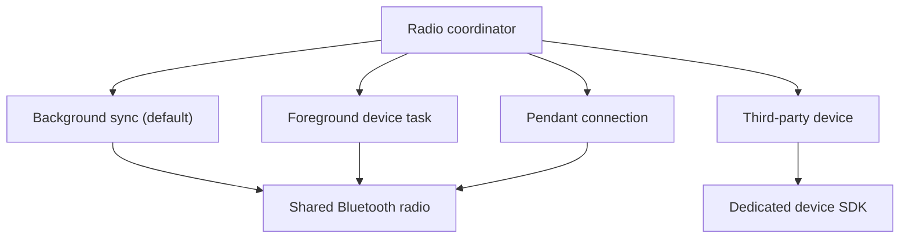
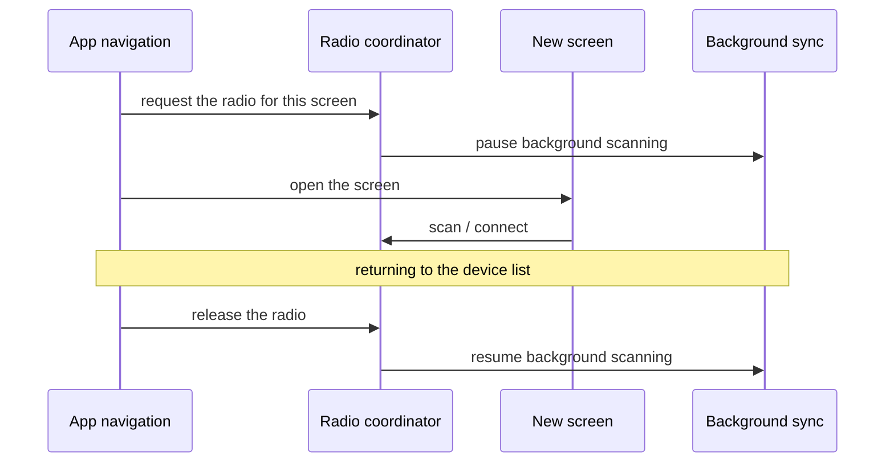
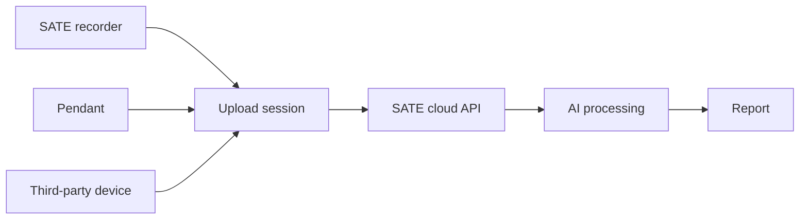

# Mobile app

The SATE companion app is a **React Native / TypeScript** application built with **Expo**.
It is **iOS-focused** — one of its device integrations ships as a proprietary
device-only SDK, so the full feature set runs on a real iPhone rather than a simulator.

At its heart the app is a **Bluetooth-to-cloud bridge**. It connects to the SATE family of
recording devices, pulls their captured audio, and relays it to the SATE backend over a
secure HTTPS connection. Alongside that, it handles first-time device setup, links devices
to the signed-in clinician account, sends remote commands, and displays the processed
reports that come back from the cloud.

React Native · iOSExpoTypeScriptdevice build required

Framework

Expo

Base

React Native

Language

TypeScript

Target

iOS

Backend

SATE cloud API

Device families

3

:::note[Runs on a real device]
Because the app relies on native Bluetooth and hardware SDK modules, it runs as a full
device build rather than inside a lightweight preview client. Everyday interface changes
still update instantly during development; only changes that touch the native layer require
a rebuild.
:::

## 1. Overview

The app pairs a clinician's iPhone with SATE recording hardware and acts as the link
between that hardware and the cloud. It signs in with the same account used on the SATE web
app, so devices, patients, and reports stay consistent across both.

| Aspect | Detail |
|--------|--------|
| Framework | Expo · React Native · TypeScript |
| Target | iOS |
| Backend | SATE cloud API — no separate app server to run |
| Sign-in | Same clinician account as the SATE web app; sessions refresh automatically |
| Device families | Three supported recording devices |
| Upload path | One shared pipeline for all devices → cloud API → AI processing → reports |
| Local state | Settings and session persisted securely on the device |

The interface is organized as a set of focused screens — a device list, per-device detail
and settings, first-time setup, Wi-Fi configuration, capture and preview, and report
viewing — that the user moves between as they work.

**The session stays signed in.** The app keeps the clinician logged in without surprise
re-authentication. When a request finds an expired credential, the app quietly renews it in
the background and retries once, so a brief network hiccup never logs anyone out — only a
genuinely invalid session does.

## 2. Connection methods

The app talks to devices over **Bluetooth Low Energy (BLE)** and talks to the cloud over
**HTTPS**. Because there is only one physical Bluetooth radio in the phone, the app carefully
coordinates which device family is using it at any moment.

| Channel | Used for |
|---------|----------|
| Bluetooth (shared) | Discovering and connecting to the SATE recorder and the SATE Pendant |
| Bluetooth (dedicated SDK) | The third-party device family, which manages the radio through its own SDK |
| HTTPS | Uploading audio and exchanging data with the cloud API |

### Coordinating one radio

A single coordinator decides which device family currently owns the Bluetooth radio and is
the one place that hands it off. Everyday background scanning for nearby recorders is the
default owner; certain foreground tasks (setup, Wi-Fi changes, manual sync) temporarily take
sole ownership so their operation isn't disturbed, and hand it back when finished.

Two families (the recorder and the Pendant) share the same Bluetooth connection cleanly:
handing the radio between them simply pauses one scan and resumes the other. The third-party
family instead takes the radio for itself through its own SDK, and the shared connection is
re-established afterward when needed. Keeping this handoff disciplined is what ensures a
device is always reliably discovered when the user goes looking for it.

### Uploads to the cloud

Every device family feeds a single upload path. Captured audio is sent to the SATE cloud
API, queued for AI processing, and the resulting analysis becomes a report. Because all
three families share this one pipeline, behavior stays consistent no matter which device
produced the recording.

## 3. Features

| Feature | What it does |
|---------|--------------|
| **Automatic background sync** | Watches for nearby recorders that have audio waiting, connects, pulls each session, uploads it, and marks it synced — with no manual step. |
| **Manual recorder sync** | Lets the user sync a specific recorder on demand from its detail screen. |
| **Pendant capture** | Streams live audio from the wearable Pendant, packages it, and uploads it through the shared pipeline. |
| **Third-party device connect** | Connects to and captures from the third-party device family, with careful account-binding safeguards (see below). |
| **Device setup (provisioning)** | Guides first-time onboarding entirely over Bluetooth: hands the device its Wi-Fi credentials, links it to the account, and reports progress through to "registered." |
| **Change Wi-Fi** | Updates a device's network without unlinking it from the account — no factory reset needed. |
| **QR / mobile-link login** | A second way to sign in: the web app shows a one-time QR code, the phone scans it, and the clinician is signed in on the same account. |
| **Patient assignment** | Recordings default to a standalone bucket; assigning them to a specific patient is optional and can be done later from the web report. |
| **Reports** | Shows the same processed recordings the web app shows, scoped to the signed-in account. |

### About the Pendant

The Pendant is a small wearable recorder that streams audio to the phone over standard
Bluetooth. The app takes care of a few practical details on its behalf: it discovers the
device reliably even when its advertised name is inconsistent, cleanly stops a recording
without tacking on stray fractions of a second, and lifts a quiet microphone signal to a
comfortable listening level before upload.

## 4. Third-party device safety

The third-party device family requires special care around **account binding** — the
association between a device and the account that owns it. If that binding is mishandled a
device can become unusable for the account, so the app treats every binding-related action
conservatively:

- **A stable, account-derived identity** is used consistently, so reconnecting after a
  reinstall or a new phone always re-establishes the same relationship rather than creating
  a new one.
- **A guard before connecting** refuses to attach a device that is already bound to a
  different account.
- **The binding is stored securely on the device** so it survives app reinstalls; the app
  reconnects to an existing binding rather than re-creating one.
- **Unbinding is always user-initiated**, never automatic. Ordinary teardown, logout, or
  radio handoff only disconnects — it never releases the binding.
- **Unbinding waits for the device to confirm** before the app forgets it locally, keeping
  the two sides in agreement.

:::warning[Handle binding with care]
Binding is the one area of the app where a careless change can leave hardware unusable for
an account. Any work touching device connection, identity, or teardown for this family
should preserve the safeguards above.
:::

## 5. Known issues & current status

The team tracks a small set of open items, prioritized around two goals: **never lose or
mismatch a patient's audio**, and **never leave a feature stuck**. Security hardening is
tracked separately and scheduled behind current feature work.

| Area | Status |
|------|--------|
| Pendant capture is held in memory until upload | Being hardened so an interrupted upload or an app restart can't lose an in-progress take |
| Duplicate sessions from a lost sync acknowledgment | **Addressed** on the server, which now detects and ignores a re-uploaded copy of the same take |
| A stalled connection could tie up the radio | Being given proper timeouts so a hung operation can't pause background sync indefinitely |
| Very long recordings are memory-heavy to upload | Being reworked to stream large takes instead of holding them whole in memory |
| Network requests without a timeout | Being given timeouts so a stalled request can't hang |
| Locally stored credentials | Planned move to more secure device storage (tracked as a security item) |

:::note[Where this fits]
The mobile app is one link in a larger chain: capture on the device, sync through the phone,
processing in the cloud, and review on the web. The integrity safeguards on the recorder and
backend close the same loop from the other end, so an uploaded recording is only ever freed
from a device once the cloud has durably confirmed it.
:::
