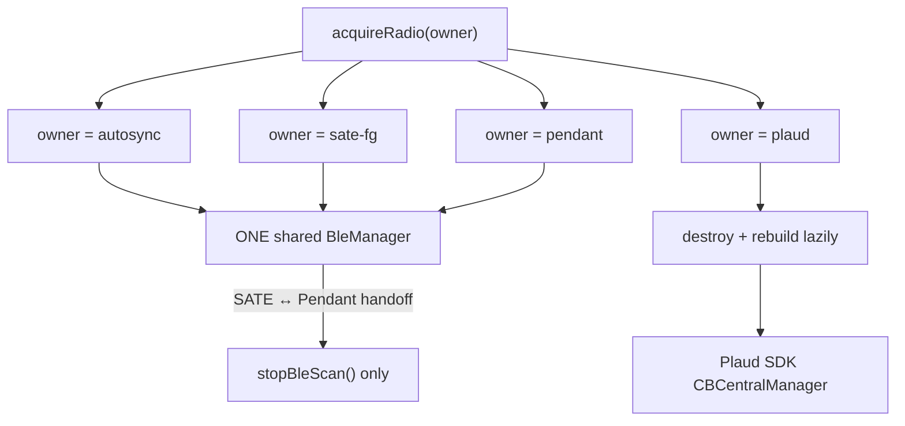
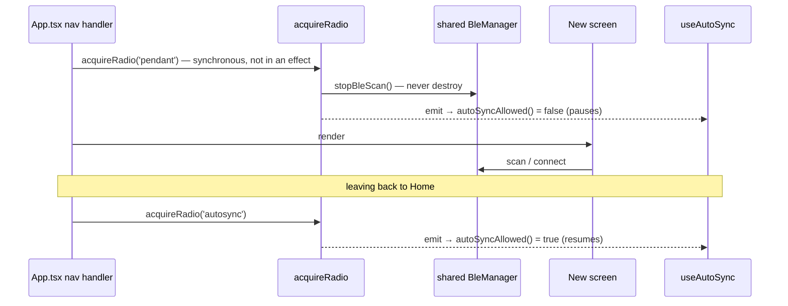
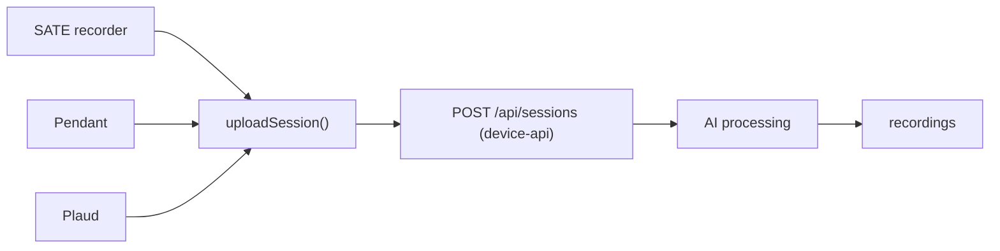
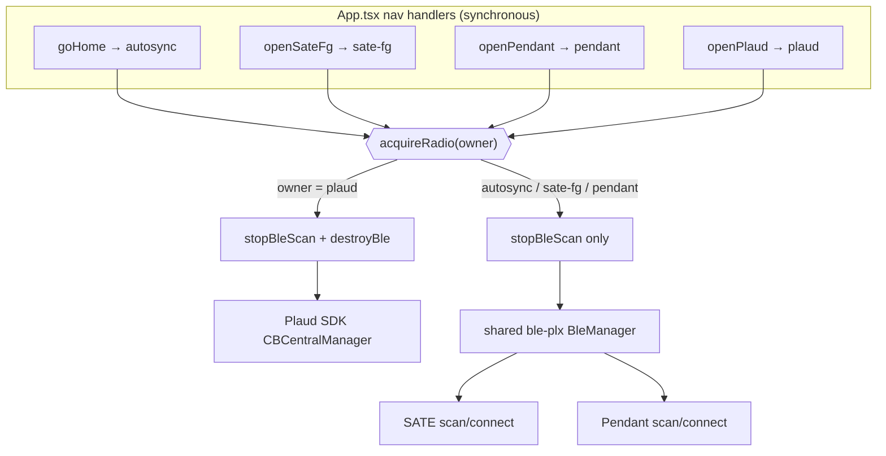
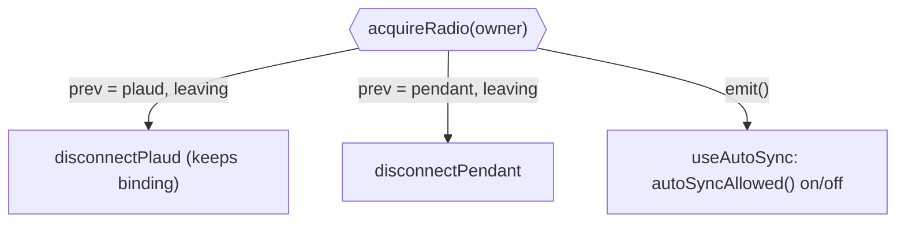

# Mobile app

The SATE companion app is an **Expo SDK 54 / React Native / TypeScript** application.
It is **iOS-focused** — the Plaud integration ships a proprietary **arm64 device SDK**
(no simulator), so full-feature builds only run on a real iPhone. Source lives in
`src/`; the entry point is `App.tsx`.

The app is a **BLE-to-cloud bridge**. It connects to three device families — the **SATE
recorder**, the **SATE Pendant**, and **Plaud** devices — and relays their audio to the
SATE backend (the Supabase `device-api` Edge Function) over HTTPS. It also does
first-time recorder setup, claims devices to the signed-in SLP account, sends remote
commands, and shows processed reports.

<div class="badge-row"><span class="sate-badge">React Native · iOS</span><span class="sate-badge">Expo SDK 54</span><span class="sate-badge">TypeScript</span><span class="sate-badge warn">dev build required</span></div>

<div class="spec-grid">
<div class="spec-tile"><div class="k">Framework</div><div class="v">Expo SDK 54</div></div>
<div class="spec-tile"><div class="k">Base</div><div class="v">React Native</div></div>
<div class="spec-tile"><div class="k">Language</div><div class="v">TypeScript</div></div>
<div class="spec-tile"><div class="k">Target</div><div class="v">iOS only</div></div>
<div class="spec-tile"><div class="k">Backend</div><div class="v">device-api</div></div>
<div class="spec-tile"><div class="k">Device families</div><div class="v">3</div></div>
</div>

:::warning[Dev build required]
`react-native-ble-plx` and the Plaud SDK are native modules, so **Expo Go cannot load them** — run
`npx expo run:ios`. `getSharedBleManager()` throws a descriptive error outside a dev build
(`src/ble/bleManager.ts`). JS changes hot-reload via Metro; native changes need a rebuild.
:::

## 1. Overview

| Aspect | Detail |
|--------|--------|
| Framework | Expo SDK 54, React Native, TypeScript |
| Target | iOS (Plaud SDK is arm64 device-only; Pendant/QR-login also need native rebuilds) |
| Backend | Supabase Auth + `device-api` Edge Function — no separate app server (`src/api/sateApi.ts`) |
| Auth | Supabase user JWT (same account as the SATE web app); auto-refreshing session |
| Device families | SATE recorder (`SATE-…`), Plaud (`plaud-<sn>`), SATE Pendant (`pendant-<id>`) |
| Upload pipeline | One path for all three: `api.uploadSession()` → `device-api` → AI → `recordings` |
| State | `StoreProvider` / `useStore` (`src/store.tsx`), persisted to AsyncStorage |

The top-level component is `Root()` in `App.tsx`. It holds a hand-rolled `Screen` union
(`home`, `recorderDetail`, `provision`, `changeWifi`, `recorderSettings`, `preview`,
`plaud`, `plaudSettings`, `pendant`, `report`, `settings`) and switches on `screen.name`
— there is no navigation library. Three link objects are memoized once and threaded into
screens: `makeLink()` (SATE), `makePlaudLink()` (Plaud), `makePendantLink()` (Pendant).

**Session self-heals.** `App.tsx` keeps the user signed in without surprise re-logins.
The `api` (`makeApi`) is built with a `doRefresh` handler: on a `401` the client calls
`onUnauthorized()`, swaps in the fresh access token, and **replays the request once**
(`HttpApi.req`, `src/api/sateApi.ts`). A proactive timer also refreshes within 5 min of
expiry. A single in-flight refresh is shared (via a `useRef` promise) so the proactive
timer and any `401` retry don't race — important because Supabase rotates refresh tokens.
A network blip during refresh does **not** sign the user out; only a genuinely dead
refresh token does (`RefreshError.authInvalid`).

## 2. Connection methods

Three BLE stacks contend for **one physical radio**, plus HTTPS for uploads:

| Stack | Library | Used by | Serial prefix |
|-------|---------|---------|---------------|
| `bleplx` (shared) | `react-native-ble-plx`, ONE `BleManager` | SATE recorder (`SateLink`) **and** Pendant | `SATE-…` / `pendant-<id>` |
| Plaud SDK | proprietary `CBCentralManager` (own, alive from launch) | Plaud devices | `plaud-<sn>` |
| HTTPS | `fetch` | uploads + REST to `device-api` | — |

### The shared BleManager rule (RULE #2)

**SATE and the Pendant share a single `BleManager`** created by `getSharedBleManager()`
in `src/ble/bleManager.ts`. This is not a style choice. `react-native-ble-plx` wraps one
native `CBCentralManager` and is explicit that you must keep **one** instance alive.
Creating a second manager — **or destroying one and immediately recreating another** —
leaves the native iOS BLE stack broken: **scans return zero devices with no error.**

That is the exact bug that stopped the pendant being found for days: the SATE→Pendant
handoff used to call `link.teardown()` (destroy) and the pendant then built its own
manager → empty scan. Both `PendantLink` and `SateLink` now pull the same manager via
`getSharedBleManager()`; `hasSharedBleManager()` checks existence without creating one;
`destroySharedBleManager()` is called **only** on the Plaud handoff.

### The radio arbiter (`src/ble/radio.ts`)

`radio.ts` is the single source of truth for who owns the radio, and the **only** place
that hands it over. It layers four **logical owners** over the two physical stacks:

| Owner | Screen(s) | Handoff behavior |
|-------|-----------|------------------|
| `autosync` | Home / background bridge (default owner) | drives shared `bleplx`; the only background scanner |
| `sate-fg` | provision, changeWifi, recorderSettings, sync-over-BLE | needs the radio alone → pauses auto-sync |
| `pendant` | pendant connect | shares `bleplx` — **stopScan only, never destroy** |
| `plaud` | plaud connect/settings | **destroys** `bleplx`; Plaud SDK takes the radio |



Diagram detail (kept out of the nodes above):

| Node | Detail |
|---|---|
| `acquireRadio(owner)` | `src/ble/radio.ts` |
| `ONE shared BleManager` | `getSharedBleManager()` |
| `stopBleScan() only` (SATE ↔ Pendant) | never destroy |
| `destroy + rebuild lazily` (plaud) | `stopBleScan() + destroyBle()` = `destroySharedBleManager()`; rebuilt lazily on next SATE/Pendant use |
| `Plaud SDK CBCentralManager` | own radio |

`acquireRadio(owner)` encodes the two rules:

```ts
if (owner === "plaud") {
  hooks.stopBleScan();
  hooks.destroyBle();     // ONLY destroy path — Plaud SDK needs the radio alone
} else {
  hooks.stopBleScan();    // autosync / sate-fg / pendant: stop scan, NEVER destroy
}
```

Leaving the previous owner releases it: a departing `plaud` owner calls
`disconnectPlaud()` (which **must** be `plaud.disconnect()` — drop the BLE link, keep the
binding; **never** `depair()`, see RULE #1); a departing `pendant` owner calls
`disconnectPendant()` (stopScan + drop connection, no destroy).

Two consequences worth internalizing:

- **`acquireRadio` is called synchronously in the navigation handler in `App.tsx`**
  (`goHome`, `openPlaud`, `openPendant`, `openSateFg`) — **never in an effect.** A parent
  effect runs *after* the child's, so acquiring in an effect would stop the scan the new
  screen just started.
- **One scan per manager.** Auto-sync (`useAutoSync`) is the only background scanner and
  publishes the `nearby` set. A screen must **not** run its own presence scan; it reads
  `nearby` from auto-sync. Auto-sync gates itself with `autoSyncAllowed()` (true when the
  owner is `null` or `autosync`) and subscribes via `subscribeRadio` — there is **no
  screen-name allowlist** (do not reintroduce one; give the screen an owner instead).

A screen taking the radio (here, the pendant connect screen) and handing it back:



### HTTPS uploads

All three families feed one upload path: `api.uploadSession({ device_serial, patient_id,
session_number, sample_rate, wav_base64, flags? })` → `POST /api/sessions` on `device-api`
→ AI processing → `recordings`. Everything goes through the same Supabase gateway (the
`apikey` anon header is required; `Authorization: Bearer <jwt>` when signed in).



## 3. Features

| Feature | Where | Notes |
|---------|-------|-------|
| **Auto-sync bridge** | `useAutoSync` (`src/sync/AutoSync.ts`) | Foreground BLE bridge: scans for recorders advertising "needs sync", connects, pulls each session, uploads, then `markSynced`. Publishes `nearby`. v0.1 runs foregrounded; true background BLE is a v0.2 item. |
| **SATE recorder sync over BLE** | `RecorderDetailScreen.syncOverBle` | Manual foreground sync: borrows the radio with `acquireRadio("sate-fg")`, scans/connects, then hands it back with `acquireRadio("autosync")`. |
| **Pendant capture + upload** | `PendantLink` + `PendantConnectScreen` | Live PCM capture over standard BLE GATT → WAV → `uploadSession`. |
| **Plaud connect / capture** | `PlaudLink` + `PlaudConnectScreen` / `PlaudSettingsScreen` | Bind-guarded connect; lock-safe teardown (see RULE #1). |
| **Provisioning** | `ProvisionScreen` + `BleLink.provision()` | BLE-only onboarding: refresh session → `claimToken()` → BLE-write Wi-Fi creds + claim token → stream `connecting → wifi_ok → registering → registered`. |
| **Change Wi-Fi** | `ChangeWifiScreen` | Keeps the account binding (no factory reset). |
| **QR / mobile-link login** | `LoginScreen` + `consumeMobileLink()` | Second login method: web mints a one-time code/QR, phone consumes it via the `mobile-link` Edge Function → same session shape as password login. Needs expo-camera (native rebuild). |
| **Patient assignment** | web report | Uploads default to **Standalone**; assigning a patient is optional and done later on the web report. Not forced at capture. |
| **Reports** | `ReportScreen` | Reads `recordings` rows directly from Supabase REST (RLS-scoped) — the same rows the web app shows. |

### Pendant capture detail (`src/pendant/PendantLink.ts`)

The pendant is a Seeed XIAO nRF52840 Sense over **standard BLE GATT** — plain
`react-native-ble-plx`, **no binding/lock concern** (unlike Plaud). GATT profile:

| UUID | Role |
|------|------|
| `19b10000-e8f2-537e-4f6c-d104768a1214` | audio service |
| `19b10001-…` | audio char (notify): 244 B = 122 int16 LE samples @ 16 kHz mono |
| `19b10002-…` | control char (write 1 byte): `0x00` stop, `0x01` start, `0x02` find-me |
| `0000180f-…` / `00002a19-…` | battery service/char (bit7 = charging, low 7 bits = percent) |

Notable behaviors, all grounded in code:

- **Scan with NO service filter**, `allowDuplicates:true`. The pendant advertises the
  audio service UUID in the ADV packet but its name only in the SCAN RESPONSE — iOS
  surfaces those as `serviceUUIDs` and `localName` across separate callbacks. Matching
  tests `name` **or** `localName` (`/sate|pendant|nuna/i`) **or** the advertised audio
  service, so a stale cached GAP name can't hide it.
- **Stop gates accumulation.** A `capturing` flag is set false in `stop()` *before*
  `CMD_STOP`, so in-flight notifications during the round-trip don't tack extra tenths
  onto the take (the "0:01/0:02 after Stop" bug).
- **Quiet mic → `applyGain`**: peak-normalize to ~97% full scale (never attenuate, gain
  capped at `MAX_GAIN=40`) plus a `LOUDNESS=2.6` drive with a `tanh` soft-clip.
- **Buffer reset on `start()` and `disconnect()`** so a start-after-stop-without-take
  can't prefix the new recording with the previous take's audio.

## 4. Plaud device-lock safety (RULE #1) — CRITICAL

**A Plaud device can be PERMANENTLY LOCKED for an account if its binding is mishandled.**
Unlike a SATE recorder (recoverable), a mis-bound / desynced Plaud is bricked for that
account. Every change that touches Plaud — connect, identity, Keychain, BLE lifecycle,
teardown, account/login, sync, settings — MUST preserve these five invariants:

1. **Stable, account-derived identity.** `plaudUserId(uid) = "sate_<uid>"`
   (`src/plaud/PlaudLink.ts`) is the SAME string used as the Plaud `user_id` by the
   `mint-plaud-token` Edge Function **and** as the `deviceToken` passed to
   `connect(deviceId, plaudUserId)`. It is restored on login → survives reinstall. Never
   pass a raw uid, a random value, or a per-install/per-device token.
2. **Bind guard before connect.** If `bindingOwner(sn)` is set and ≠ this account,
   **REFUSE** to connect. Reconnect to your own binding; never re-bind under a new
   identity (guard lives in `PlaudConnectScreen`).
3. **Binding lives in the iOS Keychain** (`plaud.bind.<sn>`, `AfterFirstUnlock`), so it
   outlives uninstall — AsyncStorage does not. Reinstall → reconnect, never re-bind.
4. **No auto-depair, ever.** `depair(clear:true)` is exposed ONLY via the user-initiated
   `resetBinding` (the UNBIND button, `PlaudSettingsScreen`). Unmount / teardown / logout
   / radio-handoff must only `disconnect()`. The arbiter's `disconnectPlaud` hook is wired
   to `plaud.disconnect()` and **nothing else**.
5. **ACK-before-forget on unbind.** Order is law: send `depair` → device ACKs
   (`bleDepair`, status 0) → **only then** delete the local Keychain record. Native
   refuses depair while disconnected, fails fast on a mid-command BLE drop, and times out
   (20s) instead of hanging; `resetBinding` keeps the Keychain record on ANY failure.
   Forgetting locally before the device ACKs desyncs the binding and freezes the device.

Native logic: `modules/plaud-sate/` (Expo module) →
`modules/plaud-sate/ios/PlaudSateModule.swift` (native connect/depair + ACK).

## 5. Radio arbiter data flow

Acquire path — a nav handler takes the radio for the new owner:



Release path — leaving an owner hands the radio back:



Diagram detail (kept out of the nodes above):

| Node | Detail |
|---|---|
| `acquireRadio(owner)` | `src/ble/radio.ts` |
| `stopBleScan + destroyBle` (plaud) | = `destroySharedBleManager()` |
| `stopBleScan only` (others) | NEVER destroy the shared manager |
| `Plaud SDK CBCentralManager` | scan / connect (own radio) |
| `shared ble-plx BleManager` | `getSharedBleManager()` |
| `SATE scan/connect` | auto-sync or sate-fg |
| `disconnectPlaud` | = `plaud.disconnect()` — keeps binding (RULE #1) |
| `disconnectPendant` | stopScan + drop connection |
| `useAutoSync` | `subscribeRadio` → `autoSyncAllowed()` flips its scan on/off |

Key invariant restated by these diagrams: **SATE ↔ Pendant transitions are `stopScan`-only**
(both live on the shared `bleplx` manager), while the **Plaud transition destroys and
rebuilds** the manager because the Plaud SDK needs the radio to itself. Leaving Plaud
`disconnect`s (never depairs).

## 6. Key files

| Path | Role |
|------|------|
| `App.tsx` | Root component, `Screen` union router, session auto-refresh, `registerRadio`, synchronous `acquireRadio` navigation handlers |
| `src/ble/bleManager.ts` | The ONE shared `BleManager`: `getSharedBleManager` / `hasSharedBleManager` / `destroySharedBleManager` |
| `src/ble/radio.ts` | Radio arbiter — logical owners `autosync\|sate-fg\|pendant\|plaud`, `acquireRadio`, `autoSyncAllowed`, `subscribeRadio` |
| `src/ble/SateBle.ts` | `SateLink` — SATE scan/connect/provision/pull-sessions/commands (`makeLink()`) |
| `src/sync/AutoSync.ts` | `useAutoSync` — foreground BLE bridge; the only background scanner; publishes `nearby` |
| `src/pendant/PendantLink.ts` | Pendant GATT capture → WAV → upload; peak-normalize gain; `capturing` gate |
| `src/pendant/PendantStore.ts` | Persisted known pendants (AsyncStorage) |
| `src/plaud/PlaudLink.ts` | Plaud identity (`plaudUserId = sate_<uid>`), Keychain bindings, `bindingOwner`, `resetBinding` |
| `modules/plaud-sate/ios/PlaudSateModule.swift` | Native Plaud connect / depair + ACK |
| `src/api/sateApi.ts` | `HttpApi` — Supabase Auth login/refresh + `device-api` REST; `uploadSession`; `consumeMobileLink` |
| `src/store.tsx` | `StoreProvider` / `useStore` — settings + session, AsyncStorage key `sate-companion-settings-v3` |
| `src/screens/` | UI screens (Login, DeviceList, RecorderDetail/Settings, Provision, ChangeWifi, PlaudConnect/Settings, PendantConnect, Report, Settings, DevicePreview) |

## 7. Known issues & current status

From the multi-agent audit (2026-07-22). The stated priorities: (1) never lose or
**mismatch** patient audio; (2) no feature ever **stuck**; security is noted, not yet
fixed. Symptom → file → status:

| Issue | Symptom | File | Status |
|-------|---------|------|--------|
| Pendant `takeWav()` clears buffer before upload succeeds | Take buffer is reset inside `takeWav()`; if the subsequent `uploadSession` fails, the audio is already gone → **data loss** | `src/pendant/PendantLink.ts` | **OPEN — data loss** |
| Pendant memory-only capture | The in-progress take lives only in the in-memory `chunks[]` buffer — an app kill (or crash) mid-capture loses it | `src/pendant/PendantLink.ts` | **OPEN** |
| AutoSync lost `markSynced` ACK → duplicate sessions | If the server stored the session but the `markSynced` ACK is lost, the next scan re-pulls and re-uploads as a NEW row (duplicate device session + duplicate AI run) | `src/sync/AutoSync.ts`, `deviceApi.ts` | **Server dedup FIXED** (`storeSessionRecord` idempotency probe); no DB UNIQUE constraint backstop yet |
| `storeSessionRecord` dedup | Chunk path had dedup; the whole-file store path did not | `deviceApi.ts` | **FIXED** (probe on user/serial/patient/session_number/bytes + `objectExists`) |
| `syncOverBle` connect has no timeout | `link.connect(found.id)` can hang with no timeout while holding `sate-fg` → the radio is **starved** and auto-sync stays paused | `src/screens/RecorderDetailScreen.tsx` | **OPEN — radio starved** |
| `uploadSession` base64 OOM on long takes | The entire WAV is base64-encoded in memory (`wav_base64`); a long take can OOM the JS heap | `src/api/sateApi.ts`, `src/sync/AutoSync.ts`, `src/pendant/PendantLink.ts` | **OPEN** |
| `unlink` / device removal swallows failure | Failure path is swallowed, so the UI can report success when the removal did not happen | recorder settings / device-remove path | **OPEN** |
| AutoSync / Plaud teardown mid-sync when `api` dep changes | `useAutoSync`'s effect depends on `api`; a token refresh rebuilds `api` and tears the scan/connection down mid-sync | `src/sync/AutoSync.ts` (dep array `[enabled, signedIn, link, api]`) | **OPEN** |
| No `fetch` timeout | `HttpApi.req` / `refreshSession` / `consumeMobileLink` use bare `fetch` with no `AbortController` — a stalled request can hang indefinitely | `src/api/sateApi.ts` | **OPEN** |
| Tokens in AsyncStorage, not Keychain | Supabase access + long-lived refresh tokens are persisted in **plaintext AsyncStorage**, not the Keychain (unlike the Plaud binding). CLAUDE.md already notes AsyncStorage doesn't protect secrets | `src/store.tsx` (`Settings`, key `sate-companion-settings-v3`) | **OPEN — security, noted/deprioritized** |

> Related fixed items for context: the recorder-side delete-during-upload splice, trim-tail
> race, and pendant byte-exact truncation reject were fixed and build-verified in the same
> session; SD reclaim is now server-verified (`GET /api/sessions/verify`, device-api ≥v15).
> Those are firmware/backend, not the mobile app, but they close the loop on the
> upload-integrity path this app feeds.
