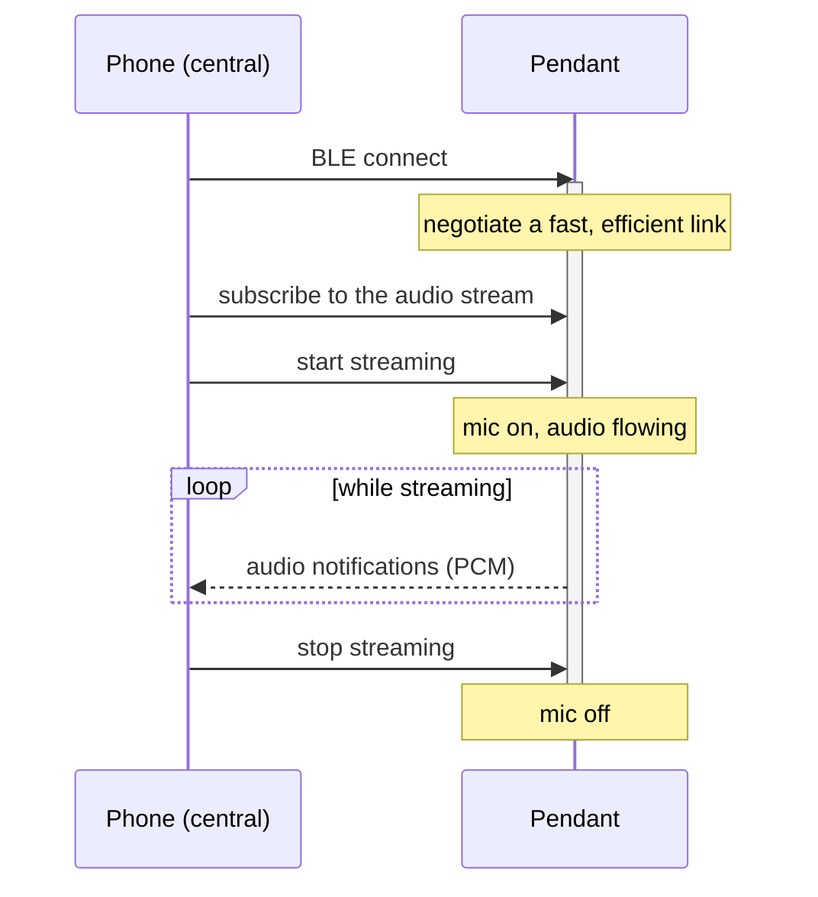
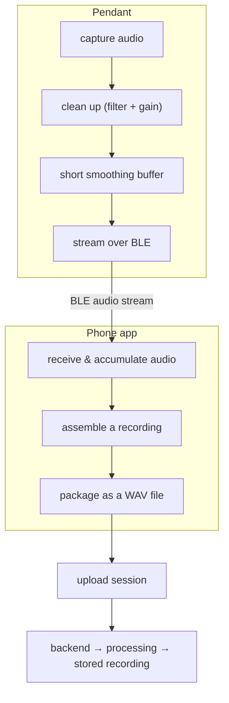

# SATE Pendant firmware

The SATE Pendant is a small wearable that captures audio and streams it, over
Bluetooth Low Energy (BLE), to the SATE phone app. The app assembles the audio
into a standard recording and uploads it through the same backend pipeline used
by the rest of the SATE system. This page is a high-level overview of what the
pendant is, how it fits into the product, and how it behaves for the people
wearing it and the app that talks to it.

WearableXIAO nRF52840 Sense PlusBLE audio streamerPCM 16 kHz mono

---

## 1. Overview

The pendant is a compact, battery-powered device built around a **Seeed XIAO
nRF52840 Sense Plus** board with an onboard microphone. It captures audio and
sends it continuously to a nearby phone as **16 kHz mono PCM** — a plain,
uncompressed audio stream that needs no decoding on the receiving end. The phone
app collects that stream and forwards it to SATE's inference service, which
listens for food-intake activity. Only audio is used; the board's motion sensors
are intentionally left out of the design.

| Property | Value |
|---|---|
| Device | XIAO nRF52840 Sense Plus wearable |
| Connectivity | Bluetooth Low Energy (BLE) |
| Audio format | Uncompressed PCM, 16 kHz, mono |
| Role | BLE peripheral — the phone acts as the central/controller |
| Upload path | The app wraps the audio as a WAV file and uploads it through the standard SATE session pipeline |

Two things the pendant deliberately does **not** do:

- **It does not upload to the backend itself.** The pendant only emits audio over
  BLE. The phone app is the relay: it assembles the recording and handles the
  upload.
- **It keeps its on-device role simple.** Diagnostics and heavier processing live
  on the phone and in the backend, keeping the wearable lightweight and
  power-efficient.

---

## 2. Hardware

The pendant is a single-board wearable with an onboard microphone, a small
battery, USB charging, and a few status LEDs. The essentials worth knowing at a
product level:

- **Microphone.** A digital onboard mic captures audio at a fixed 16 kHz sample
  rate, chosen to keep pitch and timing accurate.
- **Battery & charging.** The device runs on a small rechargeable LiPo cell and
  charges over USB. It reports a battery percentage and a charging indicator to
  the phone. A charge-status LED that blinks on USB is normal behavior.
- **Status LEDs.** On-body indicators show recording activity and BLE connection
  state. They are deliberately dimmed and blinked rather than left solid, to save
  power.
- **Power efficiency.** The device is tuned for stable streaming at low battery,
  so audio quality and connection reliability hold up as the charge drops.

:::note[Provisioning is a factory/service step]
Preparing a pendant board is a one-time setup step handled during manufacturing
or servicing. It is not something a wearer or operator needs to do — a pendant
arrives ready to pair with the app.
:::

---

## 3. Connection & BLE behavior

The pendant advertises itself over BLE and waits for the phone to connect. Once
paired, the phone controls streaming and receives audio. At a conceptual level
the BLE relationship exposes three things:

| Capability | Purpose |
|---|---|
| Audio stream | A continuous flow of PCM audio notifications from the pendant to the phone |
| Control | Simple commands from the phone: start streaming, stop streaming, and a "find-me" alert |
| Battery & status | Battery percentage and charging state, updated periodically and immediately on plug/unplug |
| Firmware update | Over-the-air firmware updates delivered from the phone over BLE |

### Control commands

The phone drives the pendant with three simple actions:

- **Start streaming** — the pendant powers its mic and begins sending audio.
- **Stop streaming** — the pendant stops the mic and the audio flow ends.
- **Find-me** — the pendant flashes its LEDs for a few seconds so a wearer can
  locate it.

The pendant does not stream until the phone explicitly starts it.

### Connection lifecycle

### Battery & status

The pendant reports both its battery percentage and whether it is currently
charging. The phone shows this to the user and refreshes it periodically, with an
immediate update whenever the device is plugged in or unplugged.

### Advertising & discovery

When idle, the pendant broadcasts its presence so the phone can find it. To make
discovery reliable across phone platforms, the app matches the pendant flexibly
rather than relying on a single identifier, and the pendant automatically resumes
advertising after any disconnection so it can be found again without user action.

### Throughput

A 16 kHz, 16-bit audio stream sits near the practical ceiling of what BLE can
carry, so the connection is tuned to move that data smoothly — negotiating a
faster radio mode and larger packets while still keeping power draw low. The
device favors an efficient link that carries the needed audio without waking the
radio more often than necessary.

### Over-the-air updates

Firmware can be updated wirelessly from the phone over BLE, so a pendant in the
field can receive new firmware without physical access.

---

## 4. Features

- **Audio streaming.** On command, the pendant powers its mic and streams
  continuous PCM audio to the phone.
- **Smooth, gap-tolerant buffering.** A short internal audio buffer smooths out
  brief timing hiccups between capturing audio and sending it, so the stream stays
  clean under load. If the phone ever falls behind, the device favors preserving
  already-captured audio and dropping only the newest samples, producing at most a
  single clean gap rather than corrupted audio.
- **On-device audio cleanup.** Lightweight filtering removes low-frequency rumble
  and DC bias, and a gentle makeup-gain stage brings quiet audio up without the
  harsh distortion of hard clipping — a meaningful clarity improvement given the
  small onboard mic.
- **Nap mode (power saving).** While streaming, if the environment stays quiet for
  a while, the pendant naps: it powers down the mic and goes idle to save battery,
  periodically listening for sound and resuming instantly when it hears activity.
  The BLE connection stays up the whole time — a pause in audio during silence is
  normal and is **not** a disconnect.
- **Find-me alert.** A command makes the pendant flash its LEDs so a wearer can
  locate it.
- **Power-conscious indicators.** Status LEDs are duty-cycled and blinked rather
  than left solid, extending battery life.
- **Over-the-air firmware updates** over the live BLE link.

```mermaid
stateDiagram-v2
    [*] --> Idle
    Idle --> Streaming : start command
    Streaming --> Napping : stays quiet for a while
    Napping --> Streaming : sound detected
    Napping --> Napping : periodic listen
    Streaming --> Idle : stop command or disconnect
    Napping --> Idle : stop command or disconnect
    note right of Napping : mic off, radio idle to save power; BLE link stays up
```

---

## 5. Audio pipeline

End to end, audio moves from the pendant's mic, through the phone app, and into
the SATE backend as a stored recording. The pendant captures and cleans the
audio, the app assembles and uploads it, and the backend reuses the same session
pipeline as the rest of the SATE system.

A key reliability principle: the pendant only considers audio "sent" once the
phone has actually received it, and never discards buffered audio on a failed
send — data is held and retried rather than dropped, which keeps the stream from
developing gaps under a busy link.

---

## 6. Configuration & tuning

The pendant and the app each have a small set of tunable behaviors that shape the
listening experience:

- **Sample rate** is fixed at 16 kHz for accurate pitch and timing.
- **Microphone and makeup gain** boost the quiet onboard mic. Both the device and
  the app apply some gain; they are tuned together so the audio is loud and clear
  without pushing into distortion.
- **Nap thresholds and timing** decide how quickly the device naps in silence, how
  often it listens while napping, and what counts as "sound" worth waking for.
- **Buffer size** sets how much timing slack the smoothing buffer absorbs.

:::note[Loudness tuning]
Because both the pendant and the app can amplify the audio, they are balanced
against each other. The goal is clear, loud speech without stacking so much gain
that the sound distorts.
:::

---

## 7. Where the pendant fits

The pendant is one of several capture devices in the SATE system. Its job is
narrow and well-defined: capture clean audio and hand it to the phone. From there
it joins the same path as every other SATE recording.

- **The pendant** captures and streams audio over BLE.
- **The phone app** connects to the pendant, assembles the audio into a recording,
  and uploads it.
- **The backend** processes the upload asynchronously and stores the finished
  recording alongside the rest of a user's data.

Pendant recordings upload as **Standalone** by default — assigning them to a
specific patient is optional and can be done later from the web report.

---

## 8. Status & known behaviors

The pendant firmware is under active development. A few behaviors are worth
setting expectations around:

- **A pause in audio is not always a disconnect.** Nap mode intentionally produces
  quiet gaps while the environment is silent; the connection is still live. The app
  treats these gaps as quiet rather than as a lost link.
- **Loudness is a balancing act.** Gain is applied on both the device and the app,
  and the two are tuned together to stay clear of distortion.
- **Reliability is prioritized around not losing audio.** The design consistently
  favors preserving captured audio over convenience — holding data until it is
  confirmed received, and preferring a single clean gap over corrupted audio when
  the link is stressed.

Ongoing work continues to harden the streaming, reconnection, and recording-
handoff paths so that a recording is never lost or mismatched and streaming never
gets stuck.
