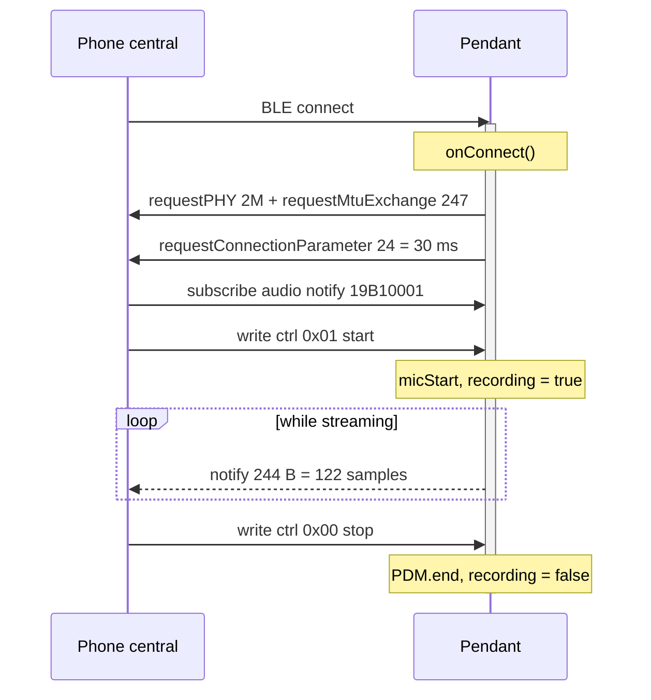
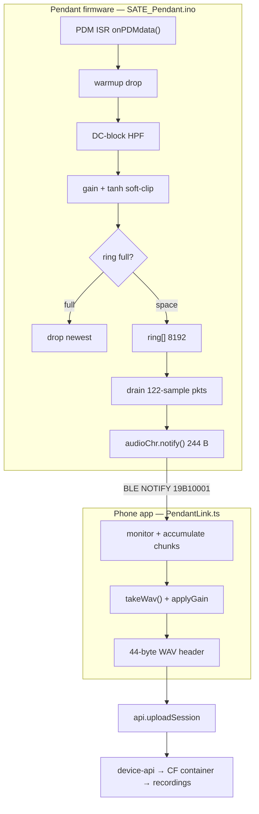

# SATE Pendant firmware

Internal engineering reference for the SATE Pendant — a wearable BLE audio
streamer. Everything below is grounded in the firmware source
(`SATE_Pendant/SATE_Pendant.ino`), the hard-won board notes
(`SATE_Pendant/HARDWARE.md`), the BLE integration guide
(`SATE_Pendant/INTEGRATION.md`), the project handbook (`doc/09-pendant.md`), and
the app-side link (`src/pendant/PendantLink.ts`). It is grounded in the source as of
**firmware 1.0.0** (`FIRMWARE_VERSION` in `SATE_Pendant.ino`, added 2026-07-22 — the
first logged pendant version; not yet exposed over BLE).

<div class="badge-row"><span class="sate-badge">Firmware 1.0.0</span><span class="sate-badge">XIAO nRF52840 Sense Plus</span><span class="sate-badge">S140 7.3.0 SoftDevice</span><span class="sate-badge">PCM 16 kHz mono</span></div>

---

## 1. Overview

The pendant is a **Seeed XIAO nRF52840 Sense Plus** running a single Arduino
sketch (`SATE_Pendant/SATE_Pendant.ino`, header comment). It streams
the board's **onboard PDM mic** over BLE as **raw 16-bit PCM @ 16 kHz mono
(S16LE)** — no codec, no framing, nothing to decode on the receiver
(`SAMPLE_RATE 16000`; `INTEGRATION.md` §4). The phone app forwards
those windows to the inference server (AST model) for food-intake detection; the
IMU is deliberately **not** used — audio only (`HARDWARE.md` note the IMU characteristic `19B10003` and all LSM6DS3 code
were deleted).

| Property | Value | Source |
|---|---|---|
| MCU / board | XIAO nRF52840 Sense Plus (FQBN `Seeeduino:nrf52:xiaonRF52840SensePlus`) | `SATE_Pendant.ino` |
| BLE stack | Nordic S140 7.3.0 SoftDevice + Adafruit **Bluefruit** core (Seeed fork) | `SATE_Pendant.ino`; `HARDWARE.md` |
| Audio format | PCM S16LE, 16 kHz, mono, 244 B/notify = 122 samples | `SATE_Pendant.ino`; `INTEGRATION.md` |
| Role | BLE peripheral; the phone is the central | `INTEGRATION.md` |
| Upload path | App wraps PCM → WAV → `api.uploadSession`, `device_serial` = `pendant-<bleId>` | `doc/09-pendant.md` |

Two things the firmware **does not** do, by design:

- **No serial log.** Unlike the ESP32 recorder, there is no `Serial.print`
  telemetry anywhere in the sketch — diagnosis is done externally (USB-CDC port
  presence as a crash test, `bleak` scans from the Mac; `HARDWARE.md`).
- **No direct server upload.** The pendant never talks to the backend. It only
  emits BLE notifications; the app is the relay that assembles the WAV and
  uploads (`doc/09-pendant.md`; `INTEGRATION.md`).

---

## 2. Hardware

XIAO nRF52840 Sense Plus. Pin map and LED polarity (active-**LOW**: driving the
pin low turns the LED **on**):

| Function | nRF pin | Firmware | Notes |
|---|---|---|---|
| LED Red | P0.26 | `LED_RED 26` | "recording" indicator, active-low (`redOn()` = `OUTCLR`) |
| LED Blue | P0.06 | `LED_BLUE 6` | BLE status: blink=advertising, dim-duty=connected |
| LED Green | P0.30 | — | active-low; unused by this firmware (`HARDWARE.md`) |
| PDM mic power | P1.10 | (driven by `PDM` lib) | drive HIGH to power the onboard mic (`HARDWARE.md`) |
| PDM CLK | P1.00 | (driven by `PDM` lib) | `HARDWARE.md` |
| PDM DATA | P0.16 | (driven by `PDM` lib) | `HARDWARE.md` |
| VBAT sense | P0.31 / AIN7 | `PIN_VBAT 32` | behind a 1 MΩ/510 kΩ divider |
| VBAT enable | P0.14 | `VBAT_ENABLE 14` | drive **LOW** to connect the divider |
| Charge LED | — | hardware (charger IC) | blinks red/orange forever on USB with no/low battery — **normal, ignore** (`HARDWARE.md`) |

**PDM mic.** Driven exclusively through the Arduino `PDM` library
(`#include <PDM.h>`), never raw nRF PDM registers — hand-rolled
register config sounded noisy and was the main clarity culprit
(`HARDWARE.md`). Config is `PDM.setGain(MIC_GAIN)` then
`PDM.begin(1, SAMPLE_RATE)` inside `micStart()`. Exact 16000 Hz
avoids the pitch/speed drift of the raw ~16125 Hz clock (`HARDWARE.md`).

**Battery.** `readBatteryPct()`: pull `VBAT_ENABLE` low, settle
200 µs, switch to the internal 2.4 V reference at 12-bit resolution. The nRF52
SAADC applies a new reference only on the *next* conversion, so the first read
after `analogReference()` is stale and is discarded, then 16 reads are averaged. Voltage is reconstructed with the divider ratio
`(1000+510)/510` and mapped to a percentage by a piecewise-linear
LiPo curve (3.30 V→0 %, 4.10 V→100 %). The divider is
disconnected afterward to save ~4 µA.

**Charging detection.** There is no charge-status pin, so `usbPlugged()` reads
the SoC's VBUS detect register directly
(`NRF_POWER->USBREGSTATUS & …VBUSDETECT_Msk`) — VBUS present ⇒
plugged in ⇒ charging/topped-off.

**DC/DC regulator.** `sd_power_dcdc_mode_set(NRF_POWER_DCDC_ENABLE)` in `setup()`
runs the SoC on the DC/DC converter instead of the default LDO.
Under streaming load the radio draws hard current bursts; on the LDO those pull
~2× peak current and sag the rail, which on a low / high-internal-resistance LiPo
makes the SoC miss connection events → `notify()` fails → packets drop — which is
why drops only appeared at low battery. It must go through the
SoftDevice API (the SoftDevice owns POWER); the XIAO populates the required DC/DC
inductors, so it is safe.

:::danger Seeed-core flash trap (0x27000 vs 0x26000)
Build **only** with the Seeed core (`FQBN Seeeduino:nrf52:xiaonRF52840SensePlus`),
never `adafruit:nrf52:feather52840sense`. The Adafruit Feather variant links the
app at **`0x26000`** (S140 6.1.1 layout), which overwrites the last flash page of
the **S140 7.3.0** SoftDevice and corrupts the BLE stack. Symptom: the app runs
but **never advertises** and **no USB-CDC port enumerates** — it hardfaults inside
`Bluefruit.begin()`. Non-BLE sketches still run, which is the giveaway it is the
SoftDevice, not the code. The correct core links at **`0x27000`**; the UF2
conversion prints the start address and `flash_xiao.sh` aborts if it sees
`0x26000` (`HARDWARE.md`; `flash_xiao.sh`; `doc/09-pendant.md`).

A **factory-fresh** board needs the DFU SoftDevice+bootloader restore too — its
factory SoftDevice state isn't Bluefruit-compatible until you flash Seeed's own
bootloader+SoftDevice (`HARDWARE.md`; `doc/09-pendant.md`).
:::

---

## 3. Connection / BLE protocol

All UUIDs are the vendor 128-bit `19B10000-E8F2-537E-4F6C-D104768A1214` family. The app uses the lowercase form to match ble-plx's normalized
UUIDs (`PendantLink.ts`).

### GATT profile

| Characteristic | UUID | Properties | Payload | Source |
|---|---|---|---|---|
| Audio service | `19B10000-…` | — | container | `SATE_Pendant.ino` |
| Audio data | `19B10001-…` | **NOTIFY** | fixed **244 B = 122 × int16** | `SATE_Pendant.ino` |
| Control | `19B10002-…` | **WRITE** | fixed **1 byte** command | `SATE_Pendant.ino` |
| Battery Service | `0x180F` / level `0x2A19` | Read + Notify | 1 byte (see below) | `BLEBas batSvc`, `SATE_Pendant.ino` |
| OTA DFU | Nordic BLE DFU (`BLEDfu`) | — | firmware push | `SATE_Pendant.ino` |

The audio characteristic is `CHR_PROPS_NOTIFY`, open read / no-access write,
**fixed length `PKT_SAMPLES * 2` = 244 B**. The control
characteristic is `CHR_PROPS_WRITE`, open, **fixed length 1**, with
`onCtrlWrite` as its write callback.

Each notify carries 122 little-endian `int16` PCM samples back to back — no header,
no framing (16 kHz mono):

<div class="bytemap">
  <div class="cell"><b>sample 0</b><span>int16 LE (2 B)</span></div>
  <div class="cell"><b>sample 1</b><span>int16 LE (2 B)</span></div>
  <div class="cell grow"><b>… samples 2–120 …</b><span>2 B each</span></div>
  <div class="cell"><b>sample 121</b><span>int16 LE (2 B)</span></div>
  <div class="cell hi"><b>= 244 B</b><span>122 × int16</span></div>
</div>

### Control commands (`onCtrlWrite`)

| Byte | Action | Firmware effect |
|---|---|---|
| `0x01` | **Start** streaming | `recording=true; napping=false; lastLoudMs=millis(); micStart(SAMPLE_RATE/7)` |
| `0x00` | **Stop** streaming | `recording=false; napping=false; PDM.end()` |
| `0x02` | **Find-me** | `findMeUntil = millis() + 5000` — flash LEDs ~5 s |

`0x01`/`0x00` are idempotent-guarded (`&& !recording` / `&& recording`); the
pendant does not stream until a `0x01` arrives.

<div class="bytemap">
  <div class="cell hi"><b>0x01</b><span>Start streaming</span></div>
  <div class="cell"><b>0x00</b><span>Stop streaming</span></div>
  <div class="cell"><b>0x02</b><span>Find-me (flash 5 s)</span></div>
</div>

The connect handshake and stream lifecycle, from the central's `0x01` to its `0x00`
stop (`onConnect`; `onCtrlWrite`; drain loop):



### Battery byte (`publishBattery`)

The Battery Service value packs the percentage into the low 7 bits and uses
**bit 7 (`0x80`) as the charging flag**: `v = readBatteryPct() & 0x7F`, then
`if (usbPlugged()) v |= 0x80`.

<div class="bytemap">
  <div class="cell hi"><b>bit 7</b><span>charging (0x80)</span></div>
  <div class="cell grow"><b>bits 0–6</b><span>battery percent (0–100)</span></div>
</div> Consumers must mask:
`percent = raw & 0x7F`, `charging = (raw & 0x80) != 0` (app: `PendantLink.ts`;
`INTEGRATION.md`). The loop refreshes battery every 60 s and fires
instantly on plug/unplug.

### Advertising

```cpp
Bluefruit.Advertising.addFlags(BLE_GAP_ADV_FLAGS_LE_ONLY_GENERAL_DISC_MODE);
Bluefruit.Advertising.addTxPower();
Bluefruit.Advertising.addService(audioSvc);   // service UUID in the ADV packet
Bluefruit.ScanResponse.addName();              // NAME only in the SCAN RESPONSE
Bluefruit.Advertising.restartOnDisconnect(true);
Bluefruit.Advertising.setInterval(32, 244);    // 20 ms fast → 152.5 ms slow after 30 s
Bluefruit.Advertising.start(0);
```

The **service UUID lives in the ADV packet**, but the **name (`SATE Pendant`) lives only in the SCAN RESPONSE** (`ScanResponse.addName()`). Consequence for the central: iOS surfaces the scan-response name as
**`localName`, not `name`**, and `name` may be a **stale cached GAP name** from
an earlier firmware (`HARDWARE.md`; `doc/09-pendant.md` app note). So the
app scans with **no service filter** and matches on `name` OR `localName` OR the
advertised audio service (`PendantLink.ts`). `restartOnDisconnect(true)`
means the pendant re-advertises automatically after a drop.

### Throughput negotiation

16 kHz × 16-bit = **256 kbps**, right at BLE's practical ceiling
(`HARDWARE.md`). Three settings together make it fit — any one
missing means noisy or choppy audio (`HARDWARE.md`):

| Setting | Where | Why |
|---|---|---|
| `configPrphBandwidth(BANDWIDTH_MAX)` | `setup()` **before** `begin()` | Raises negotiated **MTU from 23→247** and grows the notify queue; without it every notify truncates to 20 B = 92 % data loss (`HARDWARE.md`) |
| `requestPHY(BLE_GAP_PHY_2MBPS)` | `onConnect` | 2M PHY doubles the raw BLE rate; both ends must agree (`INTEGRATION.md`) |
| `requestMtuExchange(247)` | `onConnect` | MTU 247 lets a single notify carry the full 244 B packet |
| `requestConnectionParameter(24)` | `onConnect` | 24 × 1.25 ms = **30 ms** interval (was 7.5 ms). At 2M+MTU247 one event still carries the ~4 packets/s-of-audio needed, but the radio wakes ~4× less often — big streaming-power saving; the 0.5 s ring absorbs the added latency |

Note the firmware comment (`HARDWARE.md`) documents a 7.5 ms interval
(`requestConnectionParameter(6)`) as "most packets/sec"; the shipping firmware
deliberately trades that down to 30 ms for power. TX power is
**0 dBm** — plenty for an on-body pendant a couple metres from the phone; +4 dBm
would just waste radio power.

### OTA DFU

`BLEDfu bledfu` and `bledfu.begin()` is called **first** in
`setup()` — Adafruit requires the DFU service be added first so its
attribute handle stays fixed across firmware versions. The board
already ships the Adafruit/Seeed DFU bootloader (0.6.2 + S140 7.3.0), so a phone
connects to the running pendant, writes the DFU control point, the board reboots
into the bootloader, and the app streams new firmware over BLE — the app side must
speak the **Nordic BLE DFU protocol**.

---

## 4. Features

- **Streaming.** `0x01` starts the PDM mic and drains audio into 122-sample BLE
  notifies (`onCtrlWrite` → `micStart`; loop drain).
- **Ring buffer (producer/consumer).** A lock-free power-of-two ring
  (`RING_SIZE 8192`, ~0.5 s cushion @ 16 kHz) decouples the PDM ISR
  (producer, writes `ringHead`) from the BLE loop (consumer, reads `ringTail`).
  `ringHead`/`ringTail`/`ringDropped` are `volatile`.
- **DC-block HPF + tanh soft-clip gain** in the ISR (`onPDMdata`).
  Per sample: one-pole DC-blocking high-pass `y = x - x1 + R*y1`
  (`HPF_R 0.976` ≈ 60 Hz corner) removes the PDM DC bias + rumble
  (the single biggest clarity win), then makeup gain through a tanh
  knee: `v = 32767 * tanhf(y * DIGITAL_GAIN / 32767)`. tanh is
  ~linear near zero (quiet parts get ~`DIGITAL_GAIN`× louder) but bends loud peaks
  smoothly toward ±full-scale — soft-clip, not the harsh hard-clip "rè" buzz.
- **Warmup drop.** After `PDM.begin`, the first N samples are the mic's DC-settling
  thump and are discarded (`warmup` counter). Start drops
  `SAMPLE_RATE/7` ≈ 140 ms; each nap-listen drops `NAP_SETTLE_MS`=60 ms.
- **Nap mode.** While streaming, if audio stays below threshold for
  `SLEEP_AFTER_MS` (30 s) the pendant naps: PDM off, no notifies, radio idle. Every `NAP_CHECK_MS` (2 s) it re-opens the mic, listens
  `NAP_LISTEN_MS` (180 ms), and if the drained mean-abs ≥ `WAKE_MEANABS` resumes
  streaming instantly, else `PDM.end()` back to rest. The BLE
  link stays up throughout — a notification gap is **not** a disconnect
  (`INTEGRATION.md`; `doc/09-pendant.md`).

```mermaid
stateDiagram-v2
    [*] --> Idle
    Idle --> Streaming : ctrl 0x01 starts mic
    Streaming --> Napping : quiet past SLEEP_AFTER_MS 30s
    Napping --> Streaming : level reaches WAKE_MEANABS
    Napping --> Napping : listen every NAP_CHECK_MS 2s
    Streaming --> Idle : ctrl 0x00 or disconnect
    Napping --> Idle : ctrl 0x00 or disconnect
    note right of Napping : PDM off, no notifies, radio idle; BLE link stays up
```


- **Overrun guard.** In the ISR, if the consumer has stalled and the ring is full
  (`(uint32_t)(h - t) >= RING_SIZE`), the **newest** sample is dropped
  (`ringDropped++; continue`) rather than overwriting unsent audio — one clean gap
  on recovery instead of mid-buffer corruption; the HPF state keeps advancing so
  the filter stays time-aligned across the gap.
- **Find-me LED.** `0x02` sets `findMeUntil`; the loop's LED block runs a loud
  alternating red/blue flash for 5 s that overrides all other LED states.
- **OTA DFU.** Nordic BLE DFU over the running link (see §3).
- **Duty-cycled status LEDs** to save power (solid LEDs burn ~1 mA each):
  streaming red at 10 % duty, connected-idle blue blip every 3 s, napping blue
  "alive" blip every 5 s. `Bluefruit.autoConnLed(false)` — the
  firmware drives LEDs itself, saving ~1 mA.

---

## 5. Audio pipeline

End-to-end, from the PDM interrupt on the pendant to a `recordings` row on the
server. The firmware half (blue) runs on the nRF52; the app half (green) runs in
`PendantLink.ts`; the backend half reuses the unchanged SATE upload path.



Node detail and citations (moved out of the labels above):

| Step | Detail | Source |
|---|---|---|
| PDM ISR `onPDMdata()` | producer, PDM interrupt | `SATE_Pendant.ino` |
| warmup drop | first N samples discarded | `SATE_Pendant.ino` |
| DC-block HPF | `y = x - x1 + R*y1` | `SATE_Pendant.ino` |
| gain + tanh soft-clip | `32767*tanh(y*DIGITAL_GAIN/32767)` | `SATE_Pendant.ino` |
| ring full? | overrun guard | `SATE_Pendant.ino` |
| drop newest | `ringDropped++` | `SATE_Pendant.ino` |
| ring[] 8192 | `ringHead++` | `SATE_Pendant.ino` |
| drain 122-sample pkts | in `loop()` | `SATE_Pendant.ino` |
| `audioChr.notify()` 244 B | advance tail on success | `SATE_Pendant.ino` |
| monitor + accumulate | if capturing: `chunks.push()` | `PendantLink.ts` |
| `takeWav()` + applyGain | concat chunks; peak-norm + `LOUDNESS` + tanh | `PendantLink.ts` |
| 44-byte WAV header | 16 kHz mono S16LE | `PendantLink.ts` |
| `api.uploadSession` | `device_serial` = `pendant-<bleId>` | `doc/09-pendant.md` |
| backend | `/sessions` → CF container → finalize-session → `recordings` | — |

Key invariant: the firmware loop **only advances `ringTail` when `notify()`
succeeds** and otherwise `break`s to retry next loop — data is
never cleared on a failed notify, which is what previously caused gaps
(`HARDWARE.md`). A measured good run: ~390 packets / ~95 KB for a 3 s
clip, near-zero loss (`HARDWARE.md`).

---

## 6. Configuration

Firmware tunables, all `#define`d at the top of `SATE_Pendant.ino`:

| Macro | Value | Meaning / guidance |
|---|---|---|
| `SAMPLE_RATE` | `16000` | Exact 16 kHz (avoids clock pitch drift) |
| `MIC_GAIN` | `64` | PDM analog gain 0..80 (stock 20). Keep ≤ ~66 — 70+ clips in the decimator = real "rè" buzz that can't be undone |
| `DIGITAL_GAIN` | `6.0f` | Post-PDM makeup gain into the tanh knee (the raw mic is quiet) |
| `PKT_SAMPLES` | `122` | 244 B = max notify @ MTU 247 |
| `HPF_R` | `0.976f` | DC-block high-pass pole, fc ≈ 60 Hz @ 16 kHz |
| `SLEEP_AFTER_MS` | `30000` | Quiet this long → nap |
| `NAP_CHECK_MS` | `2000` | Nap listen cadence |
| `NAP_LISTEN_MS` | `180` | Listen window per check (incl. mic settle) |
| `NAP_SETTLE_MS` | `60` | Mic-settle samples discarded per nap check |
| `WAKE_MEANABS` | `1400` | mean\|sample\| that counts as sound (wake) |
| `LOUD_MEANABS` | `1400` | Same threshold while streaming (scaled with `DIGITAL_GAIN`) |
| `RING_SIZE` | `8192` | Power-of-two ring, ~0.5 s cushion |

**App-side gain** (`PendantLink.ts`) is separate and stacks on top of the
firmware: `TARGET_PEAK 0.97*32767`, `MAX_GAIN 40`, `LOUDNESS 2.6`
(`PendantLink.ts`), combined as
`gain = min(MAX_GAIN, max(1, TARGET_PEAK/peak)) * LOUDNESS` then a tanh soft-clip
(`PendantLink.ts`) — see the gain-stacking issue in §8.

**Build & flash** with the Seeed core:

```bash
# from repo root — compiles (Seeed core), converts to UF2, aborts on 0x26000
./SATE_Pendant/flash_xiao.sh SATE_Pendant
```

The script sets up the `python` shim, copies the sketch to a space-free
`/tmp` path, compiles with `Seeeduino:nrf52:xiaonRF52840SensePlus`, converts the
`.hex` to `.uf2` (family `0xADA52840`), **aborts unless the start address is
`0x27000`**, waits for the `XIAO-SENSE` volume (double-tap reset), and raw-writes
the UF2 (no xattrs — Finder drag-drop fails with error -36)
(`flash_xiao.sh`; `HARDWARE.md`).

---

## 7. Key files

| Path | Role |
|---|---|
| `SATE_Pendant/SATE_Pendant.ino` | The entire firmware: BLE setup, PDM ISR, ring buffer, DSP, nap logic, battery, LEDs |
| `SATE_Pendant/HARDWARE.md` | Board identity, Seeed-core flash trap, SoftDevice-corruption recovery, pin map, clear-audio recipe |
| `SATE_Pendant/INTEGRATION.md` | BLE integration guide for any central: GATT profile, control bytes, audio format, battery byte, nap mode |
| `SATE_Pendant/flash_xiao.sh` | One-shot compile → UF2 → flash; aborts on the `0x26000` trap |
| `doc/09-pendant.md` | Project-handbook chapter: where the pendant plugs into the app/backend, flashing trap, nap mode |
| `src/pendant/PendantLink.ts` | App side: BLE scan/connect/subscribe, PCM accumulation, `applyGain`, PCM→WAV, `takeWav` |
| `src/screens/PendantConnectScreen.tsx` | Connect/record/upload UI (per `doc/09-pendant.md`) |
| `src/pendant/PendantStore.ts` | Persists paired pendants (per `CLAUDE.md` pendant notes) |

---

## 8. Known issues & current status

From the 2026-07-22 multi-agent audit
(`~/.claude/projects/-Users-longcao-Desktop-SATE/memory/stuck-state-red-flags.md`).
The user's hard priorities: (1) never lose/mismatch patient audio; (2) no feature
ever stuck.

### 8.1 `lastLoudMs` only advances on notify success — the "audio stuck" bug — OPEN

**Symptom:** `lastLoudMs` is updated **only inside the successful-notify branch**
of the loop (`if (audioChr.notify(...)) { ringTail = …; if (acc/PKT_SAMPLES >=
LOUD_MEANABS) lastLoudMs = now; }`). If the BLE consumer stalls,
`notify()` fails and the loop `break`s **before** `lastLoudMs` is touched — even though the room is loud. `now - lastLoudMs` then crosses
`SLEEP_AFTER_MS`, the pendant naps, and the nap-wake path resets the ring
(`ringHead = ringTail = 0`) — **wiping a stalled-but-loud stream**.
This is the "audio stuck" symptom. **File:** `SATE_Pendant.ino`. The audit
notes the overrun-guard diff alone does **not** fix it. **Status: OPEN.**

### 8.2 No `onDisconnected` handler in the app — a nap looks like a disconnect — OPEN

**Symptom:** the app subscribes to audio/battery but registers no BLE
disconnect handler (`connect()` sets up `monitorCharacteristic…` only,
`PendantLink.ts`). Because nap mode also produces a gap in notifications
(§4), the app cannot distinguish a real disconnect from a nap — both present as
"no audio while connected." **File:** `src/pendant/PendantLink.ts`. **Status:
OPEN** (mitigated only by treating gaps as "quiet", per `INTEGRATION.md`).

### 8.3 Overrun guard keeps oldest / stale `ringTail` snapshot — OPEN (by design, but subtle)

**Symptom:** the ISR snapshots the consumer position **once** at entry
(`uint32_t t = ringTail;`) and uses that stale snapshot for the whole
callback's overrun check. Combined with dropping the **newest** sample, the guard preserves already-queued (oldest) audio, so a stall
yields one clean trailing gap rather than mid-buffer corruption — intended — but the stale snapshot means the guard can trip slightly early
(it doesn't see samples the consumer drained mid-callback). **File:**
`SATE_Pendant.ino`. **Status: OPEN** / accepted trade-off; interacts with
8.1.

### 8.4 Gain stacked twice (firmware tanh + app LOUDNESS) — effective app cap ~104× — OPEN

**Symptom:** the firmware already applies `DIGITAL_GAIN 6.0` + tanh in the ISR, and the app applies its **own** peak-normalize × `LOUDNESS` + tanh
on the assembled take (`applyGain`, `PendantLink.ts`). The app's cap is
`MAX_GAIN 40 × LOUDNESS 2.6 = 104×` effective (`PendantLink.ts`) on
top of the firmware gain. Stacking both toward clipping produces the harsh "rè"
buzz. **Files:** `SATE_Pendant.ino` + `src/pendant/PendantLink.ts`.
**Status: OPEN** — noted in `CLAUDE.md` ("don't stack both to the point of
clipping"); no code guard couples the two.

### 8.5 Nap-wake ring reset race — OPEN

**Symptom:** on wake the loop clears the ring from the **consumer** side
(`napping=false; lastLoudMs=now; ringHead=ringTail=0;`) while the
PDM ISR (producer) may be concurrently writing `ringHead`. The
non-atomic dual reset of `ringHead`/`ringTail` against a live ISR write is a race
that can momentarily desync head/tail. `micStart()` has the same pattern but there the mic is (re)starting so the ISR isn't firing yet; the
wake path re-uses an **already-running** mic. **File:**
`SATE_Pendant.ino`. **Status: OPEN.**

### 8.6 `connect()` double-subscribe — OPEN

**Symptom:** `connect()` assigns `this.audioSub`/`this.batterySub` without first
removing any existing subscription (`PendantLink.ts`). A reconnect without
an intervening `disconnect()`/`teardown()` (which are the only places subs are
removed, `PendantLink.ts`) leaks the prior subscription and can
double-count incoming packets into `chunks`. **File:**
`src/pendant/PendantLink.ts`. **Status: OPEN.**

### 8.7 `PendantLink` buffer reset in `start()`/`disconnect()` — FIXED

**Symptom (was):** stale PCM from a previous take could prefix a new recording and
inflate `capturedMs` (cross-take contamination). **Fix:** `start()` now clears
`this.chunks = []; this.capturedBytes = 0` before every take
(`PendantLink.ts`), and `disconnect()` drops any un-taken PCM
(`PendantLink.ts`). Called out as FIXED in the audit memory.
**File:** `src/pendant/PendantLink.ts`. **Status: FIXED.**

### Related open item (app-side, same subsystem)

`takeWav()` clears the buffer as it returns the take (`this.chunks = []`,
`PendantLink.ts`), so a **failed upload after `takeWav()` loses the take**;
the buffer is memory-only, so an app kill loses an in-progress take. Tracked in the
audit memory as OPEN. **File:** `src/pendant/PendantLink.ts`.

---

_Grounding: every claim above traces to `SATE_Pendant/SATE_Pendant.ino`,
`SATE_Pendant/HARDWARE.md`, `SATE_Pendant/INTEGRATION.md`,
`SATE_Pendant/flash_xiao.sh`, `doc/09-pendant.md`, `src/pendant/PendantLink.ts`, or
the audit memory `stuck-state-red-flags.md`. Re-check against `git` for the current
source._
