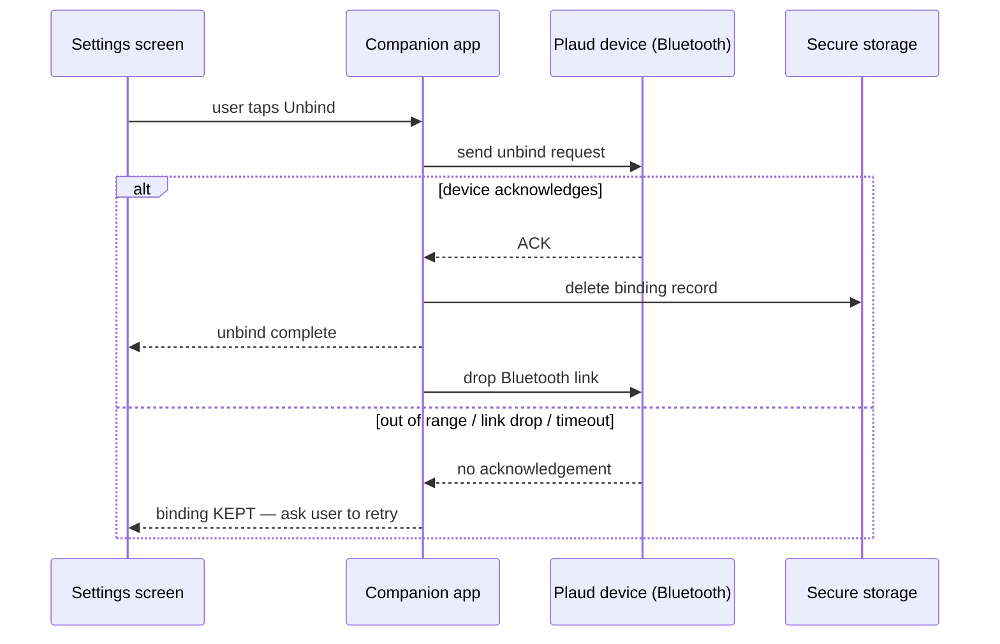
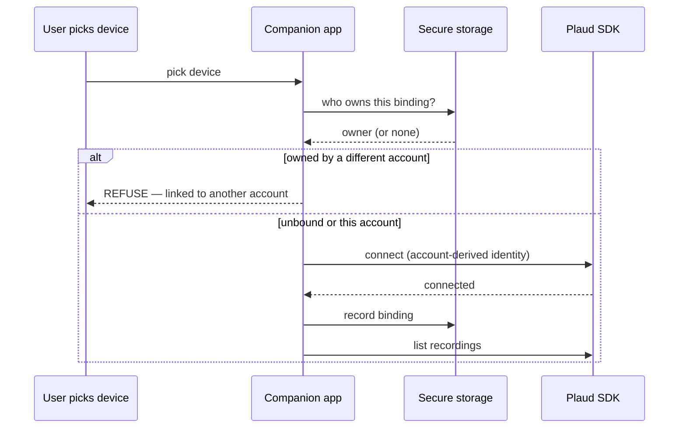

# Plaud integration

## Overview

**Plaud** (NotePin S / NotePro) is a third-party pocket recorder that the companion app
can capture from directly, using Plaud's proprietary iOS "Embedded" SDK. It is an *optional*
second capture path alongside the SATE hardware recorder and the SATE Pendant. Once a Plaud
recording is synced to the phone it is exported as audio and pushed through the **exact same**
upload pipeline the SATE recorder and Pendant use, so Plaud audio is indistinguishable from
SATE audio after it lands: same storage, same AI processing, same patient report, same
flag-marker handling.

device-lock sensitiveiOS onlyBLE sync only

What makes Plaud different from every other capture path is its **risk class**:

- **SATE recorder**: at worst a firmware issue delays or drops a recording. Recoverable —
  reflash, resync, retry.
- **SATE Pendant**: a standard Bluetooth wearable with no proprietary binding concept. Worst
  case is a dropped session that can simply be re-recorded.

:::danger[Plaud device-lock]
**Plaud is different.** A Plaud device binds to a specific account identity at the SDK level.
If that identity is ever inconsistent across binds — e.g. the same physical device gets bound
to a different account, or to a randomly-regenerated identity — the device can become
**permanently locked** for that account. There is no firmware to reflash and no server-side
undo; the failure mode is a bricked piece of the customer's hardware. Because of this, Plaud is
treated as the highest-risk integration in the product, and the safety rules below exist to make
that outcome impossible.
:::

Scope today is **iOS only** and **Bluetooth sync only**. A faster Wi-Fi transfer mode exists in
the SDK and is partially scaffolded, but is not yet wired up. Android is not supported because
Plaud has not released an Android SDK.

## Device-lock safety — the 5 invariants

Every change that touches Plaud — connecting, identity, secure storage, Bluetooth lifecycle,
teardown, account/login, provisioning, multi-device, sync, or settings — must preserve the five
invariants below. Together they make a same-account reconnect (even after an app reinstall) safe,
and make an accidental re-bind under the wrong identity impossible.

Invariant 1

Stable identity

Invariant 2

Bind guard

Invariant 3

Secure-storage binding

Invariant 4

No auto-unbind

Invariant 5

Confirm before forget

### 1. Stable, account-derived identity — never random, never per-install

The identity presented to Plaud is derived deterministically from the signed-in SATE account.
It is never randomly generated and never regenerated per install. Because the same account
always produces the same identity string, a reinstall on the same account reproduces the
identical identity — so a reconnect looks to Plaud's servers like a genuine reconnect of a known
device, not a new device trying to claim the binding. The same account-derived identity is used
both when minting the Plaud access token on the backend and when connecting to the device, so the
two always agree.

### 2. Bind guard before connect

Before the app ever asks the SDK to bind, it checks who currently owns the binding for that
device and refuses to proceed if it belongs to a different account. This is the last line of
defense: if the device is unbound, or already bound to *this* account, the flow proceeds as a
reconnect (never a re-bind). If it is bound to someone else, the user is told to unlink it on the
original account first.

### 3. The binding record lives in secure device storage

The app remembers which account owns which device in the iOS Keychain — one record per device
serial — configured so the record survives even an app uninstall and reinstall. This is
deliberate: ordinary app storage is wiped on uninstall, which would make the app "forget" a
binding the *device* still remembers, and that mismatch is exactly the dangerous state. Keeping
the record in secure storage is what makes "reinstall the app, sign back into the same account,
reconnect" safe — the app still recognizes the binding and takes the reconnect path.

### 4. No automatic unbind, ever

The unbind operation is reachable from exactly one place: the explicit **Unbind** button in Plaud
settings. Every other teardown path — leaving the screen, app backgrounding, logout — only drops
the Bluetooth link and leaves both the stored binding and the device's own bound state untouched.
Dropping the link is cheap and fully reversible; unbinding is not, so it is never triggered
automatically.

### 5. Confirm before forgetting on unbind

Unbinding is a two-party delete (the phone and the device, over Bluetooth), and the order is
fixed: **send the unbind request → wait for the device to acknowledge it → only then delete the
local binding record.** Deleting the local record first would leave the device still believing it
is bound while the app has forgotten it — the desynced state that can freeze the device. If the
device does not acknowledge (it is out of range, the link drops mid-command, or the request times
out), the local record is deliberately **kept** and the user is told the binding was not removed
and to try again with the device nearby.

To support this, the unbind operation refuses to run while disconnected, fails fast if the link
drops mid-command, and times out rather than hanging — so the app always gets a definite
success or failure to act on, never an ambiguous state.

:::note[Not a hardware-proven guarantee]
Plaud's own guidance says a device can only be bound to one application at a time, and that a user
should unbind before uninstalling. But iOS gives apps no reliable hook on uninstall, so an
unbind-before-delete can never be *forced*. The stable-identity design makes a same-account
reinstall safe as long as Plaud treats a re-bind with the same identity as a no-op. If a device
ever does end up bound to a dead install, the user-initiated Unbind is the recovery path.
:::

## Connection lifecycle

**Connect.** The app first requests a short-lived Plaud access token from the backend, then
initializes the SDK with it. A brief pause follows initialization because the SDK's secure key
exchange completes asynchronously — scanning too early finds nothing. Scanning then streams
nearby devices; when the user picks one (or a previously-paired device is auto-selected on
reconnect), the app runs the **bind guard**, connects under the **account-derived identity**,
and on success writes the **binding record** to secure storage. It then lists the device's
recordings so the user can sync them.

**Capture.** Recording can be started and stopped from the app or from the physical button on the
Plaud device; both surface through the same event stream, so the interface behaves identically
either way. Flag markers — physical taps on the device during a take — are surfaced live in the
app and flow into the same seek-bar marker feature used by the SATE recorder.

**Disconnect vs. unbind.** These are not interchangeable. Disconnecting only drops the Bluetooth
link; the binding and the device's bound state are untouched, and reconnecting later needs no
re-bind. Unbinding is the actual release of the device and is reachable only through the explicit
Unbind flow.

**Shared-radio handoff.** The phone has a single Bluetooth radio shared by three capture paths.
The SATE recorder and the Pendant share one Bluetooth manager, while the Plaud SDK manages the
radio itself and needs exclusive use of it. Handing the radio to Plaud therefore fully tears down
the shared manager and rebuilds it afterward — a deliberately different handoff from the one
between SATE and the Pendant, which must never destroy the shared manager. Importantly, this radio
handoff is purely about link ownership: it only ever *disconnects*, and never touches Plaud's
binding, keeping it completely separate from the device-lock invariants above.

## Backend

Plaud has **no dedicated backend**. It reuses the device-agnostic parts of the existing SATE
upload pipeline, adding only one small, secure piece:

**Token minting.** A backend function issues a short-lived, per-user Plaud access token so that
Plaud's partner credentials never reach the phone. The token is scoped to the same
account-derived identity used for binding, which is what keeps invariant 1 consistent between the
backend and the device.

**Session upload.** Unlike a SATE recorder — which authenticates with its own per-device key — a
Plaud device has no device record of its own. Its recordings are uploaded under the signed-in
user's own account session. Uploaded sessions are tagged with a Plaud-specific serial so they
remain distinguishable from SATE-recorder sessions without any change to the data model. From that
point on, the flow is identical to a SATE upload: the audio is stored, handed to the asynchronous
AI processing pipeline, and finalized into the patient's recordings.

## Capabilities at a glance

Platform

iOS only

Transfer

Bluetooth sync

Devices

NotePin S / NotePro

Capture

App or device button

Markers

Tap-to-flag, live

Pipeline

Shared SATE upload

## Known limitations & current status

None of the items below compromise the five device-lock invariants, but they are worth knowing
for anyone working near this integration.

- **Wi-Fi fast transfer is not yet wired up.** A faster Wi-Fi transfer mode is available in the
  SDK and partially scaffolded, but Bluetooth sync is the only supported path today.

- **Android is unsupported.** Plaud has not released an Android SDK, so the integration is
  iOS-only for now.

- **Flag-marker timing needs on-device confirmation.** Marker offsets are surfaced on a
  best-effort basis, and their exact unit has not been fully confirmed against every device model.
  This affects only where markers appear on the report timeline, not capture or upload.

- **Re-bind idempotency is unconfirmed by Plaud.** The design assumes that re-binding a device
  under the same account identity is a safe no-op, which is consistent with Plaud's documentation
  but has not been confirmed in writing. The stable-identity invariant is what makes this safe in
  practice; any future change that could alter the identity or the binding lifecycle (for example
  an account-switch flow, or enabling Wi-Fi transfer) should be treated as high-risk.
