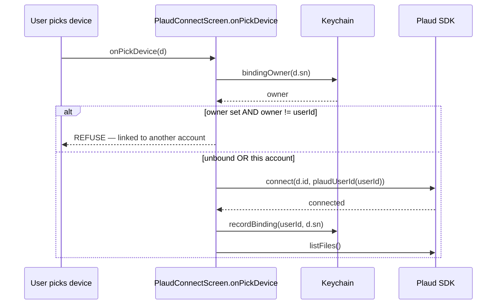

## Overview

**Plaud** (NotePin S / NotePro) is a third-party recorder integrated into the companion app
via Plaud's proprietary iOS "Embedded" SDK. It is an *optional* second capture path alongside
the SATE hardware recorder and the SATE Pendant. A synced Plaud recording is exported as WAV,
base64-encoded, and pushed through **the exact same** upload call the SATE recorder and Pendant
use — `api.uploadSession()` → `device-api` `/sessions` → Supabase → the async AI pipeline →
`recordings`. Plaud audio is indistinguishable from SATE audio once it lands: same table, same
report, same flag-marker column.

<div class="badge-row"><span class="sate-badge warn">device-lock sensitive</span><span class="sate-badge">iOS only</span><span class="sate-badge">BLE sync only</span><span class="sate-badge bad">CLAUDE.md RULE #1</span></div>

What makes Plaud different from every other integration in this codebase is risk class:

- **SATE recorder**: firmware bug at worst loses or delays a recording. Recoverable — reflash,
  resync, retry.
- **SATE Pendant**: pure `react-native-ble-plx`, no native module, no binding concept
  (`CLAUDE.md`: "no native rebuild, no binding/lock concern"). Worst case is a dropped BLE
  session.

:::danger[Plaud device-lock]
**Plaud**: the device binds to a caller-supplied identity (`deviceToken` / `user_id`) at the
SDK level. **If that identity is inconsistent across binds — e.g. the same physical device
gets bound to a different account or a randomly-regenerated identity — the device can become
PERMANENTLY LOCKED for that account.** There is no firmware to reflash and no server-side
undo; the failure mode is a bricked piece of a customer's hardware. This is called out as
**CLAUDE.md RULE #1**, ahead of every other rule in the repo, and this page exists to document
it precisely.
:::

Because of that, Plaud is the highest-risk integration in the codebase, and the rule in
`CLAUDE.md` is explicit: *any* change that touches "connect, identity, Keychain, BLE lifecycle,
teardown, account/login, provisioning, multi-device, sync, settings" for Plaud must preserve the
five invariants below.

Scope today: **iOS only**, **BLE sync only**. WiFi Fast Transfer (`PlaudWiFiAgent`, ~10x faster)
is scaffolded (Hotspot entitlement in the config plugin, currently commented out) but not
bridged. Android is not supported — Plaud has not released an Android SDK.

## Device-lock safety — the 5 invariants

<div class="spec-grid">
<div class="spec-tile"><div class="k">Invariant 1</div><div class="v">Stable identity</div></div>
<div class="spec-tile"><div class="k">Invariant 2</div><div class="v">Bind guard</div></div>
<div class="spec-tile"><div class="k">Invariant 3</div><div class="v">Keychain binding</div></div>
<div class="spec-tile"><div class="k">Invariant 4</div><div class="v">No auto-depair</div></div>
<div class="spec-tile"><div class="k">Invariant 5</div><div class="v">ACK-before-forget</div></div>
</div>

> Source of truth: `CLAUDE.md` RULE #1, cross-checked against `src/plaud/PlaudLink.ts`,
> `src/screens/PlaudConnectScreen.tsx`, `src/screens/PlaudSettingsScreen.tsx`,
> `doc/08-plaud.md`, and `plaud-integration.md`. The Swift native module
> (`modules/plaud-sate/ios/PlaudSateModule.swift`) is referenced by these docs but its `ios/`
> directory — including the Swift source and the proprietary framework binaries — **is not
> present in this checkout** (see [Key files](#key-files) below for exactly what is/isn't
> readable). Claims about native-layer behavior below are sourced from the JS/TS call sites and
> from `doc/08-plaud.md` / `plaud-integration.md`'s description of it, not from reading the
Swift directly.

### 1. Stable, account-derived identity — never random, never per-install

```ts
// src/plaud/PlaudLink.ts
export function plaudUserId(supabaseUserId: string): string {
  return `sate_${supabaseUserId}`;
}
```

This exact string is used as:
- the Plaud `user_id` when minting a token (Cloudflare port, `cloudflare/src/functions/mintPlaudToken.ts`: `body: JSON.stringify({ user_id: \`sate_${claims.sub}\`, ... })`; the Supabase edge function is documented to do the same — see [Backend](#backend)), and
- the `deviceToken` argument to `PlaudLink.connect(deviceId, plaudUserId)` (`PlaudConnectScreen.tsx`: `await plaud.connect(d.id, plaudUserId(userId));`).

It is derived from the SATE account id, never randomly generated and never regenerated per
install — so a reinstall on the same account reproduces the identical identity string, and a
reconnect looks like a reconnect to Plaud's servers rather than a new device claiming the
binding. `PlaudLink.ts` documents the reasoning inline: "Binding the SAME device to
a DIFFERENT identity can permanently LOCK it."

### 2. Bind guard before connect

Before ever calling `connect()`, the app checks who currently owns the binding and refuses to
proceed if it's a different account:

```ts
// src/screens/PlaudConnectScreen.tsx, onPickDevice()
const owner = plaud.bindingOwner(d.sn);
if (owner && owner !== userId) {
  setError(
    `This Plaud (SN ${d.sn}) is already linked to another SATE account. ` +
      `Unlink it there first — re-binding it here could lock the device.`
  );
  setPhase("error");
  return;
}
```

This is the last line of defense before the SDK is asked to bind under a new identity. If the
device is unbound or already bound to *this* account, the flow proceeds to `connect()`
(reconnect, never re-bind). `PlaudLink.ts`'s interface doc pins the contract on `connect()`
itself: *"plaudUserId = the account-derived stable identity from plaudUserId(). MUST match what
the token was minted for. Never pass a random/changing value."*

### 3. Binding lives in the iOS Keychain, `AfterFirstUnlock`

```ts
// src/plaud/PlaudLink.ts
const bindingKey = (sn: string) => `plaud.bind.${sn}`;
// ...
bindingOwner(sn: string) {
  return PlaudSate!.keychainGet(bindingKey(sn));
}
recordBinding(account: string, sn: string) {
  PlaudSate!.keychainSet(bindingKey(sn), account);
}
```

The record is `plaud.bind.<sn> → account`, one key per device serial, stored in the iOS Keychain
via the native module's `keychainGet`/`keychainSet`/`keychainDelete` bridge — **not**
AsyncStorage, because AsyncStorage does not survive an app uninstall/reinstall and the Keychain
(under `AfterFirstUnlock` accessibility, per `CLAUDE.md` RULE #1 item 3) does. This is what makes
"reinstall the app, sign back into the same account, reconnect" safe: `bindingOwner(sn)` still
returns the account, so the flow takes the reconnect branch instead of asking the SDK to bind a
"new" device.

`recordBinding()` itself is called immediately after a successful `connect()` in
`PlaudConnectScreen.tsx` — see [Known issues](#known-issues--current-status) for a gap in
that ordering.

### 4. No auto-depair, ever — teardown is `disconnect()` only

`depair()` (the Plaud SDK's unbind primitive, exposed through the native module) is invoked from
exactly one place in the JS layer: `PlaudLink.resetBinding()`, which is itself only called from
the explicit UNBIND button in `PlaudSettingsScreen.tsx`. Every other teardown path —
component unmount, navigating away, logout — calls `disconnect()` only, which drops the BLE link
but leaves the Keychain binding and the device's own bound state untouched:

```ts
// src/screens/PlaudConnectScreen.tsx — effect cleanup
return () => {
  cancelled = true;
  if (scanning.current) plaud.stopScan();
  // Keep the link alive when heading to Plaud settings — unbind needs it.
  if (!keepConnection.current) plaud.disconnect().catch(() => {});
};
```

Note the `keepConnection` ref: navigating from the connect screen into
`PlaudSettingsScreen` (to unbind) deliberately skips even the `disconnect()` call, because the
settings screen's unbind flow needs the device still connected — see invariant 5.

`CLAUDE.md` states the rule directly: *"Unmount/teardown/logout must only `disconnect()`... never
depair."*

### 5. ACK-before-forget on unbind

Unbinding is a distributed delete across two independently-failable parties (the phone, the
device over BLE) and the order is fixed: **send depair → wait for the device's ACK → only then
delete the local Keychain record.** Deleting the local record first would leave the device
convinced it's still bound while the app has forgotten it — a desync that, per the docs, causes
the device to freeze to protect its data.

```ts
// src/plaud/PlaudLink.ts — NativePlaudLink.resetBinding()
async resetBinding(sn: string) {
  // ACK-before-forget: depair() resolves ONLY after the device confirms
  // the unbind (bleDepair callback; native layer refuses when disconnected and
  // times out instead of hanging). If it throws, the Keychain record is KEPT
  // — deleting local state before the device ACKs desyncs the binding and
  // can freeze the device.
  await PlaudSate!.depair();
  PlaudSate!.keychainDelete(bindingKey(sn));
  // Forget the remembered device too, so it won't auto-reconnect after unbind.
  this.forgetDevice(sn);
}
```

`PlaudSettingsScreen.tsx`'s `doUnbind()` calls `resetBinding` and only calls `disconnect()`
*after* it resolves, and on failure keeps the Keychain record and tells the user explicitly:

```ts
// src/screens/PlaudSettingsScreen.tsx
try {
  await plaud.resetBinding(sn);
  await plaud.disconnect().catch(() => {});
  setDone(true);
} catch (e: any) {
  setError(
    (e?.message ?? "Unbind failed") +
      "\n\nThe binding was NOT removed. Keep the device nearby and connected, then try again."
  );
}
```

```mermaid
sequenceDiagram
  participant Scr as PlaudSettingsScreen.doUnbind
  participant Link as PlaudLink.resetBinding
  participant Dev as Plaud device (BLE)
  participant KC as Keychain
  Scr->>Link: resetBinding(sn)
  Link->>Dev: depair()
  alt device ACK — bleDepair status 0
    Dev-->>Link: ACK
    Link->>KC: keychainDelete(plaud.bind.sn)
    Link-->>Scr: resolved
    Scr->>Dev: disconnect()
  else disconnected / mid-command drop / 20s timeout
    Dev-->>Link: throw
    Link-->>Scr: reject — Keychain record KEPT for retry
  end
```

Per `CLAUDE.md` and `doc/08-plaud.md`, the native module enforces the safety side of this
contract: `depair` is **refused while disconnected** (can't send a command with no link), **fails
fast** on a mid-command BLE drop rather than hanging, and **times out after 20s** instead of
hanging forever — all so `resetBinding` gets a definite success/failure rather than an ambiguous
state. This native-layer behavior is described in the docs and in `CLAUDE.md`; it could not be
verified directly against `PlaudSateModule.swift` because that file is not present in this
checkout (see the note at the top of this section).

**Not a hardware-proven guarantee.** `plaud-integration.md` and `doc/08-plaud.md` both flag this
candidly: Plaud's own docs say *"a device can only be bound to one application at a time"* and
*"binding is tied to app installation — unbind before uninstalling"* — but iOS gives apps no
uninstall hook, so an unbind-before-delete can never be forced. The five invariants make a
same-account reinstall safe **iff** Plaud's backend treats a re-bind with the same `user_id` as
idempotent, which Plaud has not confirmed in writing. If a device does end up bound to a dead
install, `resetBinding` (depair) is the user-initiated recovery path.

## Connection lifecycle

**Connect** (`PlaudConnectScreen.tsx`):
1. Mint a Plaud user token via `api.getPlaudToken()` (`sateApi.ts`), then
   `plaud.initSdk(token)`. A ~2s delay follows before `startScan()` — the RSA key exchange inside
   `initSdk` is async and, per an inline comment, scanning before it lands "fires before the SDK
   is actually ready and finds nothing" (confirmed on-device: the app's `startScan()` log printed
   before the SDK's own "RSA key pair obtained and stored" log).
2. `startScan()` streams found devices via the `onScanResult` event. If a `targetSn` was passed
   in (reconnecting a specific already-paired device from Home), the scan callback auto-fires
   `onPickDevice` the moment that serial appears — but **only if** `plaud.bindingOwner(d.sn) ===
   userId` (invariant 2 applied again at the auto-connect path, not just the manual-pick path).
3. `onPickDevice(d)` runs the **bind guard** (invariant 2), then `connect(d.id,
   plaudUserId(userId))` (invariant 1), then — on success — `recordBinding(userId, d.sn)`
   (invariant 3) and `rememberDevice(d.sn, d.name)` (a separate, non-safety-critical
   "known devices" list used to show a reconnect UI on next app open, distinct from the binding
   record).
4. `listFiles()` populates the recordings list; the user picks a patient and either syncs
   manually or leaves auto-upload on.



**Capture**: recording can be driven from the app (`startRecord()`/`stopRecord()`) or from the
physical button on the Plaud device — both surface through the same `onRecordState` event
subscription, so the UI doesn't care which triggered it. Flag markers (physical taps on the
Plaud during a take) are polled — not pushed — by the native layer (`onMark` event) and rendered
live in `PlaudConnectScreen`; see `doc/08-plaud.md` §"Flag markers" for the low-level
`BleAgent`/`bleMarking` mechanics (a documented best-effort hack around a gap in the supported
`PlaudDeviceAgent` wrapper — unverified unit, see [Known issues](#known-issues--current-status)).

**Disconnect vs. depair**: `disconnect()` drops only the BLE link; the Keychain binding and the
device's bound state are untouched, and reconnecting later needs no re-bind. `depair()` is the
SDK's actual unbind primitive and is reachable only through `resetBinding()` from the explicit
UNBIND button (invariants 4 and 5). These are not interchangeable, and no code path outside
`PlaudSettingsScreen`'s confirmed UNBIND flow should ever call `depair`/`resetBinding`.

**Shared-radio handoff.** Per `CLAUDE.md` RULE #2, three BLE stacks compete for the phone's one
radio: SATE and the Pendant share a single `react-native-ble-plx` `BleManager`
(`src/ble/bleManager.ts`), but the **Plaud SDK owns its own `CBCentralManager`** and needs the
radio exclusively. The handoff into Plaud is a hard teardown of the shared manager —
`link.teardown()` → `destroySharedBleManager()` — and it is rebuilt lazily the next time SATE or
the Pendant needs it. This is explicitly **not** the same as the SATE↔Pendant handoff, which must
never destroy the shared manager (destroying and recreating a ble-plx `BleManager` leaves scans
returning zero devices with no error). `src/ble/radio.ts` is documented as the sole arbiter of
this handoff (logical owners `autosync | sate-fg | pendant | plaud`), and `CLAUDE.md` is explicit
that the Plaud radio release only ever calls `disconnect()`, never `depair()` — i.e. the radio
handoff and the device-lock invariants are orthogonal and the former must never leak into the
latter.

## Backend

Plaud has **no dedicated backend path** — it reuses the device-agnostic parts of the existing
SATE upload pipeline:

**`mint-plaud-token`** — mints a per-user, ~24h Plaud "User Access Token" server-side so the
Plaud partner credentials (`PLAUD_CLIENT_ID` / `PLAUD_API_KEY` or `PLAUD_CLIENT_SECRET`) never
reach the phone. Two-step Plaud OAuth (partner token via HTTP Basic, then a user token scoped to
`user_id: sate_<uid>`). Deployed with `--no-verify-jwt` — per `CLAUDE.md`, this and `device-api`
validate the caller's Supabase JWT themselves, and redeploying with Supabase's MCP default
(`verify_jwt:true`) breaks token minting.

> The Supabase edge function's source (`react_app_sate-ui_update/supabase/functions/mint-plaud-token/`,
> as referenced by `plaud-integration.md` and `doc/08-plaud.md`) is **not present in this
> checkout** — only `device-api` and `process-device-session` exist under
> `react_app_sate-ui_update/supabase/functions/`. It is documented as deployed in production.
> A parallel, **disabled-by-default** port exists at `cloudflare/src/functions/mintPlaudToken.ts`
> for the separate Cloudflare-backed stack; it returns HTTP 501 unless `env.PLAUD_ALLOW_MINT ===
> '1'`, because that stack has its own `users` table with a different uuid space, so
> `sate_<cloudflare_uid>` would differ from `sate_<supabase_uid>` for the same human — i.e.
> enabling it naively would violate invariant 1 by presenting a *different* identity to a device
> already bound under the Supabase identity. The guard comment in that file spells out exactly
> the three conditions (clean-slate fleet / matching uuid seeding / Plaud-confirmed re-bind
> semantics) required before flipping it on.

**`device-api` `POST /sessions`** — the upload endpoint. Unlike a SATE recorder, which
authenticates with its own per-device key (`sate_devices` row), **Plaud has no device row at
all** — a Plaud recording is uploaded under the signed-in user's own Supabase JWT ("USER-authed"
per `CLAUDE.md`). From `react_app_sate-ui_update/supabase/functions/device-api/index.ts`:

```ts
// User-authenticated session upload. The SATE recorder POSTs with its
// device key (handled earlier), but the phone app uploads on behalf of a
// device that has NO device key of its own — a Plaud recorder (which is
// never registered in sate_devices), or a BLE-bridged SATE session. Here
// the caller is the signed-in user, so the session is stored under user.id.
if (subPath === '/sessions' && method === 'POST') {
  const body = await req.json();
  const { wav_base64, ...meta } = body;
  const wavBytes = Uint8Array.from(atob(wav_base64 || ''), (c) => c.charCodeAt(0));
  return await storeSessionRecord(supabase, user.id, {
    device_serial: meta.device_serial || 'plaud',
    patient_id: meta.patient_id || 'PT',
    session_number: meta.session_number || 0,
    sample_rate: meta.sample_rate || 16000,
    flags: Array.isArray(meta.flags) ? meta.flags.filter((n: unknown) => Number.isFinite(n)) : undefined,
  }, wavBytes);
}
```

`device_serial` is sent by the app as `plaud-<sn>` (`PlaudConnectScreen.tsx`'s `uploadOne`:
`device_serial: \`plaud-${sn}\``), so Plaud sessions are distinguishable from SATE-recorder
sessions in `sate_devices`/`recordings` without any schema change. `device-api` itself is
deployed `verify_jwt:false` (same reasoning as `mint-plaud-token` — it validates the token
itself). From `/sessions` the flow is unchanged from a SATE upload: `storeSessionRecord` →
device-sessions bucket → the async Cloudflare-container processing pipeline → `finalize-session`
→ `recordings`.

## Key files

| File | Role | Present in this checkout? |
|---|---|---|
| `CLAUDE.md` (RULE #1) | The 5 invariants, canonical statement | Yes |
| `src/plaud/PlaudLink.ts` | JS interface + `NativePlaudLink` (real) + `MockPlaudLink` (simulator/dev); identity (`plaudUserId`), Keychain bindings, `resetBinding` (ACK-before-forget) | Yes |
| `src/screens/PlaudConnectScreen.tsx` | Connect/scan/sync UI; bind guard on `onPickDevice`; owns the connect lifecycle and shared-radio effect cleanup | Yes |
| `src/screens/PlaudSettingsScreen.tsx` | The UNBIND button; ACK-before-forget flow via `resetBinding` then `disconnect` | Yes |
| `src/components/PlaudDeviceCard.tsx` | Device art/graphic for the connect/settings UI | Yes |
| `src/api/sateApi.ts` | `getPlaudToken()` — calls the `mint-plaud-token` edge function | Yes |
| `modules/plaud-sate/index.ts` | `requireNativeModule("PlaudSate")` wrapper; `PlaudSateNative` interface (`initSdk`, `connect`, `depair`, `keychainGet/Set/Delete`, ...); `isPlaudAvailable()` fallback gate | Yes |
| `modules/plaud-sate/app.plugin.js` | Expo config plugin: Info.plist keys (local network / location, for WiFi Fast Transfer) survive `expo prebuild`; Hotspot entitlement present but commented out (not yet wired) | Yes |
| `modules/plaud-sate/expo-module.config.json` | Expo local-module manifest | Yes |
| `modules/plaud-sate/ios/PlaudSateModule.swift` | Swift native bridge: scan/connect/depair/listFiles/exportWav/deleteFile, ACK enforcement, Keychain bridge | **No — `modules/plaud-sate/ios/` does not exist in this checkout.** Referenced only in docs/comments. |
| `modules/plaud-sate/ios/PlaudSate.podspec` | Vendors the 3 proprietary Plaud frameworks + bundle | **No — same as above.** |
| `modules/plaud-sate/ios/Frameworks/` (`PlaudBleSDK.framework`, `PlaudWiFiSDK.framework`, `PlaudDeviceBasicSDK.framework` + `.bundle`) | Proprietary SDK binaries | **No — git-ignored** (`.gitignore`: `modules/plaud-sate/ios/Frameworks/`), copied in per-machine from a separate `plaud-sdk-public` repo per `plaud-integration.md`. |
| `react_app_sate-ui_update/supabase/functions/device-api/index.ts` | `POST /sessions` (user-authed, no device key) | Yes |
| `react_app_sate-ui_update/supabase/functions/mint-plaud-token/` | Supabase edge fn minting the per-user Plaud token | **No — not present in this checkout**, documented as deployed in prod. |
| `cloudflare/src/functions/mintPlaudToken.ts` | Cloudflare-stack port of the above; **disabled by default** (`PLAUD_ALLOW_MINT`) pending uuid-space reconciliation with Supabase | Yes |
| `plaud-integration.md` (repo root) | Deep-dive build doc: setup steps, open questions to confirm with Plaud, verification checklist | Yes |
| `doc/08-plaud.md` | Numbered handbook chapter: safety summary, sync flow, flag-marker mechanics (`BleAgent`/`bleMarking` hack) | Yes |

## Known issues & current status

All items below are sourced from the project's stuck-state audit memory
(`~/.claude/projects/-Users-longcao-Desktop-SATE/memory/stuck-state-red-flags.md`, dated
2026-07-22) and cross-checked against the current source. None of these break the 5 invariants
outright, but they are gaps worth knowing before touching this code.

| Issue | Symptom | File | Status |
|---|---|---|---|
| `recordBinding()` is written **after** `connect()` resolves | Between a successful `connect()` and the following `recordBinding(userId, d.sn)` call, there is a window where the SDK-level bind has happened but the Keychain record hasn't been written yet. If the app is killed or crashes in that window, the device ends up SDK-bound to this account but the app's own bind guard (`bindingOwner(sn)`) doesn't know it — a subsequent connect attempt (e.g. by another account, or after a botched state) would not see this account as the owner and could attempt a re-bind under a different identity, risking invariant 1. | `src/screens/PlaudConnectScreen.tsx`, `onPickDevice()`: `await plaud.connect(...)` then `plaud.recordBinding(...)` on the next line | **OPEN** — a lock-guard gap window, not yet closed. |
| Plaud connect effect's `[api, plaud]` dependency array causes teardown mid-sync | The main connect `useEffect` in `PlaudConnectScreen.tsx` depends on `[api, plaud]`; if either identity changes while a sync is in flight (e.g. a `plaud` link instance is recreated upstream), the effect's cleanup fires — which calls `plaud.stopScan()` and, unless `keepConnection.current` is set, `plaud.disconnect()` — potentially interrupting an in-progress upload or scan. | `src/screens/PlaudConnectScreen.tsx`, the connect effect and its cleanup | **OPEN** — teardown-mid-sync risk from the effect dependency shape. |
| `markOffsets` unit is unverified | `PlaudExportResult.markOffsets` / `PlaudSyncedFile.markOffsets` are assumed to be millisecond offsets (matching SATE's own `flags` convention), and `PlaudConnectScreen`'s `fmtOffset()` formats them as such — but this is explicitly flagged as unconfirmed. `doc/08-plaud.md` details that marking isn't part of the supported `PlaudDeviceAgent` API at all; the native module reaches into the low-level `BleAgent` (`bleMarking` / `bleGetRecordMarkingTags`) as a best-effort, unsupported hack, and doesn't know for certain whether the NotePin/NotePro reports ms offsets, seconds, or absolute unix-timestamps (the 3.0 path *assumes* absolute unix-seconds and computes `(timestamp - sessionId) * 1000`). | `modules/plaud-sate/index.ts` (`PlaudExportResult.markOffsets` doc comment: *"UNVERIFIED unit... check on a real device before display"*); `src/plaud/PlaudLink.ts` (`PlaudSyncedFile.markOffsets` doc comment references the same caveat); `src/screens/PlaudConnectScreen.tsx` `fmtOffset()` | **OPEN** — needs an on-device rebuild + log verification (`doc/08-plaud.md` describes tapping the Plaud at a known point and reading the native module's `[PlaudSate] bleMarking …` logs to confirm). |

Two related but lower-severity open items, not part of this page's 3 headline issues but worth
noting for anyone working nearby: `doc/08-plaud.md` flags that marking support itself is a hack
around a gap in the supported SDK surface (worth asking Plaud to expose officially), and
`plaud-integration.md` lists two standing open questions for Plaud about re-bind idempotency and
the internal ordering of `depair`'s own key deletion relative to the device ACK — both bear
directly on invariants 1 and 5 and are flagged as **not yet answered by Plaud**.
