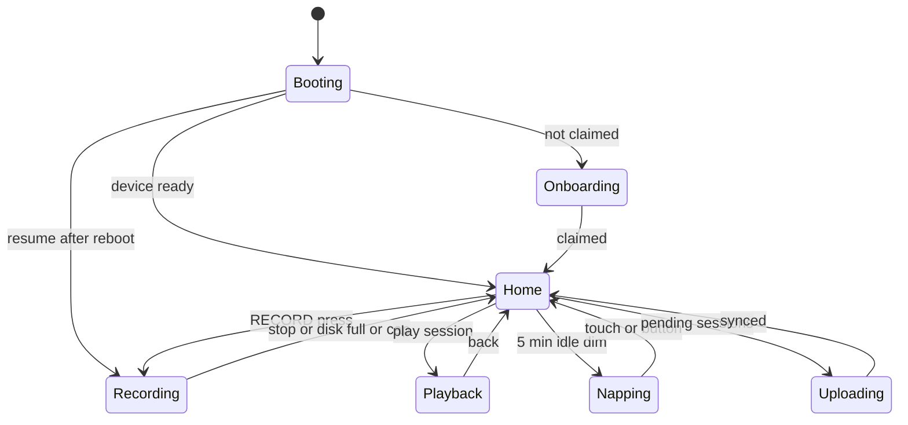
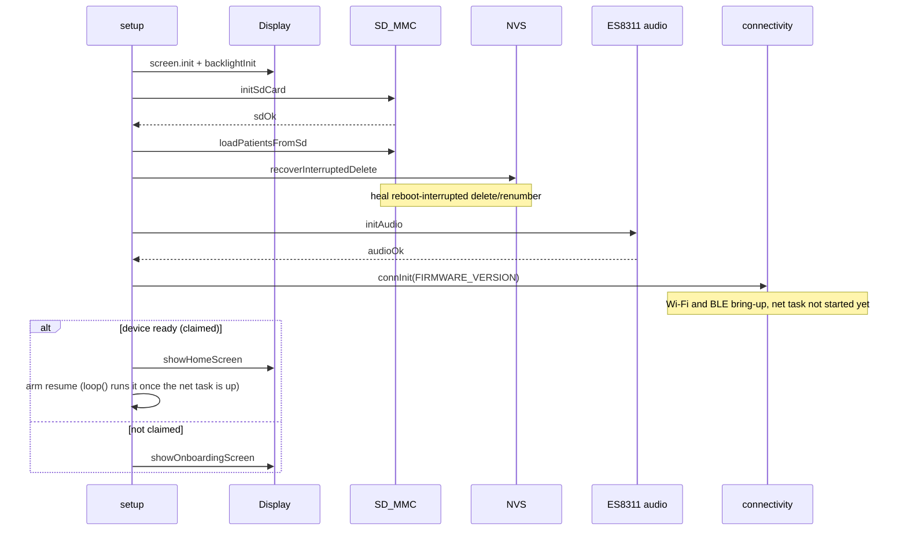
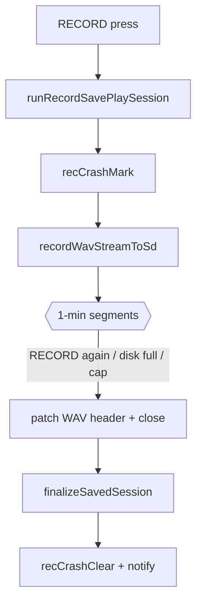
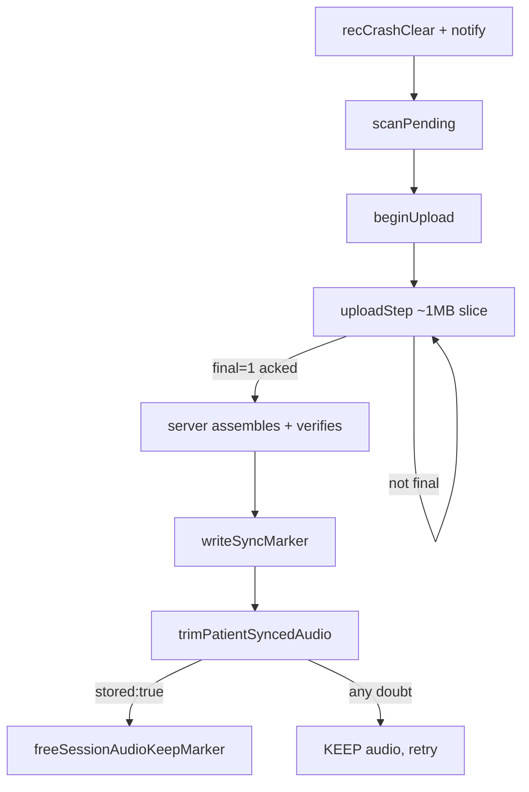
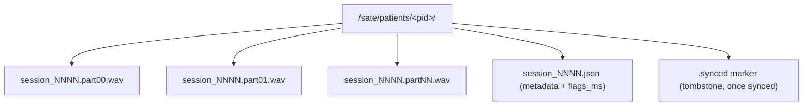
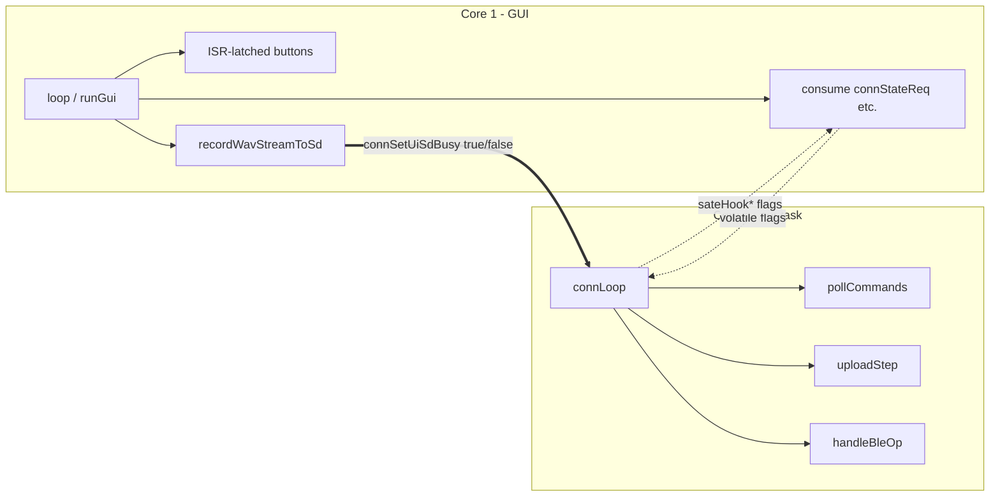
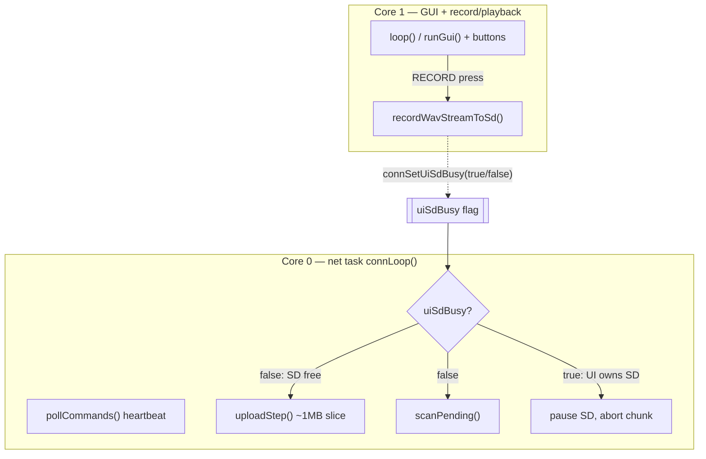

# SATE Recorder firmware

Internal engineering reference for the **SATE Clinical Recorder** — the handheld ESP32-S3
speech-capture device. This page is grounded in the source under `SATE_Recorder/`
(`SATE_Recorder.ino`, `connectivity.cpp/.h`, `display.cpp`, `es8311.cpp`). The details
below are current as of **firmware 1.5.17** (`FIRMWARE_VERSION` in `SATE_Recorder.ino`).

<div class="badge-row"><span class="sate-badge">Firmware 1.5.17</span><span class="sate-badge">ESP32-S3</span><span class="sate-badge">16 MB flash / 8 MB PSRAM</span></div>

> Companion references: `doc/02-firmware.md` (architecture), `doc/07-runbook.md`
> (build/flash/OTA), root `hardware.md` (pin map + RAM budget). Where they disagree with
> this page, re-read the code — the numbers below were taken from it directly.

---

## 1. Overview

<figure class="doc-figure"><figcaption>The SATE Recorder (ESP32-S3, 2.8" touchscreen + microSD).</figcaption></figure>

The recorder is a **Freenove FNK0104AB** board: an **ESP32-S3** (16 MB flash, 8 MB octal
PSRAM) driving a 2.8" 240×320 ILI9341 touchscreen (LVGL UI), a micro-SD slot over SD_MMC,
and an **ES8311** audio codec with an analog microphone captured over I2S. Two external
push-buttons (RECORD, FLAG) plus the on-board BOOT button give physical control; a battery
sense pin and RGB/backlight round it out. It is a self-contained field recorder an SLP
carries into a session — record, review, and it syncs to SATE Cloud on its own.

**Standalone-recording model.** Although the firmware still carries the full patient-roster
machinery (`/sate/patients/<pid>/` dirs, `currentPatientIndex`, `applyActivePatient`,
per-patient session numbering), in real use **patients are not assigned at capture time**.
The device seeds a synthetic `"Standalone"` patient when the roster is empty
(`ensureStandalonePatient()`, `SATE_Recorder.ino`) and every take uploads with
`patient_id "Standalone"`; the recording is attached to a real patient **later, on the web
report**. This matches the pendant's default behavior. Consequently, audit findings that
hinge on patient-slot management are lower real-world priority (see §9), while every
audio-integrity finding still fully applies.

**Lifecycle in one paragraph.** On boot, `setup()` (`SATE_Recorder.ino`) runs an
on-screen init checklist (display → SD → audio codec → SATE services), heals any interrupted
delete/renumber (`recoverInterruptedDelete()`), then either shows the onboarding gate (until
the device is *claimed* to an account) or Home, and **arms** a reboot-interrupted take for
resume. The resume itself runs from `loop()` once the network task is up, never from
`setup()` (see the note below). At runtime `loop()` on core 1 drives the LVGL GUI, the
ISR-latched buttons, the battery/dim/factory-reset services, and consumes flags set by the
connectivity task. Pressing RECORD streams a WAV to the SD card as a chain of 1-minute
segments; on stop the session's metadata JSON is written and the session is queued. A
core-0 network task (`connLoop()`) polls the server for commands, uploads pending sessions
in ~1 MB resumable chunks over HTTPS, and — when Wi-Fi is unavailable — advertises over BLE
so the companion app can provision, bridge-sync, and control the device.

:::danger The resume must run from `loop()`, never from `setup()`
Resuming re-enters the capture, which **blocks until Stop**. Calling it at the end of
`setup()` therefore means `loop()` never runs — and `connStartNetTask()` lives in
`loop()`. The unit records on with **no heartbeat, no remote `stop`, and no serial**:
invisible to the server and unstoppable except at the button or the ~62-minute
ceiling. A remote take, where nobody is standing at the device, simply goes dark.

`setup()` only sets a pending flag; `loop()` performs the resume once the net task is
up (or ~8 s in, if the unit is offline). That keeps a resumed take controllable for
its whole length. This was a real fault, found on the bench and fixed in **1.5.17** —
do not move the call back into `setup()`.
:::

**Device state machine.** The UI runs a small `DeviceState` machine
(`SATE_Recorder.ino`). Uploads run concurrently on the net task, so *Uploading* is
reached from *Home* while the card is otherwise idle (gated by `uiSdBusy`, see §6):



**Boot sequence** — `setup()` (`SATE_Recorder.ino`) runs an on-screen checklist,
heals a half-done delete, then either gates on onboarding or resumes an interrupted take:



---

## 2. Hardware

<div class="spec-grid">
  <div class="spec-tile"><div class="k">MCU</div><div class="v">ESP32-S3</div></div>
  <div class="spec-tile"><div class="k">Flash / PSRAM</div><div class="v">16 MB / 8 MB OPI</div></div>
  <div class="spec-tile"><div class="k">Screen</div><div class="v">2.8" 240×320 ILI9341</div></div>
  <div class="spec-tile"><div class="k">Sample rate</div><div class="v">16 kHz mono</div></div>
  <div class="spec-tile"><div class="k">Segment length</div><div class="v">60 s</div></div>
</div>

| Peripheral | Pins / value | Notes |
|---|---|---|
| **MCU** | ESP32-S3 | 16 MB flash + **8 MB octal (OPI) PSRAM** (`hardware.md`, runbook) |
| **microSD (SD_MMC, 4-bit)** | CMD 40, CLK 38, D0 39, D1 41, D2 48, D3 47 | `SATE_Recorder.ino` |
| **Audio codec (ES8311, I2S)** | MCK 4, BCK 5, DIN 6, DOUT 8, WS 7 | `SATE_Recorder.ino`; `initAudio()` |
| **I2C (touch + codec)** | SDA 16, SCL 15 @ 400 kHz | one shared `Wire` bus, `SATE_Recorder.ino` |
| **Speaker-amp enable** | `AP_ENABLE` = GPIO1 | driven LOW in `initAudio()` |
| **Touch (FT6336U)** | I2C addr `0x38`, INT 17, RST 18 | `display.cpp` |
| **TFT (ILI9341, SPI)** | 10–13, 45, 46 (per pin-audit comment) | backlight on GPIO45 |
| **Backlight** | `TFT_BL_PIN` = GPIO45, LEDC PWM 5 kHz/8-bit | `backlightInit()`; dims to duty 10 after 5 min idle |
| **RECORD button** | `REC_BTN_PIN` = **GPIO2** (not a strap pin) | active-LOW, INPUT_PULLUP, FALLING-edge ISR |
| **FLAG button** | `FLAG_BTN_PIN` = **GPIO14** | active-LOW, INPUT_PULLUP, FALLING-edge ISR |
| **BOOT button** | `BOOT_BTN_PIN` = GPIO0 | hold 5 s → factory reset |
| **Battery sense** | `BAT_ADC_PIN` = **GPIO9** (ADC1) | behind on-board 0.5 divider (`×2`), `BAT_SENSE_ENABLED 1` |
| **Display driver** | LVGL 8.4 | draw buffers in **PSRAM** (`display.cpp`) |

**Audio detail.** The ES8311 is configured as an **analog** mic front-end
(`es8311_microphone_config(dev, false)`, i.e. *not* a digital/PDM mic), with the analog PGA
set to **+30 dB** (`ES8311_MIC_GAIN_30DB`, `es8311.cpp`). The I2S link runs in
**standard mode**, 16 kHz, 16-bit, mono, left slot (`initAudio()`,
`SATE_Recorder.ino`). Capture and playback both stream through a single static
4 KB buffer (`audioChunk`) — no length-proportional allocation.

:::danger Do not move battery sense to GPIO34
GPIO34 is a classic-ESP32 ADC pin, wrong on the S3, and it bootloops the board (the fw 1.0.6
mistake). GPIO9 is the fix.
:::

---

## 3. Connection methods / transports

The recorder speaks over four channels. Only one *network* path is active at a time (Wi-Fi
online **or** BLE), while USB serial is always available when tethered.

### (a) USB serial — flashing & debug

- **When:** development, flashing, and reading the boot/register/OTA log. Never used in
  normal field operation.
- **Enumeration:** the **production FQBN** builds without a debug CDC, so the board enumerates
  as USB-Serial-JTAG only and the port stays a stable `/dev/cu.usbmodem101`. Debug builds add
  `CDCOnBoot=cdc,USBMode=hwcdc`, which splits into two interfaces macOS renumbers `101 ⇄ 2101`.
- **`Serial` output only appears with `CDCOnBoot=cdc,USBMode=hwcdc`.** A plain `cat` will not
  reset the board and, on the JTAG interface, only flushes once the host asserts DTR. Use a
  pyserial reader that pulses **RTS→EN** (reset) with **DTR** high (run, not bootloader) — see
  `doc/07-runbook.md`.
- **Log tags to grep:** `[MEM]` (heap telemetry, `logHeap()`), `[CONN]`, `[OTA]`,
  `[REC]`, `[STATUS]`. `[MEM] ready` means `setup()` completed.

### (b) Wi-Fi → Supabase `device-api` over HTTPS

- **When:** the device is provisioned and the joined network is reachable
  (`CONN_WIFI_ONLINE`). This is the primary sync path.
- **Transport:** `WiFiClientSecure` (TLS, port 443, `setInsecure()` — trust-on-first-use, no
  on-device CA bundle) for Supabase; a plain `WiFiClient` for the mock server. Chosen by
  `serverIsSupabase()` (`connectivity.cpp`).
- **Auth headers:** `apikey: <anon key>` (Supabase gateway requirement; the anon key is
  public by design, embedded at `connectivity.cpp`) **plus** `Authorization: Bearer
  <cfgDeviceKey>` (device identity issued at registration).
- **Keep-alive:** one shared `HTTPClient`/client (`s_http`, `s_httpsClient`) with
  `setReuse(true)` so the frequent command poll skips the TLS handshake
  (`httpJson()`).

| Purpose | Method / path | Key function |
|---|---|---|
| Register / claim | `POST /api/devices/register` | `handleProvisionTick()` `PROV_REGISTER` |
| Heartbeat + command poll | `GET /api/devices/:id/commands?...` | `pollCommands()`, `pushHeartbeatState()` |
| Fetch patient roster | `GET /api/patients` | `fetchPatients()` |
| Chunked upload | `POST /api/sessions/chunk?...&offset=&final=&total=` | `beginUpload()`, `uploadStep()`, `sendSessionChunk()` |
| Verify durable storage | `GET /api/sessions/verify?patient_id=&session_number=&bytes=` | `verifySessionStored()` |

:::note Upload transport history
Earlier firmware streamed audio to Supabase over a **WebSocket**. The current path is the
**resumable chunked HTTPS** upload above (`POST /sessions/chunk`, `HTTPClient`): the server
reassembles the ~1 MB slices and byte-verifies before accepting, so a dropped connection or a
mid-upload reboot resumes from the last acked offset instead of losing the take.
:::

The poll query string doubles as the **heartbeat**: it carries `pending`, `state`
(idle/recording/uploading), `fw`, `ota` phase, `bat`, `recs`, and raw cell `mv`
(`pollCommands()`). The response can carry `commands[]`, an `ota` payload, an
`active_patient`, and an `unclaimed:true` flag (the only path back to first-time setup —
`connFactoryReset()`).

### (c) BLE fallback bridge — when offline

- **When:** provisioning (first-time setup), or whenever Wi-Fi is unavailable/dropped
  (`enterBleMode()`). Provisioning-time `connLoop()` runs on the **main loop**, not the
  net task, so the register TLS handshake has contiguous heap.
- **Stack:** NimBLE-Arduino v2, MTU 247, 180-byte packets (`BLE_CHUNK`). GATT service
  `53415445-0001-...-000000000001` with four characteristics: INFO (read), CONTROL (write),
  STATUS (notify), DATA (notify) (`connectivity.cpp`).
- **Framing:** logical messages are chunked into `[flag][payload]` packets, flag
  `FRAME_PARTIAL 0x01` / `FRAME_FINAL 0x02` (`notifyFramed()`, reassembly in
  `CtrlCB::onWrite`).

<div class="bytemap">
  <div class="cell hi"><b>flag</b><span>0x01 partial / 0x02 final</span></div>
  <div class="cell grow"><b>payload</b><span>≤ 180-byte chunk (BLE_CHUNK)</span></div>
</div>

- **Advertising manufacturer data:** `[0xFF 0xFF][magic 0x5A][flags][pending][rsvd]`; flags
  encode *unprovisioned* / *needs-sync* so the app sees state without connecting
  (`bleUpdateAdvertising()`).

<div class="bytemap">
  <div class="cell"><b>0xFF 0xFF</b><span>company id</span></div>
  <div class="cell"><b>0x5A</b><span>magic</span></div>
  <div class="cell grow hi"><b>flags</b><span>unprovisioned / needs-sync</span></div>
  <div class="cell"><b>pending</b><span>unsynced count</span></div>
  <div class="cell"><b>rsvd</b><span>reserved</span></div>
</div>

- **Threading rule:** NimBLE callbacks only copy bytes and set a flag; **all** real work runs
  from `connLoop()` / `handleBleOp()` — mirrors the touch-callback rule.

| BLE op | Effect | Handler |
|---|---|---|
| `scan_wifi` | async passive Wi-Fi scan, results notified back | `handleBleOp` |
| `provision` | Wi-Fi creds + claim token → connect → register | `PROV_WIFI`/`PROV_REGISTER` |
| `change_wifi` | new creds, **keep** account/key (no re-register) | — |
| `cancel_wifi` | leave change-Wi-Fi mode immediately | — |
| `list_sessions` | enumerate unsynced sessions (`n`, patient, bytes) | — |
| `send_session` | stream a WAV to the app over CHAR_DATA | `sendSessionOverBle()` |
| `mark_synced` | write a `.synced` marker for a session | — |
| `set_patients` | write `/sate/patients.json` from the app | — |
| `reboot` / `factory_reset` | deferred reboot / account wipe | — |

### (d) OTA — pull a `.bin` from Storage

- **When:** an `ota` command arrives in the command poll while online
  (`pollCommands()`).
- **Payload:** rides alongside the command list as `ota:{url, version}`. If `version` equals
  the running build, the flash is skipped.
- **Flow:** `runOtaUpdate()` opens a **dedicated** `WiFiClientSecure`
  (`setReuse(false)`, follows redirects for signed URLs), `GET`s the image, streams it into
  the spare OTA app slot via `Update.writeStream()`, requires a full-length write, then
  `Update.end(true)` sets the new slot as boot and reboots. Progress/failure is reported via
  the `otaPhase` string in the heartbeat (`dl`, `updating`, `err-get<code>`, `err-space`,
  `err-write`, `err-final`) so the dashboard shows it with no serial attached.
- **Dual-slot requirement:** OTA only works because the partition scheme is `default_8MB`
  (two app slots). **Never** `huge_app` — see §7. See §9 for the rollback caveat.

:::warning OTA with a large upload backlog
On a device with a big upload backlog, OTA fails `err-get-1`: the second TLS handshake can't
get its ~40 KB contiguous block on a heap fragmented by hours of 1 MB chunks. **Queue
`reboot` first, wait for it to come back, then queue `ota`** (runbook recipe).
:::

---

## 4. Features

| Feature | What it does | Where |
|---|---|---|
| **Segmented recording** | Streams mic → SD as `session_NNNN.partKK.wav`, one file per **1-minute** segment. No on-device merge — the server stitches segments on upload. | `recordWavStreamToSd()` |
| **~5 s durability flush** | `file.flush()` every `FLUSH_EVERY_BYTES` (= 5 s of PCM), so a brownout loses at most a few seconds, not the open minute. | — |
| **Flag markers** | The FLAG button records the elapsed-ms offset of a clinical moment (up to `FLAG_CAP_MAX`=64). Written into the session JSON `flags_ms[]`, uploaded as `&flags=`, surfaced as seek-bar ticks on the web report. | `saveMetadataToSd()` |
| **Auto-resume after reboot** | **Every** take marks itself active in NVS (`recCrashMark()`) — button-started *and* server/app-started — so any take interrupted by a reboot or brownout continues in the same session instead of ending early. It works from local NVS plus the SD segments alone: **no Wi-Fi and no server are needed**. An empty header-only `part00` **restarts** the take rather than deleting it. A boot-loop guard gives up after two attempts so a take that reliably crashes cannot wedge the device. | — |
| **Card-full guard** | Refuses to start a take without room for a full segment; if the card fills mid-take, it stops cleanly and keeps every captured segment (a full card is a normal end state, never data loss). | `SD_MIN_FREE_BYTES` |
| **Nap / screen dim** | Backlight fades to duty 10 (~4%) after 5 min idle; any touch/button wakes it. | `serviceScreenDim()` |
| **Battery guard** | Reads GPIO9 (×2 divider, 1-point calibrated), reports `%`/`mV` telemetry, and deep-sleeps near-empty to protect the LiPo. | `readBatteryMv()`, `serviceBatteryGuard()`, `batteryBootGuard()` |
| **Verified SD reclaim** | After a synced take, frees the **audio** (not the tombstone) of synced takes older than the newest `KEEP_AUDIO_SESSIONS`=5 — **only** on a byte-exact server confirmation. | `trimPatientSyncedAudio()` |
| **Remote commands** | `sync_now`, `resync_all`, `reload_patients`, `record`, **`stop`**, `wifi_change`, `reboot`, `ota`, plus `unclaimed`→factory-reset. `stop` (fw 1.5.15) ends a take exactly like the RECORD button; before it, a server-started take could only be ended at the device or by the ~62-minute ceiling. A stop is latched only while a take is **armed** — from the moment the take is decided on, through the status screen and its GUI pump, until capture returns — so it can neither go stale and kill the next take, nor be dropped mid-start. | `runRemoteCommand()`, `pollCommands()`, `sateHookStop()` |
| **Sessions screen + delete** | List/playback of recorded sessions; Delete removes a take and renumbers the rest (crash-safe, see §9). Full deletion is **user-only**. | `ACT_DELETE_SESSION`; `deleteSession()` |
| **Battery telemetry** | `bat`/`recs`/`mv` on every heartbeat for the admin dashboard. Lifetime recording count persisted in NVS (`sate-stats`) so it survives the 5-session trim. | `connSetTelemetry()`; `loadTotalRecordings()` |
| **Find-me / live state** | `connSetLiveState()` forces an immediate heartbeat so the app sees "recording"/"uploading" near-instantly; BLE advert `NEEDS_SYNC` flag exposes pending count. | `connSetLiveState()` |

---

## 5. Recording & upload data flow

**Capture (Core 1).**



**Upload & verified trim (Core 0 net task).**



<p class="diagram-caption">Capture writes segments on Core 1; the Core 0 net task uploads then reclaims audio only on a byte-exact server confirmation.</p>

Step detail (the qualifiers moved out of the node labels above):

| Step | Detail |
|---|---|
| RECORD press | ISR latches `g_recHit` |
| runRecordSavePlaySession | `connSetUiSdBusy(true)` |
| recCrashMark | NVS mark, local take only |
| recordWavStreamToSd | mic → SD |
| 1-min segments | `part00.wav .. partNN.wav`, flush ~5 s |
| finalizeSavedSession | writes `session_NNNN.json` |
| recCrashClear + notify | `connNotifyNewSession`; `connSetUiSdBusy(false)`, `pendDirty=true` |
| scanPending | net task walks SD |
| beginUpload | picks first unparked pending |
| uploadStep | one ~1 MB slice per pass, `POST /sessions/chunk` with `offset`,`final`,`total` |
| server assembles + verifies | `upFinalAcked=true` |
| writeSyncMarker | `.synced` tombstone |
| trimPatientSyncedAudio | `verifySessionStored` byte-exact |
| freeSessionAudioKeepMarker | keep newest 5 |
| KEEP audio | retry next cycle |

**On-card layout of one session.** A take is a set of segment WAVs plus a metadata JSON;
once synced a `.synced` tombstone marks it (audio may then be reclaimed):



**The ring of session states.** A session slot is one of:

1. **Recording** — open segments, `recCrashMark` set in NVS.
2. **Pending** — segments (or a legacy merged `.wav`) on the card, no `.synced` marker.
   `scanPendingLocked()` (`connectivity.cpp`) counts these.
3. **Synced (audio present)** — a `.synced` marker **and** audio. Written only when the
   server ACKs `final=1` (`upFinalAcked`, `uploadStep()`).
4. **Tombstone (audio freed)** — `.synced` marker only; audio reclaimed after a byte-exact
   `verifySessionStored()`. The slot stays *numbered* (contiguous) so later takes never hide.

`scanPendingLocked()` must check the marker **before** deciding a slot is empty — otherwise a
synced+purged (tombstone) slot looks like "no session here" and every later take is hidden
(the fw 0.9.3 bug, `connectivity.cpp`).

---

## 6. Concurrency model {#concurrency-model}

Two cores, one deliberate split (fw 1.2.5+):

- **Core 1 — GUI + record/playback.** The Arduino `loop()` runs `runGui()` (LVGL + touch),
  services the ISR-latched buttons, factory-reset/dim/battery, and consumes connectivity
  flags. The blocking capture loop *also* lives here, so it polls the buttons directly.
- **Core 0 — net task (`connLoop()`).** `netTaskFn()` (`connectivity.cpp`) runs all
  HTTP/TLS/BLE work pinned to core 0 via `xTaskCreatePinnedToCore(..., 16384, ..., 0)`, alongside the Wi-Fi/BT stacks. A blocking poll or handshake stalls only this
  task — never the GUI or buttons.



**The `uiSdBusy` handoff.** The SD bus *and* the FATFS volume lock are shared. Before the UI
touches the card (record / save / playback), it calls `connSetUiSdBusy(true)`
(`runRecordSavePlaySession()`, `finalizeSavedSession()` releases). While
`uiSdBusy` is set, `connLoop()` pauses **all SD access** (uploads + pending scans) — HTTP
command polling keeps running (no SD) — and if an upload is mid-flight it aborts on the net
task so the file handle is closed before the UI can rename/delete underneath it
(`connectivity.cpp`). This restores the "record, *then* sync" timing without losing
dual-core responsiveness.



**Flag-based handoff.** The net task never touches LVGL. It sets `volatile` request flags
(`connStateReq`, `connPatientsReq`, `connActivePatientReq`, `connRecordReq`) and UI
hooks (`sateHook*`); `loop()` renders. Upload progress is likewise flag-driven
(`connUploadUiActive/Pct` → `renderUploadOverlay()`).

**Quiesce / cross-core rules.**

- `scanPending()` is wrapped in `pendMux` so both cores can't tear `pendTable`.
- The net task is **not** started at boot; provisioning runs `connLoop()` on the main loop
  (heap for the register handshake). `loop()` calls `connStartNetTask()` once
  `connNetTaskWanted()` (first WIFI_ONLINE) is true (`SATE_Recorder.ino`).
- A delete renumbers sessions, so the UI takes the bus, **waits** for the uploader to release
  its file, then calls `connNotifySessionsRenumbered()` to drop the resume point
  and strike table (both keyed by session number).

---

## 7. Configuration

### Mandatory flash config (verified fw 1.5.12–1.5.17)

```
esp32:esp32:esp32s3:FlashSize=16M,PartitionScheme=default_8MB,PSRAM=opi
```

| Setting | Must be | If wrong |
|---|---|---|
| `FlashSize` | **16M** | an 8M-header bootloader on a 16 MB board can hang at frame 1 |
| `PartitionScheme` | **default_8MB** (dual `ota_0`+`ota_1`) | **`huge_app` silently disables OTA** (single slot, "3MB No OTA") |
| `PSRAM` | **opi** (octal) | wrong PSRAM mode breaks the LVGL/heap layout |
| flash mode (manual esptool) | **dio** | `qio` → dead black screen |

### `lv_conf.h` traps (lives in `~/Documents/Arduino/libraries/`, **not** the repo)

A fresh `lvgl` install resets these; the repo keeps a reference copy at
`SATE_Recorder/lv_conf.reference.h`.

| Setting | Must be | If wrong |
|---|---|---|
| **`LV_TICK_CUSTOM`** | **1** (millis source) | **Silent boot brick.** The firmware calls `lv_tick_inc()` *nowhere*, so with `0` LVGL's clock freezes at 0 → boot spinner sticks at frame 1, nothing repaints, yet `setup()` still finishes (serial reaches `[MEM] ready`). Looks exactly like a bad flash — it is not. |
| `LV_MEM_CUSTOM` + `ps_malloc`/`ps_realloc` | 1 | LVGL heap in internal RAM fragments it → register TLS handshake fails `code -1` |
| `LV_FONT_MONTSERRAT_12/14/20` | 1 | missing glyphs / build errors |

Draw buffers are allocated `MALLOC_CAP_SPIRAM` (`display.cpp`) — keeping them and the
LVGL heap out of internal RAM leaves the ~40 KB contiguous block the register TLS handshake
needs.

### Key `#define`s / constants

| Constant | Value | File |
|---|---|---|
| `FIRMWARE_VERSION` | `"1.5.17"` | `SATE_Recorder.ino` |
| `AUDIO_SAMPLE_RATE` | 16000 | `SATE_Recorder.ino` |
| `AUDIO_BIT_DEPTH` / `AUDIO_CHANNELS` | 16 / 1 (mono) | `SATE_Recorder.ino` |
| `SEGMENT_SECONDS` | 60 (1-min segments) | `SATE_Recorder.ino` |
| `RECORD_MAX_SECONDS` | 3700 (~62 min safety ceiling) | `SATE_Recorder.ino` |
| `REMOTE_RECORD_SECONDS` | 8 | `SATE_Recorder.ino` |
| `AUDIO_CHUNK_BYTES` | 4096 (the only audio working buffer) | `SATE_Recorder.ino` |
| `FLUSH_EVERY_BYTES` | 5 s of PCM | `SATE_Recorder.ino` |
| loop-task stack | 16 KB (`SET_LOOP_TASK_STACK_SIZE`) | `SATE_Recorder.ino` |
| `MAX_PATIENTS` | 6 | `SATE_Recorder.ino` |
| `FLAG_CAP_MAX` | 64 | `SATE_Recorder.ino` |
| `KEEP_AUDIO_SESSIONS` | 5 | `connectivity.cpp` |
| `UPLOAD_CHUNK_BYTES` | 1 MB | `connectivity.cpp` |
| `UPLOAD_MAX_STRIKES` / `UPLOAD_PARK_RETRY_MS` | 3 / 5 min | `connectivity.cpp` |
| `CMD_POLL_PERIOD_MS` | 12000 | `connectivity.cpp` |
| `HEARTBEAT_PERIOD_MS` | 15000 | `connectivity.cpp` |
| `BLE_CHUNK` / MTU | 180 / 247 | `connectivity.cpp` |

Persisted config (NVS namespaces): `sate` (Wi-Fi SSID/pass, server, device id/key,
`provisioned`), `sate-stats` (lifetime recording count), `sate-rec` (record-resume mark),
`sate-del` (delete/renumber journal).

---

## 8. Key files

| File | Responsibility |
|---|---|
| `SATE_Recorder.ino` | `setup()`/`loop()`, UI state machine + all screens, record/playback, WAV + segment I/O, delete/renumber + journal, resume, battery/backlight, button ISRs, UI hooks |
| `connectivity.cpp` / `.h` | BLE provisioning + bridge, Wi-Fi state machine, HTTPS `httpJson`/chunked upload, command poll + heartbeat, verified trim, pending scan, OTA, dual-core net task |
| `display.cpp` / `.h` | LVGL init, ILI9341 flush (blocking CPU copy), FT6336U touch, PSRAM draw buffers |
| `es8311.cpp` / `.h` / `es8311_reg.h` | ES8311 codec register driver (I2C), analog mic + PGA config |
| `sate_logo_white.h` | Boot-logo bitmap |
| `lv_conf.reference.h` | Reference copy of the load-bearing LVGL config |

---

## 9. Known issues & current status

Audit of **2026-07-22**. Priorities, in order: (1) never lose or **mismatch** patient audio;
(2) no feature ever **stuck**; security noted but deprioritized.

### Fixed this session

| Issue | Symptom | Status / where |
|---|---|---|
| **Delete-during-upload two-in-one-WAV** | Deleting a session renumbered later takes while the uploader still streamed the old number → server assembled one WAV from two different recordings. | **FIXED** — the delete handler takes the SD bus and polls `connUploadProgress()` until the in-flight chunk is really down, bounded to **65 s** (> ~60 s final-chunk timeout), then renumbers. `ACT_DELETE_SESSION`, `SATE_Recorder.ino` |
| **Trim-tail race** | `upActive` cleared *before* `trimPatientSyncedAudio()`, so a delete during trim's verify network call saw "idle", renumbered, and slid a different unsynced take into a slot trim then freed by number → permanent loss. | **FIXED** — `upActive` stays true across `writeSyncMarker` + trim. `uploadStep()`, `connectivity.cpp` |
| **Reboot-mid-renumber hole** | A reboot during the multi-rename shift left a numbering hole; `findNextSessionIndex`/pending scan stop at the first gap → every later take invisible + never uploads. | **FIXED** — `deleteSession()` journals the op to NVS (`sate-del`) before mutating; `recoverInterruptedDelete()` → `compactPatientDir()` re-drives it on boot (idempotent). `SATE_Recorder.ino` |
| **Auto-resume flush** | Segments flushed only once per full minute, so a sub-minute take (or an early power cut) left a header-only `part00`, which boot recovery then **deleted**. | **FIXED** — ~5 s mid-segment flush (`FLUSH_EVERY_BYTES`) + empty-`part00`-on-boot now **restarts** the take into the same session instead of deleting it. |
| **Verified SD trim** | Reclaim keyed on the local `.synced` marker alone, which can exist before the server durably holds the audio (BLE `mark_synced`, or a false 2xx / swallowed 413). | **ADDED** — `verifySessionStored()` (`GET /api/sessions/verify`, checks row **and** storage object, byte-exact) gates every free; `sessionAssembledBytes()` mirrors the server's stored bytes. Any doubt → **keep**. `connectivity.cpp` |

### Open

| Issue | Symptom | Status / where |
|---|---|---|
| **OTA: no device-side rollback / self-test** | The bootloader keeps the old slot only if the new image *fails to boot*; a bad image that **boots but is broken** is not caught — one bad publish could brick the fleet. No `verifyOta`/post-boot self-test; and per CLAUDE.md `POST /firmware` still lacks an `isAdmin()` gate (image is now semver+`0xE9`-magic+size validated). | **OPEN** — `runOtaUpdate()`, `connectivity.cpp` |
| **`renameSessionFiles` ignores returns** | Each `SD_MMC.rename()` return is unchecked; a failed rename mid-renumber isn't detected in-line (the NVS journal heals it on the *next* boot, so it is not silent loss, but the running shift can leave a transient hole). | **OPEN** — `SATE_Recorder.ino` |
| **`saveMetadataToSd` return ignored** | `finalizeSavedSession()` calls it without checking the `bool` return; a failed JSON write proceeds and the session uploads with no metadata (flags/sample-rate default). | **OPEN** — `SATE_Recorder.ino` |
| **BLE `notifyFramed` truncation** | A notify is retried 50× then the packet is silently dropped and `off` still advances → a bridged session can be truncated with no device-side detection (the app rejects a byte-mismatched pull, but the device believes it sent). | **OPEN** — `connectivity.cpp` |
| **Flags truncated at `flagsCsv[300]`** | Flag offsets are packed into a 300-byte query buffer; once full, remaining flags are dropped rather than overflow. A take with many flags loses the tail on upload. | **OPEN** — `beginUpload()`, `connectivity.cpp` |
| **`millis()` wrap deadlines** | Several timers compare `now > deadline` directly (e.g. `wifiDeadline`, `nextCmdPoll`, `rebootAtMs`) rather than the wrap-safe `(int32_t)(now - x) >= 0` used elsewhere; a 49.7-day uptime wrap could misfire. Low risk on a field device that reboots often. | **OPEN** — `connLoop()`/`connectivity.cpp` timing block |
| **Roster-full patient overwrite** | When the 6-slot roster is full, `applyActivePatient()` overwrites the *current* slot's patient instead of rejecting. Not hit in the standalone-only model (patients aren't assigned at capture). | **OPEN (low real-world priority)** — `SATE_Recorder.ino` |
| **`pendDirty` lost-update** | `scanPendingLocked()` clears `pendDirty=false` after the walk; a `writeSyncMarker`/`free…` that sets it `true` *during* the walk can be clobbered → a stale cached count until the next mutation. Needs a generation counter under `pendMux`. | **OPEN** — `connectivity.cpp` |

### Notes on scope

- Per the **standalone-only** model (§1), patient-slot findings (roster-full overwrite,
  patient-id in the storage path) are lower priority; `session_number` + `device_serial`
  carry identity when everything uploads as `"Standalone"`.
- Correctly **refuted** false positives (left alone): record-begin FATFS race (fresh file, no
  renumber, FATFS reentrancy lock serializes); cf-processor watchdog requeue (heartbeat guard
  exists).
- Security holes (device heartbeat key not validated; device key derivable from serial) are
  tracked separately and **deprioritized by the user** — see the audit security notes; do not
  act on them unasked.

> Before any firmware release, run the hardware-in-the-loop harness (`hwtest/`) on a real
> board — a compiler cannot catch reboot-mid-record, delete-during-upload splicing,
> verified-trim, or crash-safe-delete regressions.
