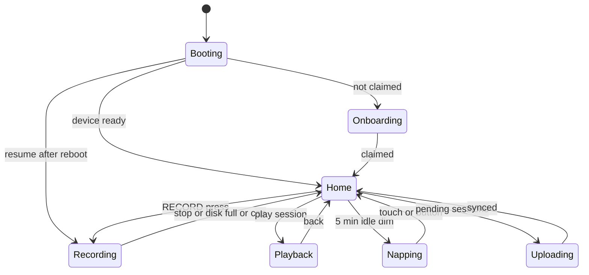
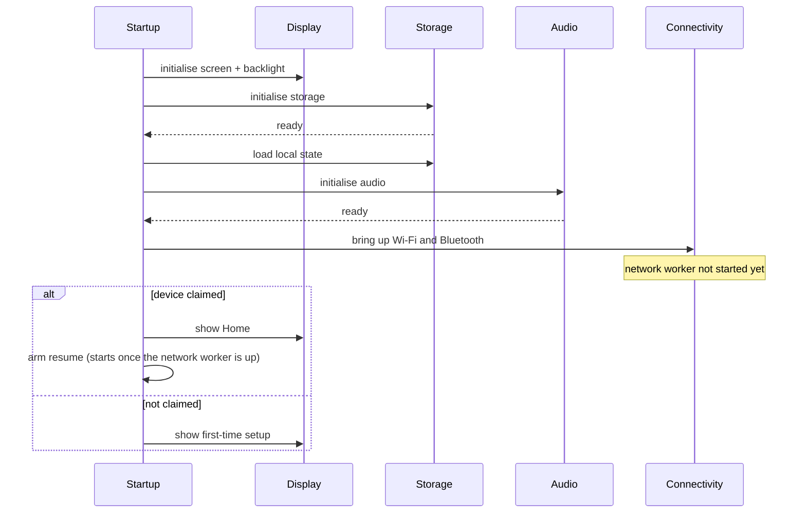
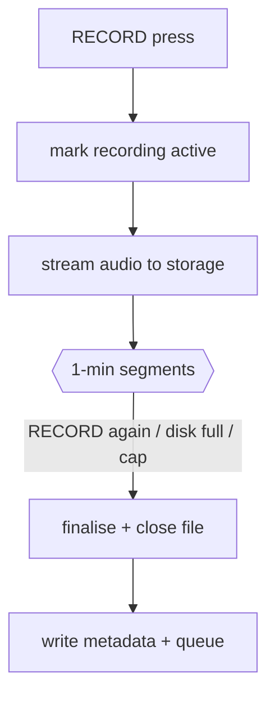
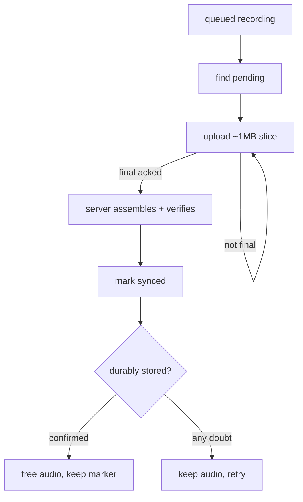
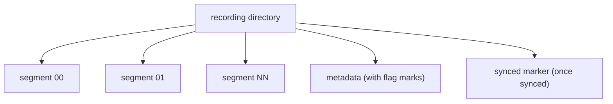
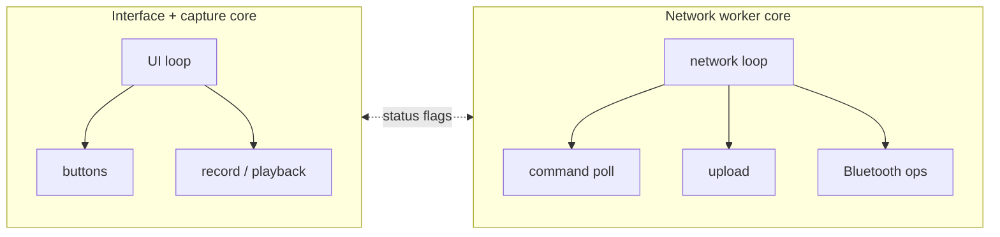
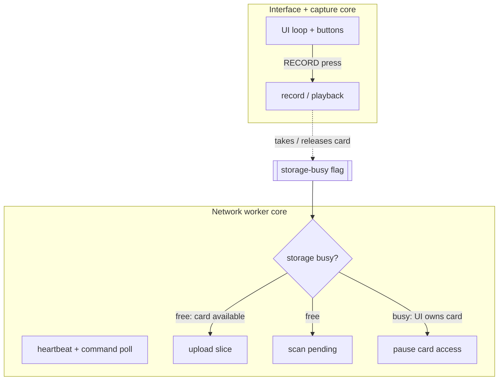

# SATE Recorder firmware

An overview of the **SATE Clinical Recorder** — the handheld speech-capture device a
speech-language pathologist carries into a session. This page describes what the recorder
is, how it fits into the wider SATE system, and how it behaves for the people who operate
it. It stays at the conceptual level rather than the code level.

ESP32-S316 MB flash / 8 MB PSRAM16 kHz mono WAV

---

## 1. Overview

<figure class="doc-figure"><figcaption>The SATE Recorder (ESP32-S3, 2.8" touchscreen + microSD).</figcaption></figure>

The recorder is a self-contained field device built around an **ESP32-S3** (16 MB flash,
8 MB PSRAM). It pairs a 2.8" colour touchscreen, a micro-SD card for local storage, and a
dedicated audio codec with an analog microphone. A pair of physical buttons — **RECORD**
and **FLAG** — give the clinician tactile control without looking at the screen. In
practice it is a pocket recorder: press to capture, review on the device, and it syncs
its recordings up to SATE Cloud on its own whenever it can reach the network.

**Standalone-recording model.** In everyday use the recorder captures **standalone audio
reports** — a recording is not tied to a specific patient at the moment of capture.
Instead, each recording uploads under a neutral "Standalone" identity and is attached to a
real patient **later, on the web report**. This keeps the clinician's hands free during a
session and mirrors how the wearable pendant behaves.

**Lifecycle in one paragraph.** On power-up the device runs a short on-screen startup
checklist (screen, storage, audio, cloud services), then shows either a first-time setup
gate — until the device has been claimed to an account — or the Home screen. If a previous
recording was interrupted by a reboot or power loss, the device arms itself to resume that
recording cleanly. During normal operation the touchscreen and buttons stay fully
responsive while a separate background worker talks to the network. Pressing RECORD writes
audio to the SD card as a series of short segments; on stop, the recording is finalised and
queued for upload. The network worker periodically checks in with the cloud, uploads
pending recordings in resumable chunks, and — when Wi-Fi is unavailable — advertises over
Bluetooth so the companion mobile app can set it up, bridge recordings across, and control
it.

:::danger[A resumed recording must stay controllable for its whole length]
When the device resumes a recording interrupted by a reboot, that capture runs until it is
stopped. The firmware is careful to bring the network worker online **before** re-entering
a resumed recording, so the recording stays fully controllable — it still sends
heartbeats, still honours a remote stop, and still reports status. A remote recording,
where nobody is standing at the device, would otherwise go dark for its entire duration.
This behaviour is deliberate and was hardened after a real bench finding.
:::

**Device state machine.** The interface follows a small set of states. Uploads run in the
background, so *Uploading* is reached from *Home* while the device is otherwise idle:

**Boot sequence** — startup runs an on-screen checklist, heals any interrupted maintenance,
then either gates on first-time setup or arms a resume:

---

## 2. Hardware

  

MCU

ESP32-S3

  

Flash / PSRAM

16 MB / 8 MB

  

Screen

2.8" 240×320 touch

  

Sample rate

16 kHz mono

  

Segment length

60 s

At a glance, the recorder combines:

- **An ESP32-S3** with 16 MB flash and 8 MB PSRAM — enough headroom for the graphical UI
  and network stacks to coexist.
- **A 2.8" 240×320 colour touchscreen** for the on-device interface, recording review, and
  status.
- **A micro-SD card** as the durable local store for every recording until it is confirmed
  safe in the cloud.
- **An audio codec with an analog microphone**, captured as 16 kHz, 16-bit, mono audio —
  the right balance of speech clarity and modest file size for clinical speech capture.
- **Two external buttons** (RECORD and FLAG) plus the on-board boot button, giving reliable
  physical control.
- **Battery sensing and an RGB/backlight**, so the device reports its charge and dims when
  idle.

The microphone front end applies a fixed analog gain suited to close speech, and audio
streams continuously to storage during a recording rather than being buffered whole in
memory.

---

## 3. Connection methods / transports

The recorder communicates over a few distinct channels. Only one *network* path is active
at a time — Wi-Fi when online, Bluetooth when not — while a USB link is always available
when the device is tethered for maintenance.

### (a) USB — flashing and diagnostics

Used only during development and servicing: flashing firmware and reading the device's
startup and status log. It is never part of normal field operation.

### (b) Wi-Fi → SATE Cloud

The primary sync path. When the device is set up and its network is reachable, it talks to
the cloud Device API over a secure connection. Over this channel the device:

| Purpose | What it does |
|---|---|
| Register / claim | Binds the device to an account during first-time setup |
| Heartbeat + command poll | Checks in regularly, reporting state and receiving commands |
| Chunked upload | Streams each recording to the cloud in resumable ~1 MB slices |
| Verify durable storage | Confirms a recording is safely stored before reclaiming space |

The regular check-in doubles as the device's **heartbeat**: it reports how many recordings
are pending, the current state (idle, recording, or uploading), firmware version, any
update progress, and battery level. The response can carry commands, a firmware-update
offer, and account status — including the signal that a device has been un-claimed, which
returns it to first-time setup.

:::note[Upload transport history]
Earlier firmware streamed audio to the cloud over a persistent WebSocket connection. The
current path is a **resumable chunked upload**: the cloud reassembles the slices and
byte-verifies the result before accepting it, so a dropped connection or a mid-upload
reboot resumes from the last acknowledged point instead of losing the recording.
:::

### (c) Bluetooth fallback bridge — when offline

Bluetooth is used for first-time setup, and whenever Wi-Fi is unavailable or drops. Over
this channel the companion mobile app can:

| Capability | What it does |
|---|---|
| Scan Wi-Fi | Ask the device to list nearby networks |
| Provision | Hand the device Wi-Fi credentials and claim it to an account |
| Change Wi-Fi | Update credentials while keeping the existing account |
| List recordings | See which recordings are still unsynced |
| Bridge a recording | Pull a recording off the device over Bluetooth |
| Mark synced | Note that a recording has been received |
| Reboot / factory reset | Restart the device, or wipe its account binding |

While offline, the device also advertises a small status beacon so the app can tell — at a
glance, without connecting — whether it still needs setup or has recordings waiting to sync.

### (d) Over-the-air firmware updates

When an update is offered during a check-in, the device downloads the new firmware image
directly from cloud storage, writes it into a spare application slot, and reboots into it.
Update progress and any failure are reported in the heartbeat, so an operator can watch an
update from the dashboard with nothing physically attached. The device carries two
application slots specifically so an update never overwrites the running firmware.

:::warning[Updating a device with a large upload backlog]
On a device that has hours of recordings still waiting to upload, an update can fail to
start because memory is fragmented. The reliable recipe is to **reboot the device first,
wait for it to come back, then trigger the update** — the first check-in after a fresh boot
has the clean memory the download needs.
:::

---

## 4. Features

| Feature | What it does |
|---|---|
| **Segmented recording** | Audio streams to storage as a series of short (~1-minute) segments. There is no on-device merge — the cloud stitches the segments into one recording on upload. |
| **Frequent durability flush** | Audio is flushed to storage every few seconds, so a sudden power loss costs at most a few seconds, never the whole recording in progress. |
| **Flag markers** | The FLAG button timestamps a clinically significant moment. Those marks travel with the recording and surface as seek-bar ticks on the web report. |
| **Auto-resume after reboot** | Any recording interrupted by a reboot or power loss continues in the same recording rather than ending early. It works from local storage alone — no Wi-Fi or server needed — and a boot-loop guard gives up gracefully if a recording reliably fails to resume. |
| **Card-full guard** | The device refuses to start a recording without room for a full segment, and if the card fills mid-recording it stops cleanly and keeps every captured segment. A full card is a normal end state, never data loss. |
| **Nap / screen dim** | The backlight fades after a few minutes idle; any touch or button press wakes it. |
| **Battery guard** | Reports charge level, and puts itself into deep sleep when the battery runs low to protect the cell. |
| **Verified space reclaim** | After a recording is safely in the cloud, the device may free that recording's audio from the card — but only on a byte-exact confirmation from the server that it is durably stored. |
| **Remote commands** | Operators can trigger sync, reload settings, start and stop recording, change Wi-Fi, reboot, and push updates remotely. A remote stop ends a recording exactly as the RECORD button would. |
| **Recordings screen** | List, play back, and delete recordings on the device. Deletion is user-initiated only. |
| **Telemetry** | Battery, recording count, and live state ride along with every heartbeat for the admin dashboard, so a device's status is visible at a distance. |

---

## 5. Recording numbering, retention and reclaim {#numbering-and-retention}

Two simple rules govern what the SD card holds. Both were reworked after review found the
older, more complex machinery was the single largest source of defects.

### Numbers are never renumbered

Each recording is given a number that is only ever used once, and numbers wrap around after
a fixed ceiling. Deleting a recording removes **only that recording's own files** and
leaves a gap — nothing else shifts, and no other recording is renamed. Keeping numbers
stable is deliberate: the cloud keeps its record of a deleted recording, and shuffling
numbers on the device was historically the cause of the worst failures.

:::danger[Renumbering is intentionally gone]
The older design shifted later recordings down to keep numbering contiguous. That produced
a whole class of failures — a renumber running under a live upload that spliced two
recordings into one on the server, a delete that removed the wrong recording after the
shift, and slot reuse after a power cut. Removing the mechanism removed all of them.
Nothing in the current design assumes recordings are numbered contiguously.
:::

### Retention: keep the newest, and only free what the server has

The card keeps the **newest few recordings** on the device. Older audio is freed only when
**both** of these are true:

1. the recording has been marked synced, **and**
2. the server confirms — with a byte-exact check — that exactly that recording is durably
   stored.

**A recording that is not yet synced is never freed, at any age.** Any doubt — the device
is offline, the server can't confirm, or the byte counts don't match — keeps the audio, and
the next cycle simply tries again. A local "synced" mark alone is never enough; only a
positive server confirmation permits freeing space.

When audio is freed, a lightweight marker stays behind so the slot remains accounted for.
Full deletion of a recording stays a user action.

Retention runs both right after a successful upload and on a periodic idle sweep across the
whole card. The idle sweep matters: without it, once everything had uploaded there was
nothing left to trigger reclaim, and a card could fill up while the screen still said "all
synced." The sweep also logs a per-directory inventory, which is the fastest way to answer
"why is my card still full?"

### Standalone is the default

The recorder records standalone audio reports. Receiving a patient roster from the server
is **not** an assignment — the active target stays Standalone unless a patient is
explicitly assigned, either from the app/server or picked on the device itself.

---

## 6. Recording & upload data flow

**Capture.** Pressing RECORD marks the recording as active in durable local state, then
streams microphone audio to storage as a chain of short segments. When the recording stops
— by button, disk-full, or the safety ceiling — the audio file is finalised, its metadata
(including any flag marks) is written, and the recording is queued for upload.

**Upload and verified reclaim.** The background network worker finds pending recordings,
uploads each in resumable ~1 MB slices, and waits for the server to reassemble and verify
the whole recording. Only then is it marked synced — and only on a later byte-exact
confirmation is the audio freed from the card.

Capture writes segments locally; the network worker uploads, then reclaims audio only on a byte-exact server confirmation.

**On-card layout of one recording.** A recording is a set of segment audio files plus a
metadata record; once synced, a small marker notes that it is safe (its audio may then be
reclaimed):

**The lifecycle of a recording slot.** Each recording is in one of four states:

1. **Recording** — segments still open, marked active in local state.
2. **Pending** — segments on the card, not yet synced.
3. **Synced (audio present)** — confirmed received by the server, audio still on the card.
4. **Reclaimed** — synced marker only; the audio was freed after a byte-exact server
   confirmation, while the slot stays accounted for so later recordings are never hidden.

---

## 7. Concurrency model {#concurrency-model}

The device does two things at once by splitting work across the ESP32-S3's two cores:

- **One core drives the interface and capture** — the touchscreen UI, the physical buttons,
  the battery and screen-dim housekeeping, and the recording/playback itself.
- **The other core runs the network worker** — all Wi-Fi, secure connections, uploads,
  command polling, and Bluetooth work. A slow network call therefore stalls only the
  network worker, never the interface or the buttons.

**Coordinating access to storage.** The SD card is a shared resource, so the two cores
hand it off cleanly. When the interface needs the card — to record, save, or play back — it
takes ownership, and the network worker pauses all card access (uploads and scans) until
the interface is done, aborting any in-flight upload safely first. Command polling, which
doesn't touch the card, keeps running throughout. This restores the natural "record first,
then sync" feel without giving up the responsiveness of running on two cores.

The network worker never touches the interface directly; the two cores coordinate through
simple status flags, and each renders or acts on its own core. This keeps the graphical
stack single-owner while still letting network events update what the operator sees.

---

## 8. Configuration

The recorder is configured for a specific hardware layout, and a few settings are
load-bearing:

- **16 MB flash with a dual-slot layout.** Two application slots are what make over-the-air
  updates possible — an update writes to the spare slot and never overwrites the running
  firmware.
- **8 MB PSRAM in the correct mode.** The graphical stack and its buffers live in PSRAM,
  which keeps enough contiguous internal memory free for secure network handshakes.
- **A pinned graphical-library configuration.** The on-device UI relies on a small number
  of specific library settings; a mismatch can leave the screen lit but frozen at the boot
  spinner, which looks like a bad flash but is not.

Key operating parameters, at the level worth sharing publicly:

| Parameter | Value |
|---|---|
| Audio format | 16 kHz, 16-bit, mono |
| Segment length | 60 s |
| Recording safety ceiling | ~62 min |
| Upload slice size | ~1 MB |
| Command poll interval | ~12 s |
| Heartbeat interval | ~15 s |

The device persists its essential state — Wi-Fi credentials, server and account binding,
lifetime recording count, and any resume marker — in non-volatile storage, so it survives
reboots and power loss.

---

## 9. Reliability principles

The recorder's design is organised around one overriding priority: **never lose or
mismatch a recording**, and never let a feature get stuck. A few principles follow from
that:

- **The device is the only copy until the cloud provably has it.** Space is reclaimed only
  on a byte-exact server confirmation, never on a local marker alone.
- **Every recording can be resumed** from local storage after an interruption, with no
  network required.
- **A remote recording stays controllable** for its whole length — it never goes off the
  air just because nobody is standing at the device.
- **Simplicity beats cleverness where data integrity is at stake** — the removal of
  recording renumbering is the clearest example, having eliminated an entire class of
  data-mismatch failures.

:::note[Hardware-in-the-loop testing]
Because the hardest failures — interrupted recordings, dropped connections, delete-during-
upload, verified reclaim — cannot be caught by a compiler, every firmware release is
exercised on a real device with an automated harness that drives record, reboot, and delete
and checks both the device's own behaviour and the bytes the server actually stored.
:::
