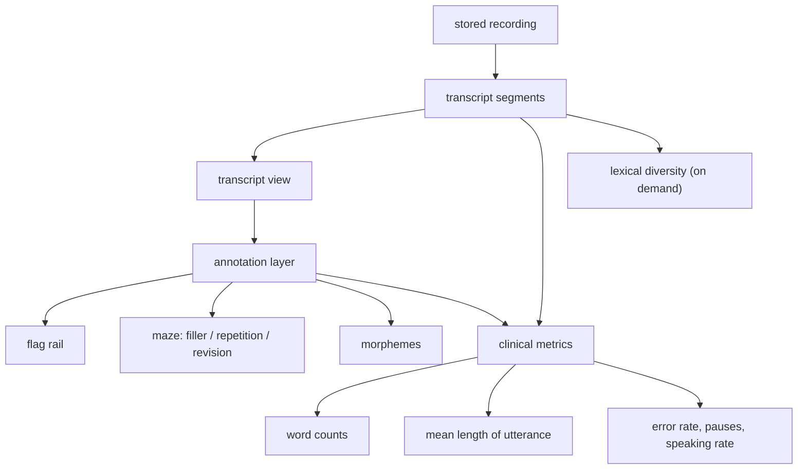
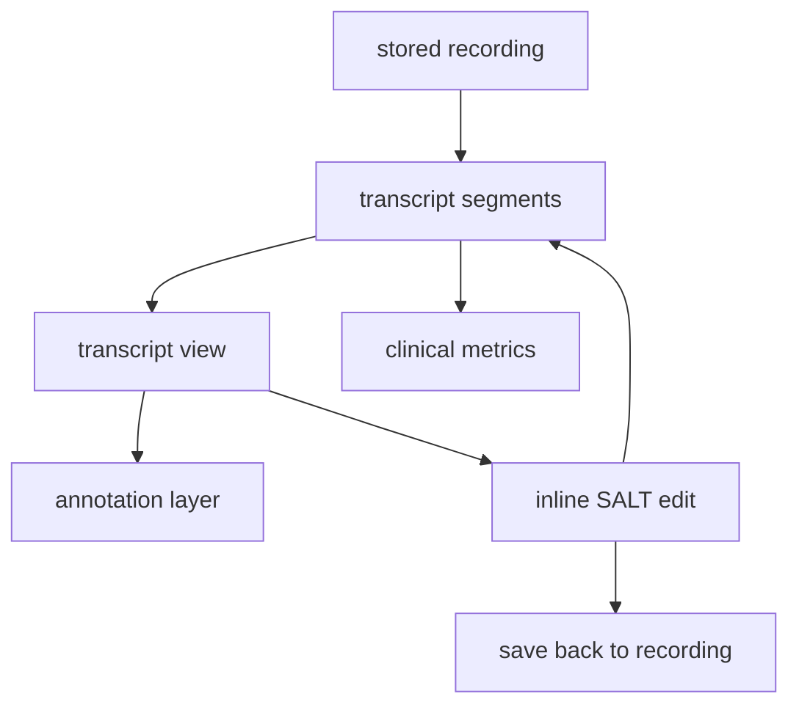
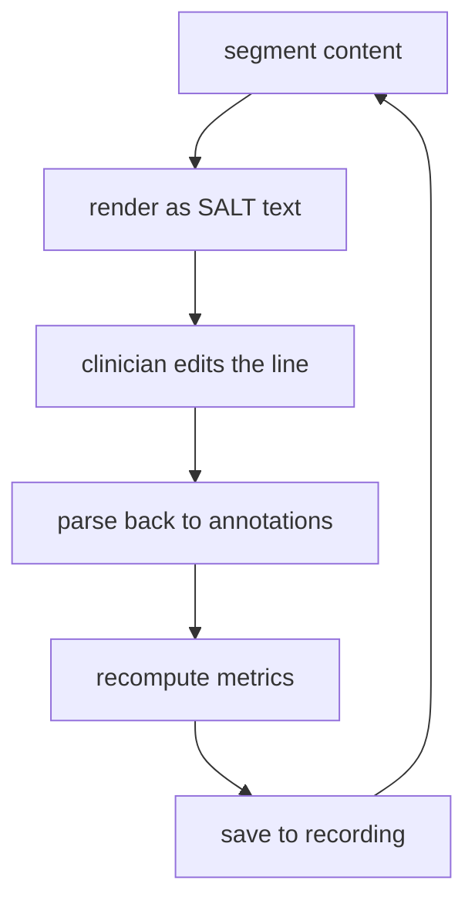

# Web app

The SATE web app is the **clinician console for speech-language pathologists**: bring in a
recording (upload a file or pull one straight from a device), get a transcript with
speech and language annotations, refine it in a SALT-aware editor, and produce clinical
metrics and reports. It runs in the browser as a modern single-page application and shares
its backend with the mobile app.

React + ViteTypeScriptSupabaseClinician console

Type

Web SPA

Runs in

Browser

Backend

Supabase

Audience

SLP clinicians

Billing

Stripe

Sits alongside

Mobile app

:::note[One system, two front ends]
The web app is a separate deployment from the mobile app, but both are backed by the same
cloud project and the same edge API. The web console focuses on manual uploads, transcript
results, patient management, and device administration; the mobile app focuses on capture
and on-the-go review.
:::

## 1. Overview

The web app is where a clinician does the heavier desk work of a session: reviewing what a
device recorded, correcting the transcript, reading the resulting metrics, and turning that
into a report a family or a school can read. At a glance:

| Aspect | Detail |
|---|---|
| Kind | Browser-based single-page app |
| Backend | Shared cloud project (database, storage, edge API) — same as mobile |
| Auth | Clinician sign-in; can also mint a QR hand-off for the mobile app |
| Payments | Subscription billing and invoices |
| Focus | Transcript review, clinical metrics, patient CRM, device & firmware management |

## 2. How it connects

### Backend

The web app talks to a shared cloud backend that provides the database, file storage, and
serverless API used by the whole SATE system. Clinicians sign in with an account, and the
app works on their behalf for everything it does.

**Sign-in and the mobile hand-off.** Besides normal account sign-in, an already-signed-in
web session can generate a short-lived, one-time **QR code** (also shown as a typed code
with a countdown). The mobile app scans it to start its own session on the same account.
This is a one-way web-to-mobile hand-off; the web app itself never consumes these codes.

**What the app works with.** From the console a clinician can reach recordings and their
transcripts, a patient roster with therapy sessions and goals, generated reports, clinic
invite/onboarding codes, and subscription/billing records. Recordings live in private
storage and are only ever played back through short-lived, expiring signed links, never
public URLs.

### The device API

For anything to do with hardware, the web app calls the system's **edge API** as the
signed-in clinician. Through it, the console can:

- list the recorders claimed to the account and provision a new one,
- send remote commands to a recorder (start a recording, reboot, trigger an update),
- browse the sessions a device has uploaded, and delete or **retry** them,
- fetch a playable link for a device-uploaded session, and
- (for administrators) manage devices and firmware across the whole fleet.

Device recordings are transcribed by an **asynchronous processing pipeline** in the
backend, not inline. A session moves through a simple lifecycle — queued, processing, then
done or errored. If one lands in an error state, the clinician sees a "failed" badge and a
**retry** button that puts it back in the queue. Keeping transcription asynchronous is a
deliberate design choice: long recordings can take far longer than a single web request is
allowed to run, so the heavy work happens in a dedicated long-running service.

## 3. Features

| Feature | What it does |
|---|---|
| Recording report | Audio player synced to the transcript, with segment-bounded playback for reviewing a single utterance |
| SALT transcript editing | Inline editing of the transcript in SALT format (see §4) |
| Annotations | Flag markers plus maze, morpheme, repetition and revision annotations, each with a detail popup |
| Clinical metrics | Word counts, mean length of utterance, error rate, speaking rate, pauses, and lexical diversity |
| Patient CRM | Patient roster, therapy sessions, goals, and generated reports |
| Device management | Device cards, remote commands, over-the-air updates, and a session browser |
| Firmware publishing | Administrator-only tool to release new device firmware to the fleet |
| Billing | Subscription management, invoice history, and downloads |

### Flag markers

Flag markers are a single shared pipeline for both the SATE recorder (its physical flag
button) and Plaud devices (a tap on the device). A device records the moment in time a
clinician wants to mark; those moments flow through to the recording and appear in the web
report as a **vertical timeline rail** beside the transcript, aligned with the ticks on the
audio seek bar. Flags can be added, removed, and annotated with notes right in the report,
and edits save automatically.

### Clinical metrics

For each recording (and optionally per speaker), the app computes a standard set of
speech-language measures:

- **Total and different words** — counted over real words, excluding fillers, repetitions,
  and other non-content tokens.
- **Mean length of utterance** in words and in morphemes.
- **Error rate**, **pause count**, and **speaking rate** (words per minute).
- **Lexical diversity** (a VoCD-style measure), computed on demand.

The transcript, its annotation layer, and these metrics all derive from the same stored
recording:

## 4. Transcript and annotation workflow

The core of the console is the transcript editor. A recording's transcript loads as a
series of **segments**, each carrying its words along with any annotations — fillers,
repetitions, revisions, morphemes, and pauses. The clinician reviews and corrects the
transcript, and the app recomputes metrics and saves the result back to the recording.

**SALT round-trip.** For inline editing, a segment's structured content is rendered as a
single line of **SALT** (Systematic Analysis of Language Transcripts) text — the notation
clinicians already know, with morpheme forms, parenthesized repetition/revision spans, and
pause markers. The clinician edits that text directly, and the app parses it back into
structured annotations, recomputes metrics, and saves.

:::note[SALT editing is a simplified round-trip]
Converting between structured annotations and a single line of SALT text is not perfectly
lossless — some finer annotation distinctions are inferred from the text rather than
preserved exactly. Inline SALT editing is best for quick corrections; treat the structured
annotation tools as the source of truth for detailed markup.
:::

## 5. Deployment

The web app and the mobile app are deployed independently but share one backend. The web
console is published as a static single-page app to a web host, while the backend (database,
storage, and edge API) is shared across the whole SATE system. New firmware for the fleet is
published from the administrator area of the console itself.

## 6. Status

The web console is in active development. Transcript review, clinical metrics, the patient
CRM, device management, and billing are all functional today. Ongoing work focuses on
tightening the transcript editing round-trip, improving how metrics handle multi-speaker
recordings, and hardening the administrative and device-management flows ahead of general
availability. For current limitations and workarounds, see the Known issues and
Troubleshooting pages.
