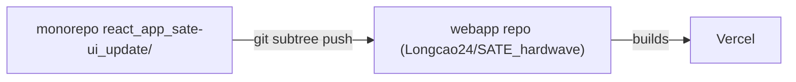
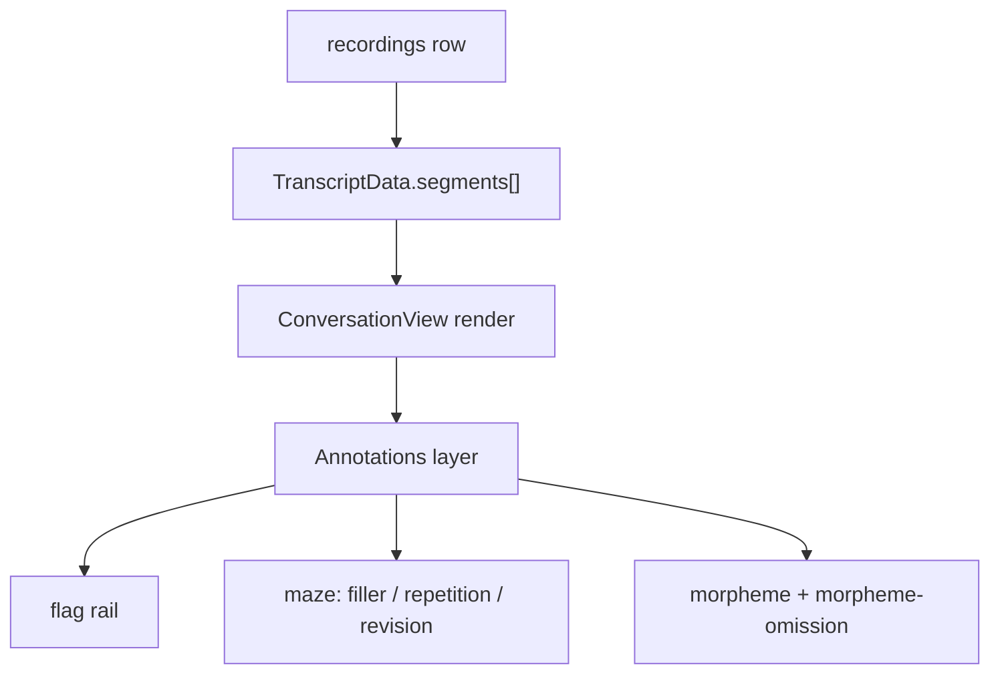
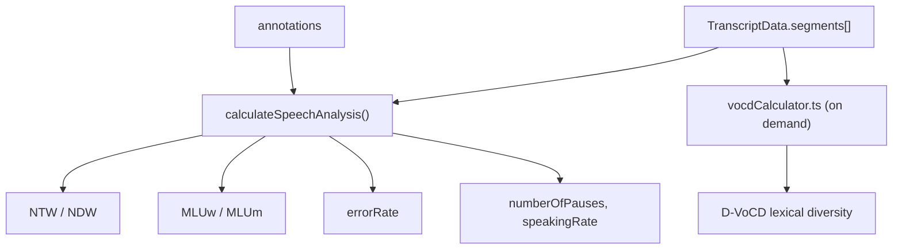
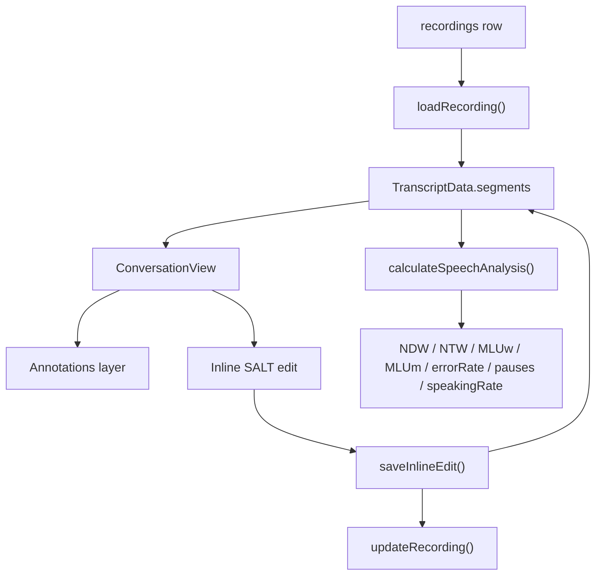
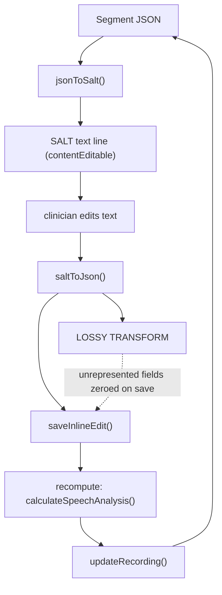

# Web app

The SATE web app is the **SLP-facing clinician console**: upload or pull in a device
recording, get a transcript with speech/language annotations, edit it in a SALT-aware
editor, and produce clinical metrics and reports. It is a **Vite + React 19 +
TypeScript** SPA. Source lives in `react_app_sate-ui_update/src/`; path alias `@/` maps
to `src/`.

<div class="badge-row"><span class="sate-badge">React + Vite</span><span class="sate-badge">React 19</span><span class="sate-badge">TypeScript</span><span class="sate-badge">v1.5.9</span></div>

<div class="spec-grid">
<div class="spec-tile"><div class="k">Framework</div><div class="v">React 19</div></div>
<div class="spec-tile"><div class="k">Build tool</div><div class="v">Vite</div></div>
<div class="spec-tile"><div class="k">Language</div><div class="v">TypeScript</div></div>
<div class="spec-tile"><div class="k">Router</div><div class="v">react-router-dom v7</div></div>
<div class="spec-tile"><div class="k">Backend</div><div class="v">Supabase</div></div>
<div class="spec-tile"><div class="k">Version</div><div class="v">1.5.9</div></div>
</div>

> **This is a separate deploy target from the mobile app**, but the same Supabase
> project and the same `device-api` Edge Function back both. Per `doc/01-architecture.md`:
> *Web app — Vite + React 19 + TypeScript — `react_app_sate-ui_update/src/` — manual
> uploads, results, device mgmt, `/admin`.*

## 1. Overview

| Aspect | Detail |
|---|---|
| Framework | Vite + React 19 + TypeScript, `react-router-dom` v7 |
| Build | `tsc -b && vite build` (`package.json` `build` script) |
| Backend | Supabase (Postgres + Storage + Edge Functions/Deno) — same project as mobile |
| State/data | `@tanstack/react-query` (`src/lib/react-query.ts`) for cache invalidation, plain hooks otherwise |
| Payments | Stripe (`@stripe/stripe-js`, `stripe` server SDK used from edge functions) |
| Analytics | PostHog (`posthog-js`) |
| Version | `package.json` `1.5.9` |

:::warning Deploy-breaker: `noUnusedLocals` + `noUnusedParameters`
`tsconfig.app.json` sets both to `true`, and the build script is `tsc -b && vite build` — so `tsc`
runs as a real build gate, not just an editor hint. A merely-unused variable or import is `TS6133`
and **fails the production build**, even though `vite dev` and most editors won't flag it as an
error. This has broken the Vercel deploy before (per `CLAUDE.md`). Always run `npm run build` inside
`react_app_sate-ui_update/` before shipping — `npx tsc --noEmit` alone is not sufficient assurance
because it's easy to run it from the wrong tsconfig project or skip it.
:::

**Deploy is a git subtree, not this repo's CI.** The web app is developed inside the
monorepo (`react_app_sate-ui_update/`) but is pushed as a **git subtree** to a separate
GitHub repo that Vercel actually builds:

```bash
git subtree push --prefix=react_app_sate-ui_update webapp <branch>
```

`webapp` remote = `Longcao24/SATE_hardwave`. There is no webhook or CI in *this* repo
that builds the web app automatically — someone has to run the subtree push, and if the
local build wasn't verified first, a broken build only surfaces on Vercel.



## 2. Connection / data

### Supabase

`src/lib/supabase.ts` creates a single client from `VITE_SUPABASE_URL` /
`VITE_SUPABASE_ANON_KEY` (env vars logged as a warning, not thrown, if missing — the app
loads but every Supabase call fails silently downstream). This client is shared by every
service module (`dataService`, `patientService`, `stripeService`, `saltService` doesn't
touch Supabase, `deviceApiService` uses it only to fetch the JWT for `device-api` calls).

**Auth.** Standard Supabase email/password + session JWT (`supabase.auth.getSession()`).
A second login path exists for the mobile app: **mobile-link QR** —
`src/components/Auth/MobileLinkModal.tsx` calls the `mobile-link` edge function
(`action: 'create'`) from an *already logged-in* web session to mint a short-lived
one-time code, rendered as both a QR (`qrcode.react`) and a typed code with a countdown.
The mobile app consumes it to get its own session (`mobile_link_codes` table, per
`CLAUDE.md`). This is a **web → mobile** hand-off; the web app does not consume codes
itself.

**Core tables used directly from the web app** (via `supabase.from(...)`):

| Table | Used by | Purpose |
|---|---|---|
| `recordings` | `DataService/recordingStorage.ts` | audio path, transcript JSON, error/analysis JSON, flags, flag_notes, patient_id |
| `patients` | `patientService.ts` | CRM patient roster (`slp_id`-scoped) |
| `sessions` | `patientService.ts` | therapy session records tied to a patient |
| `patient_goals` | `patientService.ts` | goal tracking, `status: active/achieved/discontinued/modified` |
| `reports` | `patientService.ts` / `reportService.ts` | generated progress/evaluation/monthly/quarterly reports |
| `patient_recordings` | `patientService.ts` | patient↔recording join |
| `invite_codes`, `invite_code_usage` | `inviteCodeService.ts` | clinic invite/onboarding flow |
| `subscriptions`, `payments` | `stripeService.ts` | Stripe billing mirror |
| `sate_admins` | server-side (edge fn) | admin gate — see §3 Admin |

**Storage.** Recordings are uploaded to the `recordings` bucket
(`saveRecording` in `DataService/recordingStorage.ts`) at
`${userId}/${Date.now()}_${filename}`, with a bucket-missing fallback that
auto-creates the private bucket and retries once. Playback URLs are always **signed URLs**
with a 1-hour TTL (`getRecordingUrl` → `createSignedUrl(path, 3600)`), fetched fresh on
each `loadRecording` call — never a public URL, since the bucket is private.

### device-api (Edge Function)

`src/services/device/deviceApiService.ts` is a thin REST client over the `device-api`
Supabase Edge Function, authenticated with the user's Supabase JWT (`Authorization:
Bearer <token>` + the anon `apikey` header — **not** a device key; the web app always
acts as the signed-in clinician, never as a device). Base URL:
`${VITE_SUPABASE_URL}/functions/v1/device-api`.

Key surface:

| Method | Route | Purpose |
|---|---|---|
| `listDevices` | `GET /devices` | recorders claimed to this account |
| `claimToken` | `POST /devices/claim-token` | one-time token for provisioning a new recorder |
| `sendCommand` | `POST /devices/:id/commands` | queue `record` / `reboot` / `ota` etc., optionally tagging a patient |
| `getLatestFirmware` / `publishFirmware` | `GET/POST /firmware*` | fleet firmware — see §3 |
| `listSessions` / `deleteSession` / `retrySession` | `/sessions*` | device-uploaded sessions; **`retrySession`** (`POST /sessions/:id/retry`, device-api ≥v14) re-queues a session stuck in `error` state through the async AI pipeline |
| `getSessionAudioUrl` | `GET /sessions/:id/audio` | returns a 302 to a signed Storage URL |
| `amIAdmin` / `adminListDevices` / `adminListFirmware` / `adminDeleteFirmware` / `adminDeleteDevice` | `/admin/*` | system-wide management, gated server-side by `sate_admins` |

Session **retry** surfaces in `src/components/Device/DeviceSessionStatus.tsx`: a session
whose `process_error` is set shows a "failed" badge and a retry button that calls
`retrySession`; the async processor state machine on the backend
(`queued → processing → done | error`) picks it back up (see `doc/05-backend-supabase.md`
/ `CLAUDE.md` for why AI processing must never run synchronously inside an edge
function).

## 3. Features

| Feature | Where | Notes |
|---|---|---|
| Recording report | `ConversationView` + `useAudioPlayer` | audio player synced to per-word timestamps; segment-bounded playback (`playSegment(start,end)`) |
| SALT-format transcript editing | `saltService.ts`, inline edit in `ConversationView` | see §4 |
| Annotations | `src/components/Annotations/*`, `useAnnotations` hook | flag markers (device flag button → timeline rail), maze/morpheme/repetition/revision click popups |
| Clinical metrics | `DataService/speechAnalysis.ts` | NDW, NTW, MLUw, MLUm, error rate, speaking rate, pause count; `vocdCalculator.ts` for D-VoCD lexical diversity |
| Patient CRM | `src/components/CRM/*`, `patientService.ts` | patient roster, sessions, goals, reports, inactive-patient view |
| Admin firmware publish | `src/components/Admin/AdminPage.tsx`, `FirmwarePublishCard.tsx` | gated by `sate_admins` (server-side `amIAdmin`/`/admin/*` routes) |
| Stripe billing | `src/components/Stripe/BillingPage.tsx`, `stripeService.ts` | customer portal session, invoice history/download |
| Device management | `src/components/Device/*` | device cards, remote commands, OTA, session browser |

### Flag markers

One shared pipeline for both SATE hardware (physical flag button) and Plaud (device
tap): device ms-offsets land in the `recordings.flags` column (+ `flag_notes` for
per-flag notes), and `ConversationView` renders them as a **vertical timeline rail**
alongside the transcript (`recomputeRail` in `ConversationView/index.tsx`) — flags are
placed by time, interpolated within an utterance or proportionally across silent gaps
between utterances, so the rail stays consistent with the horizontal seek-bar ticks.
Flag edits (`addFlag`/`deleteFlag`/`updateFlagNote` in
`hooks/TranscriptProcessor/index.ts`) auto-save via `updateRecordingFlags`.

### Clinical metrics detail

`calculateSpeechAnalysis` (`DataService/speechAnalysis.ts`) computes, per recording (or
per `targetSpeaker` if passed):

- **NTW / NDW** — Number of Total/Different Words, over non-maze, non-punctuation words
  (fillers/repetitions/revisions excluded via `isMazeWordOrPunctuation`); NDW lemmatizes
  a word to its `morpheme.lemma` when a non-`<IRR>` morpheme annotation exists.
- **MLUw / MLUm** — Mean Length of Utterance in words / morphemes, computed by splitting
  each segment into sentence-boundary utterances (`splitSegmentIntoUtterances`) and
  averaging valid-word (or morpheme) counts per utterance.
- **errorRate** — `totalErrors / totalWords * 100`, where `totalErrors` sums **every**
  key in `IssueCounts` (`pause`, `filler`, `repetition`, `mispronunciation`, `morpheme`,
  `morpheme-omission`, `revision`, `utterance-error`) — see §6 for why this is disputed.
- **numberOfPauses**, **speakingRate** (words/min over `totalDuration`).
- **D-VoCD** (`vocdCalculator.ts`) — a separate lexical-diversity metric (seeded
  golden-section search fitting the VoCD curve), computed on demand, not part of
  `SpeechAnalysis`.

Transcript to render + annotations:



Segments to metrics:



Diagram detail (kept out of the nodes above; fuller descriptions in the list above):

| Node | Detail |
|---|---|
| recordings row | Supabase; transcript JSON, flags, flag_notes |
| TranscriptData.segments[] | words, fillerwords, repetitions, revisions, morphemes, pauses |
| ConversationView render | TranscriptSegment per segment |
| Annotations layer | `useAnnotations` + AnnotationPopup |
| flag rail | device flag button; `recomputeRail`, flags column |
| calculateSpeechAnalysis() | `DataService/speechAnalysis.ts` |
| NTW / NDW | non-maze words; NDW lemmatizes via `morpheme.lemma` |
| MLUw / MLUm | `splitSegmentIntoUtterances` |
| errorRate | `totalErrors / totalWords * 100` (sums every `IssueCounts` key) |
| D-VoCD lexical diversity | NOT part of `SpeechAnalysis` |

## 4. Transcript / annotation pipeline



Diagram detail (kept out of the nodes above):

| Node | File / detail |
|---|---|
| recordings row | Supabase; file_path, transcript JSON, flags |
| loadRecording() | `DataService/recordingStorage.ts` |
| TranscriptData.segments | words, fillerwords, repetitions, revisions, morphemes, pauses |
| ConversationView | renders TranscriptSegment per segment |
| Annotations layer | `useAnnotations` + AnnotationPopup; flag rail, maze/morpheme click popups |
| Inline SALT edit | `jsonToSalt()` to edit, `saltToJson()` to save |
| saveInlineEdit() | `useSegmentOperations.ts` |
| calculateSpeechAnalysis() | `DataService/speechAnalysis.ts` |
| updateRecording() | writes transcript + recalculated error_counts + analysis back to Supabase |

**SALT round-trip.** A segment's structured JSON (`words[]`, `fillerwords[]`,
`repetitions[]`, `revisions[]`, `morphemes[]`, `pauses[]`) is converted to a single line
of **SALT (Systematic Analysis of Language Transcripts)** text for inline editing:

- `jsonToSalt()` (`saltService.ts`) — walks `segment.words`, substitutes morpheme forms
  as `lemma/suffix` (e.g. `walk/ed`, `do/n't` for contractions via `MORPH_MAP`), wraps
  repetition/revision spans in `(...)`, inserts filler parens, and appends pause tags
  (`:NN` = whole seconds) into the gaps between words. It self-validates balanced
  parens and repairs them if a data bug produced a mismatch.
- The user edits the SALT text directly in a `contentEditable` region
  (`startInlineEditing` in `ConversationView/index.tsx`).
- `saltToJson()` (`saltService.ts`) parses the SALT text back into `words`,
  reconstructs `repetitions`/`revisions` from parenthesized spans (using a **word-count
  heuristic**: a single-word span becomes a repetition, a multi-word span becomes a
  revision — not based on any semantic marker in the text), `morphemes` from `lemma/suf`
  tokens, and `pauses` from `:NN` tags.
- `saveInlineEdit()` (`useSegmentOperations.ts`) then overwrites the segment's annotation
  arrays wholesale with whatever `saltToJson` returned (defaulting to `[]` for anything
  it didn't return) and marks `is_edited: true`.



Diagram detail (kept out of the nodes above):

| Node | Detail |
|---|---|
| Segment JSON | words, fillerwords, repetitions, revisions, morphemes, pauses |
| jsonToSalt() | `saltService.ts`; lemma/suffix, `(...)` spans, `:NN` pauses |
| SALT text line | `startInlineEditing` |
| saltToJson() | parse words, morphemes, pauses; rebuild rep/rev by word-count heuristic |
| LOSSY TRANSFORM | mispronunciation + morpheme_omissions + fillerwords NOT returned; 1-word span → repetition, multi-word → revision |
| saveInlineEdit() | `useSegmentOperations.ts`; overwrite arrays wholesale (`\|\| []`); `is_edited = true` |
| recompute | `calculateSpeechAnalysis()` → error_counts + analysis |
| updateRecording() | `recordingStorage.ts`; write transcript + counts + analysis to Supabase |

## 5. Key files

| File | Role |
|---|---|
| `src/services/dataService.ts` | legacy re-export barrel over `DataService/` |
| `src/services/DataService/types.ts` | `Segment`, `Word`, `TranscriptData`, `IssueCounts`, `SpeechAnalysis` shapes |
| `src/services/DataService/recordingStorage.ts` | Supabase CRUD for `recordings` (save/load/update/delete, flags, patient assignment) |
| `src/services/DataService/speechAnalysis.ts` | NDW/NTW/MLUw/MLUm/errorRate/pause computation |
| `src/services/DataService/errorCounter.ts` | per-segment `IssueCounts` tally (the canonical filler-null-filter logic) |
| `src/services/DataService/errorAnnotations.ts` | which annotation types are present, for filter UI |
| `src/services/DataService/audioProcessor.ts` | uploads raw audio to the transcription API (`sate-v1-5.ngrok.io/process`), CUDA→CPU fallback, error categorization |
| `src/services/saltService.ts` | `jsonToSalt` / `saltToJson` SALT round-trip conversion |
| `src/services/reportService.ts` | `generatePatientReport` — progress/evaluation/monthly/quarterly report generation from recording history |
| `src/services/patientService.ts` | CRM CRUD: patients, sessions, goals, reports, patient_recordings |
| `src/services/device/deviceApiService.ts` | `device-api` REST client (devices, firmware, sessions, admin) |
| `src/lib/supabase.ts` | shared Supabase client |
| `src/components/Recording/ConversationView/index.tsx` | transcript renderer, flag rail, popups orchestration |
| `src/components/Recording/ConversationView/hooks/useSegmentOperations.ts` | split/merge/delete/inline-edit-save logic |
| `src/components/Recording/ConversationView/utils/segmentOperations.ts` | pure split/merge/normalize functions |
| `src/components/Annotations/AnnotationPopup.tsx` | per-type annotation detail popup (pause, maze, revision, morpheme-omission, morpheme, default) |
| `src/hooks/useAudioPlayer.ts` | `<audio>` element wrapper: play/pause/seek/segment-bounded playback |
| `src/hooks/useUndoRedo.ts` | localStorage-backed undo/redo over `Segment[]` history |
| `src/hooks/TranscriptProcessor/index.ts` | orchestrator hook composing all transcript sub-hooks + flag auto-save |
| `src/components/Layout/RightSidebar.tsx` | per-speaker issue-count summary panel |
| `src/components/Device/FirmwarePublishCard.tsx` | admin firmware upload UI |
| `src/components/Admin/AdminPage.tsx` | admin-only device/firmware management page |
| `src/utils/vocdCalculator.ts` | D-VoCD lexical diversity metric |
| `src/components/Stripe/BillingPage.tsx` | subscription + invoice UI |
| `src/components/Auth/MobileLinkModal.tsx` | mobile-link QR code generation |

## 6. Known issues & current status

From a full multi-agent audit (2026-07-22; see agent memory
`stuck-state-red-flags.md`). The user's priority order was: never lose/mismatch patient
audio, never let a feature get stuck, features over security for now.

| Issue | File | Status |
|---|---|---|
| Annotation popup unclickable — backdrop/popup were Fragment siblings, so the popup positioned against the *scrolled* panel and rendered off-screen; the invisible full-screen backdrop then swallowed the click | `src/components/Annotations/AnnotationPopup.tsx` (`getPopupPosition()`) | **FIXED** — popup now uses `position: fixed` (viewport-relative), matching the `getBoundingClientRect()` coordinate space the click handler captures |
| `useUndoRedo` transcript-wipe — `recordingId` resolves synchronously from the URL but `transcriptData` loads async after it, so the init effect could seed history `present` from an empty/stale array; the first Undo would then restore a **blank transcript** | `src/hooks/useUndoRedo.ts` | **FIXED** — a sync effect keeps `present` aligned with the loaded transcript until the user's first real edit (`past`/`future` both empty), after which history is left alone |
| SALT round-trip loses annotations: `saltToJson()` never populates `mispronunciation` or `morpheme_omissions` (parser has no representation for them), and `fillerwords` is also never returned — so any inline SALT edit's `saveInlineEdit()` (`... \|\| []` fallback for each field) **zeroes** all three on save | `src/services/saltService.ts` (`saltToJson`/`parseSalt`), `src/components/Recording/ConversationView/hooks/useSegmentOperations.ts` (`saveInlineEdit`) | **OPEN** |
| SALT round-trip rep/revision swap: `saltToJson` classifies any single-word parenthesized span as a `repetition` and any multi-word span as a `revision`, purely by word count — not by what the clinician meant, so a one-word revision or multi-word repetition changes type on save | `src/services/saltService.ts` (`saltToJson`, "Split mazes into repetitions and revisions based on heuristics") | **OPEN** |
| Split/merge word-index desync: `splitSegment`/`mergeSegments` reindex the **annotation arrays** (repetitions/morphemes/revisions word indices) but never rewrite the `index` field stored on each `Word` object itself — so after a merge, the second segment's words keep their original (now-duplicate, now-stale) `index` values, and after a split the second segment's `Word.index` values don't restart at 0 | `src/components/Recording/ConversationView/utils/segmentOperations.ts` (`splitSegment`, `mergeSegments`) | **OPEN** |
| Morpheme content-match: morphemes are matched to words by **cleaned text equality** ("due to index misalignment in JSON") rather than by index, so a segment with a repeated word (e.g. two instances of "the") can have both instances resolve to the same morpheme annotation via `.find()` | `src/services/DataService/speechAnalysis.ts` (multiple `segment.morphemes?.find(...)` call sites), `src/services/saltService.ts` | **OPEN** |
| Stale-fetch overwrites current patient PHI: `usePatientData(patientId)` fires a new `loadPatientData` on every `patientId` change with no request-id/cancellation guard — a slow fetch for a previously-viewed patient can resolve **after** a fetch for the currently-viewed patient and overwrite the displayed patient's PHI with someone else's | `src/components/CRM/PatientDetails/hooks/usePatientData.ts` | **OPEN** |
| Sidebar filler-count mismatch: `RightSidebar.tsx`'s local speaker-issue-count tally does `speakerIssueCounts.filler += segment.fillerwords.length` (raw count), while the canonical `countErrors()` in `DataService/errorCounter.ts` filters out entries with `content === null \|\| content === ''` first — the two filler counts shown in different parts of the UI can disagree | `src/components/Layout/RightSidebar.tsx` vs. `src/services/DataService/errorCounter.ts` | **OPEN** |
| `errorRate` counts morphemes and pauses as "errors": `calculateSpeechAnalysis`'s `totalErrors` sums **every** key of `IssueCounts`, including `morpheme` (a wanted grammatical marker, not an error) and `pause` (often not a scored error type), inflating the displayed error rate | `src/services/DataService/speechAnalysis.ts` (`errorRate` calc) | **OPEN** |
| Examiner-speaker pooling: when no `targetSpeaker` is passed, `isExaminer()` excludes only speakers literally named/containing "examiner" — if a transcript has multiple non-examiner speakers (e.g. two children, or a child + a caregiver), their words are pooled into a single NDW/NTW/MLU calculation instead of being kept per-speaker | `src/services/DataService/speechAnalysis.ts` (`segmentsForCounting` filter) | **OPEN** |
| `BillingPage` fabricates the next billing date: `getNextBillingDate()` always computes "today + 1 calendar month" locally rather than reading the subscription's actual `current_period_end` from Stripe/`subscriptions`, so the date shown can be wrong for annual plans, mid-cycle changes, or trials | `src/components/Stripe/BillingPage.tsx` (`getNextBillingDate`) | **OPEN** |
| Firmware version was free-text on the client (`FirmwarePublishCard` just guesses a semver from the filename or accepts anything typed) with no server-side validation, and `publishFirmware` was routed **above** the `/admin` gate so any authenticated user could push a fleet-wide OTA image | `src/components/Device/FirmwarePublishCard.tsx` (client, still free-text); server-side `publishFirmware` in the `device-api` edge function | Server validation (semver + `0xE9` magic byte + size cap) **FIXED**; the missing `isAdmin()` gate on the route itself is still **OPEN** per `CLAUDE.md` ("deprioritized behind features, but fix before GA") |
| Audio `<audio>` element error handler is a no-op: `useAudioPlayer`'s `handleError` callback is registered on the `error` event but its body is just a comment (`// Audio error occurred`) — a failed load (bad signed URL, expired token, network failure) leaves the player silently stuck with no user-visible error state | `src/hooks/useAudioPlayer.ts` (`handleError`) | **OPEN** |
| `vocdCalculator`'s `SeededRandom` uses a low-quality linear congruential generator (`seed = (seed * 1103515245 + 12345) & 0x7fffffff`) with a 31-bit modulus; over many draws for a long transcript this has visible short-period/precision artifacts versus a proper PRNG, which can bias the sampled TTR curve the D-VoCD fit depends on | `src/utils/vocdCalculator.ts` (`SeededRandom.next`) | **OPEN** |
| `flags` save result unchecked: `saveFlags()` updates local `currentRecordingFlags`/`currentRecordingFlagNotes` state **before** awaiting `updateRecordingFlags()`, and never inspects the returned `{success, error}` — a failed Supabase write is silently swallowed while the UI has already shown the flag as added/edited/deleted | `src/hooks/TranscriptProcessor/index.ts` (`saveFlags`) | **OPEN** (noted alongside the audit's other "silent loss" findings) |
| `updateRecording` reports success on 0 rows affected: the Supabase `.update(...).eq('id', recordingId).eq('user_id', userId)` call only checks the `error` field: if the ID/user combination matches no row (e.g. stale ID, wrong account), Supabase returns no error and 0 rows updated, and the function still returns `{ success: true }` | `src/services/DataService/recordingStorage.ts` (`updateRecording`, and siblings `updateRecordingName`/`updateRecordingMetadata`/`updateRecordingPatient`/`updateRecordingFlags`) | **OPEN** |

Not fixed *in* the web app but relevant to data displayed by it: the backend's async AI
processing state machine, device-session dedup, and SD-reclaim verification bugs
documented in the root `CLAUDE.md` are upstream of what the web app renders — a
duplicate or mis-processed `sate_device_sessions` row would surface here as a duplicate
or wrong `recordings` row, but the fix lives in `device-api`/`cf-processor`, not this app.
