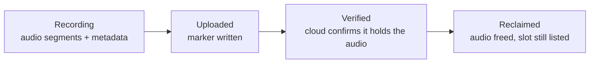
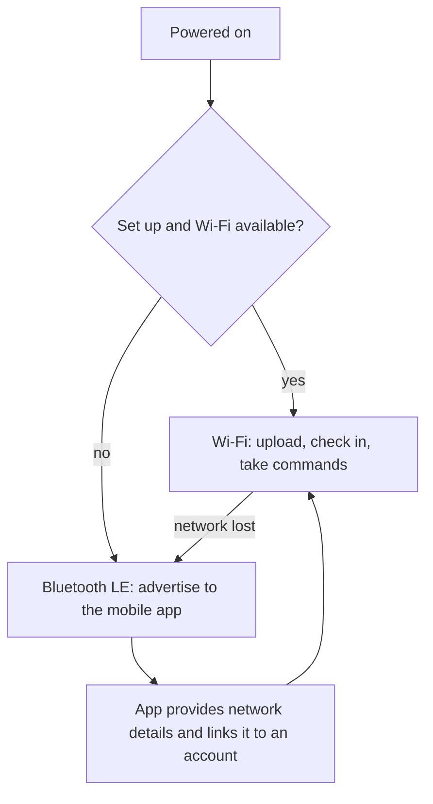

# Recorder hardware reference

The **SATE Clinical Recorder** in hardware terms: the board and chips it is built from, how
every pin is used, the audio chain, how a recording is laid out on the memory card, how power
and battery protection work, and what it takes to build and flash firmware for it.

This is the physical-layer companion to the [Recorder firmware guide](/guides/recorder), which
covers the same device from the operator's point of view.

ESP32-S3 dual-core16 MB flash / 8 MB PSRAM16 kHz mono WAVmicroSD 4-bit1S LiPo

---

## 1. Board and chips

MCU

ESP32-S3

Cores

2 @ 240 MHz

Flash

16 MB

PSRAM

8 MB octal

| Part | Detail |
|------|--------|
| Board | Freenove ESP32-S3 Display **FNK0104AB**, 2.8" |
| MCU | ESP32-S3, dual-core Xtensa LX7 @ 240 MHz |
| Flash | **16 MB**, DIO mode |
| PSRAM | 8 MB **OPI** (octal) — required; a QSPI setting will not initialise it |
| Screen | 2.8" **240×320 ILI9341** TFT |
| Touch | **FT6336U** capacitive, I²C |
| Audio codec | **ES8311** over I²S — analog microphone in, speaker amp out |
| Storage | microSD over **SD\_MMC**, 4-bit bus |
| Radio | Wi-Fi **2.4 GHz only** + Bluetooth LE, one shared antenna |
| Power | USB-C, or a single-cell (1S) LiPo |

Everything is on one board — no external wiring beyond the two physical buttons and the cell.

:::note[2.4 GHz only]
The ESP32-S3 has no 5 GHz radio. A 5 GHz-only network is the single most common reason a
recorder fails to join Wi-Fi during setup, and it looks exactly like a wrong password.
:::

---

## 2. Pin map

### microSD — SD\_MMC 4-bit

| Signal | GPIO |
|--------|------|
| CLK | 38 |
| CMD | 40 |
| D0 | 39 |
| D1 | 41 |
| D2 | 48 |
| D3 | 47 |

The 4-bit bus gives roughly four times the bandwidth of a 1-bit SPI connection, which is what
makes it comfortable to stream audio to the card continuously while other work is running.

### Audio — ES8311 over I²S

| Signal | GPIO |
|--------|------|
| MCLK | 4 |
| BCLK | 5 |
| DIN (codec → MCU, microphone) | 6 |
| DOUT (MCU → codec, speaker) | 8 |
| WS / LRCK | 7 |

The master clock runs at sample rate × 256 = **4.096 MHz**.

### I²C — shared bus

| Signal | GPIO |
|--------|------|
| SCL | 15 |
| SDA | 16 |
| Speed | 400 kHz |

One bus is shared by the FT6336U touch controller and the ES8311's register interface, brought
up once before the display is initialised.

### Buttons, backlight, battery sense

| Function | GPIO | Notes |
|----------|------|-------|
| **RECORD** button | 2 | External, active-low with pull-up. Not a strapping pin, so there is no boot-time conflict |
| **FLAG** button | 14 | External, active-low with pull-up |
| **BOOT** button | 0 | On-board. Hold 5 seconds for a full factory reset |
| LCD backlight | 45 | Active-high, driven by hardware PWM so the screen can auto-dim |
| Battery sense | 9 | ADC input behind the board's on-board half-divider |

Both external buttons are **interrupt-latched**, and all network activity runs on the second
CPU core, so a press registers immediately even while a recording is uploading.

| Button | While on Home | Elsewhere |
|--------|---------------|-----------|
| **RECORD** | Start a recording; press again to stop | Return to Home |
| **FLAG** | — | While recording, marks the current moment as an important event; the marks appear as ticks on the web report's playback bar |
| **BOOT** | Hold 5 s → factory reset (countdown shown on screen; release to cancel) | Same |

---

## 3. Audio chain

Sample rate

16 kHz

Depth

16-bit mono

Data rate

~1.9 MB/min

Max take

~62 min

| Spec | Value |
|------|-------|
| Sample rate | 16 kHz |
| Bit depth | 16-bit |
| Channels | mono |
| Data rate | 32 KB/s ≈ **1.9 MB per minute** |
| Recording ceiling | ~62 minutes (a safety cap, not a usage limit) |
| Stop condition | the clinician stops it, a remote stop arrives, an exact requested duration elapses, or the ceiling is reached |

**Recordings are written in segments, not one growing file.** Each minute of audio becomes its
own file on the card, and audio is flushed to storage every few seconds. Three things follow
from that design, and all three matter in the field:

- A power loss or reboot mid-recording costs at most the last few seconds — and the device
  **resumes the same recording** when it comes back, rather than starting a new one.
- There is no long "saving" pause when a recording stops; the work was already done.
- Segments upload directly and the cloud reassembles them, so the device never has to merge a
  100 MB file in place on the card.

Every recording also carries a **peak level** measurement. A full-length recording whose peak
is near zero indicates a dead or muted microphone, and the fleet dashboard can flag it before
the device reclaims the local copy.

---

## 4. How a recording is stored on the card

Each recording is a small set of files: the audio segments, a metadata file describing the
take, and — once it is safely in the cloud — a marker file.

**The device treats itself as the only copy until proven otherwise.** Being uploaded is not
enough to free the audio: the recorder asks the cloud to confirm that the recording — the exact
one, at the exact size — is durably stored, and only then reclaims the space. Anything
ambiguous (offline, an unclear answer, a size that does not match) keeps the audio and retries
later. It also always keeps the most recent handful of recordings on the card regardless.

Two rules protect the recording list itself:

- **Slot numbers are never reassigned.** Numbers are handed out in order and reused only after
  a deletion; gaps are normal and expected. An earlier design that renumbered recordings after
  a delete was the source of the worst failure class in the project's history — including
  splicing two takes together during a live upload — and it was removed entirely.
- **Deleting one recording never touches another**, even if a different recording is uploading
  at that moment.

Deleting audio for good is always a deliberate user action. Automatic reclaim only ever frees
the audio of a verified, already-uploaded recording, and the entry stays in the list.

---

## 5. Power and battery

The recorder runs from USB-C or a single-cell LiPo. Cell voltage is sampled on an ADC pin
behind the board's half-divider, averaged over several reads, and corrected by a one-point
calibration; a lookup table maps the resting voltage to a state-of-charge percentage that
appears on the Home screen and in fleet telemetry.

| Behaviour | Detail |
|-----------|--------|
| Screen auto-dim | The backlight dims on a PWM channel after a period of inactivity, and wakes on touch or a button |
| Low-battery cutoff | Below a conservative threshold the device warns, then enters deep sleep to protect the cell |
| Waking from cutoff | A RECORD press, or a periodic timer that re-samples the cell and only boots fully once it has recovered |
| Charge indication | Derived from the voltage trend — the board exposes no dedicated charge-status pin |

:::caution[Use a protected charge board]
Thresholds are enforced in firmware, which cannot protect a bare cell while the device is off.
Pair the cell with a protected charge module (a TP4056 with DW01/8205, the six-pad variant) so
there is a true hardware cutoff as well.
:::

---

## 6. Memory and CPU architecture

Two design decisions explain most of the device's field behaviour, and both are worth knowing
before changing anything:

- **The two cores are split by job.** The touchscreen, buttons, and recording run on one core;
  all network activity — uploads, check-ins, firmware downloads — runs on the other. Network
  work can block for seconds at a time, and keeping it off the interface core is why a button
  press is instant even mid-upload. An earlier single-core build had a 4–5 second lag whenever
  a press landed during a network call.
- **Large buffers live in PSRAM, not internal RAM.** Display buffers and the bulk allocations
  are placed in the 8 MB external PSRAM specifically so that the scarce internal RAM stays
  available in one contiguous block for secure-connection handshakes. Moving them back to
  internal memory reintroduces cloud-registration failures.

Nothing scales with recording length. Audio streams through a small fixed buffer, and uploads
stream in roughly 1 MB slices straight from the card, so memory use is flat whether a recording
is one minute or an hour.

---

## 7. Connecting to SATE Cloud

The recorder reaches the system two ways, and switches between them on its own:

**Setup.** A new recorder is claimed to a clinician's account with a one-time code generated in
the app. The mobile app passes the network details and that code to the device over Bluetooth,
the device joins the network, registers itself, and receives the credentials it uses from then
on. The app watches the whole sequence live and reports exactly which step failed — a network
that never answered, a rejected password, or a setup code that had already been used.

**In normal operation** the device checks in with the cloud every few seconds to report its
state, battery, firmware version, and how many recordings are still pending, and to pick up any
commands queued for it — start or stop a recording, re-sync, reload the roster, change network,
reboot, or apply a firmware update.

**Uploads are chunked and resumable.** A recording goes up in roughly 1 MB slices; a dropped
connection costs only the slice in flight, and re-sending one is harmless. Repeating a
completed upload is recognised and does not create a duplicate recording.

**When Wi-Fi is unavailable** the device advertises over Bluetooth LE so the mobile app can set
it up, control it, and carry recordings across on its behalf.

**Firmware updates** are downloaded and written to a spare application slot, never over the
running one. A new image must prove it boots and runs healthily before it is committed, so a
bad update rolls back by itself on the next power cycle. An update that arrives while a
recording is in progress is **deferred** until the recording finishes — flashing would cut it
short.

Capability-level detail on each of these: [Device API](/reference/device-api) and
[BLE protocol](/reference/ble-protocol).

**Returning a device to first-time setup** happens two ways: the owner removes it from their
account in the app, and the device resets itself at its next check-in; or someone holds BOOT on
the device for five seconds. Changing the Wi-Fi network is *not* one of these — that is done
from the app and keeps the device linked to its account.

---

## 8. Building and flashing firmware

Firmware is an Arduino/ESP-IDF project built with `arduino-cli`. The board configuration is not
negotiable in two respects:

| Setting | Value | Why it matters |
|---------|-------|----------------|
| PSRAM | `opi` (octal) | The board's PSRAM will not initialise otherwise |
| Flash size | 16 MB | Matches the module |
| Partition scheme | dual-slot, OTA-capable (`default_8MB`) | **Required for over-the-air updates.** A single-slot "no OTA" scheme still records and registers normally, so the loss is silent until an update is attempted |
| Flash mode | DIO | A manual QIO write boots to a dead black screen |

:::caution[Never do a full-chip erase on a device in service]
A full erase wipes the stored network credentials and account link, dropping the device back to
first-time setup. A normal flash preserves them, so an updated build comes back already linked.
Erase only on a first-ever flash or a deliberate factory reset.
:::

:::note[Two traps that look like hardware faults]
A bright but frozen boot screen is almost always a display-library timing setting reverting to
its default after a library reinstall — not a bad flash and not the board. And if a compile
appears to hang, check whether the Arduino libraries folder is inside a cloud-synced directory
being fetched on demand. Both are covered in the internal handbook.
:::

Day-to-day, the [`sate` CLI](/reference/cli) wraps all of this: `sate flash` builds and flashes
with the right settings and auto-detects the port, `sate doctor --device` diagnoses a connected
board, and `sate ci` is the gate every firmware version must pass before release.

:::caution[Do not open the serial port while a recording is running]
Attaching a serial monitor toggles the USB control lines and **resets the board mid-recording**.
Watch the on-screen interface, or use the Debugger's screen mirror instead.
:::

---

## 9. Field notes

| Symptom | Most likely cause |
|---------|-------------------|
| Wi-Fi setup fails with a password that is definitely correct | The network is 5 GHz-only, or the phone is holding the Bluetooth link during a marginal join — retry with the phone closer |
| Setup code rejected | One-time codes are single-use; generate a fresh one |
| Device returns to first-time setup on its own | It was removed from the account in the app. Expected behaviour |
| Recording ends unexpectedly at ~62 minutes | The safety ceiling, working as designed |
| Board goes quiet right after a USB flash | The chip does not always start the new application after programming — tap RESET or power-cycle once |
| Uploads appear stalled | Check signal and pending count on the fleet dashboard; uploads resume by themselves and never restart from zero unless the cloud asks them to |
| A recording sounds silent | Check the peak-level flag on the dashboard — it indicates a dead or muted microphone |

For hands-on diagnosis against a real board, see [Hardware testing](/operations/hardware-testing)
and [Troubleshooting](/operations/troubleshooting).
