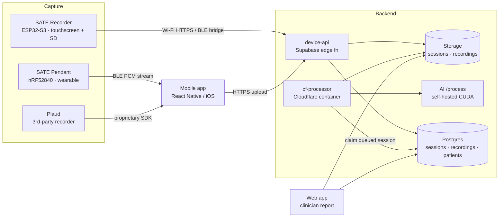

  
  Engineering documentation
  <h1>SATE Companion</h1>
  
A speech-capture and analysis platform for speech-language pathologists — from a handheld recorder and a wearable pendant, through an async AI pipeline, to an interactive clinician report.

  

    <a class="btn-primary" href="/getting-started">Get started</a>
    <a class="btn-secondary" href="/architecture">How it works</a>
  

  Recorder · fw 1.5.18
  Pendant · fw 1.0.0
  device-api · v15
   pipeline: async

SATE Companion captures a patient's speech on a hardware device, uploads the audio to a
backend that transcribes and analyses it with an AI model, and presents the result to the
clinician as an interactive report they can edit and annotate.

This site is the **internal engineering reference**. Every claim is grounded in the source;
each component guide ends with a **Known issues / current status** section drawn from the
2026-07 audit.

## Start here

  <a class="doc-card" href="/getting-started"><strong>Getting started</strong>Toolchain, build, flash, and run each part end-to-end.</a>
  <a class="doc-card" href="/architecture"><strong>Architecture</strong>Data-flow diagrams, transports, and why processing is async.</a>
  <a class="doc-card" href="/known-issues"><strong>Known issues</strong>Current bugs and status from the latest audit.</a>

## Component guides

  <a class="doc-card" href="/guides/recorder"><strong>Recorder firmware</strong>ESP32-S3 handheld — the flagship device.</a>
  <a class="doc-card" href="/guides/pendant"><strong>Pendant firmware</strong>nRF52840 wearable BLE audio streamer.</a>
  <a class="doc-card" href="/guides/mobile-app"><strong>Mobile app</strong>Device bridge, Plaud integration, auto-sync.</a>
  <a class="doc-card" href="/guides/web-app"><strong>Web app</strong>Clinician report, transcript editing, annotations.</a>
  <a class="doc-card" href="/guides/backend"><strong>Backend pipeline</strong>Async AI: assemble → transcribe → analyse → store.</a>
  <a class="doc-card" href="/guides/plaud"><strong>Plaud integration</strong>Third-party recorder — device-lock sensitive.</a>

## The system at a glance

## Components

| Component | Tech | Role | Guide |
|---|---|---|---|
| **SATE Recorder** | ESP32-S3, LVGL, SD_MMC | Handheld recorder: records to SD, uploads over Wi-Fi/BLE, OTA | [Recorder firmware](guides/recorder) |
| **SATE Pendant** | XIAO nRF52840, Bluefruit | Wearable: streams 16 kHz PCM over BLE to the app | [Pendant firmware](guides/pendant) |
| **Mobile app** | React Native / Expo (iOS) | Bridges devices → backend; Plaud integration; auto-sync | [Mobile app](guides/mobile-app) |
| **Web app** | React + Vite + Supabase | Clinician report: audio player, transcript editing, annotations, metrics | [Web app](guides/web-app) |
| **Backend** | Supabase edge fns + Cloudflare container | Async AI pipeline: assemble → transcribe → analyse → store | [Backend pipeline](guides/backend) |
| **Plaud** | proprietary iOS SDK | Third-party recorder integration (device-lock sensitive) | [Plaud integration](guides/plaud) |

## Connection methods (transports)

The system deliberately uses a **different transport per link** — each chosen for the
constraints of the device on either end.

| Link | Transport | Why |
|---|---|---|
| Recorder → backend | **Wi-Fi HTTPS** (chunked upload), **BLE bridge** when offline | The recorder has Wi-Fi; BLE is the fallback when there's no network |
| Pendant → app | **BLE** (244-byte PCM notifies) | Tiny wearable; no Wi-Fi, streams live to the phone |
| Plaud → app | **Proprietary BLE SDK** | Vendor SDK owns its own `CBCentralManager` |
| App → backend | **HTTPS** to `device-api` | Standard authenticated upload |
| Backend AI call | **Long-lived HTTP** from a container (never an edge fn) | The AI call exceeds serverless wall-clock limits |
| Firmware OTA | **HTTPS pull** of a `.bin` from Storage | Device pulls, not pushed |

See [Architecture](architecture) for the full data-flow, and each component guide for the
exact protocols and functions.
