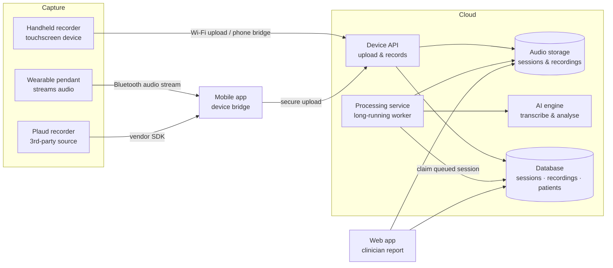

  
  Product & platform overview
  <h1>SATE Companion</h1>
  
A speech-capture and analysis platform for speech-language pathologists — from a handheld recorder and a wearable pendant, through an AI-powered pipeline, to an interactive clinician report.

  

    <a class="btn-primary" href="/getting-started">Get started</a>
    <a class="btn-secondary" href="/architecture">How it works</a>
  

  Handheld recorder
  Wearable pendant
  Mobile & web apps
   pipeline: async AI

SATE Companion captures a patient's speech on a hardware device, uploads the audio to a
cloud backend that transcribes and analyses it with an AI model, and presents the result to
the clinician as an interactive report they can review, edit, and annotate.

This site is a high-level overview of what the platform is, how its pieces fit together, and
how each part behaves. It is written for a general reader — no source code or
implementation internals required.

## Start here

  <a class="doc-card" href="/getting-started"><strong>Getting started</strong>The one core idea, and the fastest reading path for your task.</a>
  <a class="doc-card" href="/architecture"><strong>Architecture</strong>Data-flow diagrams, transports, and why processing is async.</a>
  <a class="doc-card" href="/known-issues"><strong>Known issues</strong>Current limitations and status.</a>

## Component guides

  <a class="doc-card" href="/guides/recorder"><strong>Recorder</strong>The handheld touchscreen device — the flagship capture tool.</a>
  <a class="doc-card" href="/guides/pendant"><strong>Pendant</strong>A small wearable that streams audio to the phone.</a>
  <a class="doc-card" href="/guides/mobile-app"><strong>Mobile app</strong>Bridges the devices to the cloud and keeps them in sync.</a>
  <a class="doc-card" href="/guides/web-app"><strong>Web app</strong>Clinician report: playback, transcript editing, annotations.</a>
  <a class="doc-card" href="/guides/backend"><strong>Backend pipeline</strong>Async AI: assemble, transcribe, analyse, store.</a>
  <a class="doc-card" href="/guides/plaud"><strong>Plaud integration</strong>Support for a third-party recorder as an audio source.</a>

## The system at a glance

## Components

| Component | Platform | Role | Guide |
|---|---|---|---|
| **SATE Recorder** | ESP32-S3 touchscreen handheld | Records to local storage, then uploads over Wi-Fi or via the phone; updates itself over the air | [Recorder](guides/recorder) |
| **SATE Pendant** | nRF52840 wearable | Streams 16 kHz mono audio over Bluetooth to the mobile app | [Pendant](guides/pendant) |
| **Mobile app** | iOS (React Native) | Bridges the devices to the cloud, integrates the Plaud recorder, and syncs automatically | [Mobile app](guides/mobile-app) |
| **Web app** | Browser (React) | Clinician report: audio player, transcript editing, annotations, metrics | [Web app](guides/web-app) |
| **Backend** | Cloud (serverless + container) | Async AI pipeline: assemble, transcribe, analyse, and store | [Backend pipeline](guides/backend) |
| **Plaud** | Third-party recorder | Optional recorder integration as an additional audio source | [Plaud integration](guides/plaud) |

## Connection methods (transports)

The system deliberately uses a **different transport per link** — each chosen for the
constraints of the device on either end.

| Link | Transport | Why |
|---|---|---|
| Recorder → backend | **Wi-Fi** upload, with a **Bluetooth bridge** through the phone when offline | The recorder has its own Wi-Fi; the phone bridge is the fallback when there's no network |
| Pendant → app | **Bluetooth** audio stream | A tiny wearable with no Wi-Fi streams live to the phone |
| Plaud → app | **Vendor Bluetooth SDK** | The third-party recorder connects through its own SDK |
| App → backend | **Secure upload** over the internet | Standard authenticated upload from the phone |
| Backend AI call | **Long-lived request** from a dedicated worker | Transcription can run long, so it lives in a process without a short time limit |
| Firmware updates | **Over-the-air pull** from the cloud | Devices fetch updates themselves rather than being pushed to |

See [Architecture](architecture) for the full data-flow, and each component guide for more
detail on how that part works.
