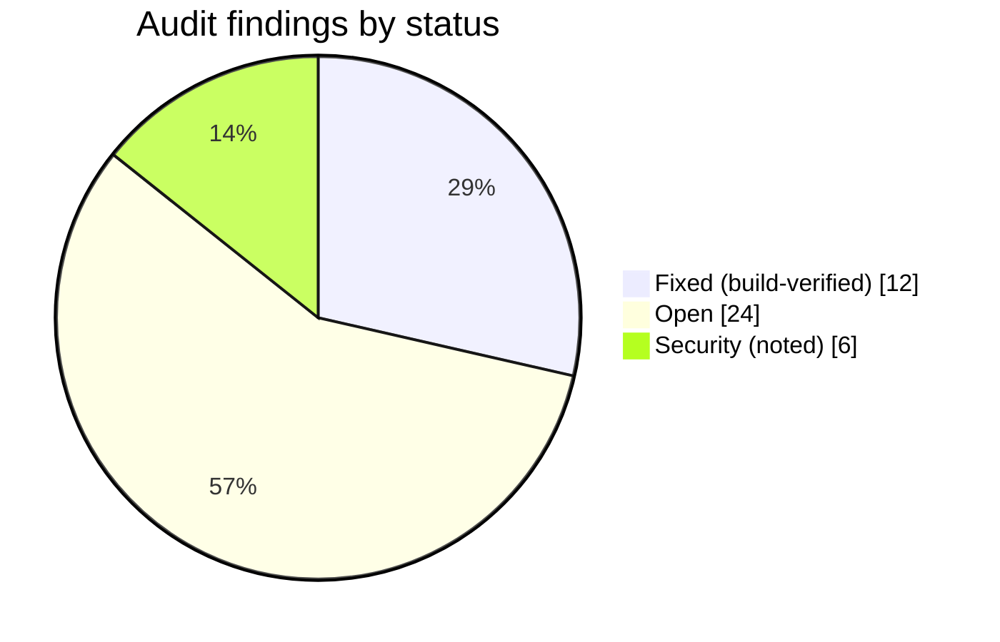

# Known issues & current status

The single cross-system view of what's fixed, open, and noted — consolidated from the
2026-07-22 audit. Each component guide repeats the items relevant to it.

audit 2026-07-22
12 fixed
24 open
6 security

Consolidated from the **2026-07-22 audit** (18 agents, two waves + three
critical-focused passes, ~110 findings).

**Legend** — fixed this session (build-verified) · open · security (real, but deprioritised behind features per the team's call).

## Data-integrity red flags (highest priority)

These can lose or mismatch a patient's recording — the worst outcomes.

:::tip Recorder firmware — 55 audited defects fixed in fw 1.5.20 (2026-07-23)
An 84-agent adversarial audit of the recorder firmware found 55 confirmed defects
(12 critical); all are fixed in **fw 1.5.20**, re-verified (56 verdicts, 0 still-broken),
compiles clean. Highlights: **sessions no longer renumber** (monotonic, wrap at 99 — this
removed the whole renumber-during-delete critical cluster); **keep-newest-5 / mark-synced
audited end to end** (an unsynced take is never freed; a synced one only after server
byte-verification); OTA rollback restored + err-get-1 fixed; crash-resume no longer strands
resumed minutes; on-device error messages made visible (they rendered to labels that were
never created); dead-mic silence detection; every `millis()` deadline made wrap-safe; the
BLE bridge can finally stream a recording; `esp_reset_reason()` on boot + heartbeat + a
serial `DIAG` dump; ~26.7 KB moved to PSRAM (internal RAM 31%→24%). **On-hardware `sate ci`
gate pending a USB replug.**
:::

| Status | Issue | Where |
|---|---|---|
| fixed | Delete-during-upload could splice **two takes into one WAV** (3 s guard vs 60 s chunk) — now waits for the upload + trim tail | `SATE_Recorder.ino`, `connectivity.cpp` |
| fixed | Reboot mid-renumber left a **numbering hole → later takes invisible forever** — now NVS-journaled + healed on boot | `SATE_Recorder.ino` (`recoverInterruptedDelete`) |
| fixed | Recorder didn't **auto-resume after reboot** (60 s flush window) — now ~5 s flush + restart-empty-`part00` | `SATE_Recorder.ino` (`maybeResumeRecording`) |
| fixed | A **server-started take that was interrupted ended early** — only button takes were marked crash-resumable, so a brownout mid-take silently truncated an app-started recording (fw 1.5.16) | `SATE_Recorder.ino` (`recCrashMark`) |
| fixed | Resuming from `setup()` **took the whole device off the air**: the capture blocks until Stop, so the network task never started — no heartbeat, no remote stop, no serial, unstoppable except at the button (fw 1.5.17) | `SATE_Recorder.ino` (`setup`/`loop`) |
| fixed | A remote **`stop` arriving during a take's start sequence was swallowed** — a resumed take hit that window every time and ran on unbounded (observed 4.5 min / 8.6 MB) (fw 1.5.18) | `SATE_Recorder.ino` (`sateHookStop`, `recTakeArmed`) |
| fixed | Uploader freed SD audio on a `.synced` marker alone — now **server byte-verified** before free | `connectivity.cpp` (`verifySessionStored`) + `device-api` `/sessions/verify` |
| fixed | BLE session pull could **upload a truncated WAV** as complete — now byte-reconciled | `src/ble/SateBle.ts` |
| fixed | Duplicate sessions + duplicate AI runs on a lost `markSynced` ACK — server **dedup probe** added | `device-api` `storeSessionRecord` |
| fixed | Pendant take **contaminated by the previous take** — buffers reset on `start()`/`disconnect()` | `src/pendant/PendantLink.ts` |
| open | Pendant `takeWav()` **clears the buffer before upload succeeds** → failed upload loses the take | `src/pendant/PendantLink.ts` |
| open | Pendant capture is **memory-only** → app kill/crash mid-record loses everything | `src/pendant/PendantLink.ts` |
| open | Stalled-but-loud pendant stream **naps and wipes its ring** → the "audio stuck" symptom | `SATE_Pendant.ino` |

## Recorder

| Status | Issue | Where |
|---|---|---|
| fixed | **Deployed `device-api` was behind the repo** and had no `/sessions/verify`, so every verified-trim probe 401'd and the device never reclaimed SD — deploying v15 fixed it instantly. Deploy state is not visible from the code: check it, don't assume | `device-api` (deployment) |
| fixed | A server-started take **could not be stopped remotely** — `REMOTE_RECORD_SECONDS` was declared but never used, so a remote take ran to the ~62-min ceiling (fw 1.5.15) | `SATE_Recorder.ino`, `connectivity.cpp` |
| note | On the debug (USB-CDC) build a **serial DTR/RTS reset cannot reboot a recording device** — the CDC reset is handled in software and the capture loop never services USB. Use the remote `reboot` command. Flashing is unaffected (esptool resets through the USB-Serial-JTAG hardware) | `hwtest/hwtest/context.py` |
| open | **The board's USB-CDC occasionally wedges** after bench runs, in two flavors: (a) it stops enumerating entirely (no `/dev/cu.usbmodem*`), or (b) the port stays enumerated but goes **silent** — no output ever arrives, while the device itself keeps working over Wi-Fi (commands, uploads, heartbeat all fine). Only a physical unplug/replug restores the log view. `sate ci` now pre-checks serial liveness and aborts with a replug instruction instead of failing scenarios misleadingly. Root cause not established | `SATE_Recorder.ino` / USB-CDC |
| open | **Orphaned `_tmp` chunk parts are never cleaned** — a 31.77 MB parts dir from a long-dead upload sits in the `device-sessions` bucket (only a final-stitch or an offset-0 restart of the same path removes parts). Costs storage and used to fake "uploading" until the v16 endpoint grew a 10-min activity filter. Needs a TTL sweep | `device-api` `/sessions/chunk` |
| fixed | **cf-processor could wedge forever on a dead-but-connected AI service** — the AI call had no read timeout (deliberate for long takes), so an accepted-then-silent connection blocked the single worker permanently; the 45-min watchdog requeued the *job* but no worker was free to claim it. Now bounded: AI read ceiling 1 h (`AI_READ_TIMEOUT_S`), storage download/upload 15 min. Container redeploy pending | `cf-processor/app/processor.py` |
| open | **OTA has no device-side rollback** — a bad image bricks the fleet (server magic/semver/size validation added) | `connectivity.cpp` (`verifyOta` not overridden) |
| open | `renameSessionFiles` ignores `SD_MMC.rename()` returns → new number + old audio on a glitch | `SATE_Recorder.ino` |
| open | `saveMetadataToSd()` return ignored → flags + patient tag silently lost on a full card | `SATE_Recorder.ino` |
| open | BLE `notifyFramed` drops a packet after 50 retries → short WAV accepted as complete | `connectivity.cpp` |
| open | Flag markers truncated to ~37 in `flagsCsv[300]` → device/server count mismatch | `connectivity.cpp` |
| open | `pendDirty` lost-update → a renumbered pending take stranded until an unrelated event | `connectivity.cpp` |
| open | Several `millis()`-wrap-unsafe deadlines (~49.7-day uptime) | `connectivity.cpp`, `SATE_Recorder.ino` |
| low | Roster-full active-patient push overwrites a slot — **low** priority (standalone recording doesn't assign patients) | `SATE_Recorder.ino` |

## Pendant

| Status | Issue | Where |
|---|---|---|
| open | No `onDisconnected` handler → a dead link looks like a normal nap (UI still says recording) | `src/pendant/PendantLink.ts` |
| open | Overrun guard keeps the **oldest** audio → stale burst on link recovery | `SATE_Pendant.ino` |
| open | Firmware + app stack **two tanh soft-clips** (effective gain 104× not 40×) → harsh distortion | `src/pendant/PendantLink.ts` |
| open | ~128 ms of every recording's onset dropped by a fixed "drain" read | `SATE_Recorder.ino` (I2S drain) |

## Web app — deep audit 2026-07-23 (41 confirmed, 52-agent adversarial pass)

The five clusters that can lose or mismatch clinical data, ranked:

| Status | Issue | Where |
|---|---|---|
| open | **SALT round-trip fabricates word timings and corrupts words.** Any simple-mode or inline edit regenerates ALL word timestamps as an even spread (real ASR timings destroyed, unrecoverable after save), corrupts inflected surface forms (`boxes→boxs`, `running→runing`), applies morphemes to the wrong word via a misaligned index, and silently wipes fillerword / mispronunciation / morpheme-omission annotations — even when the text was not changed | `saltService.ts` (44, 230, 699), `useSegmentOperations.ts:110`, `EditTranscriptPopup.tsx:227` |
| open | **Stale `window.latestProcessingResults` saves the WRONG transcript onto a new recording** — found independently by three finders; the PatientDetails save flow never clears it, so the mismatch is the *default* after the first save | `useRecordingMetadata.ts:141`, `PatientDetails/index.tsx:164` |
| open | **Failed save disarms every unsaved-changes guard.** The Save button clears undo history even when the save failed (errors are caught and toast-only), so `beforeunload`, back-confirmation, and sidebar navigation all report "no unsaved changes" — edits silently lost | `ActionButtonsPanel.tsx:80`, `MainApp.tsx:237` |
| open | **Global Ctrl+Z fires under open editors** — undo shifts segment indices beneath the popup, whose save then overwrites a *different* utterance | `MainContent/index.tsx:101` |
| open | **Wrong audio under the transcript**: previous recording's audio is kept when the new report's URL fails; signed URLs expire after 1 h with no refresh (player wedges); annotation add/remove mutates shared segments so Cancel discards them without warning; split filters morpheme omissions on the wrong key (`word_index` vs `index`) | `MainApp.tsx:136`, `recordingStorage.ts:86`, `useAnnotations.ts:493`, `segmentOperations.ts:77` |

Also confirmed at high severity: the OTA banner wedges forever in "Rebooting" (offline check
shadows the failure timeout, `DeviceProvider.tsx:368`), and a failed processing run leaves
Save a silent no-op forever (stale-closure gate, `useFileUpload.ts:143`).

**23 medium findings** cover: split/merge double-counting or dropping annotation spans,
pause arrays never re-indexed, VOCD-D computed over maze/filler words (deflates D for
disfluent speakers), utterance segmentation splitting on `.` inside `Mr.`/`2.5` (deflates
MLU), SALT export speaker-label collisions (`C` = both Child and Clinician), stale
cross-account device/subscription state after logout, duplicate Stripe subscriptions on
plan change, `past_due` subscribers shown as unsubscribed, invite codes reusable on a
swallowed consumption failure, and delete removing audio *before* the DB row (a failure
strands a live row pointing at destroyed audio). Full list in the audit run
(`webapp-audit`, 2026-07-23).

## Web app

| Status | Issue | Where |
|---|---|---|
| fixed | **Annotations couldn't be clicked** (popup off-screen behind an invisible backdrop) — now `position: fixed` | `Annotations/AnnotationPopup.tsx` |
| fixed | First **Undo wiped the transcript** (history seeded from empty) — now guarded re-seed | `hooks/useUndoRedo.ts` |
| open | Inline SALT edit **zeroes filler / mispronunciation / morpheme-omission** counts | `ConversationView/hooks/useSegmentOperations.ts` |
| open | SALT round-trip **swaps repetitions ↔ revisions**; split/merge desyncs `word.index` → inflated NDW/MLU | `services/saltService.ts`, `utils/segmentOperations.ts` |
| open | Stale fetch **overwrites the current patient's PHI** on fast switch | `CRM/PatientDetails/hooks/usePatientData.ts` |
| open | `errorRate` counts correct morphemes + pauses as errors; examiner-speaker pooling | `services/DataService/speechAnalysis.ts` |
| open | Billing page shows a **fabricated** next-billing/cancellation date | `Stripe/BillingPage.tsx` |

## Backend

| Status | Issue | Where |
|---|---|---|
| open | `process-device-session` **repo copy is NOT the deployed no-op** — if deployed it races the container → duplicate recordings | `supabase/functions/process-device-session/index.ts` |
| open | No **DB unique constraint** backstops duplicate sessions (only the app-side probe) | `cloudflare/schema.sql` |
| open | `deleteRecording` orphans the device session and can leak the audio object | `DataService/recordingStorage.ts` |
| open | Cloudflare port is a regression (no state machine, sync-AI in a Worker) | `cloudflare/src/functions/processDeviceSession.ts` |

## Security (noted, deprioritised behind features)

| Status | Issue | Where |
|---|---|---|
| security | `POST /firmware` is **above** the `/admin` gate → any authenticated user can publish fleet firmware (image validation added; `isAdmin` gate still needed) | `device-api/index.ts` |
| security | Device key is **derivable** from the serial (`key-dev-<serial>`) → roster read + audio injection | `device-api/index.ts` |
| security | Device **heartbeat has no key validation** → any `key-` string harvests active-patient PHI | `device-api/index.ts` |
| security | `.env` with a live `service_role` key is not git-ignored | repo root |
| security | Access + 30-day refresh tokens in plaintext AsyncStorage, not Keychain | `src/store.tsx` |
| security | `invite_codes` SELECT policy is cross-tenant readable | `cloudflare/src/policy.ts` |

## Refuted (verified false positives)

The adversarial pass **cleared** two claims — kept here so they aren't re-raised:

- **Record-begin FATFS race** — a fresh session file, no renumber, and the FATFS
  per-volume lock serialise the access; the delete-path quiesce exists specifically
  because delete renumbers, which record does not.
- **cf-processor watchdog requeuing a running take** — the heartbeat guard exists,
  so an actively-processing job is not reclaimed.
