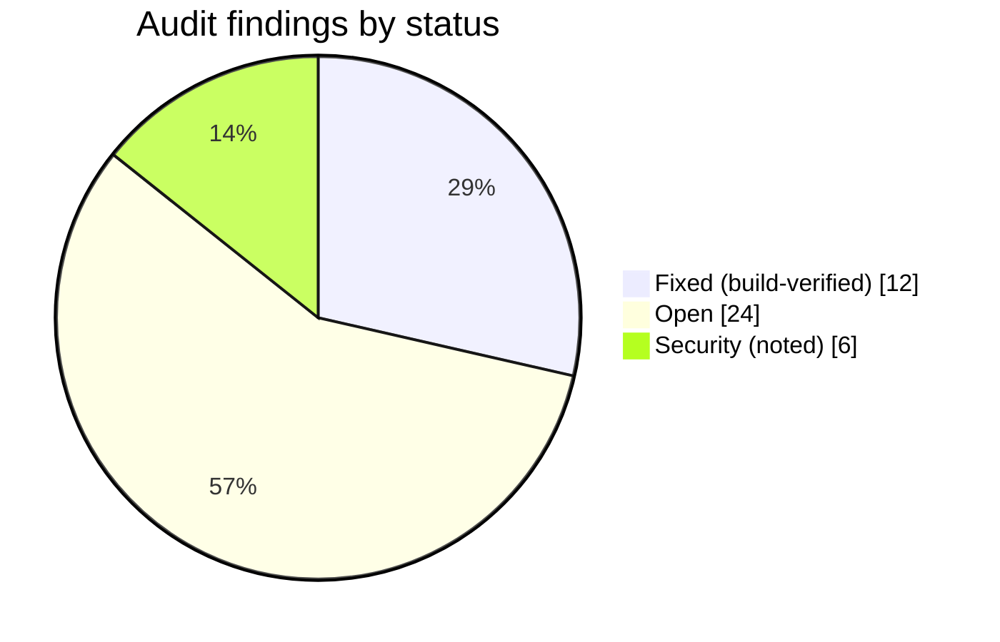

# Known issues & current status

The single cross-system view of what's fixed, open, and noted — consolidated from the
2026-07-22 audit. Each component guide repeats the items relevant to it.

audit 2026-07-22
12 fixed
24 open
6 security

Consolidated from the **2026-07-22 audit** (18 agents, two waves + three
critical-focused passes, ~110 findings).

**Legend** — fixed this session (build-verified) · open · security (real, but deprioritised behind features per the team's call).

## Data-integrity red flags (highest priority)

These can lose or mismatch a patient's recording — the worst outcomes.

| Status | Issue | Where |
|---|---|---|
| fixed | Delete-during-upload could splice **two takes into one WAV** (3 s guard vs 60 s chunk) — now waits for the upload + trim tail | `SATE_Recorder.ino`, `connectivity.cpp` |
| fixed | Reboot mid-renumber left a **numbering hole → later takes invisible forever** — now NVS-journaled + healed on boot | `SATE_Recorder.ino` (`recoverInterruptedDelete`) |
| fixed | Recorder didn't **auto-resume after reboot** (60 s flush window) — now ~5 s flush + restart-empty-`part00` | `SATE_Recorder.ino` (`maybeResumeRecording`) |
| fixed | Uploader freed SD audio on a `.synced` marker alone — now **server byte-verified** before free | `connectivity.cpp` (`verifySessionStored`) + `device-api` `/sessions/verify` |
| fixed | BLE session pull could **upload a truncated WAV** as complete — now byte-reconciled | `src/ble/SateBle.ts` |
| fixed | Duplicate sessions + duplicate AI runs on a lost `markSynced` ACK — server **dedup probe** added | `device-api` `storeSessionRecord` |
| fixed | Pendant take **contaminated by the previous take** — buffers reset on `start()`/`disconnect()` | `src/pendant/PendantLink.ts` |
| open | Pendant `takeWav()` **clears the buffer before upload succeeds** → failed upload loses the take | `src/pendant/PendantLink.ts` |
| open | Pendant capture is **memory-only** → app kill/crash mid-record loses everything | `src/pendant/PendantLink.ts` |
| open | Stalled-but-loud pendant stream **naps and wipes its ring** → the "audio stuck" symptom | `SATE_Pendant.ino` |

## Recorder

| Status | Issue | Where |
|---|---|---|
| open | **OTA has no device-side rollback** — a bad image bricks the fleet (server magic/semver/size validation added) | `connectivity.cpp` (`verifyOta` not overridden) |
| open | `renameSessionFiles` ignores `SD_MMC.rename()` returns → new number + old audio on a glitch | `SATE_Recorder.ino` |
| open | `saveMetadataToSd()` return ignored → flags + patient tag silently lost on a full card | `SATE_Recorder.ino` |
| open | BLE `notifyFramed` drops a packet after 50 retries → short WAV accepted as complete | `connectivity.cpp` |
| open | Flag markers truncated to ~37 in `flagsCsv[300]` → device/server count mismatch | `connectivity.cpp` |
| open | `pendDirty` lost-update → a renumbered pending take stranded until an unrelated event | `connectivity.cpp` |
| open | Several `millis()`-wrap-unsafe deadlines (~49.7-day uptime) | `connectivity.cpp`, `SATE_Recorder.ino` |
| low | Roster-full active-patient push overwrites a slot — **low** priority (standalone recording doesn't assign patients) | `SATE_Recorder.ino` |

## Pendant

| Status | Issue | Where |
|---|---|---|
| open | No `onDisconnected` handler → a dead link looks like a normal nap (UI still says recording) | `src/pendant/PendantLink.ts` |
| open | Overrun guard keeps the **oldest** audio → stale burst on link recovery | `SATE_Pendant.ino` |
| open | Firmware + app stack **two tanh soft-clips** (effective gain 104× not 40×) → harsh distortion | `src/pendant/PendantLink.ts` |
| open | ~128 ms of every recording's onset dropped by a fixed "drain" read | `SATE_Recorder.ino` (I2S drain) |

## Web app

| Status | Issue | Where |
|---|---|---|
| fixed | **Annotations couldn't be clicked** (popup off-screen behind an invisible backdrop) — now `position: fixed` | `Annotations/AnnotationPopup.tsx` |
| fixed | First **Undo wiped the transcript** (history seeded from empty) — now guarded re-seed | `hooks/useUndoRedo.ts` |
| open | Inline SALT edit **zeroes filler / mispronunciation / morpheme-omission** counts | `ConversationView/hooks/useSegmentOperations.ts` |
| open | SALT round-trip **swaps repetitions ↔ revisions**; split/merge desyncs `word.index` → inflated NDW/MLU | `services/saltService.ts`, `utils/segmentOperations.ts` |
| open | Stale fetch **overwrites the current patient's PHI** on fast switch | `CRM/PatientDetails/hooks/usePatientData.ts` |
| open | `errorRate` counts correct morphemes + pauses as errors; examiner-speaker pooling | `services/DataService/speechAnalysis.ts` |
| open | Billing page shows a **fabricated** next-billing/cancellation date | `Stripe/BillingPage.tsx` |

## Backend

| Status | Issue | Where |
|---|---|---|
| open | `process-device-session` **repo copy is NOT the deployed no-op** — if deployed it races the container → duplicate recordings | `supabase/functions/process-device-session/index.ts` |
| open | No **DB unique constraint** backstops duplicate sessions (only the app-side probe) | `cloudflare/schema.sql` |
| open | `deleteRecording` orphans the device session and can leak the audio object | `DataService/recordingStorage.ts` |
| open | Cloudflare port is a regression (no state machine, sync-AI in a Worker) | `cloudflare/src/functions/processDeviceSession.ts` |

## Security (noted, deprioritised behind features)

| Status | Issue | Where |
|---|---|---|
| security | `POST /firmware` is **above** the `/admin` gate → any authenticated user can publish fleet firmware (image validation added; `isAdmin` gate still needed) | `device-api/index.ts` |
| security | Device key is **derivable** from the serial (`key-dev-<serial>`) → roster read + audio injection | `device-api/index.ts` |
| security | Device **heartbeat has no key validation** → any `key-` string harvests active-patient PHI | `device-api/index.ts` |
| security | `.env` with a live `service_role` key is not git-ignored | repo root |
| security | Access + 30-day refresh tokens in plaintext AsyncStorage, not Keychain | `src/store.tsx` |
| security | `invite_codes` SELECT policy is cross-tenant readable | `cloudflare/src/policy.ts` |

## Refuted (verified false positives)

The adversarial pass **cleared** two claims — kept here so they aren't re-raised:

- **Record-begin FATFS race** — a fresh session file, no renumber, and the FATFS
  per-volume lock serialise the access; the delete-path quiesce exists specifically
  because delete renumbers, which record does not.
- **cf-processor watchdog requeuing a running take** — the heartbeat guard exists,
  so an actively-processing job is not reclaimed.
