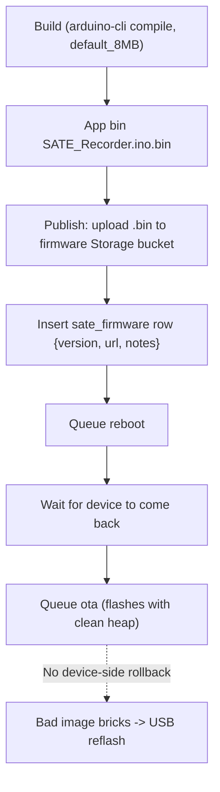

# Building & publishing a firmware release

The recorder OTA-updates itself by pulling a `.bin` from a public Storage bucket.
Publishing = upload the app bin + insert a `sate_firmware` row.

<div class="badge-row">
<span class="sate-badge">OTA</span>
<span class="sate-badge">default_8MB dual-slot</span>
<span class="sate-badge bad">no device-side rollback</span>
</div>



:::danger
OTA has **no device-side rollback** — a well-formed-but-bad image is committed and
never reverts. Always test on real hardware before publishing (see step 3 below).
:::

## 1. Build

Bump `FIRMWARE_VERSION` in `SATE_Recorder/SATE_Recorder.ino`, then compile with the
**mandatory** flash config:

```bash
arduino-cli compile --fqbn "esp32:esp32:esp32s3:FlashSize=16M,PartitionScheme=default_8MB,PSRAM=opi" SATE_Recorder
```

:::danger Partition scheme
`PartitionScheme` MUST be `default_8MB` (two OTA slots `ota_0`+`ota_1`). **Never
`huge_app`** — it's a single slot; flashing it silently kills OTA (the device still
records/registers but can't self-update).
:::

The **OTA image is the app bin** (`SATE_Recorder.ino.bin`, ~1.7 MB) — **not**
`.ino.merged.bin` (the full 8 MB image, USB-flash only).

<div class="spec-grid">
<div class="spec-tile"><div class="k">Flash size</div><div class="v">16M</div></div>
<div class="spec-tile"><div class="k">Partition</div><div class="v">default_8MB</div></div>
<div class="spec-tile"><div class="k">OTA slots</div><div class="v">ota_0 + ota_1</div></div>
<div class="spec-tile"><div class="k">PSRAM</div><div class="v">opi</div></div>
<div class="spec-tile"><div class="k">OTA image</div><div class="v">~1.7 MB app bin</div></div>
</div>

## 2. Publish

Upload the app bin to the public `firmware` bucket at `sate_<version>.bin`
(`upsert`, `application/octet-stream`), then insert a `sate_firmware` row
`{version, url, notes}` where `url` is the bucket's public URL. `getLatestFirmware`
orders by `created_at`, so the newest row wins.

Two ways:
- **Web card** (`/admin` → "Publish firmware") — uses the admin's browser session.
- **Direct** — `curl` upload + a `sate_firmware` insert (via the Supabase MCP
  `execute_sql`). Then verify the public URL returns 200 and its SHA-256 matches the
  local bin.

:::warning Publish validation & the admin-gate gap
`publishFirmware` now validates the version is plain semver and the image is a real
ESP32 app bin (`0xE9` magic, ≤4 MB). **But** the `POST /firmware` route is still
registered above the `/admin` gate — any authenticated user can publish fleet
firmware. Add an `isAdmin()` gate before GA. See [Known issues](../known-issues).
:::

## 3. OTA a device

Queueing OTA to a device with an upload backlog fails `err-get-1` (a fragmented heap
can't get the ~40 KB for the 2nd TLS handshake). The recipe is: queue **`reboot`**,
wait for it to come back, **then** queue **`ota`** — the first poll after boot
flashes with a clean heap.

:::danger No device-side rollback (open)
The firmware doesn't override `verifyOta()`, so the Arduino core marks a new image
valid in early init **before** `setup()` runs. A well-formed-but-bad image (wrong
build, the `LV_TICK_CUSTOM=0` trap, `huge_app`) is committed and **never rolls back**
→ brick requiring USB reflash. Test every image on real hardware
([Hardware testing](hardware-testing)) before publishing.
:::

## The CI gate — mandatory for every version

**Every recorder firmware version must pass `sate ci` before it is released.** This
is the standard test, not an optional extra — it is the release criterion.

```bash
sate ci               # build + flash the working tree (debug), run the standard suite
sate ci --no-flash    # gate whatever is already on the board
```

One command runs the whole gate on a real recorder:

1. Reads `FIRMWARE_VERSION` from the source — the version being gated.
2. Compiles and flashes the **debug** (USB-CDC) build, because the harness asserts
   on the firmware's own serial log.
3. Runs the standard hands-off scenarios — `boot_health`, `reboot_resume`,
   `byte_match`, `verified_trim`, `unsynced_kept`, `reclaim_idle`,
   `standalone_default` — driving the device with remote
   `record` / `stop` / `reboot`, so nobody has to be at the bench.
4. Writes a durable report to `hwtest/ci-reports/fw-<version>_<stamp>.json` and
   exits non-zero on any FAIL/ERROR, so it drops into scripts and release checklists.

The gate refuses to run against the protected in-use unit. It needs the board on
USB, the device on Wi-Fi, and the account in `hwtest/config.toml` (see
[Hardware testing](hardware-testing) for what each scenario checks and why these
four catch the classes a compile can't: reboot-mid-record, swallowed stops,
byte mismatches, unverified SD frees).

The two delete scenarios (`delete_journal`, `delete_during_upload`) stay outside the
gate because they need a human tap on the Sessions screen — run them from the
desktop Debugger before a release that touches delete/renumber code.

:::danger Regression rule — every new feature
Any change — firmware, harness, backend — re-runs the standard suite **before it
merges**, not just before a release. `sate ci` *is* the regression suite: the
1.5.16 → 1.5.18 chain is the proof, where each fix exposed the next latent bug
(resume blocked the network; then the stop was swallowed) and only re-running the
full suite after every change caught them. Feature touches the backend too? Add
`sate e2e`. Something looks down? `sate infra` first.
:::
