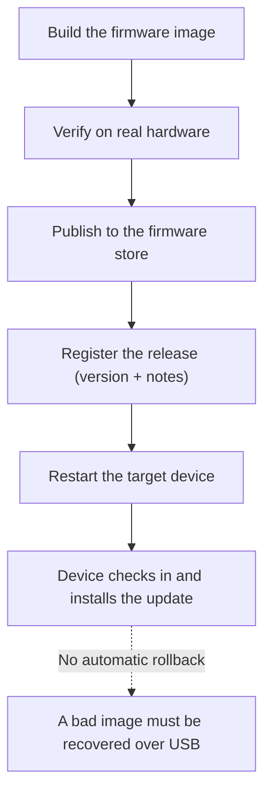

# Building & publishing a firmware release

The recorder keeps itself up to date over the air. Each release is packaged as a
firmware image, published to a public storage location, and offered to devices in the
field, which download and install it on their next check-in — no cable, no visit.

Over-the-air updates
Dual-slot install
No automatic rollback

:::danger[No automatic rollback]
An update, once installed, stays installed — the device does not fall back to the
previous image on its own. A bad build has to be recovered by reflashing over USB.
Always validate a release on real hardware before publishing it.
:::

## 1. Build

Each release carries a version number that the device reports back and that drives the
"update available" banner, so every release starts by bumping that version. The image
is then compiled for the recorder's hardware target.

The recorder is built around an **ESP32-S3** with **16 MB of flash** and **8 MB of
PSRAM**, and the flash is laid out with **two application slots**. That dual-slot
layout is what makes over-the-air updating possible: the new image lands in the
inactive slot while the current one keeps running, and the device switches over only
once the download is complete.

Platform

ESP32-S3

Flash

16 MB

PSRAM

8 MB

Layout

Dual app slot

OTA image

~1.7 MB app

:::note[Two kinds of image]
The over-the-air update is the compact **application image** (~1.7 MB) — just the code
that changes between releases. The full factory image, used only for the very first
flash of a brand-new board over USB, is much larger and is not what gets published.
:::

## 2. Publish

Publishing a release is two steps: upload the application image to the public firmware
store, and register a release record that names the version, points to the image, and
carries release notes. Devices always pick up the **most recently registered** release,
so publishing a newer version is what rolls it out to the fleet.

There are two ways to publish:

- **Admin console** — the web admin area has a "Publish firmware" action that handles
  the upload and registration in one step, using the signed-in administrator's session.
- **Direct** — upload the image and add the release record programmatically, then
  confirm the published image is reachable and matches the local build byte-for-byte.

:::warning[Publishing is an administrator action]
Publishing pushes firmware to every device in the fleet, so it is meant to be
restricted to administrators. Treat access to the publish path as privileged and keep
it behind the admin gate.
:::

## 3. Update a device

The safe way to update a device that has a backlog of work is to **restart it first,
wait for it to come back online, and only then trigger the update**. A freshly
rebooted device has the clean working memory it needs to complete the secure download,
whereas a busy device with a large backlog can run short and fail the download.

:::danger[Validate before you publish]
Because there is no automatic rollback, a well-formed but wrong or broken image will be
committed and will not revert — leaving the device recoverable only by reflashing over
USB. Test every image on real hardware before publishing. See
[Hardware testing](hardware-testing).
:::

## The release gate — mandatory for every version

**Every recorder firmware version must pass the automated hardware test gate before it
is released.** This is the standard release criterion, not an optional extra.

The gate runs the whole test suite against a **real recorder**, hands-off, from a single
command. In one pass it:

1. Identifies the version being tested.
2. Builds and installs a debug build so the harness can follow the device's own logs.
3. Drives the device through a set of realistic scenarios — booting cleanly, resuming a
   recording after a reboot, matching stored bytes exactly, verifying reclaimed storage,
   keeping unsynced audio, and defaulting to standalone recording — by issuing remote
   record, stop, and reboot commands, so nobody has to sit at the bench.
4. Writes a durable pass/fail report and fails loudly on any problem, so it fits neatly
   into release checklists.

A small number of scenarios that require a physical tap on the device — the delete
flows — sit outside the automated gate and are run by hand before any release that
touches deletion behavior.

:::danger[Regression rule — every change]
Any change — firmware, test harness, or backend — re-runs the standard suite **before
it merges**, not just before a release. The suite *is* the regression net: on more than
one occasion a fix has exposed the next hidden problem, and only re-running the full
suite after every change caught it. When a change also touches the backend, run the
end-to-end suite as well.
:::
