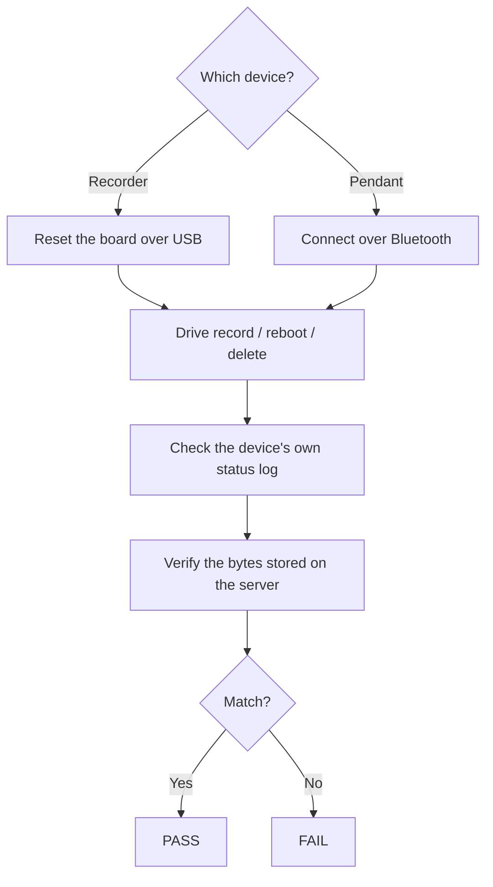

# Hardware-in-the-loop testing

Before every firmware release, SATE runs a purpose-built test harness against a
**real device** — because the bugs that matter most here are the ones a compiler can
never catch. They only appear on real timing and real silicon: a reboot in the middle
of a recording, a truncated wireless stream, a delete that overlaps an upload, freeing
storage before the cloud has confirmed it, or a firmware update gone wrong. The harness
drives an actual recorder or pendant and checks two sources of truth at once: what the
device reports about itself, and the audio the server actually stored.

<div class="badge-row">
<span class="sate-badge">Real-device scenarios</span>
<span class="sate-badge">USB serial + Bluetooth</span>
<span class="sate-badge">Pass / fail gate</span>
<span class="sate-badge">Single CLI</span>
</div>

:::tip[One command drives everything]
The whole workflow — running the test suite, flashing firmware, and diagnosing hardware
faults — sits behind a single professional command-line tool. From one CLI an operator
can run the recorder suite, run the pendant suite over Bluetooth, flash a fresh or an
older published firmware build, list connected devices, diagnose a misbehaving board,
and launch deeper end-to-end and live-pipeline views.

The same tool provides the **release gate**: the standard suite every firmware version
must pass before it ships. See
[Firmware release](firmware-release#the-release-gate--mandatory-for-every-version).
:::



## What it checks

The suite is a set of focused scenarios, each guarding a specific failure mode that has
either bitten the product before or would be catastrophic if it did. Recorder scenarios
cover the audio-integrity guarantees; pendant scenarios cover the wearable's Bluetooth
behavior.

| Scenario | What it guards | Device |
|---|---|---|
| Boot health | Boots cleanly with no crash or hang | Recorder |
| Reboot resume | A recording interrupted by a reboot resumes on its own, and stays remotely controllable meanwhile | Recorder |
| Byte match | The audio stored on the server exactly equals what the device sent | Recorder |
| Verified trim | On-device audio is freed only after the server confirms it is safely stored | Recorder |
| Unsynced kept | A recording the server has not confirmed is never freed, at any age | Recorder |
| Idle reclaim | Older confirmed recordings are actually reclaimed while the device sits idle | Recorder |
| Standalone default | Recordings default to standalone and are not silently reassigned | Recorder |
| Delete recovery | A delete interrupted by a reboot heals cleanly, with no orphaned or hidden recordings | Recorder |
| Delete during upload | Deleting while an upload runs never splices two recordings together | Recorder |
| Pendant advertise | The pendant is discoverable and connects | Pendant |
| Pendant stream | Audio streams near-live with no dropout or stall | Pendant |
| Pendant stop | The pendant cleanly reports when a capture stops | Pendant |
| Pendant battery | Battery reads within a sane range with a correct charging state | Pendant |
| Pendant find-me | The find-me feature flashes the pendant's LEDs | Pendant |

## How the harness drives the device

Most recorder scenarios run **hands-off**: the harness starts, stops, and reboots the
device remotely over the network, signed in as a real clinician account, so a full run
needs nobody at the bench. Only the delete scenarios still ask for a human touch, because
deleting a recording is an on-device screen action with no remote equivalent.

Remote control covers the core actions a test needs — start a recording, stop it, reboot
mid-capture, and trigger the upload-and-verify cycle.

:::danger[A USB reset cannot reboot a recording device]
On the debug build the USB serial link's reset signal is handled in software, and the
recording loop never services it — so a reset pulse is simply ignored while the device is
capturing. To interrupt a recording mid-capture, the harness uses the **remote reboot
command**, which runs on the networking task that keeps ticking throughout a recording.

Flashing is unaffected: the flashing tool resets the board through a dedicated hardware
path that works even when the firmware is otherwise wedged.
:::

## Two transports

- **Recorder** — tested over **USB plus the network**. The harness resets the board over
  USB, drives record / reboot / delete, reads the device's own status log, and confirms
  the stored audio by asking the backend to verify it byte-for-byte.
- **Pendant** — tested over **Bluetooth**, with the test machine standing in for the
  mobile app: it connects, sends the capture commands, and measures the incoming audio
  stream and battery telemetry.

## What has to be connected

Every recorder scenario reads the device's **own status log**, so the board must be
connected over **USB** — that is the only way the harness sees the device's boot,
resume, and upload messages. Commands go out over Wi-Fi, but the evidence comes back over
the wire.

| What you want to run | USB cable | On Wi-Fi | Signed-in account |
|---|---|---|---|
| Harness self-test (no board) | no | no | no |
| Recorder scenarios | **yes** | **yes** | **yes** |
| Screen mirror / screenshot | **yes** | no | no |
| Remote control on its own | no | **yes** | **yes** |
| Flashing | **yes** | no | no |
| Pendant scenarios | no (Bluetooth) | no | no |

## The desktop debugger

Alongside the command-line runner, a **native desktop app** supports hands-on bench work.
It opens on a login page — everything after it uses a real clinician session, exactly the
way the mobile app does — and then mirrors the device screen live with the controls
beside it:

| Section | What it does |
|---|---|
| **Device** | Connect and provision (with Wi-Fi scan so you only type the password), diagnose, watch live status, and unlink & reset — the same flow the mobile app uses, so the full first-time setup path can be re-run from scratch |
| **Test recording** | Run the hands-off suite, or tick individual scenarios and run just those; open the live pipeline view; capture a screenshot |
| **Remote control** | Record, stop, reboot, and trigger sync |
| **Tools** | Reboot over Bluetooth, move the device to a different Wi-Fi network |
| **Firmware** | Flash the debug build, flash the production build, or flash an older published version |

Scenarios that need a human are clearly labelled in the list, so an unattended run can be
selected at a glance. The app reports a pass/fail result and a non-zero exit on any
failure, so it can also serve as a pre-flash gate.

## Beyond the device — the whole system

The scenario suite proves the device half of the story. A few deeper tools follow the
audio all the way through the backend, so a stuck pipeline can be diagnosed end to end.

### One recording through the entire system

This test records for a few seconds, stops, then follows that exact recording hop by hop:
the recorder uploads it, the backend stores it and verifies the bytes, the queue picks it
up, the container processor claims it, the AI service transcribes it, and the result is
finalized. It reads the same data the web app reads, so it needs no USB cable — only the
account and a device on Wi-Fi. It prints per-stage timings and passes only when the audio
genuinely reaches the finished state.

```
[   2.1s] record   remote RECORD queued
[  18.3s] upload   remote STOP queued — device finalizes + uploads
[  28.0s] stored   session stored + byte-verified
[  28.7s] done     finalize complete
PASSED — the audio travelled recorder → cloud → AI → done.
```

### Is every tier reachable?

A connectivity probe hits each tier of the system in turn — authentication, database,
the Device API and its verify capability, storage, the cloud processor, the AI queue state,
and the device's own heartbeat — and reports latency for each. It turns "the pipeline is
stuck" into "*this* tier is down," and fails if any critical tier is unreachable.

### The live pipeline map

A desktop window (also embedded in the debugger) draws the real system architecture and
animates a recording as it flows through: the recorder feeds the backend container
(Device API, storage, and the processing queue), which hands off to the cloud processor,
then the AI service, then finalize, and finally the web frontend. Everything on the map
is **server truth**, not a simulation:

- the flow lights up only for a recording that provably exists, so an idle system never
  fakes progress, and the gap between the device finishing and the record landing shows
  as *uploading* rather than *done*;
- upload progress is real — the map shows live throughput while a recording is still
  travelling;
- the recording being processed is named at its node, with per-stage elapsed time ticking
  live;
- every tier carries a health indicator, re-probed continuously, so a down tier is visible
  on the same map as the flow;
- a stale or failing data feed is announced rather than silently showing old state.

A pipeline test can also record for an operator-set duration, and the map then verifies
the resulting audio length against the target, showing a clear pass or warning.

## Flashing an older firmware

To reproduce a field bug on the exact build that shipped, or to bisect a regression, the
tooling can fetch and flash a published firmware image instead of the current working
build. Images are cached locally, and the tool handles the correct flash settings
automatically.

:::note[Two kinds of image]
A **full image** rewrites the entire flash and lands the board in a known state — the
safe default. An **app-only image** carries just the update payload and is smaller.
Choosing the wrong one for the situation is the classic cause of a dead black screen, so
the tooling defaults to the safe path.
:::

## Diagnosing a board

Before (or instead of) a full run, the tooling can probe the actual hardware: it resets
the board, reads its boot log, and reports real faults with suggested fixes. It flags
common failures such as no serial output, a crash or boot-loop, storage-card init
failure, audio-codec failure, memory not detected, a stalled startup, or a device that
never finished registering. It exits with an error on any fault, so it can gate a flash.

## Limitations (honest)

- Boot-health proves that startup finished, but a frozen-but-alive user interface can
  still look healthy at that checkpoint; full boot-hang coverage needs an additional
  post-boot liveness check.
- The delete-during-upload and true power-loss scenarios need precise timing to reproduce
  reliably (best with a power relay); the prompted versions are "assisted."
- The full pendant → app → server upload path is the app's responsibility; this harness
  checks the pendant firmware's Bluetooth stream and control directly.
