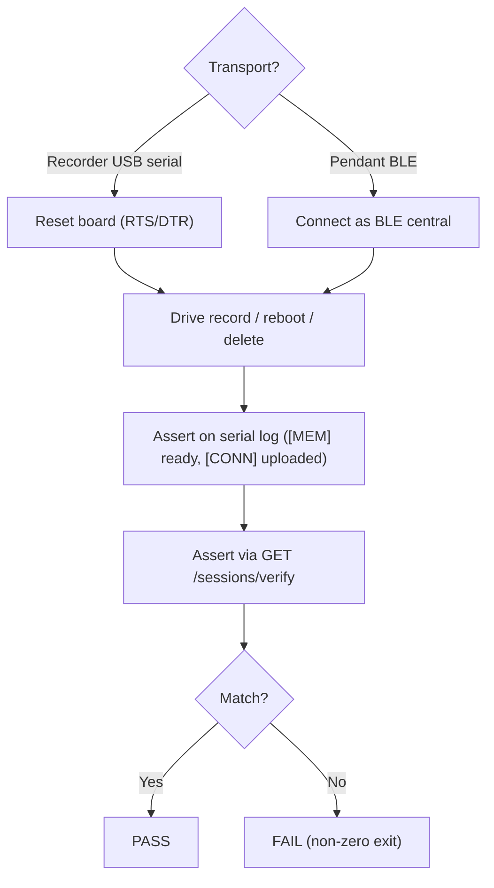

# Hardware-in-the-loop testing (`hwtest/`)

A pre-release harness that catches the bugs a **compiler cannot** — the ones that
only appear on real timing and real silicon (reboot mid-record, dropped-BLE
truncation, delete-during-upload splicing, verified trim, crash-safe delete, OTA).
It drives a real device and asserts on the firmware's **own serial log** plus the
**bytes the server actually stored**.

<div class="badge-row">
<span class="sate-badge">11 scenarios</span>
<span class="sate-badge">USB serial + BLE</span>
<span class="sate-badge">CI-gated exit code</span>
<span class="sate-badge">sate CLI</span>
</div>

:::tip Use the `sate` CLI
Everything below is wrapped by a single professional command — `sate` — which also
flashes firmware and diagnoses hardware faults:

```bash
sate test                 # run the recorder harness (--sim for no board)
sate test -t pendant      # pendant over BLE
sate flash recorder       # build + flash (auto-detects the port)
sate flash pendant        # build + flash (Seeed core)
sate devices --ble        # list serial ports + scan the pendant
sate doctor --device      # reset the board + diagnose real hardware faults
```

Install it with `pip install -e hwtest` (gives a `sate` command), or run in place
with `./hwtest/sate …`. `sate <command> -h` shows options.
:::



## What it checks

| Scenario | Guards | Device |
|---|---|---|
| `boot_health` | Boots to `[MEM] ready`, no crash/hang (LV_TICK_CUSTOM trap) | Recorder |
| `reboot_resume` | A button take interrupted by a reboot **auto-resumes** | Recorder |
| `byte_match` | Uploaded bytes on the server **== bytes the device sent** | Recorder |
| `verified_trim` | SD audio is freed **only after** the server confirms it | Recorder |
| `delete_journal` | A delete interrupted by a reboot **heals** (no hidden takes) | Recorder |
| `delete_during_upload` | Delete during an upload doesn't **splice two takes** | Recorder |
| `pendant_advertise` | Pendant is discoverable + connects | Pendant |
| `pendant_stream` | Loud stream flows near-live, no nap-wipe / dropped-packet stall | Pendant |
| `pendant_stop` | Notifies stop after `0x00` | Pendant |
| `pendant_battery` | Battery reads 0–100 with a sane charging bit | Pendant |
| `pendant_findme` | Find-me flashes the LEDs | Pendant |

## Two transports

- **Recorder** — tested over **USB serial + device-api**. The harness resets the
  board (RTS/DTR), drives record/reboot/delete, reads the serial log
  (`[MEM] ready`, `[CONN] resume … session …`, `[CONN] uploaded … (N bytes)`,
  `[REC] healed interrupted delete`), and confirms bytes via `GET /sessions/verify`.
- **Pendant** — tested over **BLE** (the Mac acts as the BLE central, the app's
  role): connect, send `0x01/0x00/0x02`, measure the PCM stream + battery.

## Setup

```bash
pip install -e hwtest                       # installs the `sate` command + deps
cp hwtest/config.example.toml hwtest/config.toml   # fill in serial port, server, pendant name
sate doctor                                 # confirm pyserial/bleak/arduino-cli are ready
```

The recorder firmware must be built `CDCOnBoot=cdc,USBMode=hwcdc` (else no serial).
For the pendant, grant Bluetooth permission to Terminal/Python and unpair it from
the phone (one BLE central at a time).

## Run

```bash
sate test                 # recorder, all scenarios
sate test -t pendant      # pendant over BLE
sate test --sim           # self-test the harness, no board
sate test --only byte_match,reboot_resume   # a subset
sate gui                  # native window (or double-click "SATE Hardware Test.app")
sate dashboard            # browser dashboard
```

The GUI has a **PORT** picker (auto-scans `/dev/cu.usbmodem*`) for the recorder and
a **PENDANT** scan for BLE. Bench steps that need a human (press RECORD, make noise)
appear as a **Done ▸** button. Exit code is non-zero on any FAIL/ERROR, so it drops
into CI / a pre-flash gate.

The raw entry points still work if you prefer (`python3 hwtest/run.py --config …`,
`gui.py`, `dashboard.py`).

## Diagnose a board — `sate doctor --device`

Before (or instead of) a full run, probe the actual hardware. `sate doctor --device`
resets the board, reads its boot log, and reports real faults with fixes:

```bash
sate doctor --device            # recorder over serial
sate doctor -d -t pendant       # pendant over BLE (advertising, connect, battery)
```

| It flags | From |
|---|---|
| No serial output | wrong CDC build / unpowered / wrong port |
| Crash · panic · brownout · **boot-loop** | `Guru Meditation`, `Backtrace`, repeated boot banners |
| **SD card init failure** | `SD_MMC.begin/setPins failed` |
| **Audio codec failure** | `ES8311 init failed` |
| **PSRAM not detected** / low contiguous heap | `psram free = 0`, `largest < 40 KB` |
| **Setup hang** | never reached `[MEM] ready` |
| Unclaimed / failing registration | `provisioned=0`, `register … code<0` |

It exits non-zero on any fault, so it also gates a flash.

## Limitations (honest)

- `boot_health` proves `setup()` finished; a *frozen* LVGL still prints
  `[MEM] ready`, so add a post-boot UI-liveness marker for full boot-hang coverage.
- `delete_during_upload` and a true brownout need precise timing (best with a power
  relay); the prompted versions are "assisted".
- Full pendant → app → server upload is the app's job; the harness checks the
  pendant firmware's BLE stream + control directly.
