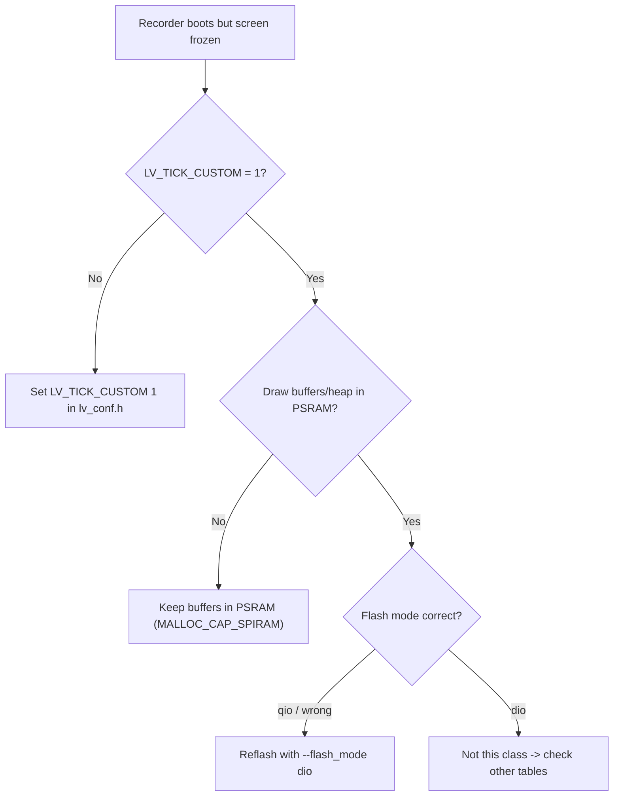
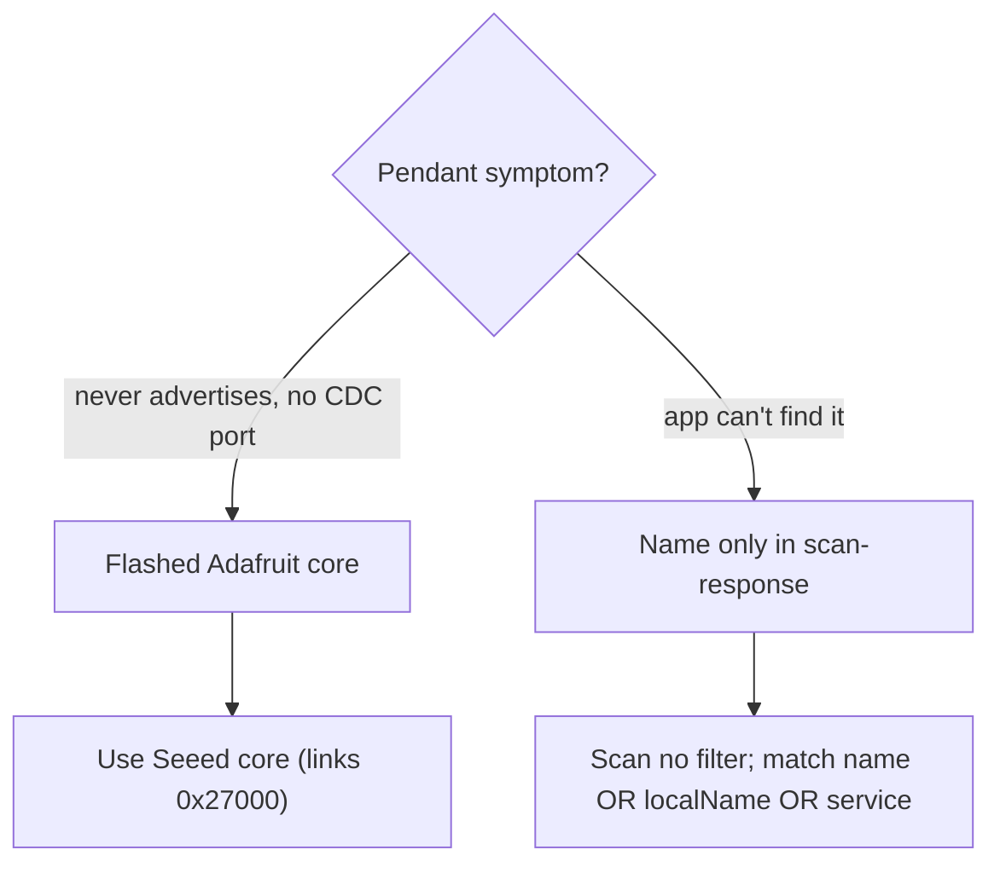
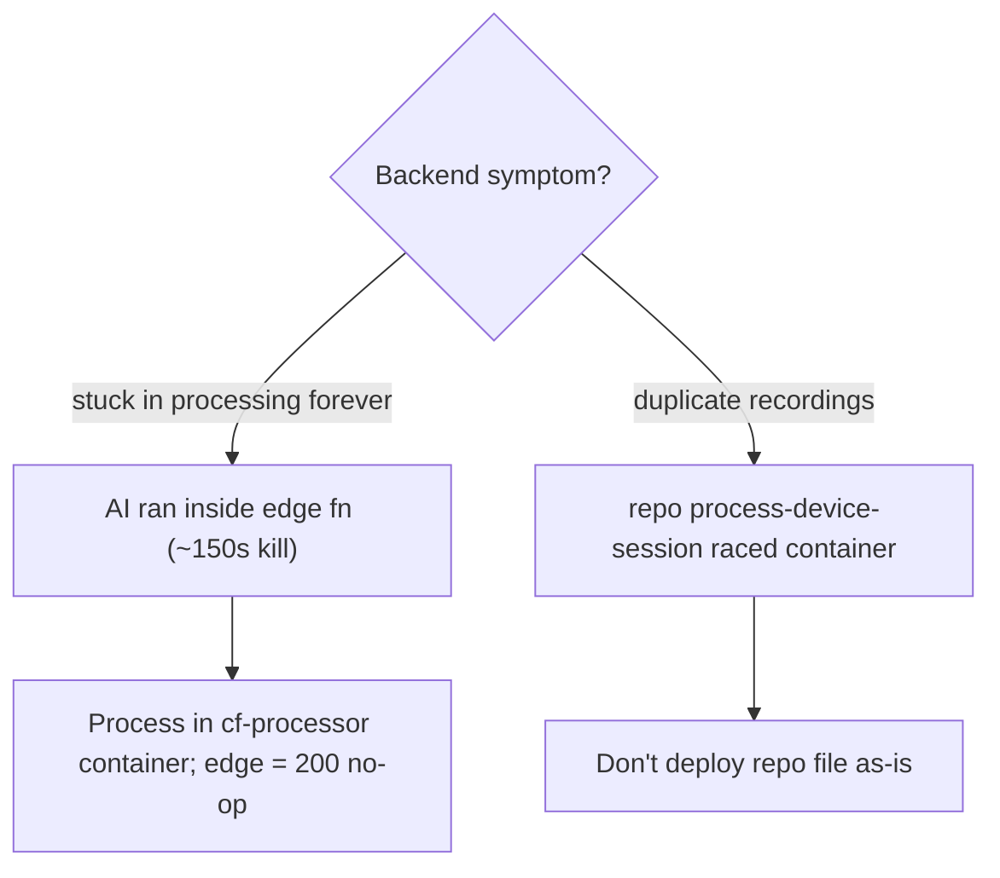

# Troubleshooting & gotchas

Hard-won traps. Check the one matching your symptom before spending hours.

## Recorder

| Symptom | Cause | Fix |
|---|---|---|
| Screen bright but frozen at the boot spinner (serial still reaches `[MEM] ready`) | `lv_conf.h` `LV_TICK_CUSTOM` is `0` — LVGL's clock never ticks | Set `LV_TICK_CUSTOM 1` in `~/Documents/Arduino/libraries/lv_conf.h` (+ montserrat 12/14/20). Reinstalling lvgl resets this — re-check after any `lib install lvgl`. |
| Records/registers but can't self-update | Flashed with `huge_app` (single slot, no OTA) | Reflash with `PartitionScheme=default_8MB` |
| "Server registration failed code -1" | LVGL draw buffers moved to internal DMA RAM (ate the contiguous block the TLS handshake needs) | Keep draw buffers + heap in **PSRAM** (`MALLOC_CAP_SPIRAM`) |
| Black screen after manual `esptool` flash | Wrong flash mode | Manual merged-bin flash needs `--flash_mode dio` (qio = dead) |
| No `/dev/cu.usbmodem*` when plugged in | Firmware not built with USB CDC | Build `CDCOnBoot=cdc,USBMode=hwcdc` |
| `cc1plus` hangs forever compiling | iCloud evicted lvgl to 0-block placeholders | `arduino-cli lib uninstall lvgl && lib install lvgl@8.4.0`, re-fix `lv_conf.h`. Move the sketchbook out of iCloud. |
| OTA fails `err-get-1` | Fragmented heap on a device with a backlog | Queue `reboot`, wait, then `ota` |
| Battery reads wrong / bootloops | Battery ADC moved off GPIO9 | Keep `BAT_ADC_PIN 9` (GPIO34 is a classic-ESP32 pin, wrong on S3) |

## Pendant

| Symptom | Cause | Fix |
|---|---|---|
| App runs but never advertises, no CDC port | Flashed with the **Adafruit** Feather core (links app at `0x26000`, overwrites the SoftDevice) | Use the **Seeed** core (`Seeeduino:nrf52:xiaonRF52840SensePlus`, links at `0x27000`). Recover with a DFU SoftDevice restore. |
| App can't find the pendant | Name is only in the scan-response (`localName`), and `name` may be a stale cached GAP name | Scan with **no** service filter; match on `name` OR `localName` OR the advertised service |
| Notification gap while connected | **Normal** — the pendant naps in silence | Not a disconnect; don't treat it as one |
| Harsh "rè" buzz on loud audio | Gain stacked (firmware `DIGITAL_GAIN` + app `LOUDNESS`, both tanh) | Pick one loudness stage (see [Pendant](../guides/pendant)) |

## Backend

| Symptom | Cause | Fix |
|---|---|---|
| Session stuck in `processing` forever | The AI call ran inside an edge fn and hit the ~150 s wall-clock kill | Processing must live in the **container** (`cf-processor`); `process-device-session` must be a 200 no-op |
| Duplicate recordings | The repo's `process-device-session` (not the deployed no-op) raced the container | Don't deploy the repo file as-is |
| `process_error: "download failed: Object not found"` on big takes | Storage project-wide file-size limit (defaults 50 MB) below a ~118 MB take | Raise the **project** limit (bucket limit alone isn't enough); it's 500 MB now |
| Registration breaks after a redeploy ("Setup link expired") | Redeployed with `verify_jwt:true` | Deploy `device-api`/`mint-plaud-token` with `--no-verify-jwt` |

## Dev environment

- **The dev Mac's LAN IP is dynamic** — a stale IP breaks app launch and device
  provisioning. Check `ipconfig getifaddr en0` first when things "suddenly" can't
  reach the Mac.

See [Known issues](../known-issues) for the full audit list.
