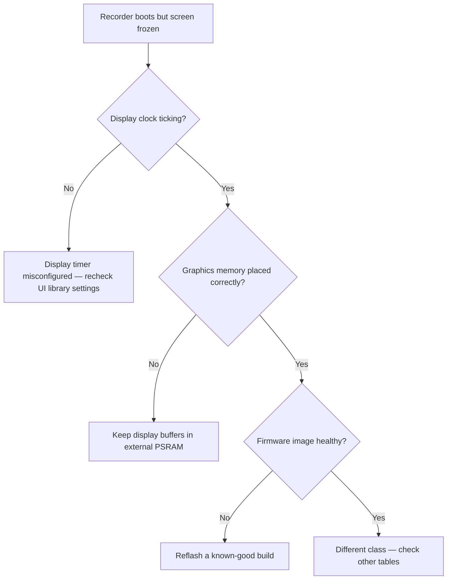
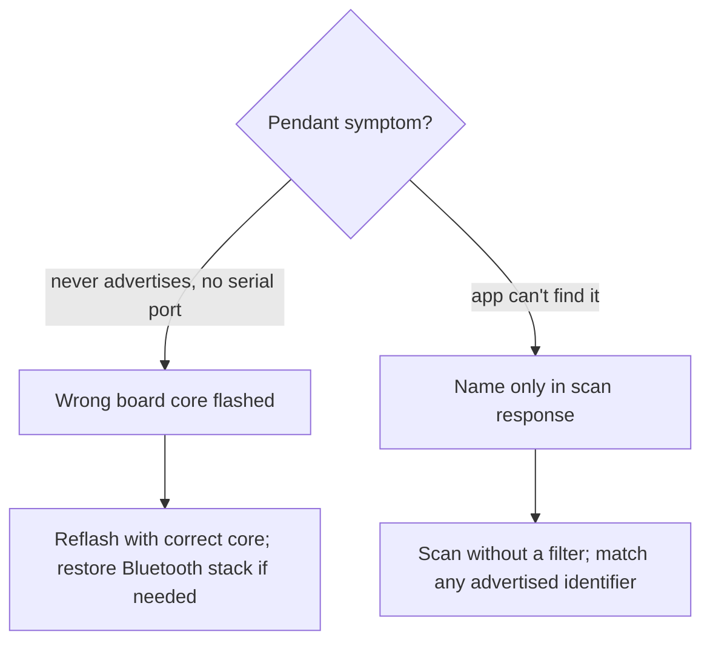
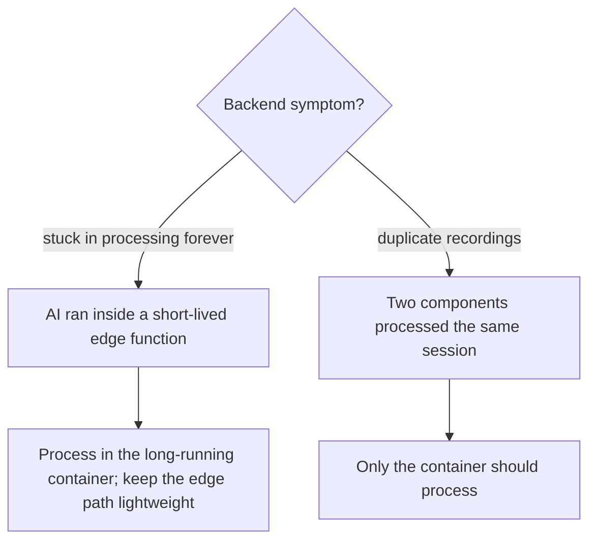

# Troubleshooting & common issues

A field guide to the symptoms operators and installers hit most often, grouped by
component. Each entry pairs a visible symptom with the underlying cause and the
practical fix — enough to recognize and resolve an issue without diving into the
code.

## Recorder

The recorder is an ESP32-S3 device with a small color display. Most issues fall
into a few recognizable classes.

| Symptom | Likely cause | What to do |
|---|---|---|
| Screen lights up but freezes at the boot spinner (device otherwise finishes starting) | The display's refresh timer isn't running, so the UI never repaints | Recheck the UI library configuration after any library update — a reinstall can silently reset it |
| Records and registers normally but can't self-update over the air | Flashed with a firmware layout that has no spare update slot | Reflash using the dual-slot layout that supports over-the-air updates |
| "Server registration failed" during setup | Graphics memory crowded out the contiguous block the secure connection needs | Keep display buffers and working memory in external PSRAM, not internal RAM |
| Black screen after a manual firmware flash | Wrong flash mode used during the manual flash | Reflash with the correct, compatible flash settings (the standard upload tool handles this automatically) |
| Device doesn't appear as a serial port when plugged in | Firmware built without USB serial support | Rebuild with USB serial enabled |
| Battery reads wrong or the device restarts in a loop | Battery sensing wired to the wrong pin for this chip | Restore the correct battery sense pin for the ESP32-S3 |
| Over-the-air update fails on a device with a large backlog | Fragmented memory leaves too little room for the secure download | Reboot the device first, let it come back online, then trigger the update |

## Pendant

The pendant is a small wearable that streams audio over standard Bluetooth Low
Energy.

| Symptom | Likely cause | What to do |
|---|---|---|
| Firmware runs but the pendant never advertises and exposes no serial port | Flashed with an incompatible board core that overwrites part of the Bluetooth stack | Reflash using the correct board core; recover a corrupted board by restoring its Bluetooth stack first |
| App can't find the pendant when scanning | The pendant's name is only in its scan response, and a cached name may be stale | Scan without a service filter and match on any of the advertised identifiers |
| Brief gaps in audio while connected | Normal — the pendant sleeps during silence to save power | Not a disconnect; no action needed |
| Harsh buzzing on loud audio | Loudness boost applied in two places at once | Use a single loudness stage (see the [Pendant guide](../guides/pendant)) |

## Backend

The backend spans an edge API, a long-running container that runs AI processing,
and cloud storage. Audio processing is intentionally asynchronous.

| Symptom | Likely cause | What to do |
|---|---|---|
| A session stays stuck in "processing" indefinitely | A long AI job was run inside a short-lived edge function and hit its execution time limit | Keep AI processing in the long-running container, never inline in an edge function |
| Duplicate recordings appear for one session | Two components processed the same session at once | Ensure only the container performs processing |
| Large recordings fail to download during processing | A project-wide file-size limit was set below the size of a long take | Raise the storage size limit at the project level, not just per bucket |
| Device registration breaks after a redeploy ("Setup link expired") | The API was redeployed with token verification misconfigured | Redeploy the device and token services with their intended verification settings |

## Development environment

:::note[Dynamic LAN address]
The development machine's local network address can change between sessions. A
stale address is a common reason the app or device provisioning "suddenly" can't
reach it — verify the current address first before assuming a deeper fault.
:::

See [Known issues](../known-issues) for the broader list of tracked items.
