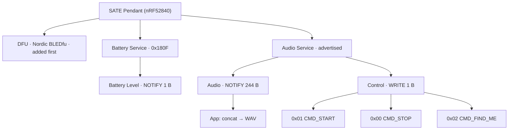
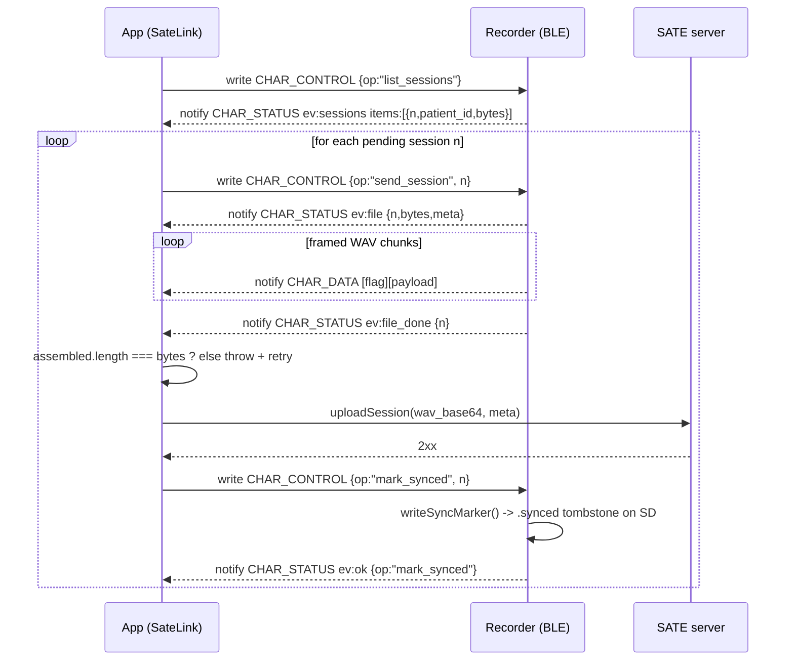

# BLE protocol

Two independent BLE peripherals in this repo, unrelated GATT profiles:

- **Pendant** (`SATE_Pendant/SATE_Pendant.ino`) — a wearable that streams live PCM
  audio. Standard Bluefruit/Nordic GATT, app-side link is
  `src/pendant/PendantLink.ts`.
- **Recorder** (`SATE_Recorder/connectivity.cpp`) — a device that mostly talks
  Wi-Fi/HTTPS, but exposes a JSON-over-BLE bridge for provisioning and for
  pulling sessions when it has no Wi-Fi. App-side link is `src/ble/SateBle.ts`,
  shared constants in `src/protocol.ts`. See also `doc/04-ble-protocol.md`.

Both are plain `react-native-ble-plx` peripherals (unlike Plaud's proprietary
SDK) and **share one `BleManager`** on the app side — see `src/ble/bleManager.ts`
and `src/ble/radio.ts`.

<div class="badge-row"><span class="sate-badge">2 BLE peripherals</span><span class="sate-badge">16 kHz mono PCM</span><span class="sate-badge">244 B/notify</span><span class="sate-badge">react-native-ble-plx</span></div>

---

## Pendant (streaming)

Source: `SATE_Pendant/SATE_Pendant.ino`; app side `src/pendant/PendantLink.ts`.

### GATT profile

| Characteristic | UUID | Properties | Payload |
|---|---|---|---|
| Audio service | `19B10000-E8F2-537E-4F6C-D104768A1214` | — | groups the two characteristics below |
| Audio | `19B10001-E8F2-537E-4F6C-D104768A1214` | **Notify** (fixed-length) | 244 bytes = 122 int16 LE samples, 16 kHz mono PCM |
| Control | `19B10002-E8F2-537E-4F6C-D104768A1214` | **Write** (fixed-length 1 byte) | 1 byte command |
| Battery Service | `0000180F-...` (standard) | Notify | 1 byte, see below |
| Battery Level | `00002A19-...` (standard) | Notify | low 7 bits = %, bit 7 = charging |
| DFU (OTA) | Adafruit/Nordic `BLEDfu` (`bledfu`) | — | Nordic BLE DFU protocol, added first so its attribute handle is fixed across firmware versions |

The firmware uses Adafruit's `BLEBas` helper for the battery service,
which registers the standard `0x180F` service / `0x2A19`
characteristic.



<p class="diagram-caption">UUIDs and properties are in the GATT profile table above; audio-packet, battery-byte, and WAV-assembly detail are in the sections below. DFU is added first so its attribute handle stays fixed across firmware versions; the audio service UUID rides in the primary advertising packet.</p>

### Control byte values

From `onCtrlWrite()` and mirrored in `PendantLink.ts`:

| Value | Meaning |
|---|---|
| `0x01` | Start streaming (`CMD_START`) — begins PDM capture, resets ring buffer, drops ~140 ms of mic-settling samples |
| `0x00` | Stop streaming (`CMD_STOP`) — ends PDM capture |
| `0x02` | Find-me (`CMD_FIND_ME`) — flashes red/blue LEDs for 5 s, independent of streaming state |

### Audio packet byte layout

Each notify on the Audio characteristic is exactly `PKT_SAMPLES * 2` = 244
bytes: 122 little-endian `int16_t` PCM samples, 16 kHz, mono,
no header, no framing. The app reconstructs a WAV by concatenating raw
notify payloads and prepending a 44-byte RIFF/WAVE header
(`PendantLink.ts`, `pcmToWavBase64`).

<div class="bytemap">
  <div class="cell"><b>sample 0</b><span>int16 LE (2 B)</span></div>
  <div class="cell"><b>sample 1</b><span>int16 LE (2 B)</span></div>
  <div class="cell grow"><b>… samples 2–120 …</b><span>2 B each</span></div>
  <div class="cell"><b>sample 121</b><span>int16 LE (2 B)</span></div>
  <div class="cell hi"><b>= 244 B</b><span>122 × int16, no header</span></div>
</div>

### Battery byte

`publishBattery()` packs the value written to the battery
characteristic as:

- bits 0–6: battery percent (0–100)
- bit 7 (`0x80`): charging flag (USB VBUS detected)

<div class="bytemap">
  <div class="cell hi"><b>bit 7</b><span>charging (0x80)</span></div>
  <div class="cell grow"><b>bits 0–6</b><span>battery percent (0–100)</span></div>
</div>

The app unpacks it identically: `percent: raw & 0x7f, charging: (raw & 0x80) !== 0`
(`PendantLink.ts`).

### Advertising

Set up in `setup()`:

- `Bluefruit.Advertising.addService(audioSvc)` — the **audio service UUID is in
  the primary advertising packet**.
- `Bluefruit.ScanResponse.addName()` — the device **name ("SATE Pendant") is
  only in the scan response**, not the primary advert.
- Advertising interval: fast 20 ms, backs off to slow 152.5 ms after 30 s
  (`setInterval(32, 244)`).
- General-discoverable flag set (`BLE_GAP_ADV_FLAGS_LE_ONLY_GENERAL_DISC_MODE`).

Because the name only shows up in the scan response, iOS can report it via
`localName` (and may even carry a stale cached `name` from a previous
firmware/label). The app therefore scans with **no service filter** and
matches on `name` OR `localName` OR the advertised audio service UUID
(`PendantLink.ts`).

### Connection parameters

`onConnect()`:

- Requests **2M PHY** (`BLE_GAP_PHY_2MBPS`) to double raw throughput.
- Requests **MTU 247** (`requestMtuExchange(247)`), matching the app's
  `connectToDevice(deviceId, { requestMTU: 247 })` (`PendantLink.ts`).
- Requests a 30 ms connection interval (`24 * 1.25 ms`) — the ring buffer
  (~0.5 s) absorbs the added latency; this is a power-saving tradeoff, not a
  throughput one.
- `Bluefruit.configPrphBandwidth(BANDWIDTH_MAX)` before `Bluefruit.begin()`
  sizes the MTU-247 negotiation and notify queue.

### Battery percent curve

`readBatteryPct()` reads `VBAT` via a resistor divider and maps
voltage to percent with a piecewise-linear LiPo discharge curve (100% ≥4.10 V
down to 0% ≤3.30 V); this is cosmetic UI detail, not part of the wire protocol.

---

## Recorder (offline BLE bridge)

Source: `SATE_Recorder/connectivity.cpp`; shared protocol constants
`src/protocol.ts`; app-side link `src/ble/SateBle.ts`; `doc/04-ble-protocol.md`.

The recorder's primary path is Wi-Fi/HTTPS straight to the SATE server
(`connectivity.cpp` HTTP section, `beginUpload`/`uploadStep`). BLE is used for
two things only: **first-time / Wi-Fi provisioning**, and **pulling sessions
when the recorder currently has no Wi-Fi** ("offline bridge"). That second
case is what this section documents.

### GATT profile

Service `53415445-0001-4a7e-8c5e-000000000001` (`SATE_SERVICE`,
`connectivity.cpp`, `protocol.ts`).

| Characteristic | UUID | Properties | Payload |
|---|---|---|---|
| `CHAR_INFO` | `...0010` | Read (`NIMBLE_PROPERTY::READ`, `connectivity.cpp`) | one-shot JSON `{model, fw, serial, provisioned}` (`InfoCB::onRead`) |
| `CHAR_CONTROL` | `...0020` | Write (`connectivity.cpp`) | JSON op from the app, chunk-framed if large |
| `CHAR_STATUS` | `...0030` | Notify | JSON events from the device, chunk-framed |
| `CHAR_DATA` | `...0040` | Notify | raw WAV bytes for a pulled session, chunk-framed |

`NimBLEDevice::setMTU(247)` is requested on `bleStart()`; the app also
requests MTU 247 on connect (`SateBle.ts`). The framed-message chunk size
(`BLE_CHUNK = 180`, `connectivity.cpp`) is deliberately independent of the
negotiated MTU so the link works even if 247 isn't granted.

### Advertising

`bleUpdateAdvertising()` (`connectivity.cpp`):

- Primary advert: flags, the `SATE_SERVICE` UUID, and 6 bytes of manufacturer
  data (company id `0xFFFF` + payload):
  `[0]=0x5A magic  [1]=flags  [2]=pending sessions (capped 255)  [3]=0x00 reserved`
  - `flags` bit 0 (`0x01`, `ADV_FLAG_UNPROVISIONED`) = device not yet claimed
  - `flags` bit 1 (`0x02`, `ADV_FLAG_NEEDS_SYNC`) = provisioned **and** has
    pending (unsynced) sessions

<div class="bytemap">
  <div class="cell"><b>0xFFFF</b><span>company id</span></div>
  <div class="cell"><b>0x5A</b><span>magic</span></div>
  <div class="cell grow hi"><b>flags</b><span>bit 0 unprovisioned / bit 1 needs-sync</span></div>
  <div class="cell"><b>pending</b><span>sessions, capped 255</span></div>
  <div class="cell"><b>0x00</b><span>reserved</span></div>
</div>

- Scan response: device name = its serial (`SATE-XXXXXX`).
- The app parses the magic/flags/pending fields to show "needs setup" /
  "needs sync" / a pending count **without connecting**
  (`SateBle.ts`); on Android `ble-plx` prepends a 2-byte company id,
  so the parser checks manufacturer-data offsets 0 and 2 for the magic byte.

### Framed message protocol

Any payload (JSON command/status, or raw WAV bytes) larger than one packet is
split into `[flag: 1 byte][payload]` packets:

- `FRAME_PARTIAL = 0x01` — more packets follow
- `FRAME_FINAL = 0x02` — last packet of this logical message

<div class="bytemap">
  <div class="cell hi"><b>flag</b><span>0x01 partial / 0x02 final</span></div>
  <div class="cell grow"><b>payload</b><span>up to BLE_CHUNK = 180 bytes</span></div>
</div>

Firmware side: `notifyFramed()` (`connectivity.cpp`) chunks a buffer
into `BLE_CHUNK` (180-byte) payload pieces, retries `ch->notify()` up to 50
times per packet (5 ms backoff) to ride out a busy TX queue, and paces with a
2 ms delay between packets. Incoming writes are reassembled by `CtrlCB::onWrite`
into `ctrlAsm`, and handed to `handleBleOp()` once a `FRAME_FINAL`
flag lands.

App side: `FrameAssembler` (`SateBle.ts`) does the mirror-image
reassembly on notifies; `frameChunks()` (`SateBle.ts`) does the
mirror-image splitting on writes, using the same 180-byte payload MTU
(`mtuPayload = 180`).

### Control ops (`CHAR_CONTROL`, app → device)

Dispatched in `handleBleOp()` (`connectivity.cpp`); JSON shapes
documented in `src/protocol.ts`.

| Op | Args | Effect | Reply |
|---|---|---|---|
| `scan_wifi` | — | async Wi-Fi scan | `ev:scan` |
| `provision` | `ssid, pass, server, claim_token` | join Wi-Fi + register/claim the device | `ev:state` sequence |
| `change_wifi` | `ssid, pass` | move an **already-claimed** device to a new network, no re-registration | `ev:state` sequence ending `wifi_saved` |
| `cancel_wifi` | — | abort a pending change-Wi-Fi window | `ev:ok` |
| `list_sessions` | — | list sessions not yet marked synced | `ev:sessions` |
| `send_session` | `n` | stream session `n`'s WAV over `CHAR_DATA` | `ev:file` → data → `ev:file_done` |
| `mark_synced` | `n` | write the `.synced` tombstone marker for session `n` | `ev:ok` / `ev:err` |
| `set_patients` | `patients[]` | overwrite `/sate/patients.json` on the SD card | `ev:ok` / `ev:err` |
| `reboot` | — | ack, then restart after 800 ms | `ev:ok` |
| `factory_reset` | — | ack, wipe Wi-Fi + account, restart to first-time setup | `ev:ok` |

`n` is a **1-based index into the pending-session table** built by the most
recent `list_sessions` scan (`pendTable`, `connectivity.cpp`;
"`n` on the wire = index + 1") — it is not a persistent
session id.

### Status events (`CHAR_STATUS`, device → app)

| Event | Fields | Source |
|---|---|---|
| `scan` | `networks: [{ssid, rssi, sec}]` | `connectivity.cpp` |
| `state` | `state, ip?, device_id?, msg?` | provisioning / change-Wi-Fi progress, `handleProvisionTick()` |
| `sessions` | `items: [{n, patient_id, bytes}]` | `connectivity.cpp`, pending only |
| `file` | `n, bytes, meta` | `sendSessionOverBle()`; then raw bytes follow on `CHAR_DATA` |
| `file_done` | `n` | — |
| `ok` / `err` | `op` (+ `msg` on err) | `statusOk()` / `statusErr()` |

Provisioning `state` sequence: `connecting → wifi_ok → registering → registered`
(full `provision`) or `connecting → wifi_ok → wifi_saved` (`change_wifi`), or
`error` at any point (`connectivity.cpp`, `protocol.ts`).

### File transfer: `send_session`

`sendSessionOverBle()` (`connectivity.cpp`):

1. Opens the session's WAV + JSON metadata files from SD.
2. Sends one `ev:file` status message: `{"ev":"file","n":<n>,"bytes":<total>,"meta":<raw json>}`.
3. Streams the WAV in 4 KB blocks (`ioChunk[4096]`); each block is one
   call to `notifyFramed(chData, ...)` — i.e. each 4 KB block is itself
   re-split into 180-byte framed packets on `CHAR_DATA`.
4. Sends `ev:file_done {"n":<n>}`.

The loop bails early if `bleClientConnected` goes false mid-transfer
(`while (wf.available() && bleClientConnected)`), leaving the app's transfer
incomplete — this is exactly the case the app's byte-count check below is
guarding against.

### App-side reconciliation (`pullSession`, `markSynced`)

`SateLink.pullSession()` (`SateBle.ts`):

1. Registers waiters for `ev:file` (matching `n`) and `ev:file_done`
   (matching `n`, 120 s timeout).
2. Sends `{op:"send_session", n}`.
3. Accumulates every `CHAR_DATA` chunk via `dataHandler`, reporting
   `(received, total)` progress against the `bytes` field from `ev:file`.
4. After `ev:file_done` arrives, concatenates the chunks and compares byte
   count against the `bytes` the device declared up front:
   ```ts
   const assembled = Buffer.concat(chunks);
   if (assembled.length !== total) {
     throw new Error(`session ${n} transfer incomplete: got ${assembled.length} of ${total} bytes`);
   }
   ```
   BLE notifications are unacknowledged, so a dropped `CHAR_DATA` notify
   would otherwise silently truncate the WAV. This check makes that fail
   loudly (the caller retries the pull) instead of uploading and
   `mark_synced`-ing a short recording — permanently losing the tail of the
   device's only copy.
5. Only on an exact byte match does `pullSession()` resolve with
   `{wavBase64, meta}`.

The caller (`src/sync/AutoSync.ts`) uses this ordering: `listSessions()`
→ `pullSession(n)` → `api.uploadSession(...)` (upload to the backend) →
**only then** `link.markSynced(n)` (`AutoSync.ts`, comment: "only after
the server confirmed"). `markSynced()` itself (`SateBle.ts`) just
writes `{op:"mark_synced", n}` and waits for `ev:ok`/op match — the
byte-exactness guarantee lives entirely in the `pullSession` check above, not
in `markSynced`; `markSynced` is never sent unless `pullSession` already
proved the transfer was complete and the backend upload succeeded.

### Session pull sequence


