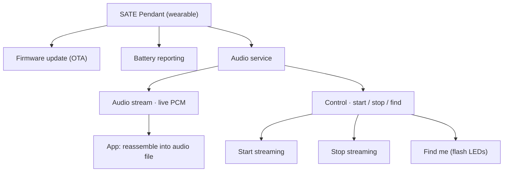
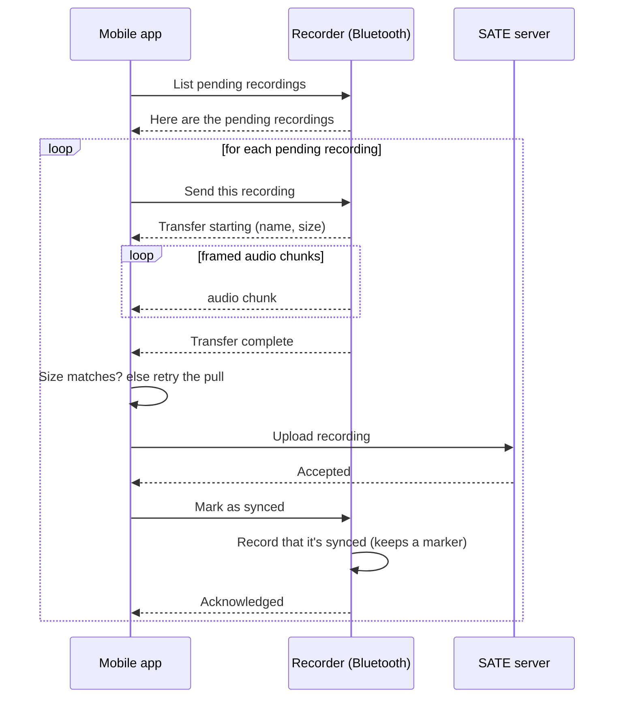

# BLE protocol

The SATE system uses Bluetooth Low Energy for two very different jobs, handled by
two independent devices with unrelated Bluetooth profiles:

- **Pendant** — a wearable that streams live microphone audio to the mobile app in
  real time.
- **Recorder** — a device that normally moves audio over Wi-Fi, but also offers a
  Bluetooth bridge used for first-time setup and for pulling recordings when no
  Wi-Fi is available.

Both are standard Bluetooth peripherals (no proprietary vendor SDK), and on the
mobile side they cooperatively share a single Bluetooth radio so they never
compete for the hardware.

2 BLE peripherals16 kHz mono audioLive streaming + offline syncStandard GATT

---

## Pendant (live streaming)

The pendant continuously captures microphone audio and pushes it to the phone as a
steady stream of small Bluetooth notifications. The app stitches those packets
back into a normal audio file, so from the user's point of view a pendant session
behaves like any other recording once it lands in the app.

### What the pendant exposes

At a conceptual level the pendant advertises a handful of Bluetooth capabilities:

| Capability | Role |
|---|---|
| Audio stream | A steady flow of raw 16 kHz mono PCM audio, sent as fixed-size notifications |
| Control | A single-byte command the app writes to start, stop, or locate the device |
| Battery | Standard battery-level reporting, including a charging indicator |
| Firmware update | A standard over-the-air update capability for shipping new firmware |

The pendant advertises its audio capability so the app can discover it, then streams live audio while the app reassembles the packets into a playable recording.

### Control commands

The app steers the pendant with three simple commands:

- **Start** — begin capturing and streaming audio. The very start of capture is
  trimmed slightly so the microphone has time to settle.
- **Stop** — end capture and streaming.
- **Find me** — briefly flash the device's LEDs so a user can physically locate it.
  This works whether or not the pendant is currently streaming.

### Live audio

Audio arrives as a continuous series of small, fixed-size packets carrying raw
16 kHz mono PCM samples with no per-packet framing. The app buffers and
concatenates these packets, then wraps the result in a standard audio-file header
so the recording can be played, uploaded, and processed through the same pipeline
as every other SATE recording.

### Battery and charging

The pendant reports its battery level as a percentage together with a charging
indicator, so the app can show both the current charge and whether the device is
plugged in.

### Discovery and connection

The pendant broadcasts enough information for the app to find it reliably even
across firmware versions and cached device names. To keep discovery robust, the
app scans without a rigid filter and matches the pendant on any of its advertised
identifiers.

Once connected, the link is tuned for a smooth audio stream: it negotiates a
higher-throughput Bluetooth mode and a larger packet size, and accepts a small
amount of added latency in exchange for better battery life. A short on-device
audio buffer absorbs that latency so the stream stays continuous.

:::note[Battery percentage is cosmetic]
The battery percentage is derived from a voltage reading mapped onto a typical
LiPo discharge curve. It is a display convenience for the app, not part of the
audio wire protocol.
:::

---

## Recorder (offline Bluetooth bridge)

The recorder's main path is Wi-Fi: it uploads finished recordings straight to the
SATE server. Bluetooth plays a supporting role and is used for just two things:

1. **Provisioning** — first-time setup, joining a Wi-Fi network, and claiming the
   device to an account.
2. **Offline sync** — pulling recordings off the device over Bluetooth when it has
   no working Wi-Fi connection.

This section focuses on that second case: how the app retrieves recordings
directly over Bluetooth.

### What the recorder exposes

The recorder offers a small set of Bluetooth capabilities organized around a single
service:

| Capability | Role |
|---|---|
| Info | Basic device facts the app can read once: model, firmware, serial, and whether it has been claimed |
| Control | The channel the app writes commands to (scan Wi-Fi, provision, list recordings, and so on) |
| Status | The channel the device sends progress and result events back on |
| Data | The channel that carries recording audio during a transfer |

Because Bluetooth packets are small, large messages — JSON commands and audio
alike — are split into a sequence of chunks and reassembled on the other side. The
chunking is deliberately independent of the negotiated packet size so transfers
work reliably even on a conservative connection.

### Advertising and at-a-glance status

Before the app ever connects, the recorder broadcasts a compact status summary in
its advertisement. This lets the app show useful state in a device list without
opening a connection, including:

- whether the device still needs to be set up (not yet claimed to an account), and
- whether it has finished recordings waiting to be synced, along with a rough count.

The device's serial number is also broadcast so users can tell devices apart.

### Framed message transfers

Any message too large for one packet — a command, a status event, or a chunk of
audio — is sent as a series of framed pieces, each marked as either "more to come"
or "final." The receiving side reassembles the pieces back into the complete
message once the final piece arrives. The firmware paces and retries these sends so
a momentarily busy Bluetooth link doesn't drop data, and the app performs the
mirror-image reassembly (and splitting, for its own writes).

### Commands the app can send

The app drives the recorder with a small vocabulary of operations:

| Operation | Purpose |
|---|---|
| Scan Wi-Fi | Ask the device to list nearby Wi-Fi networks |
| Provision | Join a Wi-Fi network and register/claim the device to an account |
| Change Wi-Fi | Move an already-claimed device to a new network, without re-claiming it |
| Cancel Wi-Fi | Abort an in-progress Wi-Fi change |
| List recordings | List the recordings that haven't been synced yet |
| Send recording | Stream a specific recording's audio to the app |
| Mark synced | Mark a recording as synced once the app has it safely |
| Set patients | Update the on-device patient list |
| Reboot | Restart the device |
| Factory reset | Wipe Wi-Fi and account and return to first-time setup |

When the app refers to a recording, it uses its position in the most recent
"list recordings" result rather than any permanent identifier.

### Events the device sends back

The device reports progress and results on its status channel — Wi-Fi scan results,
provisioning progress, the list of pending recordings, the start and end of a file
transfer, and simple success/error acknowledgements for each command.

Provisioning in particular reports a readable sequence of states as it connects,
confirms Wi-Fi, and registers the device (or a shorter sequence when only changing
networks), and surfaces a clear error state if anything fails along the way.

### Pulling a recording

Retrieving a recording over Bluetooth follows a careful, verify-before-delete
sequence, because until a recording is proven to be safely on the server the device
holds the only copy:

1. The app lists the pending recordings on the device.
2. For each one, the app asks the device to send it. The device first announces the
   transfer and the exact size to expect, then streams the audio in framed chunks,
   then signals completion.
3. The app reassembles the chunks and **compares the received size against the size
   the device declared up front.** Bluetooth notifications are unacknowledged, so a
   dropped chunk could otherwise silently truncate the audio — this check makes any
   shortfall fail loudly so the app simply retries the pull.
4. Only after a recording transfers completely **and** is confirmed uploaded to the
   server does the app tell the device to mark it as synced.

:::caution[Safety ordering is deliberate]
The device is only ever told a recording is synced after the app has both received
it in full and confirmed the server accepted it. This ordering prevents the device
from freeing the only copy of a recording before it is durably stored elsewhere.
:::

### Session pull sequence

