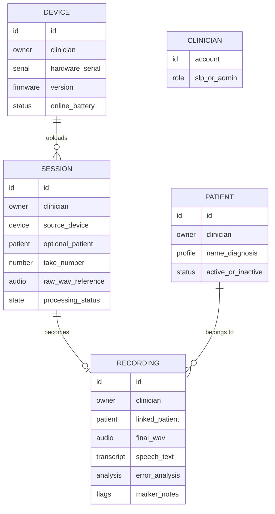

# Data model

A conceptual overview of the information SATE keeps: the core entities, how audio moves
from a device to a finished clinical result, where files live, and how each clinician's
data is kept private. This page describes *what* the system stores and *why* — not the
internal database layout.

Cloud-hosted databasePrivate object storageTenant isolation by default

:::note[One clinician, one private workspace]
SATE is multi-tenant: every clinician (SLP) has their own private workspace. Patients,
recordings, devices, and everything derived from them belong to a single owning account.
The platform is built so that data is scoped to its owner by default — a clinician can only
ever see and act on their own records.
:::

---

## 1. Core entities

The data model is small and centres on the journey of a recording — from a device upload,
through automated processing, to a reviewable clinical result attached to a patient.

### Devices

A **device** is a registered SATE recorder (or a paired pendant) belonging to a clinician.
The system tracks its display name, hardware serial, current firmware version, and live
status such as whether it is online, its battery level, and how many recordings are waiting
to sync. Devices are claimed to an account during a one-time provisioning step, so each
recorder has a clear owner.

### Sessions

A **session** represents a single "take" uploaded from a device before it has been turned
into a finished result. Each session records which device and clinician it came from, an
optional patient, a per-patient take number, a reference to the raw audio, and its place in
the processing pipeline (queued, processing, done, or errored). Sessions are the working
state of the automated pipeline; once processed, a session produces a recording.

### Recordings

A **recording** is the clinical result — the artifact a clinician actually reviews. It
holds the final audio, the transcript, the automated speech-error analysis, any flag
markers placed during capture, and clinician-entered metadata such as a name, protocol, or
notes. Both a device upload and a manual web upload end up as a recording, so the review
experience is identical regardless of how the audio arrived.

### Patients

A **patient** is a clinical record owned by a clinician: name, basic demographics,
diagnosis, and contact details. Recordings are linked to a patient so a clinician can track
progress over time. Patients are deactivated rather than hard-deleted, which preserves the
recordings already associated with them.

### Clinicians and admins

Every account is a **clinician (SLP)** with their own private workspace. A small set of
accounts are also **administrators**, who manage devices and firmware releases across the
whole fleet.

---

## 2. Storage

Audio and firmware live in dedicated object storage, separated by purpose and sensitivity.

Private buckets

Audio

Public buckets

Firmware

Audio access

Signed URLs

| Storage area | Visibility | Holds |
|---|---|---|
| Device uploads | Private | Raw audio arriving from a device, before processing |
| Recordings | Private | The final audio behind each clinical result |
| Firmware | Public | Over-the-air firmware release images |
| Mobile uploads | Public | Files uploaded from the mobile app |

Recorded audio is always treated as sensitive. Private audio is never served from a public
address — access is granted through short-lived signed links that expire after a short
window, so a URL cannot be shared or leaked into permanent access.

:::note[Sizing large recordings]
A full-length clinical take can be sizeable (roughly a hundred megabytes or more), so the
platform's storage is configured with generous upload limits. If very long recordings ever
fail to store, an upload size limit is the first thing to check.
:::

---

## 3. Access and privacy

SATE enforces tenant isolation at the data layer, not just in the app. Access is
**deny-by-default**: a request only succeeds if it is explicitly permitted for the owning
account, and anything not expressly allowed is refused.

- **Patients, recordings, devices, and sessions** are visible and editable only to the
  clinician who owns them.
- **Recordings** are reachable both directly by their owner and through the patient they
  belong to, so a clinician's roster and recording history stay in sync.
- **Patients are deactivated, not deleted**, which avoids orphaning the recordings tied to
  them.
- **Firmware, admin, and login-linking data** are reserved for trusted server-side
  operations and are never queried directly by a browser.

Trusted server components (the device API and the processing pipeline) operate with elevated
access for the specific jobs they perform — registering devices, moving audio between
buckets, and finalizing results — but that elevated access is never reachable from a user's
browser session.

---

## 4. Session identity and de-duplication

Because a device may be the only holder of a recording until it is confirmed stored, the
system is careful never to lose or duplicate a take.

Each take is identified by the combination of its owning account, source device, optional
patient, take number, and exact audio size. Two safeguards use this identity:

- **Upload de-duplication.** Before accepting a new upload, the platform checks whether a
  matching take is already stored *and* confirms the audio object is really present. If so,
  the upload is treated as a duplicate — no second copy, no second round of processing. This
  protects against a device re-sending a take whose earlier delivery was not acknowledged.

- **Store verification.** A device can ask, read-only, whether a specific take is durably
  stored before it frees the local copy. The answer is "yes" only when both the record and
  the actual audio object are confirmed present.

The guiding principle is that a stored record alone is not proof — the audio object itself
must be verified to exist. Any doubt (offline, an unexpected response, or a size mismatch)
means the device keeps its copy and simply tries again later.
