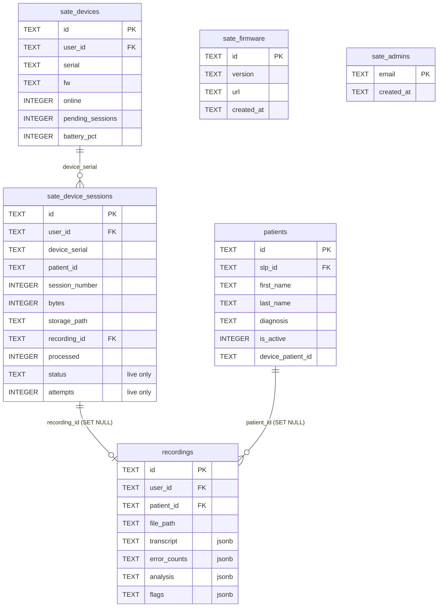

# Data model

Reference for the backend tables, storage buckets, and access-control policies. Two backends
exist side by side:

- **Live production** — Supabase Postgres, project `zlgdpivcbmaodgokkdvz`. Tenant isolation is
  enforced in the database via Row Level Security (RLS). This is what the app actually talks to
  today.
- **Cloudflare port** — `cloudflare/schema.sql` is a D1 (SQLite) schema "ported from Supabase
  Postgres," plus `cloudflare/src/policy.ts`, a hand-written re-implementation of the live
  `pg_policies` (SQLite has no RLS at all).

Grounding: `cloudflare/schema.sql`, `cloudflare/src/policy.ts`,
`react_app_sate-ui_update/supabase/functions/device-api/index.ts`, `doc/05-backend-supabase.md`.

<div class="badge-row"><span class="sate-badge">Supabase Postgres + Cloudflare D1</span><span class="sate-badge">project zlgdpivcbmaodgokkdvz</span><span class="sate-badge">RLS deny-by-default</span></div>

:::warning[No committed SQL for the live async state machine]
The live Postgres schema has columns and an RPC (`sate_device_sessions.status`, `attempts`,
`processing_started_at`, `claim_next_session()`, `requeue_stale_sessions()`, `requeue_session()`)
that were added by a migration named `async_processor_state_machine` (per `CLAUDE.md` /
`doc/05-backend-supabase.md`). **No `.sql` file for that migration exists in this repo** — no
`supabase/migrations/` directory was found, and `cloudflare/schema.sql` does not have these
columns at all (see below). The only evidence for them is the RPC/column names referenced from
`react_app_sate-ui_update/supabase/functions/device-api/index.ts` (e.g. `.select('..., status,
attempts')`, `.update({ status: 'queued', process_error: null, attempts: 0 })`) and from
`doc/05-backend-supabase.md` / `CLAUDE.md`. Treat those two columns and the RPC functions as
**live-Postgres-only, undocumented-in-SQL** until a migration file is added to the repo.
:::

---

## 1. Tables

Source of truth for column lists below is `cloudflare/schema.sql` (the only committed SQL),
cross-checked against table usage in `device-api/index.ts` and the table inventory in
`doc/05-backend-supabase.md`. Columns marked "live only" appear in `device-api/index.ts` queries
but are **absent from `cloudflare/schema.sql`**.



<p class="diagram-caption">Attributes shown are the key/FK subset; full column lists (including "live only" columns absent from <code>cloudflare/schema.sql</code>) are in the per-table sections below.</p>

### `sate_devices` — registered recorders

| Column | Notes |
|---|---|
| `id`, `user_id` | owner (`user_id` = SLP account) |
| `name`, `serial`, `fw` | display name, hardware serial, firmware version string |
| `online`, `ip`, `last_seen` | live/heartbeat state |
| `pending_sessions`, `state`, `ota_state` | device-reported status fields |
| `slp`, `slp_id` | owning clinician (two columns — `slp` is a legacy/display field) |
| `battery_pct`, `battery_mv`, `total_recordings` | telemetry |

Indexed on `user_id` and `serial`.

### `sate_device_sessions` — raw uploaded device sessions

The state machine table. A row is created per take upload and tracks it through processing.

| Column | Notes |
|---|---|
| `id` | e.g. `s-<8 hex chars>` |
| `user_id`, `device_serial`, `patient_id` | identity triple (see [§4](#4-session-identity)) |
| `session_number` | per-patient sequence number, restarts at 1 per patient |
| `sample_rate`, `bytes`, `storage_path` | audio metadata + object key in `device-sessions` |
| `recording_id` | FK → `recordings.id`, set once processed |
| `processed`, `processed_at`, `process_error` | D1-schema's processing tracking (boolean flag) |
| `flags` | jsonb array of ms offsets (flag-button markers) |
| `no_text` | boolean — session produced no transcribable speech |
| `status` **(live only)** | `queued \| processing \| done \| error \| no_text` — the async state machine (see the backend pipeline guide) |
| `attempts` **(live only)** | retry counter, reset to `0` by `POST /sessions/:id/retry` |
| `processing_started_at` **(live only)** | watchdog uses this to detect a stalled `processing` job |

**D1 vs live divergence:** `cloudflare/schema.sql` models processing state with the boolean
`processed` / `processed_at` / `process_error` triad only — it has **no `status`, `attempts`, or
`processing_started_at` columns**, and no `claim_next_session()` / `requeue_stale_sessions()` /
`requeue_session()` equivalents. The D1 schema predates (or never absorbed) the
`async_processor_state_machine` migration; it reflects an older synchronous-processing model. The
live app (`device-api/index.ts` `listSessions`, `retrySession`) depends on `status` + `attempts`
and is the one actually in use.

`cloudflare/schema.sql` also notes the uploader's idempotency probe relies on an index over
`(device_serial, patient_id, session_number)` — see [§4](#4-session-identity) — and that there is
**no DB unique constraint**, only that index plus application-level probing.

### `recordings` — the clinical result

| Column | Notes |
|---|---|
| `id`, `user_id`, `patient_id` | `patient_id` FK → `patients.id`, `ON DELETE SET NULL` |
| `file_path`, `file_name`, `file_size`, `duration` | audio object reference + metadata |
| `transcript` | jsonb, required |
| `error_counts` | jsonb — per-category speech error counts |
| `analysis` | jsonb — `calculateSpeechAnalysis` output |
| `flags`, `flag_notes` | jsonb — flag-button markers and any notes on them |
| `recording_name`, `protocol`, `notes` | clinician-entered metadata |
| `segments_edited`, `needs_review` | boolean review-workflow flags |

Both a manual web upload and a processed device session end up as a row here — `finalize-session`
inserts this row identically to the manual-upload path (per `doc/05-backend-supabase.md`).
Indexed on `user_id` and `patient_id`.

### `patients` — clinical patients

| Column | Notes |
|---|---|
| `id`, `slp_id` | owning clinician, `ON DELETE SET NULL` |
| `first_name`, `last_name`, `date_of_birth`, `gender`, `diagnosis` | |
| `contact_email`, `contact_phone`, `guardian_name`, `guardian_phone`, `notes` | |
| `is_active` | boolean — **there is no DELETE policy in production**; deactivation (`is_active=0`) is used instead of a hard delete, to avoid orphaning `recordings` |
| `device_patient_id` | links a recorder-side patient id to this clinical patient |

Indexed on `slp_id`.

### `sate_firmware` — OTA release catalog

| Column | Notes |
|---|---|
| `id`, `version`, `url`, `notes`, `created_at` | `getLatestFirmware` orders by `created_at`, so the newest row wins |

Service-role-only table (see [§3](#3-rls--access)) — clients never query it directly except
through `device-api`.

### `sate_admins` — admin allowlist

| Column | Notes |
|---|---|
| `email` (PK), `created_at` | gates `/admin`, which manages **all** devices and firmware fleet-wide |

Service-role-only. See the known gap on `POST /firmware` in [§3](#3-rls--access).

### `invite_codes` / `invite_code_usage`

| Table | Columns |
|---|---|
| `invite_codes` | `id`, `code` (unique), `created_by`, `expires_at`, `max_uses`, `current_uses`, `is_active`, `metadata` (jsonb) |
| `invite_code_usage` | `id`, `invite_code_id`, `used_by`, `used_at`; D1 adds a `UNIQUE(invite_code_id, used_by)` index because SQLite has no `FOR UPDATE` row lock to otherwise guard "already used this code" |

### `mobile_link_codes` — QR/phone login

| Column | Notes |
|---|---|
| `code` (PK), `user_id`, `expires_at`, `consumed_at` | one-time code minted by the web app, consumed by the `mobile-link` edge function |

Service-role-only (RLS on, zero policies in production).

### `sate_claim_tokens` — device provisioning

| Column | Notes |
|---|---|
| `token` (PK), `user_id`, `user_name`, `used` | one-time token minted by the app, consumed at `POST /devices/register` |

### Other device tables (present in `cloudflare/schema.sql`, not called out explicitly in the task but part of the device surface)

| Table | Role |
|---|---|
| `sate_device_commands` | remote command queue the device polls (`op`, `patient` jsonb payload, `consumed`) |
| `sate_device_patients` | device roster ↔ clinical patient bridge; `clinical_patient_id` FK → `patients.id`; unique on `(user_id, patient_id)` to make the roster upsert well-defined |

### D1-only supporting tables

`cloudflare/schema.sql` also defines `users`, `refresh_tokens`, and `password_reset_tokens` —
these exist **only in the Cloudflare port**, replacing Supabase Auth (`auth.users` / GoTrue),
which has no Cloudflare equivalent. They have no counterpart to document on the live side.

### Explicitly NOT ported to D1

Per the comment header of `cloudflare/schema.sql`:
- **Stripe billing** — `payments`, `stripe_customers`, `stripe_webhook_events`, `subscriptions`,
  `active_subscriptions` — dropped from the port deliberately.
- **Dead tables** — `patient_goals`, `patient_recordings`, `reports`, `sessions` — referenced by
  `src/services/patientService.ts` but do not exist in the live Supabase database; porting them
  would port broken code.

---

## 2. Storage buckets

<div class="spec-grid"><div class="spec-tile"><div class="k">Buckets</div><div class="v">4</div></div><div class="spec-tile"><div class="k">Private (signed URL)</div><div class="v">2</div></div><div class="spec-tile"><div class="k">Public</div><div class="v">2</div></div></div>

Per `doc/05-backend-supabase.md`:

| Bucket | Visibility | Holds | Path convention |
|---|---|---|---|
| `device-sessions` | private | Raw device-uploaded WAVs pre-processing, plus in-flight chunk parts | `<user_id>/<device_serial>/<sessionId>.wav` (final object); chunk parts at `<device>/_tmp/<patient>/s<n>/<zero-padded-offset>.part` during assembly |
| `recordings` | private | Final WAVs backing `recordings` rows (both manual and device uploads) | not enumerated in the read files beyond "final WAVs" |
| `firmware` | public | OTA `.bin` releases | `sate_<version>.bin`, e.g. `sate_1.5.13.bin` — version must be plain semver, enforced by `publishFirmware` |
| `mobile` | public | Mobile uploads | not detailed in the read files |

`device-sessions` path confirmed directly in `storeSessionRecord` (`device-api/index.ts`):

```ts
const storagePath = `${userId}/${meta.device_serial}/${sessionId}.wav`;
```

`firmware` path confirmed in `publishFirmware`:

```ts
const path = `sate_${version}.bin`;
```

Access to `device-sessions` and `recordings` is via **signed URLs** (`createSignedUrl`, e.g.
`getSessionAudio` in `device-api/index.ts`, 1-hour expiry) — never a public URL, matching their
"private" visibility.

**Operational gotcha (from `doc/05-backend-supabase.md`):** a bucket's own `file_size_limit` is
not the real ceiling — the Supabase project's *global* file size limit (Storage → Settings)
overrides it and defaults to 50 MB. `device-sessions` is configured for 200 MB, but the effective
cap must come from the project-wide setting (currently 500 MB) since a full-length take is
~118 MB. A silent 413 here previously caused a session row to be inserted with no matching
object — `storeSessionRecord` now throws on upload failure specifically to prevent that class of
ghost row.

<div class="spec-grid"><div class="spec-tile"><div class="k">Global limit default</div><div class="v">50 MB</div></div><div class="spec-tile"><div class="k">Bucket configured</div><div class="v">200 MB</div></div><div class="spec-tile"><div class="k">Project-wide (effective)</div><div class="v">500 MB</div></div><div class="spec-tile"><div class="k">Full-length take</div><div class="v">~118 MB</div></div></div>

---

## 3. RLS / access

`cloudflare/policy.ts` states plainly: on Supabase, **every table has RLS enabled**, and Postgres
refuses cross-tenant rows at the database layer. D1/SQLite has **no RLS at all** — `policy.ts`
is a 1:1 transcription of the live `pg_policies` (captured 2026-07-16), deny-by-default: a table
absent from the policy map is refused entirely, and a command absent on a present table is denied
even if other commands are allowed.

### Effective policy per table (`select` / `insert` / `update` / `delete`)

| Table | select | insert | update | delete |
|---|---|---|---|---|
| `patients` | own (`slp_id = uid`) | `slp_id` must equal uid | own, `slp_id` must equal uid | **denied** (no policy — deactivate via `is_active=0` instead) |
| `recordings` | own (`user_id = uid`) **OR** patient belongs to the caller (`EXISTS ... patients p WHERE p.id = recordings.patient_id AND p.slp_id = uid`) | `user_id` must equal uid | own | own |
| `sate_devices` | own | own | own | own |
| `sate_device_sessions` | own | own | own | own |
| `sate_device_patients` | own | own | own | own |
| `sate_claim_tokens` | own | own | own | own |
| `sate_device_commands` | device belongs to caller (subquery on `sate_devices.user_id`) | async check: `device_id` must belong to caller | same async check | device belongs to caller |
| `invite_codes` | **`is_active = true`, not scoped to creator** | `created_by` must equal uid | own (`created_by`) | own |
| `invite_code_usage` | usage rows for codes the caller created | **wide open**, `WITH CHECK (true)` | denied | denied |
| `mobile_link_codes`, `sate_admins`, `sate_firmware` | **service-role only** — RLS on, zero policies, no client access at all | — | — | — |

`service_role` (`Ctx.serviceRole`) bypasses everything — reserved for trusted server-side paths
(`device-api`, `process-device-session`, `mobile-link`), never reachable from a browser token.

### Known gaps — audit findings (2026-07-22)

These are called out explicitly as gaps in the source, not proposed changes:

- **`invite_codes` SELECT is cross-tenant.** The live policy is `USING (is_active = true)` with
  no `created_by` scoping — any signed-in user can read every other user's active invite codes.
  `policy.ts` reproduces this "verbatim" rather than silently fixing it, and flags it as "worth a
  look on the Supabase side."
- **`recordings` INSERT has no patient-ownership check.** The only `WITH CHECK` on insert is
  `user_id = uid` (via `mustEqualUid`) — nothing validates that `patient_id`, if set, actually
  belongs to that user's roster. A caller could attach a recording to a `patient_id` they don't
  own (the SELECT-side patient-ownership `EXISTS` clause is not mirrored on INSERT).
- **No DB unique constraint on device sessions.** `cloudflare/schema.sql` has only a lookup
  index on `(device_serial, patient_id, session_number)` for the uploader's idempotency probe —
  explicitly **not** a `UNIQUE` constraint. The same is true of the live table per
  `doc/05-backend-supabase.md` / `CLAUDE.md`: "There is no DB unique-constraint backstop yet — the
  probe is the only guard." A race between two concurrent uploads for the same take is not
  database-enforced; correctness rests entirely on the application-level probe in
  `storeSessionRecord` (see [§4](#4-session-identity)).
- **`POST /firmware` (`publishFirmware`) is registered above the `/admin` `isAdmin()` gate**
  (per `CLAUDE.md`), so any authenticated user — not just an admin — can currently publish
  fleet-wide OTA firmware. `publishFirmware` validates the uploaded image (plain semver version,
  `0xE9` ESP32 magic byte, ≤4 MB) but does not check admin membership in `sate_admins`. Flagged as
  a pre-GA fix, not yet applied.

---

## 4. Session identity

A single hardware "take" is identified by the tuple:

```
(user_id, device_serial, patient_id, session_number, bytes)
```

plus a live check that the storage object actually exists (`objectExists`). This combination is
used in two places in `device-api/index.ts`:

- **The chunk/upload idempotency probe** (`storeSessionRecord`): before inserting a new
  `sate_device_sessions` row, it looks up an existing row matching
  `user_id`, `device_serial`, `patient_id`, `session_number`, and `bytes` (byte-exact), ordered by
  `created_at desc`, limit 1. If a match is found *and* `objectExists(supabase,
  'device-sessions', existing.storage_path)` confirms the object is really in the bucket, the
  upload is treated as a duplicate and the existing id is returned (`idempotent: true`) — no
  second row, no second AI run. If the row exists but the object is missing (a "ghost row" from a
  previously swallowed storage error), the stale row is deleted and the upload proceeds as new.
  This guards against a lost BLE `mark_synced` ACK causing the recorder to resend a take it
  already delivered.

- **`GET /sessions/verify`** (device-key auth, read-only, firmware ≥1.5.13 calls this before
  freeing SD audio): given `session_number`, `bytes`, optional `device_serial` and `patient_id`,
  it runs the same lookup — `sate_device_sessions` filtered by `user_id` (resolved from the
  device key), `device_serial`, `session_number`, `bytes`, optionally `patient_id` — and responds
  `{ stored: true }` **only if** a row is found **and** `objectExists` confirms the object is
  present. It is explicitly read-only: it never mutates state, and cleanup of ghost rows stays
  owned by the upload-path probe above.

`objectExists` itself lists the bucket directory with a `search` filter for the exact filename
and checks for a name match — it does not just trust that a row exists, precisely because a row
alone was previously proven not to be sufficient evidence (the 413/global-file-size-limit
incident described in `doc/05-backend-supabase.md`).

Because this identity is enforced only by an index (not a `UNIQUE` constraint — see the audit
finding in [§3](#3-rls--access)), it is a purely application-level invariant: it works only
because every code path that inserts a `sate_device_sessions` row goes through this probe first.
