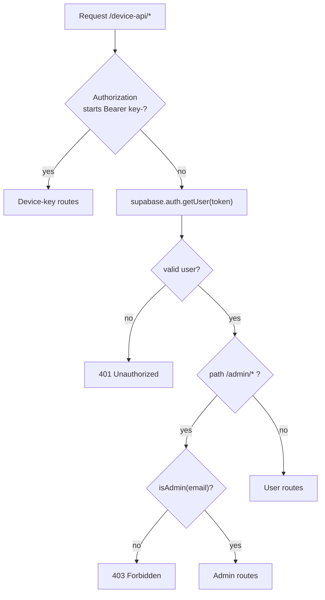
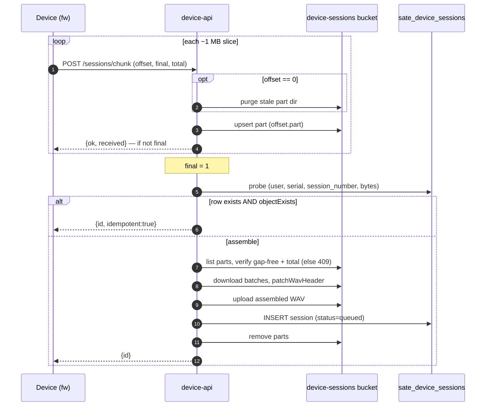

`device-api` is a single Supabase Edge Function (Deno) that does its own internal path
routing instead of being split into many functions. Source:
`react_app_sate-ui_update/supabase/functions/device-api/index.ts`. The header comment
currently marks it **v15** — bump that comment whenever routes change.

<div class="badge-row"><span class="sate-badge">device-api v15</span><span class="sate-badge">single Deno edge function</span><span class="sate-badge">3 auth modes</span><span class="sate-badge warn">verify_jwt:false</span></div>

## Base URL and deploy

```
${SUPABASE_URL}/functions/v1/device-api/<path>
```

The function also accepts an `/api` prefix and strips it before matching routes, because
the firmware posts to paths like `/api/sessions/chunk` (a convention carried over from the
old mock Express server):

```ts
const pathMatch = fullPath.match(/\/device-api(\/.*)?$/);
let subPath = pathMatch?.[1] || '/';
if (subPath.startsWith('/api')) subPath = subPath.slice(4) || '/';
```

So `POST /functions/v1/device-api/api/sessions/chunk` and
`POST /functions/v1/device-api/sessions/chunk` reach the same handler.

**Deploy note** — this function must always be deployed with `verify_jwt:false`:

```
npx supabase functions deploy device-api --no-verify-jwt
```

`verify_jwt` MUST stay false because the function validates the caller itself (device key
or user JWT); the CLI/MCP default of `verify_jwt:true` breaks device registration. The
Supabase Edge gateway still requires the public `apikey` header on every call regardless of
this setting.

## Auth modes

The function recognizes three distinct callers, and the routing table below is dispatched
based on which one is present.

<div class="spec-grid"><div class="spec-tile"><div class="k">Auth modes</div><div class="v">3</div></div><div class="spec-tile"><div class="k">Function version</div><div class="v">v15</div></div><div class="spec-tile"><div class="k">verify_jwt</div><div class="v">false</div></div><div class="spec-tile"><div class="k">Audio signed URL</div><div class="v">1 hour</div></div></div>

The dispatcher branches on the `Authorization` header *before* any DB lookup: a `Bearer key-`
prefix takes the device-key routes, otherwise the token is resolved as a user JWT and, for
`/admin/*` paths, passed through the `isAdmin()` gate.



<p class="diagram-caption">Which routes each branch reaches is listed in the auth-mode and route tables below: device-key covers heartbeat, <code>/sessions*</code>, <code>/sessions/verify</code>, and <code>/patients</code>; user routes cover devices, patients, sessions, and firmware.</p>

| Mode | How it's sent | Who uses it | Validated how |
|------|----------------|-------------|----------------|
| Device key | `Authorization: Bearer key-<device_id>` | The recorder itself (registration, heartbeat, session upload, verify, device-scoped patient roster) | `device_id` is looked up in `sate_devices`; some routes only check the `Bearer key-` *prefix* (see [Auth gaps](#auth-gaps)) |
| User JWT | `Authorization: Bearer <supabase JWT>` | The web/mobile app on behalf of a signed-in SLP | `supabase.auth.getUser(token)` |
| `apikey` (anon) | `apikey: <anon key>` header | Required by the Supabase Edge gateway itself on every call (not application-level auth) | Enforced by the gateway, not by this function's code |

Device keys are minted at registration as `'key-' + id` where `id = 'dev-' + serial.toLowerCase()`
(see `handleDeviceRegister`), i.e. a device key is literally `key-dev-<serial>`.

## Route table

Method, path, auth mode, and purpose for every route the function matches. "device-key" means
the handler is only reached when `Authorization` starts with `Bearer key-`; "user" means it falls
through to `supabase.auth.getUser(token)`; "unauth" means no credential is checked in-function.

| Method | Path | Auth | Purpose |
|--------|------|------|---------|
| POST | `/register` or `/devices/register` | unauth (claim token is the real gate) | Redeem a `claim_token` from `sate_claim_tokens`, upsert `sate_devices`, return `{device_id, device_key, slp, slp_id}` |
| GET | `/devices/:id/commands` | device-key | Heartbeat: device reports `pending`/`state`/`fw`/`ota` query params, marks itself online, returns queued (and now-consumed) commands + active patient + pending OTA |
| POST | `/devices/:id/commands` | user | SLP queues a command (`op`, optional `patient`) for a device it owns |
| GET | `/devices/:id/commands` | user (fallback path) | Same heartbeat handler as the device-key path, but reached via `handleDeviceHeartbeatUser` after verifying the device belongs to the caller |
| GET | `/devices` | user | List the caller's claimed devices; also flips stale (`last_seen` > 45s old) rows offline first |
| POST | `/devices/claim-token` | user | Mint a one-time `claim-<8 hex>` token tied to the caller, for a device to register against |
| PATCH | `/devices/:id` | user | Rename a device the caller owns |
| DELETE | `/devices/:id` | user | Remove a device the caller owns |
| GET | `/firmware/latest` | user | Return the newest `sate_firmware` row (version/url/notes/created_at) |
| POST | `/firmware` | user (**not admin-gated** — see [Auth gaps](#auth-gaps)) | Publish a new firmware `.bin`: validates semver version + `0xE9` ESP32 magic byte + size cap, uploads to the `firmware` bucket, inserts a `sate_firmware` row |
| GET | `/admin/me` | user | Returns `{isAdmin}` for the caller (checked against `sate_admins` by email) |
| GET | `/admin/devices` | user + admin | List every device fleet-wide, annotated with owner email |
| GET | `/admin/firmware` | user + admin | List all `sate_firmware` rows |
| DELETE | `/admin/firmware/:id` | user + admin | Delete a firmware row and best-effort remove its `.bin` from storage |
| DELETE | `/admin/devices/:id` | user + admin | Unlink any device fleet-wide (no `user_id` filter); device sees `{unclaimed:true}` on its next heartbeat and resets to setup |
| GET | `/patients` | device-key | Recorder fetches its owner's patient roster (`sate_device_patients`), resolved via the device's `user_id` |
| GET | `/patients` | user | SLP reads their own patient roster, optional `?slp=` filter on `clinician` |
| PUT | `/patients` | user | SLP replaces their entire patient roster (delete-all then insert) |
| POST | `/sessions` | device-key | Upload a full session as `{wav_base64, ...meta}` JSON |
| POST | `/sessions/raw` | device-key | Upload a full session as a raw request body (`?device_serial=&patient_id=&session_number=&sample_rate=`) |
| POST | `/sessions/chunk` | device-key | Upload one slice of a chunked session (see [Chunked upload](#chunked-upload)) |
| POST | `/sessions` | user | Phone app (e.g. Plaud, or a BLE-bridged device with no `sate_devices` row/key of its own) uploads a session on behalf of the signed-in user, as `{wav_base64, ...meta}` JSON |
| GET | `/sessions/verify` | device-key | Read-only durability check before the recorder frees local audio (see [/sessions/verify](#sessionsverify)) |
| GET | `/sessions` | user | List the caller's uploaded sessions (last 20, optional `?device=` filter), including `status`/`attempts`/`processed`/`recording_id` |
| GET | `/sessions/:id/audio` | user | 302-redirect to a 1-hour signed URL for the session's stored WAV |
| POST | `/sessions/:id/retry` | user | Re-queue an `error` session (`status:'queued'`, `attempts:0`) for the async processing container |
| DELETE | `/sessions/:id` | user | Delete a session's DB row and its stored WAV (leaves any linked `recordings` row intact) |

## Chunked upload {#chunked-upload}

`POST /sessions/chunk` assembles the firmware's ~1 MB upload slices. Query params:

<div class="spec-grid"><div class="spec-tile"><div class="k">Slice size</div><div class="v">~1 MB</div></div><div class="spec-tile"><div class="k">Download batch</div><div class="v">8 parts</div></div><div class="spec-tile"><div class="k">Device wait on final</div><div class="v">60 s</div></div><div class="spec-tile"><div class="k">Old firmware timeout</div><div class="v">12 s</div></div></div>

| Param | Meaning |
|-------|---------|
| `offset` | Byte offset of this slice within the session |
| `final` | `1` on the last slice — triggers assembly |
| `total` | Declared full byte length (firmware ≥1.5.9); `0` on older firmware skips the size check |
| `session_number`, `patient_id`, `device_serial`, `sample_rate`, `flags` | Session metadata, same as the non-chunked routes |

Each slice is stored as its **own** object rather than being merged into one blob per request:

```
${deviceId}/_tmp/${patientId}/s${sessionNumber}/${offset.padStart(12,'0')}.part
```

Per the in-code history, the previous version rewrote a single temp blob on every slice
(download-whole + upload-whole), which was quadratic and blew the firmware's 12s timeout on
long recordings — and because a timed-out slice retried from offset 0, offset 0 truncated the
blob back to the start, so a stuck upload could never drain. Writing one part per slice makes
each slice O(1); the file is only materialized once, on the final slice.

**Idempotency (lost-ACK handling).** Before touching parts on a final slice, the handler checks
for an already-stored row matching `(user, device_serial, session_number, bytes=total)`:

```ts
if (isFinal && declaredTotal > 0) {
  const { data: already } = await supabase.from('sate_device_sessions')
    .select('id, storage_path')
    .eq('user_id', device.user_id)
    .eq('device_serial', serial)
    .eq('session_number', sessionNumber)
    .eq('bytes', declaredTotal)
    .order('created_at', { ascending: false })
    .limit(1)
    .maybeSingle();
  if (already) {
    const real = already.storage_path &&
      await objectExists(supabase, 'device-sessions', already.storage_path);
    if (real) {
      await supabase.storage.from('device-sessions').remove([partPath]).catch(() => {});
      return json({ id: already.id, idempotent: true });
    }
    await supabase.from('sate_device_sessions').delete().eq('id', already.id);
    console.warn(`dropped ghost session row ${already.id} (no object) - re-storing`);
  }
}
```

This exists because assembling a long session can outlast the device's 60s wait; if the device
times out on a final that actually succeeded, it retries — but the parts are already gone, so
without this check the retry would 409 and the device would re-upload the entire session from
byte 0.

**Ghost-row handling.** A DB row alone is not proof the audio object landed — a past 413 bug left
rows whose storage object never landed. `objectExists` confirms the object is really in the
bucket; if the row is a ghost, it is deleted so the re-upload can replace it cleanly, rather than
being trusted as "already stored".

**Stale-part purge.** `offset === 0` means the device is (re)starting the session, so anything
already in the part dir is from an abandoned attempt and is purged first — otherwise leftover
higher-offset parts from a stale attempt would get stitched onto the new upload (session numbers
are reused after a delete renumbers a patient's sessions, so `s3` today isn't necessarily `s3`
from an earlier attempt).

**Byte verification on assembly.** On the final slice, parts are listed and checked for gap-free
contiguity purely from their *listed* sizes before any bytes are downloaded:

```ts
let assembledLen = 0;
for (const p of parts) {
  if (p.offset !== assembledLen) {
    return err(`offset gap: expected ${assembledLen}, have part at ${p.offset}`, 409);
  }
  assembledLen += p.size;
}
if (declaredTotal > 0 && assembledLen !== declaredTotal) {
  return err(`size mismatch: assembled ${assembledLen}, device says ${declaredTotal}`, 409);
}
if (assembledLen === 0) return err('no audio received', 400);
```

A gap or size mismatch is a 409, and the device restarts the session from 0 rather than let a
corrupt WAV get stored. Parts are then downloaded in parallel batches of 8 straight into a single
pre-allocated buffer (to avoid holding the whole session in memory twice), the WAV header is
patched (`patchWavHeader`), and the assembled bytes go through the same `storeSessionRecord` path
as a non-chunked upload. Parts are only deleted **after** the session is safely stored.



## `/sessions/verify` {#sessionsverify}

`GET /sessions/verify` — device-key auth, read-only, added in v15. The recorder calls this
**before** freeing a synced take's audio from its SD card (firmware ≥1.5.13, "verified trim").

Query params: `patient_id` (optional filter), `session_number` (required), `bytes` (required —
exact byte count), `device_serial` (optional, defaults to the device's own registered serial).

```ts
async function handleSessionVerify(supabase: any, req: Request) {
  ...
  let q = supabase.from('sate_device_sessions')
    .select('id, storage_path')
    .eq('user_id', device.user_id)
    .eq('device_serial', serial)
    .eq('session_number', sessionNumber)
    .eq('bytes', bytes)
    .order('created_at', { ascending: false })
    .limit(1);
  if (patientId) q = q.eq('patient_id', patientId);
  const { data: row } = await q.maybeSingle();

  const stored = !!(row?.storage_path &&
    await objectExists(supabase, 'device-sessions', row.storage_path));
  return json({ stored });
}
```

It returns `{stored}` — `true` only when a byte-exact row exists **and** `objectExists` confirms
the storage object is really present. A row alone is not treated as proof, because the same 413
bug that motivated the chunked-upload ghost-row handling could leave a row pointing at nothing;
trusting the row alone would let the recorder delete its only copy. The handler never mutates
anything — ghost-row cleanup is deliberately left to the chunk-final idempotency check, not to
this endpoint.

## Auth gaps {#auth-gaps}

:::warning[Known gaps (audit 2026-07-22) — fix before GA]
- **`POST /firmware` (`publishFirmware`) is registered above the `/admin` gate.** It only requires
  a valid user JWT, not `isAdmin()`, so any authenticated user can publish a fleet-wide OTA image
  today. `publishFirmware` does validate the upload itself (plain semver version, `0xE9` ESP32
  magic byte, ≤4 MB size cap), but that's image-integrity validation, not an authorization check.
- **The device key is trivially derivable.** It is minted as `'key-' + id` where
  `id = 'dev-' + serial.toLowerCase()` — i.e. `key-dev-<serial>`. Anyone who knows (or guesses) a
  device's serial can construct its key without ever seeing the registration response.
- **The heartbeat route validates no key value at all.** The dispatcher only checks that the
  `Authorization` header starts with the literal prefix `Bearer key-`; it never checks that the
  key corresponds to the `:id` in the URL:
  ```ts
  const deviceCommandMatch = subPath.match(/^\/devices\/([^/]+)\/commands$/);
  if (deviceCommandMatch && method === 'GET') {
    const deviceId = deviceCommandMatch[1];
    if (authHeader.startsWith('Bearer key-')) {
      return await handleDeviceHeartbeat(supabase, req, deviceId);
    }
  }
  ```
  Any string of the form `Bearer key-anything` authenticates a `GET /devices/:id/commands` call
  for *any* `:id`, including a device the caller doesn't own.

These are tracked as audit findings, not implemented fixes — see `CLAUDE.md` and
`doc/05-backend-supabase.md` for the same gaps noted against the current deployed version.
:::
