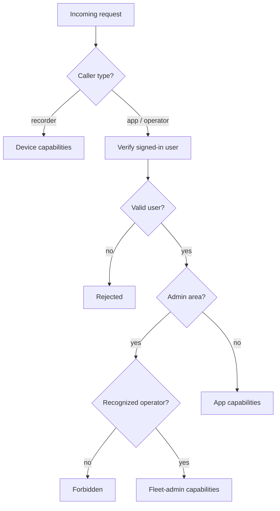
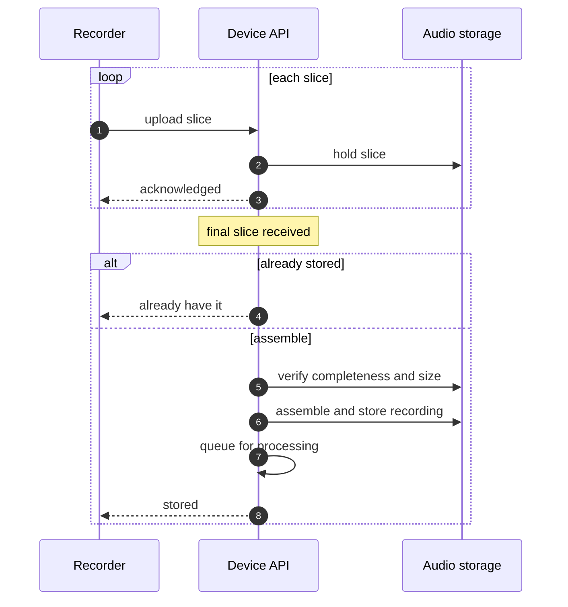
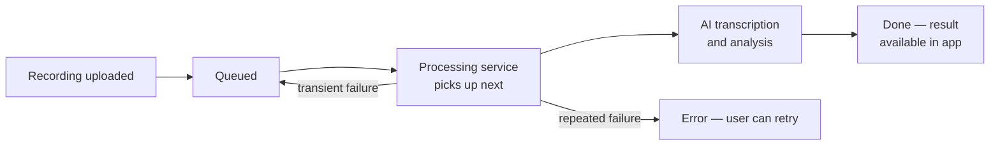

The **device API** is the cloud service that everything in the SATE system talks to. It sits
at the edge — close to the network, fast to reach — and acts as the single front door for the
recorders in the field, the web and mobile apps, and the fleet-management tools. Rather than
being spread across many small services, it is one focused API that routes each request to the
right handler internally.

edge APIdevice + app + admin3 caller typesaudio, sessions, firmware

## What it does

The API is responsible for the parts of the system that need to be shared and durable:

- **Device onboarding** — a new recorder claims itself to an account and receives the
  credentials it needs to talk to the cloud.
- **Heartbeat and remote control** — devices check in periodically to report their state and
  pick up any commands (such as "start recording" or "apply a firmware update") queued for them
  by their owner.
- **Session upload** — recordings captured on a device are uploaded, stored durably, and queued
  for downstream processing.
- **Durability verification** — a device can confirm that a recording is safely stored in the
  cloud before it reclaims the local copy.
- **Roster and account data** — the patient roster and device list that an operator manages in
  the app.
- **Firmware distribution** — publishing new firmware images and telling devices when an update
  is available.
- **Fleet administration** — a privileged view across all devices and firmware for operators
  who manage the whole fleet.

## Who calls it

The API recognizes three kinds of callers and tailors what each one can do:

Caller types

3

Audio links

time-limited

Upload style

whole or chunked

Processing

async queue

| Caller | Who it is | What it can do |
|--------|-----------|----------------|
| **The recorder** | A SATE device in the field | Register, send heartbeats, upload sessions, verify durability, and read its owner's patient roster |
| **The app** | The web or mobile app, acting for a signed-in clinician | Manage devices and patients, browse and retrieve sessions, retry or delete sessions, and publish firmware |
| **A fleet operator** | A privileged administrator | View and manage every device and firmware release across the whole fleet |

Each request identifies its caller, and the API decides which capabilities to grant based on
that identity. Fleet-administration capabilities are gated so that only recognized operators can
reach them.

The API first sorts each request by caller type, then grants only the capabilities that caller is entitled to. Fleet-admin actions sit behind an extra operator check.

## Capabilities at a glance

The following capabilities are exposed, grouped by the caller that typically uses them.

**Recorders**

| Capability | Purpose |
|------------|---------|
| Register | Claim a new device to an account and receive its credentials |
| Heartbeat | Report state and firmware version, mark online, and pick up queued commands and pending updates |
| Upload session | Send a completed recording to the cloud, as a whole file or in chunks |
| Verify durability | Confirm a recording is safely stored before reclaiming local storage |
| Read roster | Fetch the owner's patient roster |

**Apps (signed-in clinician)**

| Capability | Purpose |
|------------|---------|
| List / rename / remove devices | Manage the devices claimed to the account |
| Mint claim token | Create a one-time code a new device can use to register |
| Queue command | Send an instruction (e.g. start a recording) to an owned device |
| Manage roster | Read and update the account's patient roster |
| List / retrieve sessions | Browse uploaded recordings and open their stored audio |
| Retry / delete session | Re-queue a failed recording or remove one |
| Latest firmware / publish firmware | Check for and publish firmware releases |

**Fleet operators**

| Capability | Purpose |
|------------|---------|
| Fleet device view | List and unlink any device across the fleet |
| Firmware management | List and remove firmware releases |

Stored audio is served through short-lived, time-limited links rather than permanent public
URLs, so a recording can be opened by the app but not freely shared.

## Session upload

A recording can be uploaded either as a single request or, for longer takes, split into
sequential slices that the API reassembles. Chunked upload lets a device stream a large
recording in manageable pieces and recover gracefully if the connection drops partway through.

Slice size

~1 MB

Audio format

16 kHz mono WAV

Reassembly

on final slice

Transport

Wi-Fi

The design prioritizes never losing or corrupting a recording:

- **Resumable and idempotent.** If a device loses its connection and retries, the API recognizes
  a recording it has already received and does not duplicate it or force a full re-upload.
- **Integrity-checked before storing.** Reassembled slices are checked for completeness and
  correct total size before the recording is committed. Anything that doesn't line up is
  rejected so a corrupt file is never stored, and the device simply starts that recording over.
- **Stored before cleanup.** Temporary pieces are only discarded after the final recording is
  safely in place.

## Durability verification

Because a recorder may be the only place a recording exists until it is proven to be in the
cloud, the API offers a read-only durability check. A device asks whether a specific recording
of a specific size is stored, and the API answers only after confirming that both the record and
the actual audio file are present. This is what lets a device safely reclaim its local storage
without risking the loss of a recording that was never really saved.

:::note[Why a stored record isn't enough]
A bookkeeping entry alone is not treated as proof that the audio landed. Verification always
confirms the actual audio file is present before a device is told it is safe to free its local
copy. This guards against the case where an upload was recorded as complete but the audio never
truly arrived.
:::

## Processing pipeline

Uploading a recording and analyzing it are deliberately separated. When a recording arrives, the
API stores it and adds it to a processing queue — it does not wait for analysis to finish. A
dedicated long-running processing service works through that queue on its own schedule: it picks
up each queued recording, runs it through the AI transcription and analysis service, and produces
the finished result the app displays.

This split matters because transcription can take a long time, while the edge API is meant to
respond quickly. Keeping the heavy work in a separate, long-lived process — with an async queue,
automatic retries for transient failures, and a watchdog that re-queues stalled work — means a
long recording is processed reliably instead of timing out.

Upload and analysis are decoupled: the API queues recordings quickly, and a separate long-running service drains the queue, with retries and a watchdog for reliability.

